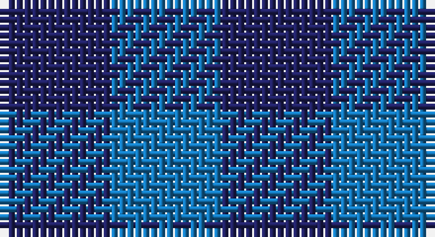

This page is one **sett** — a single exact thread-count. It belongs to the [tartan](/setts/db1b1/)
(the same proportion at any scale), whose colour order is pattern [BB](/stripes/bb/).

Sourced from tartans-authority.  It is a [2 stripe tartan](/stripes/stripes2/).

Original link http://www.tartansauthority.com/tartan-ferret/display/8968/

## Also known as

This cloth is also recorded under:

- Rob Roy, Blue
- St. Combs Fisher Plaid

## Register references

External register numbers recorded for this tartan.

- Scottish Tartans Authority (ITI): 8968

## Thread count
DB/14 B/14

One full sett is **28 threads**.

## Palette

Palette: <strong>Tartan Register</strong>
<table><thead><tr><th>Colour</th><th>Threads</th><th>Shade</th><th>Base</th><th>OKLCh</th></tr></thead><tbody><tr><td>DB/</td><td style="text-align:right;font-variant-numeric:tabular-nums">14</td><td><code style="background-color:#202060;">#202060</code> <small style="color:#888">#202060</small></td><td>B <code style="background-color:#2A418A;">#2A418A</code></td><td><small style="color:#888">oklch(28.9% 0.111 276.9)</small></td></tr><tr><td>B/</td><td style="text-align:right;font-variant-numeric:tabular-nums">14</td><td><code style="background-color:#1474B4;">#1474B4</code> <small style="color:#888">#1474B4</small></td><td>B <code style="background-color:#2A418A;">#2A418A</code></td><td><small style="color:#888">oklch(54.0% 0.129 245.1)</small></td></tr></tbody></table>

# Sample pattern

## Nearest tartans

The nearest existing variants by ΔTartan distance, with this tartan at the top so the swatches line up against it.

ΔTartan

Tartan

Sett

—

<a href="/ttd/edit/#slug=db1b1~x14">St. Combs Fisher Plaid</a> <a class="nn-out" href="/variants/s2/db1b1~x14/" title="open its dictionary page">↗</a>

1.73

<a href="/ttd/edit/#slug=db1b1~x100&amp;base=db1b1~x14">Rob Roy, Blue (Fashion)</a> <a class="nn-out" href="/variants/s2/db1b1~x100/" title="open its dictionary page">↗</a>

2.87

<a href="/ttd/edit/#slug=k9t8~x2&amp;base=db1b1~x14">Wilson's No.172</a> <a class="nn-out" href="/variants/s2/k9t8~x2/" title="open its dictionary page">↗</a>

2.92

<a href="/ttd/edit/#slug=y9dp8~x2&amp;base=db1b1~x14">Wilson's No.116 (light)</a> <a class="nn-out" href="/variants/s2/y9dp8~x2/" title="open its dictionary page">↗</a>

2.95

<a href="/ttd/edit/#slug=g7t6~x2&amp;base=db1b1~x14">Wilson's No.210</a> <a class="nn-out" href="/variants/s2/g7t6~x2/" title="open its dictionary page">↗</a>

3.00

<a href="/ttd/edit/#slug=db1r1~x100&amp;base=db1b1~x14">Rob Roy, Blue &amp; Red (Fashion)</a> <a class="nn-out" href="/variants/s2/db1r1~x100/" title="open its dictionary page">↗</a>

3.00

<a href="/ttd/edit/#slug=db1r1~x14&amp;base=db1b1~x14">Cairnbulg &amp; Inverllocjy Fisher Plaid</a> <a class="nn-out" href="/variants/s2/db1r1~x14/" title="open its dictionary page">↗</a>

3.07

<a href="/ttd/edit/#slug=k1db1~x100&amp;base=db1b1~x14">Buffalo Plaid</a> <a class="nn-out" href="/variants/s2/k1db1~x100/" title="open its dictionary page">↗</a>

3.19

<a href="/ttd/edit/#slug=g1p1~x16&amp;base=db1b1~x14">Wilson's, No 116</a> <a class="nn-out" href="/variants/s2/g1p1~x16/" title="open its dictionary page">↗</a>

3.21

<a href="/ttd/edit/#slug=k8dg7db8~x2&amp;base=db1b1~x14">Glenlyon</a> <a class="nn-out" href="/variants/s3/k8dg7db8~x2/" title="open its dictionary page">↗</a>

3.51

<a href="/ttd/edit/#slug=db2k1~x4&amp;base=db1b1~x14">Tartan Army</a> <a class="nn-out" href="/variants/s2/db2k1~x4/" title="open its dictionary page">↗</a>

## Neighbour map

Every grey dot is one of 14360 variants placed by the first two principal components of the ΔTartan feature space (44% of its variance). Red is this tartan; blue dots are its nearest — click one to open its page.

<svg viewBox="0 0 640 380" role="img" style="max-width:100%;height:auto;border:1px solid #e0e0e0;border-radius:4px;display:block" xmlns="http://www.w3.org/2000/svg"><image href="/nn/cloud.v1.png" width="640" height="380"/><a href="/variants/s2/db1b1~x100/"><circle cx="178.0" cy="366.0" r="4" fill="#3465a4"><title>Rob Roy, Blue (Fashion)</title></circle></a><a href="/variants/s2/k9t8~x2/"><circle cx="171.9" cy="366.0" r="4" fill="#3465a4"><title>Wilson's No.172</title></circle></a><a href="/variants/s2/y9dp8~x2/"><circle cx="233.9" cy="366.0" r="4" fill="#3465a4"><title>Wilson's No.116 (light)</title></circle></a><a href="/variants/s2/g7t6~x2/"><circle cx="246.0" cy="366.0" r="4" fill="#3465a4"><title>Wilson's No.210</title></circle></a><a href="/variants/s2/db1r1~x100/"><circle cx="236.5" cy="366.0" r="4" fill="#3465a4"><title>Rob Roy, Blue &amp; Red (Fashion)</title></circle></a><a href="/variants/s2/db1r1~x14/"><circle cx="236.5" cy="366.0" r="4" fill="#3465a4"><title>Cairnbulg &amp; Inverllocjy Fisher Plaid</title></circle></a><a href="/variants/s2/k1db1~x100/"><circle cx="289.7" cy="366.0" r="4" fill="#3465a4"><title>Buffalo Plaid</title></circle></a><a href="/variants/s2/g1p1~x16/"><circle cx="160.4" cy="366.0" r="4" fill="#3465a4"><title>Wilson's, No 116</title></circle></a><a href="/variants/s3/k8dg7db8~x2/"><circle cx="110.9" cy="366.0" r="4" fill="#3465a4"><title>Glenlyon</title></circle></a><a href="/variants/s2/db2k1~x4/"><circle cx="397.3" cy="366.0" r="4" fill="#3465a4"><title>Tartan Army</title></circle></a><circle cx="211.3" cy="366.0" r="5" fill="#c00000"/></svg>

ID: /variants/s2/db1b1~x14/
