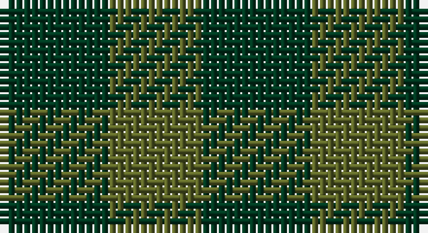

This page is one **sett** — a single exact thread-count. It belongs to the [tartan](/setts/dg7y6/)
(the same proportion at any scale), whose colour order is pattern [GG](/stripes/gg/).

Sourced from register-of-tartans.  It is a [2 stripe tartan](/stripes/stripes2/).

Original link https://www.tartanregister.gov.uk/tartanDetails.aspx?ref=4747

## Register references

External register numbers recorded for this tartan.

- Scottish Register of Tartans: [4747](https://www.tartanregister.gov.uk/tartanDetails.aspx?ref=4747)
- Scottish Tartans Authority (ITI): 754
- Scottish Tartans World Register: 754

## Thread count
DG/14 G/12

One full sett is **26 threads**.

## Palette

Palette: <strong>Tartan Register</strong>
<table><thead><tr><th>Colour</th><th>Threads</th><th>Shade</th><th>Base</th><th>OKLCh</th></tr></thead><tbody><tr><td>DG/</td><td style="text-align:right;font-variant-numeric:tabular-nums">14</td><td><code style="background-color:#003820;">#003820</code> <small style="color:#888">#003820</small></td><td>G <code style="background-color:#006100;">#006100</code></td><td><small style="color:#888">oklch(30.0% 0.070 158.3)</small></td></tr><tr><td>G/</td><td style="text-align:right;font-variant-numeric:tabular-nums">12</td><td><code style="background-color:#5C6428;">#5C6428</code> <small style="color:#888">#5C6428</small></td><td>G <code style="background-color:#006100;">#006100</code></td><td><small style="color:#888">oklch(48.3% 0.084 116.0)</small></td></tr></tbody></table>

# Sample pattern

## Nearest tartans

The nearest existing variants by ΔTartan distance, with this tartan at the top so the swatches line up against it.

ΔTartan

Tartan

Sett

—

<a href="/ttd/edit/#slug=dg7y6~x2">Wilson's No.219</a> <a class="nn-out" href="/variants/s2/dg7y6~x2/" title="open its dictionary page">↗</a>

2.11

<a href="/ttd/edit/#slug=k1g1~x168&amp;base=dg7y6~x2">MacKillen Hunting</a> <a class="nn-out" href="/variants/s2/k1g1~x168/" title="open its dictionary page">↗</a>

2.16

<a href="/ttd/edit/#slug=n1g1~x130&amp;base=dg7y6~x2">Hafren (Personal)</a> <a class="nn-out" href="/variants/s2/n1g1~x130/" title="open its dictionary page">↗</a>

2.64

<a href="/ttd/edit/#slug=g7t6~x2&amp;base=dg7y6~x2">Wilson's No.210</a> <a class="nn-out" href="/variants/s2/g7t6~x2/" title="open its dictionary page">↗</a>

2.83

<a href="/ttd/edit/#slug=dg1g1~x18&amp;base=dg7y6~x2">Wilson's, No 219</a> <a class="nn-out" href="/variants/s2/dg1g1~x18/" title="open its dictionary page">↗</a>

2.89

<a href="/ttd/edit/#slug=k1dg1~x100&amp;base=dg7y6~x2">Robin Hood/Wilson no.224/Rob Roy Hunting</a> <a class="nn-out" href="/variants/s2/k1dg1~x100/" title="open its dictionary page">↗</a>

3.22

<a href="/ttd/edit/#slug=g9k8~x2&amp;base=dg7y6~x2">Robin Hood Fancy Tartan</a> <a class="nn-out" href="/variants/s2/g9k8~x2/" title="open its dictionary page">↗</a>

3.42

<a href="/ttd/edit/#slug=dg1r1&amp;base=dg7y6~x2">Moncreiffe</a> <a class="nn-out" href="/variants/s2/dg1r1/" title="open its dictionary page">↗</a>

3.42

<a href="/ttd/edit/#slug=k1db1~x100&amp;base=dg7y6~x2">Buffalo Plaid</a> <a class="nn-out" href="/variants/s2/k1db1~x100/" title="open its dictionary page">↗</a>

3.44

<a href="/ttd/edit/#slug=y9dp8~x2&amp;base=dg7y6~x2">Wilson's No.116 (light)</a> <a class="nn-out" href="/variants/s2/y9dp8~x2/" title="open its dictionary page">↗</a>

3.44

<a href="/ttd/edit/#slug=k8dg7db8~x2&amp;base=dg7y6~x2">Glenlyon</a> <a class="nn-out" href="/variants/s3/k8dg7db8~x2/" title="open its dictionary page">↗</a>

## Neighbour map

Every grey dot is one of 14360 variants placed by the first two principal components of the ΔTartan feature space (44% of its variance). Red is this tartan; blue dots are its nearest — click one to open its page.

<svg viewBox="0 0 640 380" role="img" style="max-width:100%;height:auto;border:1px solid #e0e0e0;border-radius:4px;display:block" xmlns="http://www.w3.org/2000/svg"><image href="/nn/cloud.v1.png" width="640" height="380"/><a href="/variants/s2/k1g1~x168/"><circle cx="224.5" cy="366.0" r="4" fill="#3465a4"><title>MacKillen Hunting</title></circle></a><a href="/variants/s2/n1g1~x130/"><circle cx="307.1" cy="366.0" r="4" fill="#3465a4"><title>Hafren (Personal)</title></circle></a><a href="/variants/s2/g7t6~x2/"><circle cx="246.0" cy="366.0" r="4" fill="#3465a4"><title>Wilson's No.210</title></circle></a><a href="/variants/s2/dg1g1~x18/"><circle cx="202.1" cy="366.0" r="4" fill="#3465a4"><title>Wilson's, No 219</title></circle></a><a href="/variants/s2/k1dg1~x100/"><circle cx="337.5" cy="366.0" r="4" fill="#3465a4"><title>Robin Hood/Wilson no.224/Rob Roy Hunting</title></circle></a><a href="/variants/s2/g9k8~x2/"><circle cx="215.6" cy="366.0" r="4" fill="#3465a4"><title>Robin Hood Fancy Tartan</title></circle></a><a href="/variants/s2/dg1r1/"><circle cx="215.8" cy="366.0" r="4" fill="#3465a4"><title>Moncreiffe</title></circle></a><a href="/variants/s2/k1db1~x100/"><circle cx="289.7" cy="366.0" r="4" fill="#3465a4"><title>Buffalo Plaid</title></circle></a><a href="/variants/s2/y9dp8~x2/"><circle cx="233.9" cy="366.0" r="4" fill="#3465a4"><title>Wilson's No.116 (light)</title></circle></a><a href="/variants/s3/k8dg7db8~x2/"><circle cx="110.9" cy="366.0" r="4" fill="#3465a4"><title>Glenlyon</title></circle></a><circle cx="310.0" cy="366.0" r="5" fill="#c00000"/></svg>

ID: /variants/s2/dg7y6~x2/
