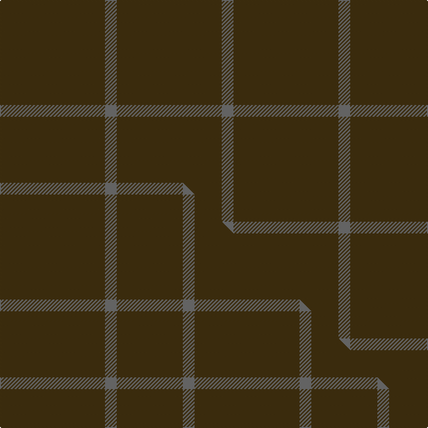

This is one **variant** — a specific cloth: this exact thread count and colourway, with its own
provenance below. It is one weaving of the [sett](/tartans/o/ou/outlander-5/) (the scale-free proportion — the
same cloth at any scale or shade), whose colour order is pattern [BG](/stripes/bg/).

Part of the [Outlander](/tartans/o/ou/outlander-5/) tartan — the named design grouping this sett with its other cloths.

Sourced from tartans-authority.  It is a [2 stripe tartan](/stripes/stripes2/).

Original link <code>http://www.tartansauthority.com/tartan-ferret/display/11116/</code> — retired · [Internet Archive copy](https://web.archive.org/web/*/http://www.tartansauthority.com/tartan-ferret/display/11116/*)

Dataset <small>— provenance for this record, inherited from the source manifest</small>

<dl class="dataset-prov">
<dt>source</dt><dd><a href="/sources/tartans-authority/">Scottish Tartans Authority</a></dd>
<dt>data captured from</dt><dd><a href="https://github.com/thetartan/tartan-database/blob/master/data/tartans-authority/data.csv">https://github.com/thetartan/tartan-database/blob/master/data/tartans-authority/data.csv</a></dd>
<dt>data date</dt><dd>2014 <small>(this record)</small></dd>
<dt>licence</dt><dd><a href="https://creativecommons.org/licenses/by-nc-nd/4.0/">CC BY-NC-ND 4.0</a></dd>
</dl>

Capture chain <small>— the hands this data passed through, oldest first; each capture carries its own licence</small>

<ol class="capture-chain">
<li><a href="https://www.tartansauthority.com/">Scottish Tartans Authority</a> <small>the heritage body’s archive — its tartan-ferret record browser is retired; dead record links are shown unlinked, with an Internet Archive copy (ITI numbers are not SRT references)</small></li>
<li><a href="https://github.com/thetartan/tartan-database">thetartan/tartan-database</a> <small>2016-2017</small> · <a href="https://creativecommons.org/licenses/by-nc-nd/4.0/">CC BY-NC-ND 4.0</a> <small>Levko Kravets's frozen compilation — the capture we vendored, and where its CC licence text came from</small></li>
<li>this dictionary <small>captured 2026-06-10 · commit 5bf86c7566</small> <small>each re-capture is a git commit to data/sources</small></li>
</ol>

## Register references

External register numbers recorded for this tartan.

- Scottish Register of Tartans: [11116](https://www.tartanregister.gov.uk/tartanDetails?ref=11116)
- Scottish Tartans Authority (ITI): 11116

## Thread count
DY/108 N/12

One full sett is **120 threads**.

## Palette
<table><thead><tr><th>Colour</th><th>Shade</th><th>OKLCh</th></tr></thead><tbody><tr><td>N</td><td><code style="background-color:#636363;">#636363</code> <small style="color:#888">#636363</small></td><td><small style="color:#888">oklch(50.0% 0.000 89.9)</small></td></tr><tr><td>DY</td><td><code style="background-color:#3A2B0D;">#3A2B0D</code> <small style="color:#888">#3A2B0D</small></td><td><small style="color:#888">oklch(30.0% 0.049 82.0)</small></td></tr></tbody></table>

# Sample pattern

## Compared to the master

This cloth is one sett of its design; the master sett (the exemplar the design is anchored on) is below for comparison.

Its **ΔTartan distance** from the master is **1.00** — the same measure the nearest-tartans table ranks by (0 is identical; a re-scale of the same cloth is near 0, a recolour or a different proportion further).

<figure class="master-compare" style="margin:0">

this sett
master sett ★

<figcaption style="color:#888;font-size:smaller">One weave of this sett against the <a href="/setts/dy27n3dy17/">master sett ★</a>, split on the diagonal: a shared proportion runs seamlessly across it with only the shades shifting; a different proportion breaks on it.</figcaption>
</figure>

## Nearest tartan variants

The nearest existing variants by ΔTartan distance, with this cloth at the top so the swatches line up against it.

ΔTartan

Threads

Variant

Sett

—

120

<a href="/variants/s2/dy9n1~x12/">Outlander #4</a>

<a href="/ttd/edit/#slug=dy27n3dy17~x4&amp;base=dy9n1~x12" title="compare in the TTD">1.00</a>

200

<a href="/variants/s3/dy27n3dy17~x4/">Outlander #4</a>

<a href="/ttd/edit/#slug=db12k1~x10&amp;base=dy9n1~x12" title="compare in the TTD">1.00</a>

130

<a href="/variants/s2/db12k1~x10/">Staines</a>

<a href="/ttd/edit/#slug=r1y60t1~x2&amp;base=dy9n1~x12" title="compare in the TTD">1.19</a>

244

<a href="/variants/s3/r1y60t1~x2/">Nutwood</a>

<a href="/ttd/edit/#slug=ly81dg6lyi8dg8~x2~ly6307084-lyi6614084&amp;base=dy9n1~x12" title="compare in the TTD">1.28</a>

234

<a href="/variants/s4/ly81dg6lyi8dg8~x2~ly6307084-lyi6614084/">Young in Australia (Name)</a>

<a href="/ttd/edit/#slug=dr9lr1~x20&amp;base=dy9n1~x12" title="compare in the TTD">1.30</a>

200

<a href="/variants/s2/dr9lr1~x20/">Roddy &quot;Rowdy&quot; Piper (Personal)</a>

<a href="/ttd/edit/#slug=n13dy15n2~x4&amp;base=dy9n1~x12" title="compare in the TTD">1.40</a>

180

<a href="/variants/s3/n13dy15n2~x4/">Outlander #5</a>

<a href="/ttd/edit/#slug=dy10w1dy30y3~x4&amp;base=dy9n1~x12" title="compare in the TTD">1.43</a>

300

<a href="/variants/s4/dy10w1dy30y3~x4/">Pasteur</a>

<a href="/ttd/edit/#slug=k20dt1~x6&amp;base=dy9n1~x12" title="compare in the TTD">1.60</a>

126

<a href="/variants/s2/k20dt1~x6/">Black Shadow (Fashion)</a>

<a href="/ttd/edit/#slug=dg8dr1db1n1~x10&amp;base=dy9n1~x12" title="compare in the TTD">1.60</a>

130

<a href="/variants/s4/dg8dr1db1n1~x10/">Jodi Williams (Personal)</a>

<a href="/ttd/edit/#slug=dr1g22lo1~x4&amp;base=dy9n1~x12" title="compare in the TTD">1.60</a>

184

<a href="/variants/s3/dr1g22lo1~x4/">Kenmore Hunting</a>

## Neighbour map

Every grey dot is one of 13662 variants placed by the first two principal components of the ΔTartan feature space (42% of its variance). Red is this tartan; blue dots are its nearest — click one to open its page. The map is a flat projection of a many-dimensional space — [how to read it](/posts/neighbourhood-maps/).

<svg viewBox="0 0 640 380" role="img" style="max-width:100%;height:auto;border:1px solid #e0e0e0;border-radius:4px;display:block" xmlns="http://www.w3.org/2000/svg"><image href="/nn/cloud.v1.png" width="640" height="380"/><a href="/variants/s3/dy27n3dy17~x4/"><circle cx="626.0" cy="366.0" r="4" fill="#3465a4"><title>Outlander #4</title></circle></a><a href="/variants/s2/db12k1~x10/"><circle cx="626.0" cy="291.2" r="4" fill="#3465a4"><title>Staines</title></circle></a><a href="/variants/s3/r1y60t1~x2/"><circle cx="626.0" cy="245.1" r="4" fill="#3465a4"><title>Nutwood</title></circle></a><a href="/variants/s4/ly81dg6lyi8dg8~x2~ly6307084-lyi6614084/"><circle cx="626.0" cy="249.1" r="4" fill="#3465a4"><title>Young in Australia (Name)</title></circle></a><a href="/variants/s2/dr9lr1~x20/"><circle cx="626.0" cy="310.9" r="4" fill="#3465a4"><title>Roddy &quot;Rowdy&quot; Piper (Personal)</title></circle></a><a href="/variants/s3/n13dy15n2~x4/"><circle cx="512.7" cy="366.0" r="4" fill="#3465a4"><title>Outlander #5</title></circle></a><a href="/variants/s4/dy10w1dy30y3~x4/"><circle cx="626.0" cy="211.7" r="4" fill="#3465a4"><title>Pasteur</title></circle></a><a href="/variants/s2/k20dt1~x6/"><circle cx="626.0" cy="278.9" r="4" fill="#3465a4"><title>Black Shadow (Fashion)</title></circle></a><a href="/variants/s4/dg8dr1db1n1~x10/"><circle cx="622.4" cy="292.5" r="4" fill="#3465a4"><title>Jodi Williams (Personal)</title></circle></a><a href="/variants/s3/dr1g22lo1~x4/"><circle cx="626.0" cy="250.1" r="4" fill="#3465a4"><title>Kenmore Hunting</title></circle></a><circle cx="626.0" cy="366.0" r="5" fill="#c00000"/><text x="320" y="376" text-anchor="middle" font-size="11" fill="#999">ground</text><text x="11" y="190" text-anchor="middle" font-size="11" fill="#999" transform="rotate(-90 11 190)">complexity</text></svg>

ID: /variants/s2/dy9n1~x12/
