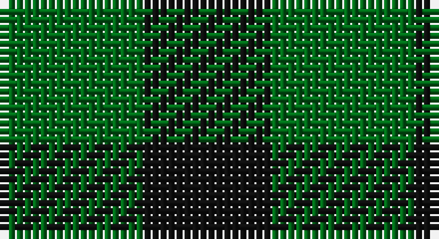

This page is one **sett** — a single exact thread-count. It belongs to the [tartan](/setts/g9k8/)
(the same proportion at any scale), whose colour order is pattern [GK](/stripes/gk/).

Sourced from house-of-tartan.  It is a [2 stripe tartan](/stripes/stripes2/).

Original link http://www.house-of-tartan.scotland.net/house/TartanViewjs.asp?colr=Def&tnam=785

## Provenance

Earliest known date: 1819 In 1815, members of the Highland Society of London resolved to request of each of the Highland chiefs, a sample of their clan tartan. The swatches were to be signed and sealed in the chief's own hand. This sett is one of those delivered to the Society between 1815 and 1822.

## Thread count
G/18 K/16

One full sett is **34 threads**.

## Palette

Palette: <strong>Tartan Register</strong>
<table><thead><tr><th>Colour</th><th>Threads</th><th>Shade</th><th>Base</th><th>OKLCh</th></tr></thead><tbody><tr><td>G/</td><td style="text-align:right;font-variant-numeric:tabular-nums">18</td><td><code style="background-color:#006818;">#006818</code> <small style="color:#888">#006818</small></td><td>G <code style="background-color:#006100;">#006100</code></td><td><small style="color:#888">oklch(45.0% 0.142 145.0)</small></td></tr><tr><td>K/</td><td style="text-align:right;font-variant-numeric:tabular-nums">16</td><td><code style="background-color:#101010;">#101010</code> <small style="color:#888">#101010</small></td><td>K <code style="background-color:#000000;">#000000</code></td><td><small style="color:#888">oklch(17.3% 0.000 89.9)</small></td></tr></tbody></table>

# Sample pattern

## Nearest tartans

The nearest existing variants by ΔTartan distance, with this tartan at the top so the swatches line up against it.

ΔTartan

Tartan

Sett

—

<a href="/ttd/edit/#slug=g9k8~x2">Robin Hood Fancy Tartan</a> <a class="nn-out" href="/variants/s2/g9k8~x2/" title="open its dictionary page">↗</a>

1.67

<a href="/ttd/edit/#slug=k1g1~x168&amp;base=g9k8~x2">MacKillen Hunting</a> <a class="nn-out" href="/variants/s2/k1g1~x168/" title="open its dictionary page">↗</a>

1.79

<a href="/ttd/edit/#slug=dg1g1~x18&amp;base=g9k8~x2">Wilson's, No 219</a> <a class="nn-out" href="/variants/s2/dg1g1~x18/" title="open its dictionary page">↗</a>

1.97

<a href="/ttd/edit/#slug=k1y1~x100&amp;base=g9k8~x2">Rob Roy, Black &amp; Tan (Fashion)</a> <a class="nn-out" href="/variants/s2/k1y1~x100/" title="open its dictionary page">↗</a>

2.20

<a href="/ttd/edit/#slug=y9dp8~x2&amp;base=g9k8~x2">Wilson's No.116 (light)</a> <a class="nn-out" href="/variants/s2/y9dp8~x2/" title="open its dictionary page">↗</a>

2.23

<a href="/ttd/edit/#slug=k1g1~x66&amp;base=g9k8~x2">Robin Hood / Rob Roy hunting</a> <a class="nn-out" href="/variants/s2/k1g1~x66/" title="open its dictionary page">↗</a>

2.43

<a href="/ttd/edit/#slug=g7t6~x2&amp;base=g9k8~x2">Wilson's No.210</a> <a class="nn-out" href="/variants/s2/g7t6~x2/" title="open its dictionary page">↗</a>

2.49

<a href="/ttd/edit/#slug=g1p1~x16&amp;base=g9k8~x2">Wilson's, No 116</a> <a class="nn-out" href="/variants/s2/g1p1~x16/" title="open its dictionary page">↗</a>

2.59

<a href="/ttd/edit/#slug=k9t8~x2&amp;base=g9k8~x2">Wilson's No.172</a> <a class="nn-out" href="/variants/s2/k9t8~x2/" title="open its dictionary page">↗</a>

2.64

<a href="/variants/s4/k1g1r1~x8/">Wilson's No.187</a>

2.66

<a href="/ttd/edit/#slug=dg1r1&amp;base=g9k8~x2">Moncreiffe</a> <a class="nn-out" href="/variants/s2/dg1r1/" title="open its dictionary page">↗</a>

## Neighbour map

Every grey dot is one of 14360 variants placed by the first two principal components of the ΔTartan feature space (44% of its variance). Red is this tartan; blue dots are its nearest — click one to open its page.

<svg viewBox="0 0 640 380" role="img" style="max-width:100%;height:auto;border:1px solid #e0e0e0;border-radius:4px;display:block" xmlns="http://www.w3.org/2000/svg"><image href="/nn/cloud.v1.png" width="640" height="380"/><a href="/variants/s2/k1g1~x168/"><circle cx="224.5" cy="366.0" r="4" fill="#3465a4"><title>MacKillen Hunting</title></circle></a><a href="/variants/s2/dg1g1~x18/"><circle cx="202.1" cy="366.0" r="4" fill="#3465a4"><title>Wilson's, No 219</title></circle></a><a href="/variants/s2/k1y1~x100/"><circle cx="161.2" cy="366.0" r="4" fill="#3465a4"><title>Rob Roy, Black &amp; Tan (Fashion)</title></circle></a><a href="/variants/s2/y9dp8~x2/"><circle cx="233.9" cy="366.0" r="4" fill="#3465a4"><title>Wilson's No.116 (light)</title></circle></a><a href="/variants/s2/k1g1~x66/"><circle cx="128.2" cy="366.0" r="4" fill="#3465a4"><title>Robin Hood / Rob Roy hunting</title></circle></a><a href="/variants/s2/g7t6~x2/"><circle cx="246.0" cy="366.0" r="4" fill="#3465a4"><title>Wilson's No.210</title></circle></a><a href="/variants/s2/g1p1~x16/"><circle cx="160.4" cy="366.0" r="4" fill="#3465a4"><title>Wilson's, No 116</title></circle></a><a href="/variants/s2/k9t8~x2/"><circle cx="171.9" cy="366.0" r="4" fill="#3465a4"><title>Wilson's No.172</title></circle></a><a href="/variants/s4/k1g1r1~x8/"><circle cx="89.9" cy="366.0" r="4" fill="#3465a4"><title>Wilson's No.187</title></circle></a><a href="/variants/s2/dg1r1/"><circle cx="215.8" cy="366.0" r="4" fill="#3465a4"><title>Moncreiffe</title></circle></a><circle cx="215.6" cy="366.0" r="5" fill="#c00000"/></svg>

ID: /variants/s2/g9k8~x2/
