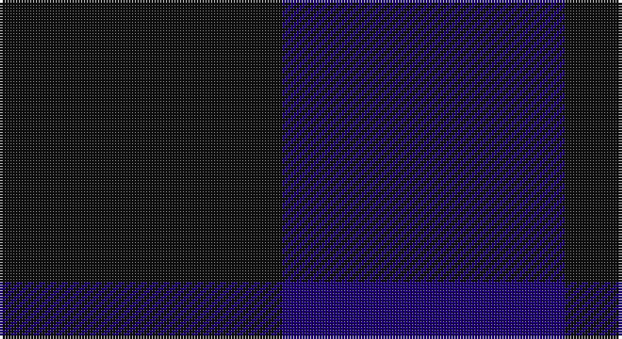

This page is one **sett** — a single exact thread-count. It belongs to the [tartan](/setts/k1db1/)
(the same proportion at any scale), whose colour order is pattern [BK](/stripes/bk/).

Part of the [Buffalo](/tartans/buffalo/) tartan — the named design grouping this sett with its other cloths.

Sourced from register-of-tartans.  It is a [2 stripe tartan](/stripes/stripes2/).

Original link https://www.tartanregister.gov.uk/tartanDetails.aspx?ref=5286

## Also known as

This cloth is also recorded under:

- Buffalo Plaid

## Register references

External register numbers recorded for this tartan.

- Scottish Register of Tartans: [5286](https://www.tartanregister.gov.uk/tartanDetails.aspx?ref=5286)
- Scottish Tartans Authority (ITI): 3762

## Thread count
K/100 DB/100

One full sett is **200 threads**.

## Palette

Palette: <strong>Tartan Register</strong>
<table><thead><tr><th>Colour</th><th>Threads</th><th>Shade</th><th>Base</th><th>OKLCh</th></tr></thead><tbody><tr><td>K/</td><td style="text-align:right;font-variant-numeric:tabular-nums">100</td><td><code style="background-color:#101010;">#101010</code> <small style="color:#888">#101010</small></td><td>K <code style="background-color:#000000;">#000000</code></td><td><small style="color:#888">oklch(17.3% 0.000 89.9)</small></td></tr><tr><td>DB/</td><td style="text-align:right;font-variant-numeric:tabular-nums">100</td><td><code style="background-color:#1C0070;">#1C0070</code> <small style="color:#888">#1C0070</small></td><td>B <code style="background-color:#2A418A;">#2A418A</code></td><td><small style="color:#888">oklch(26.3% 0.162 277.1)</small></td></tr></tbody></table>

# Sample pattern

## Nearest tartans

The nearest existing variants by ΔTartan distance, with this tartan at the top so the swatches line up against it.

ΔTartan

Tartan

Sett

—

<a href="/ttd/edit/#slug=k1db1~x100">Buffalo Plaid</a> <a class="nn-out" href="/variants/s2/k1db1~x100/" title="open its dictionary page">↗</a>

2.97

<a href="/ttd/edit/#slug=k1dg1~x100&amp;base=k1db1~x100">Robin Hood/Wilson no.224/Rob Roy Hunting</a> <a class="nn-out" href="/variants/s2/k1dg1~x100/" title="open its dictionary page">↗</a>

3.07

<a href="/ttd/edit/#slug=db1b1~x14&amp;base=k1db1~x100">St. Combs Fisher Plaid</a> <a class="nn-out" href="/variants/s2/db1b1~x14/" title="open its dictionary page">↗</a>

3.11

<a href="/ttd/edit/#slug=db1r1~x100&amp;base=k1db1~x100">Rob Roy, Blue &amp; Red (Fashion)</a> <a class="nn-out" href="/variants/s2/db1r1~x100/" title="open its dictionary page">↗</a>

3.11

<a href="/ttd/edit/#slug=db1r1~x14&amp;base=k1db1~x100">Cairnbulg &amp; Inverllocjy Fisher Plaid</a> <a class="nn-out" href="/variants/s2/db1r1~x14/" title="open its dictionary page">↗</a>

3.42

<a href="/ttd/edit/#slug=dg7y6~x2&amp;base=k1db1~x100">Wilson's No.219</a> <a class="nn-out" href="/variants/s2/dg7y6~x2/" title="open its dictionary page">↗</a>

3.46

<a href="/ttd/edit/#slug=k8dg7db8~x2&amp;base=k1db1~x100">Glenlyon</a> <a class="nn-out" href="/variants/s3/k8dg7db8~x2/" title="open its dictionary page">↗</a>

3.81

<a href="/ttd/edit/#slug=n1g1~x130&amp;base=k1db1~x100">Hafren (Personal)</a> <a class="nn-out" href="/variants/s2/n1g1~x130/" title="open its dictionary page">↗</a>

3.91

<a href="/ttd/edit/#slug=y9dp8~x2&amp;base=k1db1~x100">Wilson's No.116 (light)</a> <a class="nn-out" href="/variants/s2/y9dp8~x2/" title="open its dictionary page">↗</a>

3.99

<a href="/ttd/edit/#slug=k1g1~x168&amp;base=k1db1~x100">MacKillen Hunting</a> <a class="nn-out" href="/variants/s2/k1g1~x168/" title="open its dictionary page">↗</a>

4.08

<a href="/ttd/edit/#slug=db2k1~x4&amp;base=k1db1~x100">Tartan Army</a> <a class="nn-out" href="/variants/s2/db2k1~x4/" title="open its dictionary page">↗</a>

## Neighbour map

Every grey dot is one of 14360 variants placed by the first two principal components of the ΔTartan feature space (44% of its variance). Red is this tartan; blue dots are its nearest — click one to open its page.

<svg viewBox="0 0 640 380" role="img" style="max-width:100%;height:auto;border:1px solid #e0e0e0;border-radius:4px;display:block" xmlns="http://www.w3.org/2000/svg"><image href="/nn/cloud.v1.png" width="640" height="380"/><a href="/variants/s2/k1dg1~x100/"><circle cx="337.5" cy="366.0" r="4" fill="#3465a4"><title>Robin Hood/Wilson no.224/Rob Roy Hunting</title></circle></a><a href="/variants/s2/db1b1~x14/"><circle cx="211.3" cy="366.0" r="4" fill="#3465a4"><title>St. Combs Fisher Plaid</title></circle></a><a href="/variants/s2/db1r1~x100/"><circle cx="236.5" cy="366.0" r="4" fill="#3465a4"><title>Rob Roy, Blue &amp; Red (Fashion)</title></circle></a><a href="/variants/s2/db1r1~x14/"><circle cx="236.5" cy="366.0" r="4" fill="#3465a4"><title>Cairnbulg &amp; Inverllocjy Fisher Plaid</title></circle></a><a href="/variants/s2/dg7y6~x2/"><circle cx="310.0" cy="366.0" r="4" fill="#3465a4"><title>Wilson's No.219</title></circle></a><a href="/variants/s3/k8dg7db8~x2/"><circle cx="110.9" cy="366.0" r="4" fill="#3465a4"><title>Glenlyon</title></circle></a><a href="/variants/s2/n1g1~x130/"><circle cx="307.1" cy="366.0" r="4" fill="#3465a4"><title>Hafren (Personal)</title></circle></a><a href="/variants/s2/y9dp8~x2/"><circle cx="233.9" cy="366.0" r="4" fill="#3465a4"><title>Wilson's No.116 (light)</title></circle></a><a href="/variants/s2/k1g1~x168/"><circle cx="224.5" cy="366.0" r="4" fill="#3465a4"><title>MacKillen Hunting</title></circle></a><a href="/variants/s2/db2k1~x4/"><circle cx="397.3" cy="366.0" r="4" fill="#3465a4"><title>Tartan Army</title></circle></a><circle cx="289.7" cy="366.0" r="5" fill="#c00000"/></svg>

ID: /variants/s2/k1db1~x100/
