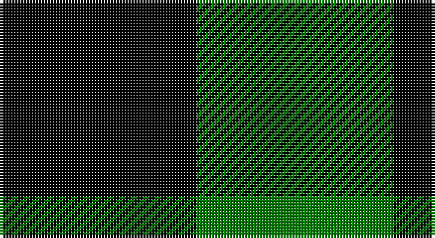

This page is one **sett** — a single exact thread-count. It belongs to the [tartan](/setts/k1g1/)
(the same proportion at any scale), whose colour order is pattern [GK](/stripes/gk/).

Sourced from weddslist.  It is a [2 stripe tartan](/stripes/stripes2/).

Original link http://www.weddslist.com/cgi-bin/tartans/pg.pl?source=sts

## Also known as

This cloth is also recorded under:

- Robin Hood / Rob Roy hunting
- Wilson's, No 219

## Thread count
K/66 G/66

One full sett is **132 threads**.

## Palette

Palette: <strong>Ingles Buchan</strong> <small style="color:#888">(1 of 2 colours)</small>
<table><thead><tr><th>Colour</th><th>Threads</th><th>Shade</th><th>Base</th><th>OKLCh</th></tr></thead><tbody><tr><td>K/</td><td style="text-align:right;font-variant-numeric:tabular-nums">66</td><td><code style="background-color:#000000;">#000000</code> <small style="color:#888">#000000</small></td><td>K <code style="background-color:#000000;">#000000</code></td><td><small style="color:#888">oklch(0.0% 0.000 0.0)</small></td></tr><tr><td>G/</td><td style="text-align:right;font-variant-numeric:tabular-nums">66</td><td><code style="background-color:#008000;">#008000</code> <small style="color:#888">#008000</small></td><td>G <code style="background-color:#006100;">#006100</code></td><td><small style="color:#888">oklch(52.0% 0.177 142.5)</small></td></tr></tbody></table>

# Sample pattern

## Nearest tartans

The nearest existing variants by ΔTartan distance, with this tartan at the top so the swatches line up against it.

ΔTartan

Tartan

Sett

—

<a href="/ttd/edit/#slug=k1g1~x66">Robin Hood / Rob Roy hunting</a> <a class="nn-out" href="/variants/s2/k1g1~x66/" title="open its dictionary page">↗</a>

2.11

<a href="/ttd/edit/#slug=k1y1~x100&amp;base=k1g1~x66">Rob Roy, Black &amp; Tan (Fashion)</a> <a class="nn-out" href="/variants/s2/k1y1~x100/" title="open its dictionary page">↗</a>

2.15

<a href="/ttd/edit/#slug=k1lr1&amp;base=k1g1~x66">Shepherd</a> <a class="nn-out" href="/variants/s2/k1lr1/" title="open its dictionary page">↗</a>

2.23

<a href="/ttd/edit/#slug=g9k8~x2&amp;base=k1g1~x66">Robin Hood Fancy Tartan</a> <a class="nn-out" href="/variants/s2/g9k8~x2/" title="open its dictionary page">↗</a>

2.54

<a href="/ttd/edit/#slug=k1ly1~x40&amp;base=k1g1~x66">Justus Check (Personal)</a> <a class="nn-out" href="/variants/s2/k1ly1~x40/" title="open its dictionary page">↗</a>

2.54

<a href="/ttd/edit/#slug=k1ly1~x50&amp;base=k1g1~x66">Justus Check (Personal)</a> <a class="nn-out" href="/variants/s2/k1ly1~x50/" title="open its dictionary page">↗</a>

2.58

<a href="/ttd/edit/#slug=k1w1~x15&amp;base=k1g1~x66">Shepherd</a> <a class="nn-out" href="/variants/s2/k1w1~x15/" title="open its dictionary page">↗</a>

2.58

<a href="/ttd/edit/#slug=k1w1~x28&amp;base=k1g1~x66">Shepherd Check</a> <a class="nn-out" href="/variants/s2/k1w1~x28/" title="open its dictionary page">↗</a>

2.70

<a href="/ttd/edit/#slug=k9t8~x2&amp;base=k1g1~x66">Wilson's No.172</a> <a class="nn-out" href="/variants/s2/k9t8~x2/" title="open its dictionary page">↗</a>

2.78

<a href="/ttd/edit/#slug=k8g7db8~x2&amp;base=k1g1~x66">Glen Lyon</a> <a class="nn-out" href="/variants/s3/k8g7db8~x2/" title="open its dictionary page">↗</a>

2.94

<a href="/ttd/edit/#slug=g1p1~x16&amp;base=k1g1~x66">Wilson's, No 116</a> <a class="nn-out" href="/variants/s2/g1p1~x16/" title="open its dictionary page">↗</a>

## Neighbour map

Every grey dot is one of 14360 variants placed by the first two principal components of the ΔTartan feature space (44% of its variance). Red is this tartan; blue dots are its nearest — click one to open its page.

<svg viewBox="0 0 640 380" role="img" style="max-width:100%;height:auto;border:1px solid #e0e0e0;border-radius:4px;display:block" xmlns="http://www.w3.org/2000/svg"><image href="/nn/cloud.v1.png" width="640" height="380"/><a href="/variants/s2/k1y1~x100/"><circle cx="161.2" cy="366.0" r="4" fill="#3465a4"><title>Rob Roy, Black &amp; Tan (Fashion)</title></circle></a><a href="/variants/s2/k1lr1/"><circle cx="117.7" cy="366.0" r="4" fill="#3465a4"><title>Shepherd</title></circle></a><a href="/variants/s2/g9k8~x2/"><circle cx="215.6" cy="366.0" r="4" fill="#3465a4"><title>Robin Hood Fancy Tartan</title></circle></a><a href="/variants/s2/k1ly1~x40/"><circle cx="117.0" cy="366.0" r="4" fill="#3465a4"><title>Justus Check (Personal)</title></circle></a><a href="/variants/s2/k1ly1~x50/"><circle cx="117.0" cy="366.0" r="4" fill="#3465a4"><title>Justus Check (Personal)</title></circle></a><a href="/variants/s2/k1w1~x15/"><circle cx="109.2" cy="366.0" r="4" fill="#3465a4"><title>Shepherd</title></circle></a><a href="/variants/s2/k1w1~x28/"><circle cx="109.2" cy="366.0" r="4" fill="#3465a4"><title>Shepherd Check</title></circle></a><a href="/variants/s2/k9t8~x2/"><circle cx="171.9" cy="366.0" r="4" fill="#3465a4"><title>Wilson's No.172</title></circle></a><a href="/variants/s3/k8g7db8~x2/"><circle cx="23.3" cy="366.0" r="4" fill="#3465a4"><title>Glen Lyon</title></circle></a><a href="/variants/s2/g1p1~x16/"><circle cx="160.4" cy="366.0" r="4" fill="#3465a4"><title>Wilson's, No 116</title></circle></a><circle cx="128.2" cy="366.0" r="5" fill="#c00000"/></svg>

ID: /variants/s2/k1g1~x66/
