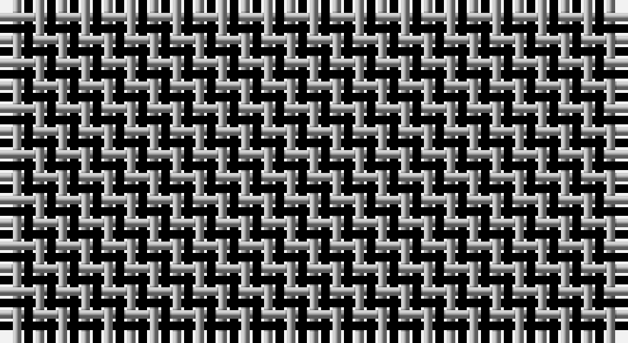

This page is one **sett** — a single exact thread-count. It belongs to the [tartan](/setts/k1lr1/)
(the same proportion at any scale), whose colour order is pattern [KY](/stripes/ky/).

Part of the [Shepherd](/tartans/shepherd/) tartan — the named design grouping this sett with its other cloths.

Sourced from weddslist.  It is a [2 stripe tartan](/stripes/stripes2/).

Original link http://www.weddslist.com/cgi-bin/tartans/pg.pl?source=tinsel

## Also known as

This cloth is also recorded under:

- Falkirk
- Northumberland
- Shepherd Brown & White
- Shepherd Check
- Shepherd Historic
- Shepherd or Falkirk
- Shepherd,

2 attestations — the source records this cloth was collapsed from (oldest owns this page)

<ul>
<li>undated — Shepherd (weddslist, <a href="http://www.weddslist.com/cgi-bin/tartans/pg.pl?source=tinsel">record</a>)</li>
<li>undated — Shepherd (weddslist, <a href="http://www.weddslist.com/cgi-bin/tartans/pg.pl?source=x">record</a>)</li>
</ul>

## Related setts

Setts a curator has related to this one.

- **derived-from**: [/setts/dy1lb1/](/setts/dy1lb1/) — The Shepherd's Check is the black-and-white form of the Falkirk sett — the oldest surviving Scottish tartan (c. 3rd century AD), a simple 2:2 check recovered in undyed brown-and-white wool near Falkirk. Restated in dyed black and white it became the Border shepherds' plaid from which a long line of district checks descends.
- **parent-of**: [Shepherd](/setts/k1w1/) — The black-and-white Shepherd's Check is the Falkirk sett restated in dyed wool.
- **parent-of**: [/setts/k1w1k1w1b1/](/setts/k1w1k1w1b1/) — Haig is one of the Border district checks built on the Shepherd's Check.

## Thread count
K/1 N/1

One full sett is **2 threads**.

## Palette

Palette: <strong>Ingles Buchan</strong> <small style="color:#888">(1 of 2 colours)</small>
<table><thead><tr><th>Colour</th><th>Threads</th><th>Shade</th><th>Base</th><th>OKLCh</th></tr></thead><tbody><tr><td>K/</td><td style="text-align:right;font-variant-numeric:tabular-nums">1</td><td><code style="background-color:#000000;">#000000</code> <small style="color:#888">#000000</small></td><td>K <code style="background-color:#000000;">#000000</code></td><td><small style="color:#888">oklch(0.0% 0.000 0.0)</small></td></tr><tr><td>N/</td><td style="text-align:right;font-variant-numeric:tabular-nums">1</td><td><code style="background-color:#AAAAAA;">#AAAAAA</code> <small style="color:#888">#AAAAAA</small></td><td>Y <code style="background-color:#F2BF00;">#F2BF00</code></td><td><small style="color:#888">oklch(73.8% 0.000 89.9)</small></td></tr></tbody></table>

# Sample pattern

## Compared to the master

This cloth is one sett of its design; the master sett (the exemplar the design is anchored on) is below for comparison.

<figure style="margin:0"><figcaption style="color:#888;font-size:smaller">this sett</figcaption></figure>
<figure style="margin:0"><figcaption style="color:#888;font-size:smaller"><a href="/setts/k1w1/">master sett →</a></figcaption></figure>

## Nearest tartans

The nearest existing variants by ΔTartan distance, with this tartan at the top so the swatches line up against it.

ΔTartan

Tartan

Sett

—

<a href="/ttd/edit/#slug=k1lr1">Shepherd</a> <a class="nn-out" href="/variants/s2/k1lr1/" title="open its dictionary page">↗</a>

0.73

<a href="/ttd/edit/#slug=k1w1~x15&amp;base=k1lr1">Shepherd</a> <a class="nn-out" href="/variants/s2/k1w1~x15/" title="open its dictionary page">↗</a>

0.73

<a href="/ttd/edit/#slug=k1w1~x28&amp;base=k1lr1">Shepherd Check</a> <a class="nn-out" href="/variants/s2/k1w1~x28/" title="open its dictionary page">↗</a>

1.44

<a href="/ttd/edit/#slug=k1w1~x6&amp;base=k1lr1">Shepherd Check (Universal)</a> <a class="nn-out" href="/variants/s2/k1w1~x6/" title="open its dictionary page">↗</a>

1.66

<a href="/ttd/edit/#slug=k1w1~x24&amp;base=k1lr1">Falkirk Tartan</a> <a class="nn-out" href="/variants/s2/k1w1~x24/" title="open its dictionary page">↗</a>

1.68

<a href="/ttd/edit/#slug=k1y1~x100&amp;base=k1lr1">Rob Roy, Black &amp; Tan (Fashion)</a> <a class="nn-out" href="/variants/s2/k1y1~x100/" title="open its dictionary page">↗</a>

1.73

<a href="/ttd/edit/#slug=k1w1k1~x10&amp;base=k1lr1">Northumberland</a> <a class="nn-out" href="/variants/s3/k1w1k1~x10/" title="open its dictionary page">↗</a>

1.76

<a href="/ttd/edit/#slug=k9t8~x2&amp;base=k1lr1">Wilson's No.172</a> <a class="nn-out" href="/variants/s2/k9t8~x2/" title="open its dictionary page">↗</a>

1.81

<a href="/ttd/edit/#slug=g1p1~x16&amp;base=k1lr1">Wilson's, No 116</a> <a class="nn-out" href="/variants/s2/g1p1~x16/" title="open its dictionary page">↗</a>

2.04

<a href="/ttd/edit/#slug=k1ly1~x40&amp;base=k1lr1">Justus Check (Personal)</a> <a class="nn-out" href="/variants/s2/k1ly1~x40/" title="open its dictionary page">↗</a>

2.04

<a href="/ttd/edit/#slug=k1ly1~x50&amp;base=k1lr1">Justus Check (Personal)</a> <a class="nn-out" href="/variants/s2/k1ly1~x50/" title="open its dictionary page">↗</a>

## Neighbour map

Every grey dot is one of 14360 variants placed by the first two principal components of the ΔTartan feature space (44% of its variance). Red is this tartan; blue dots are its nearest — click one to open its page.

<svg viewBox="0 0 640 380" role="img" style="max-width:100%;height:auto;border:1px solid #e0e0e0;border-radius:4px;display:block" xmlns="http://www.w3.org/2000/svg"><image href="/nn/cloud.v1.png" width="640" height="380"/><a href="/variants/s2/k1w1~x15/"><circle cx="109.2" cy="366.0" r="4" fill="#3465a4"><title>Shepherd</title></circle></a><a href="/variants/s2/k1w1~x28/"><circle cx="109.2" cy="366.0" r="4" fill="#3465a4"><title>Shepherd Check</title></circle></a><a href="/variants/s2/k1w1~x6/"><circle cx="110.2" cy="366.0" r="4" fill="#3465a4"><title>Shepherd Check (Universal)</title></circle></a><a href="/variants/s2/k1w1~x24/"><circle cx="113.1" cy="366.0" r="4" fill="#3465a4"><title>Falkirk Tartan</title></circle></a><a href="/variants/s2/k1y1~x100/"><circle cx="161.2" cy="366.0" r="4" fill="#3465a4"><title>Rob Roy, Black &amp; Tan (Fashion)</title></circle></a><a href="/variants/s3/k1w1k1~x10/"><circle cx="179.1" cy="366.0" r="4" fill="#3465a4"><title>Northumberland</title></circle></a><a href="/variants/s2/k9t8~x2/"><circle cx="171.9" cy="366.0" r="4" fill="#3465a4"><title>Wilson's No.172</title></circle></a><a href="/variants/s2/g1p1~x16/"><circle cx="160.4" cy="366.0" r="4" fill="#3465a4"><title>Wilson's, No 116</title></circle></a><a href="/variants/s2/k1ly1~x40/"><circle cx="117.0" cy="366.0" r="4" fill="#3465a4"><title>Justus Check (Personal)</title></circle></a><a href="/variants/s2/k1ly1~x50/"><circle cx="117.0" cy="366.0" r="4" fill="#3465a4"><title>Justus Check (Personal)</title></circle></a><circle cx="117.7" cy="366.0" r="5" fill="#c00000"/></svg>

ID: /variants/s2/k1lr1/
