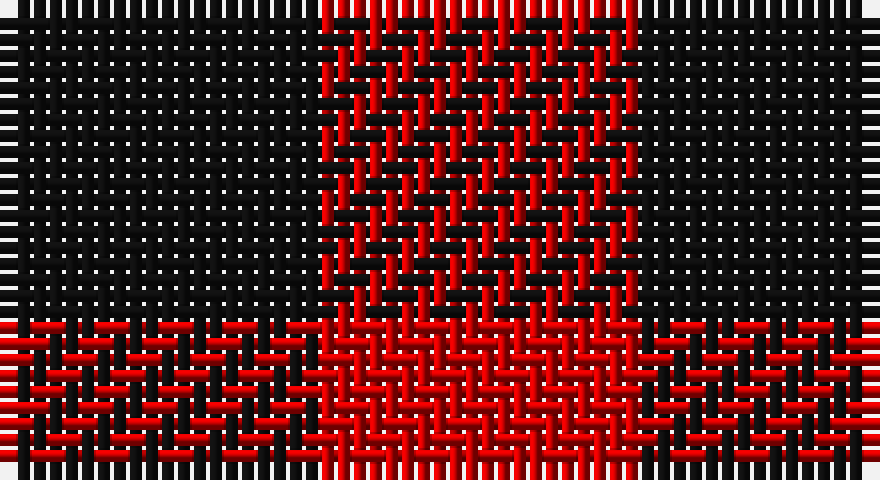

This page is one **sett** — a single exact thread-count. It belongs to the [tartan](/setts/k1r1/)
(the same proportion at any scale), whose colour order is pattern [KR](/stripes/kr/).

Sourced from tartans-authority.  It is a [2 stripe tartan](/stripes/stripes2/).

Original link http://www.tartansauthority.com/tartan-ferret/display/7190/

## Also known as

This cloth is also recorded under:

- MacGregor
- Masai Shuka 03
- Rob Roy
- Rob Roy Macgregor

## Register references

External register numbers recorded for this tartan.

- Scottish Tartans Authority (ITI): 7190

## Thread count
K/20 R/20

One full sett is **40 threads**.

## Palette

Palette: <strong>Tartan Register</strong>
<table><thead><tr><th>Colour</th><th>Threads</th><th>Shade</th><th>Base</th><th>OKLCh</th></tr></thead><tbody><tr><td>K/</td><td style="text-align:right;font-variant-numeric:tabular-nums">20</td><td><code style="background-color:#101010;">#101010</code> <small style="color:#888">#101010</small></td><td>K <code style="background-color:#000000;">#000000</code></td><td><small style="color:#888">oklch(17.3% 0.000 89.9)</small></td></tr><tr><td>R/</td><td style="text-align:right;font-variant-numeric:tabular-nums">20</td><td><code style="background-color:#C80000;">#C80000</code> <small style="color:#888">#C80000</small></td><td>R <code style="background-color:#CC0000;">#CC0000</code></td><td><small style="color:#888">oklch(52.3% 0.215 29.2)</small></td></tr></tbody></table>

# Sample pattern

## Nearest tartans

The nearest existing variants by ΔTartan distance, with this tartan at the top so the swatches line up against it.

ΔTartan

Tartan

Sett

—

<a href="/ttd/edit/#slug=k1r1~x20">Masai Shuka 03 (Artefact)</a> <a class="nn-out" href="/variants/s2/k1r1~x20/" title="open its dictionary page">↗</a>

0.00

<a href="/ttd/edit/#slug=k1r1~x172&amp;base=k1r1~x20">Rob Roy Macgregor</a> <a class="nn-out" href="/variants/s2/k1r1~x172/" title="open its dictionary page">↗</a>

0.00

<a href="/ttd/edit/#slug=k1r1~x100&amp;base=k1r1~x20">MacGregor - 1816 (Red &amp; Black)</a> <a class="nn-out" href="/variants/s2/k1r1~x100/" title="open its dictionary page">↗</a>

0.00

<a href="/ttd/edit/#slug=k1r1~x16&amp;base=k1r1~x20">Rob Roy Clan Tartan</a> <a class="nn-out" href="/variants/s2/k1r1~x16/" title="open its dictionary page">↗</a>

1.15

<a href="/ttd/edit/#slug=k1r1~x66&amp;base=k1r1~x20">Rob Roy</a> <a class="nn-out" href="/variants/s2/k1r1~x66/" title="open its dictionary page">↗</a>

1.16

<a href="/ttd/edit/#slug=k1r1~x4&amp;base=k1r1~x20">Rob Roy</a> <a class="nn-out" href="/variants/s2/k1r1~x4/" title="open its dictionary page">↗</a>

1.19

<a href="/ttd/edit/#slug=k1r1~x8&amp;base=k1r1~x20">Rob Roy</a> <a class="nn-out" href="/variants/s2/k1r1~x8/" title="open its dictionary page">↗</a>

1.59

<a href="/ttd/edit/#slug=dg1r1~x80&amp;base=k1r1~x20">Glenlyon (District)</a> <a class="nn-out" href="/variants/s2/dg1r1~x80/" title="open its dictionary page">↗</a>

1.76

<a href="/ttd/edit/#slug=db1r1~x20&amp;base=k1r1~x20">Masai Shuka 02 (Artefact)</a> <a class="nn-out" href="/variants/s2/db1r1~x20/" title="open its dictionary page">↗</a>

1.94

<a href="/ttd/edit/#slug=k1y1~x100&amp;base=k1r1~x20">Rob Roy, Black &amp; Tan (Fashion)</a> <a class="nn-out" href="/variants/s2/k1y1~x100/" title="open its dictionary page">↗</a>

2.23

<a href="/ttd/edit/#slug=r14g13~x2&amp;base=k1r1~x20">Moncreiffe (MacLachlan) Clan Tartan</a> <a class="nn-out" href="/variants/s2/r14g13~x2/" title="open its dictionary page">↗</a>

## Neighbour map

Every grey dot is one of 14360 variants placed by the first two principal components of the ΔTartan feature space (44% of its variance). Red is this tartan; blue dots are its nearest — click one to open its page.

<svg viewBox="0 0 640 380" role="img" style="max-width:100%;height:auto;border:1px solid #e0e0e0;border-radius:4px;display:block" xmlns="http://www.w3.org/2000/svg"><image href="/nn/cloud.v1.png" width="640" height="380"/><a href="/variants/s2/k1r1~x172/"><circle cx="170.2" cy="366.0" r="4" fill="#3465a4"><title>Rob Roy Macgregor</title></circle></a><a href="/variants/s2/k1r1~x100/"><circle cx="170.2" cy="366.0" r="4" fill="#3465a4"><title>MacGregor - 1816 (Red &amp; Black)</title></circle></a><a href="/variants/s2/k1r1~x16/"><circle cx="170.2" cy="366.0" r="4" fill="#3465a4"><title>Rob Roy Clan Tartan</title></circle></a><a href="/variants/s2/k1r1~x66/"><circle cx="149.8" cy="366.0" r="4" fill="#3465a4"><title>Rob Roy</title></circle></a><a href="/variants/s2/k1r1~x4/"><circle cx="148.0" cy="366.0" r="4" fill="#3465a4"><title>Rob Roy</title></circle></a><a href="/variants/s2/k1r1~x8/"><circle cx="155.9" cy="366.0" r="4" fill="#3465a4"><title>Rob Roy</title></circle></a><a href="/variants/s2/dg1r1~x80/"><circle cx="179.0" cy="366.0" r="4" fill="#3465a4"><title>Glenlyon (District)</title></circle></a><a href="/variants/s2/db1r1~x20/"><circle cx="186.9" cy="366.0" r="4" fill="#3465a4"><title>Masai Shuka 02 (Artefact)</title></circle></a><a href="/variants/s2/k1y1~x100/"><circle cx="161.2" cy="366.0" r="4" fill="#3465a4"><title>Rob Roy, Black &amp; Tan (Fashion)</title></circle></a><a href="/variants/s2/r14g13~x2/"><circle cx="210.9" cy="366.0" r="4" fill="#3465a4"><title>Moncreiffe (MacLachlan) Clan Tartan</title></circle></a><circle cx="170.2" cy="366.0" r="5" fill="#c00000"/></svg>

ID: /variants/s2/k1r1~x20/
