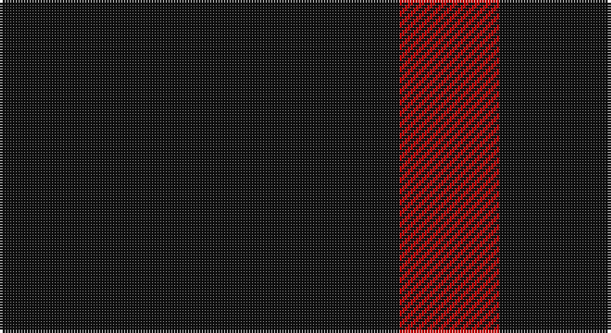

This page is one **sett** — a single exact thread-count. It belongs to the [tartan](/setts/k4r1/)
(the same proportion at any scale), whose colour order is pattern [KR](/stripes/kr/).

Sourced from register-of-tartans.  It is a [2 stripe tartan](/stripes/stripes2/).

Original link https://www.tartanregister.gov.uk/tartanDetails.aspx?ref=3896

## Also known as

This cloth is also recorded under:

- St. Kilda

2 attestations — the source records this cloth was collapsed from (oldest owns this page)

<ul>
<li>01/01/1900 — St Kilda (register-of-tartans, <a href="https://www.tartanregister.gov.uk/tartanDetails.aspx?ref=3896">record</a>)</li>
<li>pre 2002 — St. Kilda (District) (tartans-authority, <a href="http://www.tartansauthority.com/tartan-ferret/display/1189/">record</a>)</li>
</ul>

## Register references

External register numbers recorded for this tartan.

- Scottish Register of Tartans: [3896](https://www.tartanregister.gov.uk/tartanDetails.aspx?ref=3896)
- Scottish Tartans Authority (ITI): 1189
- Scottish Tartans World Register: 1189

## Thread count
K/144 R/36

One full sett is **180 threads**.

## Palette

Palette: <strong>Tartan Register</strong>
<table><thead><tr><th>Colour</th><th>Threads</th><th>Shade</th><th>Base</th><th>OKLCh</th></tr></thead><tbody><tr><td>K/</td><td style="text-align:right;font-variant-numeric:tabular-nums">144</td><td><code style="background-color:#101010;">#101010</code> <small style="color:#888">#101010</small></td><td>K <code style="background-color:#000000;">#000000</code></td><td><small style="color:#888">oklch(17.3% 0.000 89.9)</small></td></tr><tr><td>R/</td><td style="text-align:right;font-variant-numeric:tabular-nums">36</td><td><code style="background-color:#C80000;">#C80000</code> <small style="color:#888">#C80000</small></td><td>R <code style="background-color:#CC0000;">#CC0000</code></td><td><small style="color:#888">oklch(52.3% 0.215 29.2)</small></td></tr></tbody></table>

# Sample pattern

## Nearest tartans

The nearest existing variants by ΔTartan distance, with this tartan at the top so the swatches line up against it.

ΔTartan

Tartan

Sett

—

<a href="/ttd/edit/#slug=k4r1~x36">St Kilda</a> <a class="nn-out" href="/variants/s2/k4r1~x36/" title="open its dictionary page">↗</a>

1.59

<a href="/ttd/edit/#slug=k4r1~x6&amp;base=k4r1~x36">St Kilda</a> <a class="nn-out" href="/variants/s2/k4r1~x6/" title="open its dictionary page">↗</a>

2.34

<a href="/ttd/edit/#slug=k10r3k1~x4&amp;base=k4r1~x36">Red Watch</a> <a class="nn-out" href="/variants/s3/k10r3k1~x4/" title="open its dictionary page">↗</a>

2.49

<a href="/variants/s4/k5lo1k1~x20/">Justus #2 (Personal)</a>

2.74

<a href="/ttd/edit/#slug=k69r14ly5~x2&amp;base=k4r1~x36">Batson (Personal)</a> <a class="nn-out" href="/variants/s3/k69r14ly5~x2/" title="open its dictionary page">↗</a>

2.80

<a href="/ttd/edit/#slug=k30dp5k10dp9~x4&amp;base=k4r1~x36">Leonard Hunting (Name)</a> <a class="nn-out" href="/variants/s4/k30dp5k10dp9~x4/" title="open its dictionary page">↗</a>

2.91

<a href="/ttd/edit/#slug=k2r4k7r1k2~x2&amp;base=k4r1~x36">Romsdal Tresfjord</a> <a class="nn-out" href="/variants/s5/k2r4k7r1k2~x2/" title="open its dictionary page">↗</a>

2.93

<a href="/ttd/edit/#slug=k55r18k4r18k38&amp;base=k4r1~x36">Unidentified Kirtle</a> <a class="nn-out" href="/variants/s5/k55r18k4r18k38/" title="open its dictionary page">↗</a>

2.93

<a href="/ttd/edit/#slug=k20r3k20r20~x2&amp;base=k4r1~x36">Wcwm 9275-1333-2</a> <a class="nn-out" href="/variants/s4/k20r3k20r20~x2/" title="open its dictionary page">↗</a>

2.98

<a href="/variants/s4/k5ly1k1~x12/">Justus</a>

2.98

<a href="/ttd/edit/#slug=m18k3m2~x4&amp;base=k4r1~x36">Buie</a> <a class="nn-out" href="/variants/s3/m18k3m2~x4/" title="open its dictionary page">↗</a>

## Neighbour map

Every grey dot is one of 14360 variants placed by the first two principal components of the ΔTartan feature space (44% of its variance). Red is this tartan; blue dots are its nearest — click one to open its page.

<svg viewBox="0 0 640 380" role="img" style="max-width:100%;height:auto;border:1px solid #e0e0e0;border-radius:4px;display:block" xmlns="http://www.w3.org/2000/svg"><image href="/nn/cloud.v1.png" width="640" height="380"/><a href="/variants/s2/k4r1~x6/"><circle cx="481.4" cy="362.6" r="4" fill="#3465a4"><title>St Kilda</title></circle></a><a href="/variants/s3/k10r3k1~x4/"><circle cx="550.0" cy="308.9" r="4" fill="#3465a4"><title>Red Watch</title></circle></a><a href="/variants/s4/k5lo1k1~x20/"><circle cx="442.6" cy="284.8" r="4" fill="#3465a4"><title>Justus #2 (Personal)</title></circle></a><a href="/variants/s3/k69r14ly5~x2/"><circle cx="513.4" cy="245.9" r="4" fill="#3465a4"><title>Batson (Personal)</title></circle></a><a href="/variants/s4/k30dp5k10dp9~x4/"><circle cx="530.3" cy="340.9" r="4" fill="#3465a4"><title>Leonard Hunting (Name)</title></circle></a><a href="/variants/s5/k2r4k7r1k2~x2/"><circle cx="480.5" cy="319.7" r="4" fill="#3465a4"><title>Romsdal Tresfjord</title></circle></a><a href="/variants/s5/k55r18k4r18k38/"><circle cx="468.6" cy="260.9" r="4" fill="#3465a4"><title>Unidentified Kirtle</title></circle></a><a href="/variants/s4/k20r3k20r20~x2/"><circle cx="427.4" cy="348.9" r="4" fill="#3465a4"><title>Wcwm 9275-1333-2</title></circle></a><a href="/variants/s4/k5ly1k1~x12/"><circle cx="425.6" cy="282.8" r="4" fill="#3465a4"><title>Justus</title></circle></a><a href="/variants/s3/m18k3m2~x4/"><circle cx="626.0" cy="281.8" r="4" fill="#3465a4"><title>Buie</title></circle></a><circle cx="505.2" cy="366.0" r="5" fill="#c00000"/></svg>

ID: /variants/s2/k4r1~x36/
