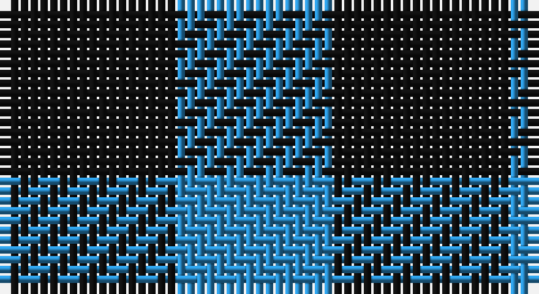

This page is one **sett** — a single exact thread-count. It belongs to the [tartan](/setts/k9t8/)
(the same proportion at any scale), whose colour order is pattern [BK](/stripes/bk/).

Sourced from register-of-tartans.  It is a [2 stripe tartan](/stripes/stripes2/).

Original link https://www.tartanregister.gov.uk/tartanDetails.aspx?ref=4711

## Also known as

This cloth is also recorded under:

- Wilson's, No: 172

2 attestations — the source records this cloth was collapsed from (oldest owns this page)

<ul>
<li>01/01/1819 — Wilson's No.172 (register-of-tartans, <a href="https://www.tartanregister.gov.uk/tartanDetails.aspx?ref=4711">record</a>)</li>
<li>undated — Wilson's, No: 172 (weddslist, <a href="http://www.weddslist.com/cgi-bin/tartans/pg.pl?source=sts">record</a>)</li>
</ul>

## Register references

External register numbers recorded for this tartan.

- Scottish Register of Tartans: [4711](https://www.tartanregister.gov.uk/tartanDetails.aspx?ref=4711)
- Scottish Tartans Authority (ITI): 250
- Scottish Tartans World Register: 250

## Thread count
K/18 B/16

One full sett is **34 threads**.

## Palette

Palette: <strong>Tartan Register</strong>
<table><thead><tr><th>Colour</th><th>Threads</th><th>Shade</th><th>Base</th><th>OKLCh</th></tr></thead><tbody><tr><td>K/</td><td style="text-align:right;font-variant-numeric:tabular-nums">18</td><td><code style="background-color:#101010;">#101010</code> <small style="color:#888">#101010</small></td><td>K <code style="background-color:#000000;">#000000</code></td><td><small style="color:#888">oklch(17.3% 0.000 89.9)</small></td></tr><tr><td>B/</td><td style="text-align:right;font-variant-numeric:tabular-nums">16</td><td><code style="background-color:#2888C4;">#2888C4</code> <small style="color:#888">#2888C4</small></td><td>B <code style="background-color:#2A418A;">#2A418A</code></td><td><small style="color:#888">oklch(60.1% 0.125 241.5)</small></td></tr></tbody></table>

# Sample pattern

## Nearest tartans

The nearest existing variants by ΔTartan distance, with this tartan at the top so the swatches line up against it.

ΔTartan

Tartan

Sett

—

<a href="/ttd/edit/#slug=k9t8~x2">Wilson's No.172</a> <a class="nn-out" href="/variants/s2/k9t8~x2/" title="open its dictionary page">↗</a>

1.76

<a href="/ttd/edit/#slug=k1lr1&amp;base=k9t8~x2">Shepherd</a> <a class="nn-out" href="/variants/s2/k1lr1/" title="open its dictionary page">↗</a>

1.86

<a href="/ttd/edit/#slug=g1p1~x16&amp;base=k9t8~x2">Wilson's, No 116</a> <a class="nn-out" href="/variants/s2/g1p1~x16/" title="open its dictionary page">↗</a>

1.98

<a href="/ttd/edit/#slug=k1w1~x15&amp;base=k9t8~x2">Shepherd</a> <a class="nn-out" href="/variants/s2/k1w1~x15/" title="open its dictionary page">↗</a>

1.98

<a href="/ttd/edit/#slug=k1w1~x28&amp;base=k9t8~x2">Shepherd Check</a> <a class="nn-out" href="/variants/s2/k1w1~x28/" title="open its dictionary page">↗</a>

2.19

<a href="/ttd/edit/#slug=k1y1~x100&amp;base=k9t8~x2">Rob Roy, Black &amp; Tan (Fashion)</a> <a class="nn-out" href="/variants/s2/k1y1~x100/" title="open its dictionary page">↗</a>

2.25

<a href="/ttd/edit/#slug=k1w1~x6&amp;base=k9t8~x2">Shepherd Check (Universal)</a> <a class="nn-out" href="/variants/s2/k1w1~x6/" title="open its dictionary page">↗</a>

2.35

<a href="/ttd/edit/#slug=k1w1k1~x10&amp;base=k9t8~x2">Northumberland</a> <a class="nn-out" href="/variants/s3/k1w1k1~x10/" title="open its dictionary page">↗</a>

2.53

<a href="/variants/s4/lo5db5k3~x4/">Kazakhstan Relic</a>

2.55

<a href="/ttd/edit/#slug=y9dp8~x2&amp;base=k9t8~x2">Wilson's No.116 (light)</a> <a class="nn-out" href="/variants/s2/y9dp8~x2/" title="open its dictionary page">↗</a>

2.59

<a href="/ttd/edit/#slug=g9k8~x2&amp;base=k9t8~x2">Robin Hood Fancy Tartan</a> <a class="nn-out" href="/variants/s2/g9k8~x2/" title="open its dictionary page">↗</a>

## Neighbour map

Every grey dot is one of 14360 variants placed by the first two principal components of the ΔTartan feature space (44% of its variance). Red is this tartan; blue dots are its nearest — click one to open its page.

<svg viewBox="0 0 640 380" role="img" style="max-width:100%;height:auto;border:1px solid #e0e0e0;border-radius:4px;display:block" xmlns="http://www.w3.org/2000/svg"><image href="/nn/cloud.v1.png" width="640" height="380"/><a href="/variants/s2/k1lr1/"><circle cx="117.7" cy="366.0" r="4" fill="#3465a4"><title>Shepherd</title></circle></a><a href="/variants/s2/g1p1~x16/"><circle cx="160.4" cy="366.0" r="4" fill="#3465a4"><title>Wilson's, No 116</title></circle></a><a href="/variants/s2/k1w1~x15/"><circle cx="109.2" cy="366.0" r="4" fill="#3465a4"><title>Shepherd</title></circle></a><a href="/variants/s2/k1w1~x28/"><circle cx="109.2" cy="366.0" r="4" fill="#3465a4"><title>Shepherd Check</title></circle></a><a href="/variants/s2/k1y1~x100/"><circle cx="161.2" cy="366.0" r="4" fill="#3465a4"><title>Rob Roy, Black &amp; Tan (Fashion)</title></circle></a><a href="/variants/s2/k1w1~x6/"><circle cx="110.2" cy="366.0" r="4" fill="#3465a4"><title>Shepherd Check (Universal)</title></circle></a><a href="/variants/s3/k1w1k1~x10/"><circle cx="179.1" cy="366.0" r="4" fill="#3465a4"><title>Northumberland</title></circle></a><a href="/variants/s4/lo5db5k3~x4/"><circle cx="171.5" cy="366.0" r="4" fill="#3465a4"><title>Kazakhstan Relic</title></circle></a><a href="/variants/s2/y9dp8~x2/"><circle cx="233.9" cy="366.0" r="4" fill="#3465a4"><title>Wilson's No.116 (light)</title></circle></a><a href="/variants/s2/g9k8~x2/"><circle cx="215.6" cy="366.0" r="4" fill="#3465a4"><title>Robin Hood Fancy Tartan</title></circle></a><circle cx="171.9" cy="366.0" r="5" fill="#c00000"/></svg>

ID: /variants/s2/k9t8~x2/
