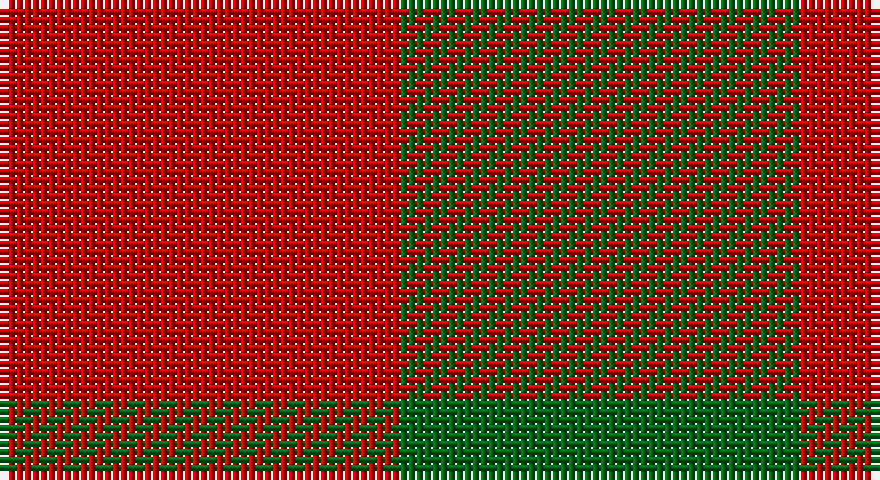

This page is one **sett** — a single exact thread-count. It belongs to the [tartan](/setts/r1g1/)
(the same proportion at any scale), whose colour order is pattern [GR](/stripes/gr/).

Sourced from register-of-tartans.  It is a [2 stripe tartan](/stripes/stripes2/).

Original link https://www.tartanregister.gov.uk/tartanDetails.aspx?ref=2980

## Register references

External register numbers recorded for this tartan.

- Scottish Register of Tartans: [2980](https://www.tartanregister.gov.uk/tartanDetails.aspx?ref=2980)
- Scottish Tartans Authority (ITI): 963
- Scottish Tartans World Register: 963

## Thread count
R/50 G/50

One full sett is **100 threads**.

## Palette

Palette: <strong>Tartan Register</strong>
<table><thead><tr><th>Colour</th><th>Threads</th><th>Shade</th><th>Base</th><th>OKLCh</th></tr></thead><tbody><tr><td>R/</td><td style="text-align:right;font-variant-numeric:tabular-nums">50</td><td><code style="background-color:#C80000;">#C80000</code> <small style="color:#888">#C80000</small></td><td>R <code style="background-color:#CC0000;">#CC0000</code></td><td><small style="color:#888">oklch(52.3% 0.215 29.2)</small></td></tr><tr><td>G/</td><td style="text-align:right;font-variant-numeric:tabular-nums">50</td><td><code style="background-color:#006818;">#006818</code> <small style="color:#888">#006818</small></td><td>G <code style="background-color:#006100;">#006100</code></td><td><small style="color:#888">oklch(45.0% 0.142 145.0)</small></td></tr></tbody></table>

# Sample pattern

## Nearest tartans

The nearest existing variants by ΔTartan distance, with this tartan at the top so the swatches line up against it.

ΔTartan

Tartan

Sett

—

<a href="/ttd/edit/#slug=r1g1~x50">Moncreiffe</a> <a class="nn-out" href="/variants/s2/r1g1~x50/" title="open its dictionary page">↗</a>

0.00

<a href="/ttd/edit/#slug=r1g1~x100&amp;base=r1g1~x50">Moncrieffe Lachlan (Clan)</a> <a class="nn-out" href="/variants/s2/r1g1~x100/" title="open its dictionary page">↗</a>

0.46

<a href="/ttd/edit/#slug=r14g13~x2&amp;base=r1g1~x50">Moncreiffe (MacLachlan) Clan Tartan</a> <a class="nn-out" href="/variants/s2/r14g13~x2/" title="open its dictionary page">↗</a>

0.59

<a href="/ttd/edit/#slug=dg14r13~x2&amp;base=r1g1~x50">Wilson's No.099</a> <a class="nn-out" href="/variants/s2/dg14r13~x2/" title="open its dictionary page">↗</a>

0.73

<a href="/ttd/edit/#slug=dg1r1~x80&amp;base=r1g1~x50">Glenlyon (District)</a> <a class="nn-out" href="/variants/s2/dg1r1~x80/" title="open its dictionary page">↗</a>

1.05

<a href="/ttd/edit/#slug=dg1r1&amp;base=r1g1~x50">Moncreiffe</a> <a class="nn-out" href="/variants/s2/dg1r1/" title="open its dictionary page">↗</a>

1.92

<a href="/ttd/edit/#slug=k1y1~x100&amp;base=r1g1~x50">Rob Roy, Black &amp; Tan (Fashion)</a> <a class="nn-out" href="/variants/s2/k1y1~x100/" title="open its dictionary page">↗</a>

1.99

<a href="/ttd/edit/#slug=dy1lb1~x6&amp;base=r1g1~x50">Shepherd Brown &amp; White (Fashion?)</a> <a class="nn-out" href="/variants/s2/dy1lb1~x6/" title="open its dictionary page">↗</a>

2.10

<a href="/ttd/edit/#slug=y9dp8~x2&amp;base=r1g1~x50">Wilson's No.116 (light)</a> <a class="nn-out" href="/variants/s2/y9dp8~x2/" title="open its dictionary page">↗</a>

2.13

<a href="/ttd/edit/#slug=g1p1~x16&amp;base=r1g1~x50">Wilson's, No 116</a> <a class="nn-out" href="/variants/s2/g1p1~x16/" title="open its dictionary page">↗</a>

2.21

<a href="/ttd/edit/#slug=r1dg1r1~x2&amp;base=r1g1~x50">Moncreiffe D</a> <a class="nn-out" href="/variants/s3/r1dg1r1~x2/" title="open its dictionary page">↗</a>

## Neighbour map

Every grey dot is one of 14360 variants placed by the first two principal components of the ΔTartan feature space (44% of its variance). Red is this tartan; blue dots are its nearest — click one to open its page.

<svg viewBox="0 0 640 380" role="img" style="max-width:100%;height:auto;border:1px solid #e0e0e0;border-radius:4px;display:block" xmlns="http://www.w3.org/2000/svg"><image href="/nn/cloud.v1.png" width="640" height="380"/><a href="/variants/s2/r1g1~x100/"><circle cx="191.5" cy="366.0" r="4" fill="#3465a4"><title>Moncrieffe Lachlan (Clan)</title></circle></a><a href="/variants/s2/r14g13~x2/"><circle cx="210.9" cy="366.0" r="4" fill="#3465a4"><title>Moncreiffe (MacLachlan) Clan Tartan</title></circle></a><a href="/variants/s2/dg14r13~x2/"><circle cx="220.0" cy="366.0" r="4" fill="#3465a4"><title>Wilson's No.099</title></circle></a><a href="/variants/s2/dg1r1~x80/"><circle cx="179.0" cy="366.0" r="4" fill="#3465a4"><title>Glenlyon (District)</title></circle></a><a href="/variants/s2/dg1r1/"><circle cx="215.8" cy="366.0" r="4" fill="#3465a4"><title>Moncreiffe</title></circle></a><a href="/variants/s2/k1y1~x100/"><circle cx="161.2" cy="366.0" r="4" fill="#3465a4"><title>Rob Roy, Black &amp; Tan (Fashion)</title></circle></a><a href="/variants/s2/dy1lb1~x6/"><circle cx="145.4" cy="366.0" r="4" fill="#3465a4"><title>Shepherd Brown &amp; White (Fashion?)</title></circle></a><a href="/variants/s2/y9dp8~x2/"><circle cx="233.9" cy="366.0" r="4" fill="#3465a4"><title>Wilson's No.116 (light)</title></circle></a><a href="/variants/s2/g1p1~x16/"><circle cx="160.4" cy="366.0" r="4" fill="#3465a4"><title>Wilson's, No 116</title></circle></a><a href="/variants/s3/r1dg1r1~x2/"><circle cx="292.6" cy="366.0" r="4" fill="#3465a4"><title>Moncreiffe D</title></circle></a><circle cx="191.5" cy="366.0" r="5" fill="#c00000"/></svg>

ID: /variants/s2/r1g1~x50/
