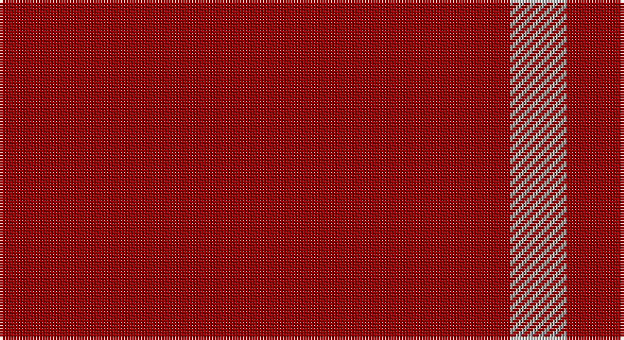

This page is one **sett** — a single exact thread-count. It belongs to the [tartan](/setts/r9lr1/)
(the same proportion at any scale), whose colour order is pattern [RY](/stripes/ry/).

Sourced from tartans-authority.  It is a [2 stripe tartan](/stripes/stripes2/).

Original link http://www.tartansauthority.com/tartan-ferret/display/5411/

## Register references

External register numbers recorded for this tartan.

- Scottish Tartans Authority (ITI): 5411

## Thread count
DR/180 N/20

One full sett is **200 threads**.

## Palette

Palette: <strong>Tartan Register</strong> <small style="color:#888">(1 of 2 colours)</small>
<table><thead><tr><th>Colour</th><th>Threads</th><th>Shade</th><th>Base</th><th>OKLCh</th></tr></thead><tbody><tr><td>DR/</td><td style="text-align:right;font-variant-numeric:tabular-nums">180</td><td><code style="background-color:#8C0000;">#8C0000</code> <small style="color:#888">#8C0000</small></td><td>R <code style="background-color:#CC0000;">#CC0000</code></td><td><small style="color:#888">oklch(40.2% 0.165 29.2)</small></td></tr><tr><td>N/</td><td style="text-align:right;font-variant-numeric:tabular-nums">20</td><td><code style="background-color:#B0B0B0;">#B0B0B0</code> <small style="color:#888">#B0B0B0</small></td><td>Y <code style="background-color:#F2BF00;">#F2BF00</code></td><td><small style="color:#888">oklch(75.7% 0.000 89.9)</small></td></tr></tbody></table>

# Sample pattern

## Nearest tartans

The nearest existing variants by ΔTartan distance, with this tartan at the top so the swatches line up against it.

ΔTartan

Tartan

Sett

—

<a href="/ttd/edit/#slug=r9lr1~x20">Roddy &quot;Rowdy&quot; Piper (Personal)</a> <a class="nn-out" href="/variants/s2/r9lr1~x20/" title="open its dictionary page">↗</a>

2.06

<a href="/ttd/edit/#slug=m18k3m2~x4&amp;base=r9lr1~x20">Buie</a> <a class="nn-out" href="/variants/s3/m18k3m2~x4/" title="open its dictionary page">↗</a>

2.42

<a href="/ttd/edit/#slug=r18k3r2~x4&amp;base=r9lr1~x20">Buie</a> <a class="nn-out" href="/variants/s3/r18k3r2~x4/" title="open its dictionary page">↗</a>

2.85

<a href="/ttd/edit/#slug=db1r9db2r9lo1~x4&amp;base=r9lr1~x20">Brooks Brothers Tattersall Red</a> <a class="nn-out" href="/variants/s5/db1r9db2r9lo1~x4/" title="open its dictionary page">↗</a>

2.89

<a href="/ttd/edit/#slug=r8w1k1~x20&amp;base=r9lr1~x20">International Karate Fed. (Corporat)</a> <a class="nn-out" href="/variants/s3/r8w1k1~x20/" title="open its dictionary page">↗</a>

3.18

<a href="/ttd/edit/#slug=r10y3r24lb3r16k3r8~x2&amp;base=r9lr1~x20">Rannoch Red</a> <a class="nn-out" href="/variants/s7/r10y3r24lb3r16k3r8~x2/" title="open its dictionary page">↗</a>

3.21

<a href="/ttd/edit/#slug=r3dg1~x14&amp;base=r9lr1~x20">Wilson's No.134</a> <a class="nn-out" href="/variants/s2/r3dg1~x14/" title="open its dictionary page">↗</a>

3.25

<a href="/ttd/edit/#slug=r3t1~x14&amp;base=r9lr1~x20">Wilson's No.138</a> <a class="nn-out" href="/variants/s2/r3t1~x14/" title="open its dictionary page">↗</a>

3.31

<a href="/ttd/edit/#slug=r3g1~x14&amp;base=r9lr1~x20">Wilson's, No 134</a> <a class="nn-out" href="/variants/s2/r3g1~x14/" title="open its dictionary page">↗</a>

3.36

<a href="/ttd/edit/#slug=r40db2r6db15~x2&amp;base=r9lr1~x20">Masai Shuka 21 (Artefact)</a> <a class="nn-out" href="/variants/s4/r40db2r6db15~x2/" title="open its dictionary page">↗</a>

3.40

<a href="/ttd/edit/#slug=o5k2o28k10o26k4o4~x2&amp;base=r9lr1~x20">Dunbar, John Telfer (Personal)</a> <a class="nn-out" href="/variants/s7/o5k2o28k10o26k4o4~x2/" title="open its dictionary page">↗</a>

## Neighbour map

Every grey dot is one of 14360 variants placed by the first two principal components of the ΔTartan feature space (44% of its variance). Red is this tartan; blue dots are its nearest — click one to open its page.

<svg viewBox="0 0 640 380" role="img" style="max-width:100%;height:auto;border:1px solid #e0e0e0;border-radius:4px;display:block" xmlns="http://www.w3.org/2000/svg"><image href="/nn/cloud.v1.png" width="640" height="380"/><a href="/variants/s3/m18k3m2~x4/"><circle cx="626.0" cy="281.8" r="4" fill="#3465a4"><title>Buie</title></circle></a><a href="/variants/s3/r18k3r2~x4/"><circle cx="606.3" cy="252.3" r="4" fill="#3465a4"><title>Buie</title></circle></a><a href="/variants/s5/db1r9db2r9lo1~x4/"><circle cx="605.6" cy="274.2" r="4" fill="#3465a4"><title>Brooks Brothers Tattersall Red</title></circle></a><a href="/variants/s3/r8w1k1~x20/"><circle cx="521.8" cy="246.8" r="4" fill="#3465a4"><title>International Karate Fed. (Corporat)</title></circle></a><a href="/variants/s7/r10y3r24lb3r16k3r8~x2/"><circle cx="588.6" cy="244.3" r="4" fill="#3465a4"><title>Rannoch Red</title></circle></a><a href="/variants/s2/r3dg1~x14/"><circle cx="484.5" cy="366.0" r="4" fill="#3465a4"><title>Wilson's No.134</title></circle></a><a href="/variants/s2/r3t1~x14/"><circle cx="485.9" cy="366.0" r="4" fill="#3465a4"><title>Wilson's No.138</title></circle></a><a href="/variants/s2/r3g1~x14/"><circle cx="469.2" cy="366.0" r="4" fill="#3465a4"><title>Wilson's, No 134</title></circle></a><a href="/variants/s4/r40db2r6db15~x2/"><circle cx="546.2" cy="226.0" r="4" fill="#3465a4"><title>Masai Shuka 21 (Artefact)</title></circle></a><a href="/variants/s7/o5k2o28k10o26k4o4~x2/"><circle cx="601.1" cy="251.2" r="4" fill="#3465a4"><title>Dunbar, John Telfer (Personal)</title></circle></a><circle cx="626.0" cy="314.6" r="5" fill="#c00000"/></svg>

ID: /variants/s2/r9lr1~x20/
