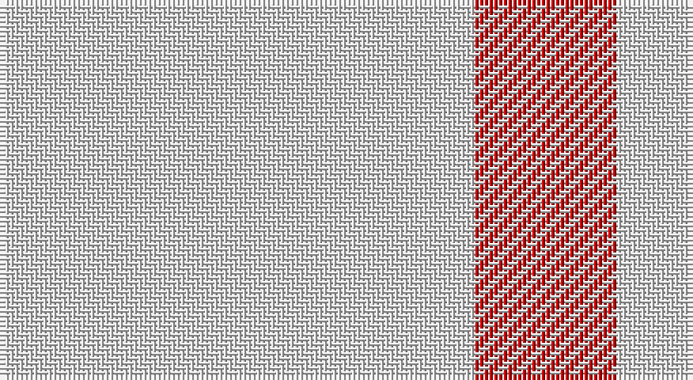

This page is one **sett** — a single exact thread-count. It belongs to the [tartan](/setts/w10r3/)
(the same proportion at any scale), whose colour order is pattern [RW](/stripes/rw/).

Sourced from tartans-authority.  It is a [2 stripe tartan](/stripes/stripes2/).

Original link http://www.tartansauthority.com/tartan-ferret/display/8127/

## Also known as

This cloth is also recorded under:

- English Kilt

## Register references

External register numbers recorded for this tartan.

- Scottish Register of Tartans: [8127](https://www.tartanregister.gov.uk/tartanDetails?ref=8127)
- Scottish Tartans Authority (ITI): 8127

## Thread count
LN/100 R/30

One full sett is **130 threads**.

## Palette

Palette: <strong>Tartan Register</strong>
<table><thead><tr><th>Colour</th><th>Threads</th><th>Shade</th><th>Base</th><th>OKLCh</th></tr></thead><tbody><tr><td>LN/</td><td style="text-align:right;font-variant-numeric:tabular-nums">100</td><td><code style="background-color:#E0E0E0;">#E0E0E0</code> <small style="color:#888">#E0E0E0</small></td><td>W <code style="background-color:#F7F7F7;">#F7F7F7</code></td><td><small style="color:#888">oklch(90.7% 0.000 89.9)</small></td></tr><tr><td>R/</td><td style="text-align:right;font-variant-numeric:tabular-nums">30</td><td><code style="background-color:#C80000;">#C80000</code> <small style="color:#888">#C80000</small></td><td>R <code style="background-color:#CC0000;">#CC0000</code></td><td><small style="color:#888">oklch(52.3% 0.215 29.2)</small></td></tr></tbody></table>

# Sample pattern

## Nearest tartans

The nearest existing variants by ΔTartan distance, with this tartan at the top so the swatches line up against it.

ΔTartan

Tartan

Sett

—

<a href="/ttd/edit/#slug=w10r3~x10">English Kilt (Fashion)</a> <a class="nn-out" href="/variants/s2/w10r3~x10/" title="open its dictionary page">↗</a>

2.96

<a href="/ttd/edit/#slug=lo40g13lo6db13lo22~x2&amp;base=w10r3~x10">Burt's Highlanders (Fashion)</a> <a class="nn-out" href="/variants/s5/lo40g13lo6db13lo22~x2/" title="open its dictionary page">↗</a>

2.99

<a href="/ttd/edit/#slug=ly49r16k11~x2&amp;base=w10r3~x10">Quenouille (2011)</a> <a class="nn-out" href="/variants/s3/ly49r16k11~x2/" title="open its dictionary page">↗</a>

3.01

<a href="/ttd/edit/#slug=w11t20lo3t8~x2&amp;base=w10r3~x10">Lucard, Stéphane (Personal)</a> <a class="nn-out" href="/variants/s4/w11t20lo3t8~x2/" title="open its dictionary page">↗</a>

3.20

<a href="/ttd/edit/#slug=r35w94k6&amp;base=w10r3~x10">St Georges Check</a> <a class="nn-out" href="/variants/s3/r35w94k6/" title="open its dictionary page">↗</a>

3.26

<a href="/ttd/edit/#slug=w50db7w7t7w18~x2&amp;base=w10r3~x10">Sephardim (Corporate)</a> <a class="nn-out" href="/variants/s5/w50db7w7t7w18~x2/" title="open its dictionary page">↗</a>

3.33

<a href="/ttd/edit/#slug=lo7w6lo11r2~x2&amp;base=w10r3~x10">Virgin One (Corporate)</a> <a class="nn-out" href="/variants/s4/lo7w6lo11r2~x2/" title="open its dictionary page">↗</a>

3.38

<a href="/ttd/edit/#slug=ly6w5ly12r2~x2&amp;base=w10r3~x10">One Account (Corporate)</a> <a class="nn-out" href="/variants/s4/ly6w5ly12r2~x2/" title="open its dictionary page">↗</a>

3.50

<a href="/variants/s4/k7w6k1~x4/">Lendrum (B&amp;W)</a>

3.50

<a href="/variants/s6/k7w6k1w6~x4/">Wallace Dress</a>

3.54

<a href="/ttd/edit/#slug=w11t20ly3t8ly3t10~x2&amp;base=w10r3~x10">Lucard, Stphane (Personal))</a> <a class="nn-out" href="/variants/s6/w11t20ly3t8ly3t10~x2/" title="open its dictionary page">↗</a>

## Neighbour map

Every grey dot is one of 14360 variants placed by the first two principal components of the ΔTartan feature space (44% of its variance). Red is this tartan; blue dots are its nearest — click one to open its page.

<svg viewBox="0 0 640 380" role="img" style="max-width:100%;height:auto;border:1px solid #e0e0e0;border-radius:4px;display:block" xmlns="http://www.w3.org/2000/svg"><image href="/nn/cloud.v1.png" width="640" height="380"/><a href="/variants/s5/lo40g13lo6db13lo22~x2/"><circle cx="373.0" cy="245.5" r="4" fill="#3465a4"><title>Burt's Highlanders (Fashion)</title></circle></a><a href="/variants/s3/ly49r16k11~x2/"><circle cx="299.7" cy="262.4" r="4" fill="#3465a4"><title>Quenouille (2011)</title></circle></a><a href="/variants/s4/w11t20lo3t8~x2/"><circle cx="363.0" cy="277.7" r="4" fill="#3465a4"><title>Lucard, Stéphane (Personal)</title></circle></a><a href="/variants/s3/r35w94k6/"><circle cx="406.5" cy="200.2" r="4" fill="#3465a4"><title>St Georges Check</title></circle></a><a href="/variants/s5/w50db7w7t7w18~x2/"><circle cx="511.8" cy="228.8" r="4" fill="#3465a4"><title>Sephardim (Corporate)</title></circle></a><a href="/variants/s4/lo7w6lo11r2~x2/"><circle cx="399.4" cy="305.9" r="4" fill="#3465a4"><title>Virgin One (Corporate)</title></circle></a><a href="/variants/s4/ly6w5ly12r2~x2/"><circle cx="416.9" cy="282.3" r="4" fill="#3465a4"><title>One Account (Corporate)</title></circle></a><a href="/variants/s4/k7w6k1~x4/"><circle cx="286.7" cy="278.7" r="4" fill="#3465a4"><title>Lendrum (B&amp;W)</title></circle></a><a href="/variants/s6/k7w6k1w6~x4/"><circle cx="322.1" cy="249.2" r="4" fill="#3465a4"><title>Wallace Dress</title></circle></a><a href="/variants/s6/w11t20ly3t8ly3t10~x2/"><circle cx="363.9" cy="258.2" r="4" fill="#3465a4"><title>Lucard, Stphane (Personal))</title></circle></a><circle cx="430.6" cy="334.7" r="5" fill="#c00000"/></svg>

ID: /variants/s2/w10r3~x10/
