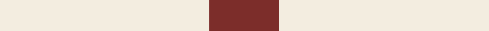

This is one **variant** — a specific cloth: this exact thread count and colourway, with its own
provenance below. It is one weaving of the [sett](/setts/w3o1/) (the scale-free proportion — the
same cloth at any scale or shade), whose colour order is pattern [RW](/stripes/rw/).

Sourced from research.  It is a [2 stripe tartan](/stripes/stripes2/).

Original link [https://www.vindolanda.com/](https://www.vindolanda.com/)

Dataset <small>— provenance for this record, inherited from the source manifest</small>

<dl class="dataset-prov">
<dt>source</dt><dd><a href="/sources/research/">Our own research</a></dd>
<dt>licence</dt><dd><a href="https://creativecommons.org/licenses/by-sa/4.0/">CC BY-SA 4.0</a></dd>
<dt>captured</dt><dd>2025-11-01</dd>
</dl>

## Thread count
W/24 O/8

One full sett is **32 threads**.

## Palette
<table><thead><tr><th>Colour</th><th>Shade</th><th>OKLCh</th></tr></thead><tbody><tr><td>O</td><td><code style="background-color:#7C2D2A;">#7C2D2A</code> <small style="color:#888">#7C2D2A</small></td><td><small style="color:#888">oklch(41.2% 0.111 25.4)</small></td></tr><tr><td>W</td><td><code style="background-color:#F3EDE0;">#F3EDE0</code> <small style="color:#888">#F3EDE0</small></td><td><small style="color:#888">oklch(94.7% 0.018 86.1)</small></td></tr></tbody></table>

# Sample pattern

## Nearest tartan variants

The nearest existing variants by ΔTartan distance, with this cloth at the top so the swatches line up against it.

ΔTartan

Threads

Variant

Sett

—

32

<a href="/variants/s2/w3o1~x8~w3801060-o1604029/">Vindolanda Check</a>

<a href="/ttd/edit/#slug=y49r16k11~x2&amp;base=w3o1~x8~w3801060-o1604029" title="compare in the TTD">0.76</a>

184

<a href="/variants/s3/y49r16k11~x2/">Quenouille (2011)</a>

<a href="/ttd/edit/#slug=w10r3~x10&amp;base=w3o1~x8~w3801060-o1604029" title="compare in the TTD">1.40</a>

130

<a href="/variants/s2/w10r3~x10/">English Kilt (Fashion)</a>

<a href="/ttd/edit/#slug=dy6lb38k3~x2&amp;base=w3o1~x8~w3801060-o1604029" title="compare in the TTD">1.88</a>

170

<a href="/variants/s3/dy6lb38k3~x2/">Poulain League (Corporate)</a>

<a href="/ttd/edit/#slug=dy1ly2r1~x10&amp;base=w3o1~x8~w3801060-o1604029" title="compare in the TTD">1.89</a>

60

<a href="/variants/s3/dy1ly2r1~x10/">Glenmorangie Check (Corporate)</a>

<a href="/ttd/edit/#slug=r3lb1~x14&amp;base=w3o1~x8~w3801060-o1604029" title="compare in the TTD">1.96</a>

56

<a href="/variants/s2/r3lb1~x14/">Wilson's No.138</a>

<a href="/ttd/edit/#slug=r3g1~x14&amp;base=w3o1~x8~w3801060-o1604029" title="compare in the TTD">1.96</a>

56

<a href="/variants/s2/r3g1~x14/">Wilson's, No 134</a>

<a href="/ttd/edit/#slug=lb8dg1dr2~x20&amp;base=w3o1~x8~w3801060-o1604029" title="compare in the TTD">2.34</a>

240

<a href="/variants/s3/lb8dg1dr2~x20/">Gyle</a>

<a href="/ttd/edit/#slug=y20db10w3~x2&amp;base=w3o1~x8~w3801060-o1604029" title="compare in the TTD">2.40</a>

86

<a href="/variants/s3/y20db10w3~x2/">Masai Shuka 04 (Artefact)</a>

<a href="/ttd/edit/#slug=r4g2lb1~x4&amp;base=w3o1~x8~w3801060-o1604029" title="compare in the TTD">2.58</a>

36

<a href="/variants/s3/r4g2lb1~x4/">Wilson's, No 188</a>

<a href="/ttd/edit/#slug=r35w94k6&amp;base=w3o1~x8~w3801060-o1604029" title="compare in the TTD">2.61</a>

229

<a href="/variants/s3/r35w94k6/">St Georges Check</a>

## Neighbour map

Every grey dot is one of 13621 variants placed by the first two principal components of the ΔTartan feature space (42% of its variance). Red is this tartan; blue dots are its nearest — click one to open its page.

<svg viewBox="0 0 640 380" role="img" style="max-width:100%;height:auto;border:1px solid #e0e0e0;border-radius:4px;display:block" xmlns="http://www.w3.org/2000/svg"><image href="/nn/cloud.v1.png" width="640" height="380"/><a href="/variants/s3/y49r16k11~x2/"><circle cx="328.6" cy="276.7" r="4" fill="#3465a4"><title>Quenouille (2011)</title></circle></a><a href="/variants/s2/w10r3~x10/"><circle cx="460.5" cy="353.1" r="4" fill="#3465a4"><title>English Kilt (Fashion)</title></circle></a><a href="/variants/s3/dy6lb38k3~x2/"><circle cx="479.9" cy="206.8" r="4" fill="#3465a4"><title>Poulain League (Corporate)</title></circle></a><a href="/variants/s3/dy1ly2r1~x10/"><circle cx="207.2" cy="363.8" r="4" fill="#3465a4"><title>Glenmorangie Check (Corporate)</title></circle></a><a href="/variants/s2/r3lb1~x14/"><circle cx="499.1" cy="365.0" r="4" fill="#3465a4"><title>Wilson's No.138</title></circle></a><a href="/variants/s2/r3g1~x14/"><circle cx="488.1" cy="361.6" r="4" fill="#3465a4"><title>Wilson's, No 134</title></circle></a><a href="/variants/s3/lb8dg1dr2~x20/"><circle cx="400.3" cy="247.1" r="4" fill="#3465a4"><title>Gyle</title></circle></a><a href="/variants/s3/y20db10w3~x2/"><circle cx="361.9" cy="301.7" r="4" fill="#3465a4"><title>Masai Shuka 04 (Artefact)</title></circle></a><a href="/variants/s3/r4g2lb1~x4/"><circle cx="325.1" cy="319.6" r="4" fill="#3465a4"><title>Wilson's, No 188</title></circle></a><a href="/variants/s3/r35w94k6/"><circle cx="390.5" cy="209.3" r="4" fill="#3465a4"><title>St Georges Check</title></circle></a><circle cx="421.5" cy="358.1" r="5" fill="#c00000"/><text x="320" y="376" text-anchor="middle" font-size="11" fill="#999">ground</text><text x="11" y="190" text-anchor="middle" font-size="11" fill="#999" transform="rotate(-90 11 190)">complexity</text></svg>

ID: /variants/s2/w3o1~x8~w3801060-o1604029/
