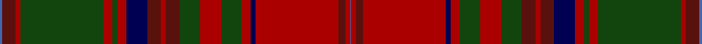

This page is one **sett** — a single exact thread-count. It belongs to the [tartan](/setts/b2dr12r4dg72r8dg4r8db18dr12r4dr12dg18r18dg18r8db4r72dr6r4b1/)
(the same proportion at any scale), whose colour order is pattern [BBRGRGRBBRBGRGRBRBRB](/stripes/bbrgrgrbbrbgrgrbrbrb/).

Part of the [MacDougall](/tartans/macdougall/) tartan — the named design grouping this sett with its other cloths.

Sourced from weddslist.  It is a [20 stripe tartan](/stripes/stripes20/).

Original link http://www.weddslist.com/cgi-bin/tartans/pg.pl?source=tinsel

## Also known as

This cloth is also recorded under:

- MacDougal 2
- MacDougall #6
- MacDougall #8
- MacDougall 7
- MacDougall 9
- MacDougall Plaid
- MacDougall, Plaid
- MacDougall, William

2 attestations — the source records this cloth was collapsed from (oldest owns this page)

<ul>
<li>undated — MacDougall (weddslist, <a href="http://www.weddslist.com/cgi-bin/tartans/pg.pl?source=tinsel">record</a>)</li>
<li>undated — MacDougall (weddslist, <a href="http://www.weddslist.com/cgi-bin/tartans/pg.pl?source=x">record</a>)</li>
</ul>

## Thread count
B/4 DRa24 DR8 DG144 DR16 DG8 DR16 DB36 DRa24 DR8 DRa24 DG36 DR36 DG36 DR16 DB8 DR144 DRa12 DR8 B/2

One full sett is **1214 threads**.

## Palette

Palette: <strong>custom</strong>
<table><thead><tr><th>Colour</th><th>Threads</th><th>Shade</th><th>Base</th><th>OKLCh</th></tr></thead><tbody><tr><td>B/</td><td style="text-align:right;font-variant-numeric:tabular-nums">4</td><td><code style="background-color:#4367AE;">#4367AE</code> <small style="color:#888">#4367AE</small></td><td>B <code style="background-color:#2A418A;">#2A418A</code></td><td><small style="color:#888">oklch(52.2% 0.120 262.7)</small></td></tr><tr><td>DRa</td><td style="text-align:right;font-variant-numeric:tabular-nums">24</td><td><code style="background-color:#59110D;">#59110D</code> <small style="color:#888">#59110D</small></td><td>B <code style="background-color:#2A418A;">#2A418A</code></td><td><small style="color:#888">oklch(30.7% 0.105 28.2)</small></td></tr><tr><td>DR</td><td style="text-align:right;font-variant-numeric:tabular-nums">8</td><td><code style="background-color:#AA0000;">#AA0000</code> <small style="color:#888">#AA0000</small></td><td>R <code style="background-color:#CC0000;">#CC0000</code></td><td><small style="color:#888">oklch(46.3% 0.190 29.2)</small></td></tr><tr><td>DG</td><td style="text-align:right;font-variant-numeric:tabular-nums">144</td><td><code style="background-color:#11450D;">#11450D</code> <small style="color:#888">#11450D</small></td><td>G <code style="background-color:#006100;">#006100</code></td><td><small style="color:#888">oklch(34.4% 0.101 142.1)</small></td></tr><tr><td>DR</td><td style="text-align:right;font-variant-numeric:tabular-nums">16</td><td><code style="background-color:#AA0000;">#AA0000</code> <small style="color:#888">#AA0000</small></td><td>R <code style="background-color:#CC0000;">#CC0000</code></td><td><small style="color:#888">oklch(46.3% 0.190 29.2)</small></td></tr><tr><td>DG</td><td style="text-align:right;font-variant-numeric:tabular-nums">8</td><td><code style="background-color:#11450D;">#11450D</code> <small style="color:#888">#11450D</small></td><td>G <code style="background-color:#006100;">#006100</code></td><td><small style="color:#888">oklch(34.4% 0.101 142.1)</small></td></tr><tr><td>DR</td><td style="text-align:right;font-variant-numeric:tabular-nums">16</td><td><code style="background-color:#AA0000;">#AA0000</code> <small style="color:#888">#AA0000</small></td><td>R <code style="background-color:#CC0000;">#CC0000</code></td><td><small style="color:#888">oklch(46.3% 0.190 29.2)</small></td></tr><tr><td>DB</td><td style="text-align:right;font-variant-numeric:tabular-nums">36</td><td><code style="background-color:#000052;">#000052</code> <small style="color:#888">#000052</small></td><td>B <code style="background-color:#2A418A;">#2A418A</code></td><td><small style="color:#888">oklch(19.8% 0.137 264.1)</small></td></tr><tr><td>DRa</td><td style="text-align:right;font-variant-numeric:tabular-nums">24</td><td><code style="background-color:#59110D;">#59110D</code> <small style="color:#888">#59110D</small></td><td>B <code style="background-color:#2A418A;">#2A418A</code></td><td><small style="color:#888">oklch(30.7% 0.105 28.2)</small></td></tr><tr><td>DR</td><td style="text-align:right;font-variant-numeric:tabular-nums">8</td><td><code style="background-color:#AA0000;">#AA0000</code> <small style="color:#888">#AA0000</small></td><td>R <code style="background-color:#CC0000;">#CC0000</code></td><td><small style="color:#888">oklch(46.3% 0.190 29.2)</small></td></tr><tr><td>DRa</td><td style="text-align:right;font-variant-numeric:tabular-nums">24</td><td><code style="background-color:#59110D;">#59110D</code> <small style="color:#888">#59110D</small></td><td>B <code style="background-color:#2A418A;">#2A418A</code></td><td><small style="color:#888">oklch(30.7% 0.105 28.2)</small></td></tr><tr><td>DG</td><td style="text-align:right;font-variant-numeric:tabular-nums">36</td><td><code style="background-color:#11450D;">#11450D</code> <small style="color:#888">#11450D</small></td><td>G <code style="background-color:#006100;">#006100</code></td><td><small style="color:#888">oklch(34.4% 0.101 142.1)</small></td></tr><tr><td>DR</td><td style="text-align:right;font-variant-numeric:tabular-nums">36</td><td><code style="background-color:#AA0000;">#AA0000</code> <small style="color:#888">#AA0000</small></td><td>R <code style="background-color:#CC0000;">#CC0000</code></td><td><small style="color:#888">oklch(46.3% 0.190 29.2)</small></td></tr><tr><td>DG</td><td style="text-align:right;font-variant-numeric:tabular-nums">36</td><td><code style="background-color:#11450D;">#11450D</code> <small style="color:#888">#11450D</small></td><td>G <code style="background-color:#006100;">#006100</code></td><td><small style="color:#888">oklch(34.4% 0.101 142.1)</small></td></tr><tr><td>DR</td><td style="text-align:right;font-variant-numeric:tabular-nums">16</td><td><code style="background-color:#AA0000;">#AA0000</code> <small style="color:#888">#AA0000</small></td><td>R <code style="background-color:#CC0000;">#CC0000</code></td><td><small style="color:#888">oklch(46.3% 0.190 29.2)</small></td></tr><tr><td>DB</td><td style="text-align:right;font-variant-numeric:tabular-nums">8</td><td><code style="background-color:#000052;">#000052</code> <small style="color:#888">#000052</small></td><td>B <code style="background-color:#2A418A;">#2A418A</code></td><td><small style="color:#888">oklch(19.8% 0.137 264.1)</small></td></tr><tr><td>DR</td><td style="text-align:right;font-variant-numeric:tabular-nums">144</td><td><code style="background-color:#AA0000;">#AA0000</code> <small style="color:#888">#AA0000</small></td><td>R <code style="background-color:#CC0000;">#CC0000</code></td><td><small style="color:#888">oklch(46.3% 0.190 29.2)</small></td></tr><tr><td>DRa</td><td style="text-align:right;font-variant-numeric:tabular-nums">12</td><td><code style="background-color:#59110D;">#59110D</code> <small style="color:#888">#59110D</small></td><td>B <code style="background-color:#2A418A;">#2A418A</code></td><td><small style="color:#888">oklch(30.7% 0.105 28.2)</small></td></tr><tr><td>DR</td><td style="text-align:right;font-variant-numeric:tabular-nums">8</td><td><code style="background-color:#AA0000;">#AA0000</code> <small style="color:#888">#AA0000</small></td><td>R <code style="background-color:#CC0000;">#CC0000</code></td><td><small style="color:#888">oklch(46.3% 0.190 29.2)</small></td></tr><tr><td>B/</td><td style="text-align:right;font-variant-numeric:tabular-nums">2</td><td><code style="background-color:#4367AE;">#4367AE</code> <small style="color:#888">#4367AE</small></td><td>B <code style="background-color:#2A418A;">#2A418A</code></td><td><small style="color:#888">oklch(52.2% 0.120 262.7)</small></td></tr></tbody></table>

## Compared to the master

This cloth is one sett of its design; the master sett (the exemplar the design is anchored on) is below for comparison.

<figure style="margin:0"><figcaption style="color:#888;font-size:smaller">this sett</figcaption></figure>
<figure style="margin:0"><figcaption style="color:#888;font-size:smaller"><a href="/setts/db3dp12w6r6dg46r14dg6r14db14dp8w6r6w6dp8dg12r16dg12r6db6r86dp10w6r10db3/">master sett →</a></figcaption></figure>

## Nearest tartans

The nearest existing variants by ΔTartan distance, with this tartan at the top so the swatches line up against it.

ΔTartan

Tartan

Sett

—

<a href="/ttd/edit/#slug=b2dr12r4dg72r8dg4r8db18dr12r4dr12dg18r18dg18r8db4r72dr6r4b1~x2">MacDougall</a> <a class="nn-out" href="/variants/s20/b2dr12r4dg72r8dg4r8db18dr12r4dr12dg18r18dg18r8db4r72dr6r4b1~x2/" title="open its dictionary page">↗</a>

1.12

<a href="/ttd/edit/#slug=t1ri12r4dg72r8dg4r8db18ri12r4ri12dg18r18dg18r8db4r72ri6r4t1~x2&amp;base=b2dr12r4dg72r8dg4r8db18dr12r4dr12dg18r18dg18r8db4r72dr6r4b1~x2">MacDougall (Logan)</a> <a class="nn-out" href="/variants/s20/t1ri12r4dg72r8dg4r8db18ri12r4ri12dg18r18dg18r8db4r72ri6r4t1~x2/" title="open its dictionary page">↗</a>

1.21

<a href="/ttd/edit/#slug=t1ri12r4g72r8g4r8db18ri12r4ri12g18r18g18r8db4r72ri6r4t1~x2&amp;base=b2dr12r4dg72r8dg4r8db18dr12r4dr12dg18r18dg18r8db4r72dr6r4b1~x2">MacDougal 2</a> <a class="nn-out" href="/variants/s20/t1ri12r4g72r8g4r8db18ri12r4ri12g18r18g18r8db4r72ri6r4t1~x2/" title="open its dictionary page">↗</a>

1.23

<a href="/ttd/edit/#slug=k16lo1k4lb2k4r1dg41lo2r36k1dg3k1r3k1dg4~x2&amp;base=b2dr12r4dg72r8dg4r8db18dr12r4dr12dg18r18dg18r8db4r72dr6r4b1~x2">Belk Heritage (Fashion)</a> <a class="nn-out" href="/variants/s15/k16lo1k4lb2k4r1dg41lo2r36k1dg3k1r3k1dg4~x2/" title="open its dictionary page">↗</a>

1.32

<a href="/ttd/edit/#slug=r5dg10r2db2r30n3r2lr1r2n3r30db2r2dg10r10dg10n4r2n4db10r4dg2r4dg30r2n3lr1~x2&amp;base=b2dr12r4dg72r8dg4r8db18dr12r4dr12dg18r18dg18r8db4r72dr6r4b1~x2">MacDougall D</a> <a class="nn-out" href="/variants/s27/r5dg10r2db2r30n3r2lr1r2n3r30db2r2dg10r10dg10n4r2n4db10r4dg2r4dg30r2n3lr1~x2/" title="open its dictionary page">↗</a>

1.41

<a href="/ttd/edit/#slug=g14r6ri2dt3r65dt2t2r6dt34r6t2dt2r4g66r12ri2dt2t4&amp;base=b2dr12r4dg72r8dg4r8db18dr12r4dr12dg18r18dg18r8db4r72dr6r4b1~x2">Stewart of Ardshiel Clan Tartan</a> <a class="nn-out" href="/variants/s18/g14r6ri2dt3r65dt2t2r6dt34r6t2dt2r4g66r12ri2dt2t4/" title="open its dictionary page">↗</a>

1.55

<a href="/ttd/edit/#slug=ri6r1db2ri2dg40ri6db13t1ri48dg2ri4r1dg4~x2&amp;base=b2dr12r4dg72r8dg4r8db18dr12r4dr12dg18r18dg18r8db4r72dr6r4b1~x2">MacDonald of Glenaladale #2</a> <a class="nn-out" href="/variants/s13/ri6r1db2ri2dg40ri6db13t1ri48dg2ri4r1dg4~x2/" title="open its dictionary page">↗</a>

1.59

<a href="/ttd/edit/#slug=r7ri3r6db26r8dg2r2db2r2g1ri2r8g26r8g2r2ri2~x2&amp;base=b2dr12r4dg72r8dg4r8db18dr12r4dr12dg18r18dg18r8db4r72dr6r4b1~x2">MacColl, Ancient</a> <a class="nn-out" href="/variants/s17/r7ri3r6db26r8dg2r2db2r2g1ri2r8g26r8g2r2ri2~x2/" title="open its dictionary page">↗</a>

1.62

<a href="/ttd/edit/#slug=r5ly1db2r2dg30r5db10t1r42dg2r4ly1dg4~x2&amp;base=b2dr12r4dg72r8dg4r8db18dr12r4dr12dg18r18dg18r8db4r72dr6r4b1~x2">MacDonald of Glencoe #2</a> <a class="nn-out" href="/variants/s13/r5ly1db2r2dg30r5db10t1r42dg2r4ly1dg4~x2/" title="open its dictionary page">↗</a>

1.63

<a href="/ttd/edit/#slug=dr11w4dr8do1dr1do28lo2do28k2do2k23dr3lo6dr3k5~x2&amp;base=b2dr12r4dg72r8dg4r8db18dr12r4dr12dg18r18dg18r8db4r72dr6r4b1~x2">Scottish Register of Tartans Corporate Tartan</a> <a class="nn-out" href="/variants/s15/dr11w4dr8do1dr1do28lo2do28k2do2k23dr3lo6dr3k5~x2/" title="open its dictionary page">↗</a>

1.67

<a href="/ttd/edit/#slug=r6dg4ly2dg36r2dg2r2dg12r48dg4r2k1r2lr6~x2&amp;base=b2dr12r4dg72r8dg4r8db18dr12r4dr12dg18r18dg18r8db4r72dr6r4b1~x2">Hay</a> <a class="nn-out" href="/variants/s14/r6dg4ly2dg36r2dg2r2dg12r48dg4r2k1r2lr6~x2/" title="open its dictionary page">↗</a>

## Neighbour map

Every grey dot is one of 14360 variants placed by the first two principal components of the ΔTartan feature space (44% of its variance). Red is this tartan; blue dots are its nearest — click one to open its page.

<svg viewBox="0 0 640 380" role="img" style="max-width:100%;height:auto;border:1px solid #e0e0e0;border-radius:4px;display:block" xmlns="http://www.w3.org/2000/svg"><image href="/nn/cloud.v1.png" width="640" height="380"/><a href="/variants/s20/t1ri12r4dg72r8dg4r8db18ri12r4ri12dg18r18dg18r8db4r72ri6r4t1~x2/"><circle cx="302.3" cy="56.8" r="4" fill="#3465a4"><title>MacDougall (Logan)</title></circle></a><a href="/variants/s20/t1ri12r4g72r8g4r8db18ri12r4ri12g18r18g18r8db4r72ri6r4t1~x2/"><circle cx="301.5" cy="59.5" r="4" fill="#3465a4"><title>MacDougal 2</title></circle></a><a href="/variants/s15/k16lo1k4lb2k4r1dg41lo2r36k1dg3k1r3k1dg4~x2/"><circle cx="323.3" cy="89.6" r="4" fill="#3465a4"><title>Belk Heritage (Fashion)</title></circle></a><a href="/variants/s27/r5dg10r2db2r30n3r2lr1r2n3r30db2r2dg10r10dg10n4r2n4db10r4dg2r4dg30r2n3lr1~x2/"><circle cx="330.2" cy="80.0" r="4" fill="#3465a4"><title>MacDougall D</title></circle></a><a href="/variants/s18/g14r6ri2dt3r65dt2t2r6dt34r6t2dt2r4g66r12ri2dt2t4/"><circle cx="296.4" cy="67.6" r="4" fill="#3465a4"><title>Stewart of Ardshiel Clan Tartan</title></circle></a><a href="/variants/s13/ri6r1db2ri2dg40ri6db13t1ri48dg2ri4r1dg4~x2/"><circle cx="406.4" cy="93.6" r="4" fill="#3465a4"><title>MacDonald of Glenaladale #2</title></circle></a><a href="/variants/s17/r7ri3r6db26r8dg2r2db2r2g1ri2r8g26r8g2r2ri2~x2/"><circle cx="249.7" cy="95.1" r="4" fill="#3465a4"><title>MacColl, Ancient</title></circle></a><a href="/variants/s13/r5ly1db2r2dg30r5db10t1r42dg2r4ly1dg4~x2/"><circle cx="399.8" cy="93.2" r="4" fill="#3465a4"><title>MacDonald of Glencoe #2</title></circle></a><a href="/variants/s15/dr11w4dr8do1dr1do28lo2do28k2do2k23dr3lo6dr3k5~x2/"><circle cx="313.1" cy="128.8" r="4" fill="#3465a4"><title>Scottish Register of Tartans Corporate Tartan</title></circle></a><a href="/variants/s14/r6dg4ly2dg36r2dg2r2dg12r48dg4r2k1r2lr6~x2/"><circle cx="380.7" cy="73.8" r="4" fill="#3465a4"><title>Hay</title></circle></a><circle cx="321.7" cy="76.1" r="5" fill="#c00000"/></svg>

ID: /variants/s20/b2dr12r4dg72r8dg4r8db18dr12r4dr12dg18r18dg18r8db4r72dr6r4b1~x2/
