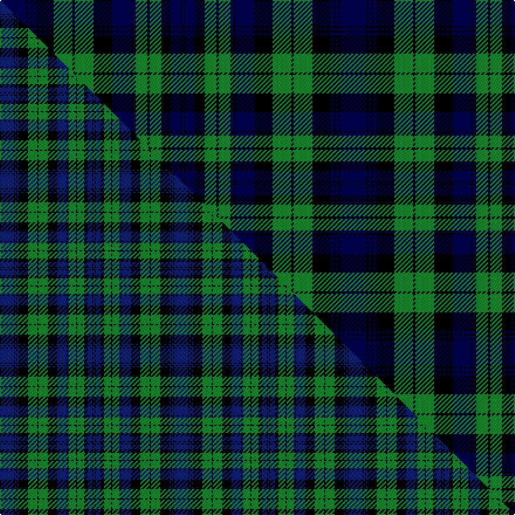

This is one **variant** — a specific cloth: this exact thread count and colourway, with its own
provenance below. It is one weaving of the [sett](/setts/db22k2db2k2db2k16g16k2g16k16db16k2db2g10k2g10k8db9k1db1/) (the scale-free proportion — the
same cloth at any scale or shade), whose colour order is pattern [BKBKBKGKGKBKBGKGKBKB](/stripes/bkbkbkgkgkbkbgkgkbkb/).

Part of the [Black Watch](/tartans/black-watch-2/) tartan — the named design grouping this sett with its other cloths.

Sourced from weddslist.  It is a [20 stripe tartan](/stripes/stripes20/).

Original link [http://www.weddslist.com/cgi-bin/tartans/pg.pl?source=tinsel](http://www.weddslist.com/cgi-bin/tartans/pg.pl?source=tinsel)

2 attestations — the source records this cloth was collapsed from (oldest owns this page)

<ul>
<li>undated — Black Watch (weddslist, <a href="http://www.weddslist.com/cgi-bin/tartans/pg.pl?source=tinsel">record</a>) </li>
<li>undated — Black Watch (weddslist, <a href="http://www.weddslist.com/cgi-bin/tartans/pg.pl?source=x">record</a>) </li>
</ul>

Dataset <small>— provenance for this record, inherited from the source manifest</small>

<dl class="dataset-prov">
<dt>source</dt><dd><a href="/sources/weddslist/">Weddslist</a></dd>
<dt>data captured from</dt><dd><a href="https://github.com/thetartan/tartan-database/blob/master/data/weddslist/data.csv">https://github.com/thetartan/tartan-database/blob/master/data/weddslist/data.csv</a></dd>
<dt>data date</dt><dd>2016-11-17 <small>(dataset default)</small></dd>
<dt>licence</dt><dd><a href="https://creativecommons.org/licenses/by-nc-nd/4.0/">CC BY-NC-ND 4.0</a></dd>
</dl>

Capture chain <small>— the hands this data passed through, oldest first; each capture carries its own licence</small>

<ol class="capture-chain">
<li><a href="https://www.weddslist.com/tartans/">Weddslist</a> <small>the living privately compiled reference</small></li>
<li><a href="https://github.com/thetartan/tartan-database">thetartan/tartan-database</a> <small>2016-2017</small> · <a href="https://creativecommons.org/licenses/by-nc-nd/4.0/">CC BY-NC-ND 4.0</a> <small>Levko Kravets's frozen compilation — the capture we vendored, and where its CC licence text came from</small></li>
<li>this dictionary <small>captured 2026-06-10 · commit 5bf86c7566</small> <small>each re-capture is a git commit to data/sources</small></li>
</ol>

## Thread count
DB/22 K2 DB2 K2 DB2 K16 G16 K2 G16 K16 DB16 K2 DB2 G10 K2 G10 K8 DB9 K1 DB/1

One full sett is **291 threads**.

## Palette
<table><thead><tr><th>Colour</th><th>Shade</th><th>OKLCh</th></tr></thead><tbody><tr><td>DB</td><td><code style="background-color:#000052;">#000052</code> <small style="color:#888">#000052</small></td><td><small style="color:#888">oklch(19.8% 0.137 264.1)</small></td></tr><tr><td>DB</td><td><code style="background-color:#000052;">#000052</code> <small style="color:#888">#000052</small></td><td><small style="color:#888">oklch(19.8% 0.137 264.1)</small></td></tr><tr><td>G</td><td><code style="background-color:#008B2A;">#008B2A</code> <small style="color:#888">#008B2A</small></td><td><small style="color:#888">oklch(55.4% 0.170 145.9)</small></td></tr><tr><td>K</td><td><code style="background-color:#000000;">#000000</code> <small style="color:#888">#000000</small></td><td><small style="color:#888">oklch(0.0% 0.000 0.0)</small></td></tr></tbody></table>

# Sample pattern

## Compared to the master

This cloth is one sett of its design; the master sett (the exemplar the design is anchored on) is below for comparison.

Its **ΔTartan distance** from the master is **0.54** — the same measure the nearest-tartans table ranks by (0 is identical; a re-scale of the same cloth is near 0, a recolour or a different proportion further).

<figure class="master-compare" style="margin:0">

this sett
master sett ★

<figcaption style="color:#888;font-size:smaller">One weave of this sett against the <a href="/setts/db12k1db1k1db1k8g8k1g8k8db8k1db1g6k1g6k3db4k1db1/">master sett ★</a>, split on the diagonal: a shared proportion runs seamlessly across it with only the shades shifting; a different proportion breaks on it.</figcaption>
</figure>

## Nearest tartan variants

The nearest existing variants by ΔTartan distance, with this cloth at the top so the swatches line up against it.

ΔTartan

Threads

Variant

Sett

—

291

<a href="/variants/s20/db22k2db2k2db2k16g16k2g16k16db16k2db2g10k2g10k8db9k1db1~db0805267/">Black Watch</a>

<a href="/ttd/edit/#slug=db12k1db1k1db1k8g8k1g8k8db8k1db1g6k1g6k3db4k1db1&amp;base=db22k2db2k2db2k16g16k2g16k16db16k2db2g10k2g10k8db9k1db1~db0805267" title="compare in the TTD">0.54</a>

149

<a href="/variants/s20/db12k1db1k1db1k8g8k1g8k8db8k1db1g6k1g6k3db4k1db1/">Black Watch</a>

<a href="/ttd/edit/#slug=k2db18lb1k13lb1g16db3k2db3g16lb1k13lb1db18k2db2~x2&amp;base=db22k2db2k2db2k16g16k2g16k16db16k2db2g10k2g10k8db9k1db1~db0805267" title="compare in the TTD">2.19</a>

440

<a href="/variants/s16/k2db18lb1k13lb1g16db3k2db3g16lb1k13lb1db18k2db2~x2/">Hebrides #10</a>

<a href="/ttd/edit/#slug=db18k2db4k20g10dr2g10k1lb3k1g10dr2g10k20dr1db14dr3db2dr2db4lb1~x2&amp;base=db22k2db2k2db2k16g16k2g16k16db16k2db2g10k2g10k8db9k1db1~db0805267" title="compare in the TTD">2.22</a>

522

<a href="/variants/s21/db18k2db4k20g10dr2g10k1lb3k1g10dr2g10k20dr1db14dr3db2dr2db4lb1~x2/">Rankin (Dalgleish)</a>

<a href="/ttd/edit/#slug=g34k2db2k2g34r3k34r2k34r3db33k2g2k2g2k2db33&amp;base=db22k2db2k2db2k16g16k2g16k16db16k2db2g10k2g10k8db9k1db1~db0805267" title="compare in the TTD">2.23</a>

385

<a href="/variants/s17/g34k2db2k2g34r3k34r2k34r3db33k2g2k2g2k2db33/">Stewart, Old - 1819 (Clan)</a>

<a href="/ttd/edit/#slug=g34db2k2db2g34r3db34r2db34r3k33db2g2db2g2db2k33~x2&amp;base=db22k2db2k2db2k16g16k2g16k16db16k2db2g10k2g10k8db9k1db1~db0805267" title="compare in the TTD">2.23</a>

770

<a href="/variants/s17/g34db2k2db2g34r3db34r2db34r3k33db2g2db2g2db2k33~x2/">Lumsden Hunting</a>

<a href="/ttd/edit/#slug=g19k1g4k1g3k10db20y1k7y1db20k10y3g1~x2&amp;base=db22k2db2k2db2k16g16k2g16k16db16k2db2g10k2g10k8db9k1db1~db0805267" title="compare in the TTD">2.33</a>

364

<a href="/variants/s14/g19k1g4k1g3k10db20y1k7y1db20k10y3g1~x2/">Hope-Vere/Weir #2</a>

<a href="/ttd/edit/#slug=g34k2dt2k2g34r3k34r2k34r3dt33k2g2k2g2k2dt33~dt1204274&amp;base=db22k2db2k2db2k16g16k2g16k16db16k2db2g10k2g10k8db9k1db1~db0805267" title="compare in the TTD">2.38</a>

385

<a href="/variants/s17/g34k2db2k2g34r3k34r2k34r3db33k2g2k2g2k2db33~db1204274/">Stewart/Stuart</a>

<a href="/ttd/edit/#slug=db22k3db3k3db3k15r2g19k1lb3k1g19r2k15db19k3db3~x2&amp;base=db22k2db2k2db2k16g16k2g16k16db16k2db2g10k2g10k8db9k1db1~db0805267" title="compare in the TTD">2.42</a>

494

<a href="/variants/s17/db22k3db3k3db3k15r2g19k1lb3k1g19r2k15db19k3db3~x2/">Sempill</a>

<a href="/ttd/edit/#slug=db12k1g2k1g2k1db12r2k12r1k12r2g12k1db2k1g12~x2&amp;base=db22k2db2k2db2k16g16k2g16k16db16k2db2g10k2g10k8db9k1db1~db0805267" title="compare in the TTD">2.49</a>

304

<a href="/variants/s17/db12k1g2k1g2k1db12r2k12r1k12r2g12k1db2k1g12~x2/">Stewart Old.. Clan Tartan</a>

<a href="/ttd/edit/#slug=db12k1g2k1g2k1db12r2k12r1k12r2g12k1db2k1g12&amp;base=db22k2db2k2db2k16g16k2g16k16db16k2db2g10k2g10k8db9k1db1~db0805267" title="compare in the TTD">2.49</a>

152

<a href="/variants/s17/db12k1g2k1g2k1db12r2k12r1k12r2g12k1db2k1g12/">Stewart Old</a>

## Neighbour map

Every grey dot is one of 13621 variants placed by the first two principal components of the ΔTartan feature space (42% of its variance). Red is this tartan; blue dots are its nearest — click one to open its page.

<svg viewBox="0 0 640 380" role="img" style="max-width:100%;height:auto;border:1px solid #e0e0e0;border-radius:4px;display:block" xmlns="http://www.w3.org/2000/svg"><image href="/nn/cloud.v1.png" width="640" height="380"/><a href="/variants/s20/db12k1db1k1db1k8g8k1g8k8db8k1db1g6k1g6k3db4k1db1/"><circle cx="163.4" cy="158.2" r="4" fill="#3465a4"><title>Black Watch</title></circle></a><a href="/variants/s16/k2db18lb1k13lb1g16db3k2db3g16lb1k13lb1db18k2db2~x2/"><circle cx="183.3" cy="129.1" r="4" fill="#3465a4"><title>Hebrides #10</title></circle></a><a href="/variants/s21/db18k2db4k20g10dr2g10k1lb3k1g10dr2g10k20dr1db14dr3db2dr2db4lb1~x2/"><circle cx="123.6" cy="102.6" r="4" fill="#3465a4"><title>Rankin (Dalgleish)</title></circle></a><a href="/variants/s17/g34k2db2k2g34r3k34r2k34r3db33k2g2k2g2k2db33/"><circle cx="163.3" cy="113.6" r="4" fill="#3465a4"><title>Stewart, Old - 1819 (Clan)</title></circle></a><a href="/variants/s17/g34db2k2db2g34r3db34r2db34r3k33db2g2db2g2db2k33~x2/"><circle cx="167.4" cy="115.7" r="4" fill="#3465a4"><title>Lumsden Hunting</title></circle></a><a href="/variants/s14/g19k1g4k1g3k10db20y1k7y1db20k10y3g1~x2/"><circle cx="191.9" cy="128.4" r="4" fill="#3465a4"><title>Hope-Vere/Weir #2</title></circle></a><a href="/variants/s17/g34k2db2k2g34r3k34r2k34r3db33k2g2k2g2k2db33~db1204274/"><circle cx="166.1" cy="113.4" r="4" fill="#3465a4"><title>Stewart/Stuart</title></circle></a><a href="/variants/s17/db22k3db3k3db3k15r2g19k1lb3k1g19r2k15db19k3db3~x2/"><circle cx="152.2" cy="103.1" r="4" fill="#3465a4"><title>Sempill</title></circle></a><a href="/variants/s17/db12k1g2k1g2k1db12r2k12r1k12r2g12k1db2k1g12~x2/"><circle cx="134.9" cy="136.9" r="4" fill="#3465a4"><title>Stewart Old.. Clan Tartan</title></circle></a><a href="/variants/s17/db12k1g2k1g2k1db12r2k12r1k12r2g12k1db2k1g12/"><circle cx="134.9" cy="136.9" r="4" fill="#3465a4"><title>Stewart Old</title></circle></a><circle cx="150.7" cy="123.1" r="5" fill="#c00000"/><text x="320" y="376" text-anchor="middle" font-size="11" fill="#999">ground</text><text x="11" y="190" text-anchor="middle" font-size="11" fill="#999" transform="rotate(-90 11 190)">complexity</text></svg>

ID: /variants/s20/db22k2db2k2db2k16g16k2g16k16db16k2db2g10k2g10k8db9k1db1~db0805267/
