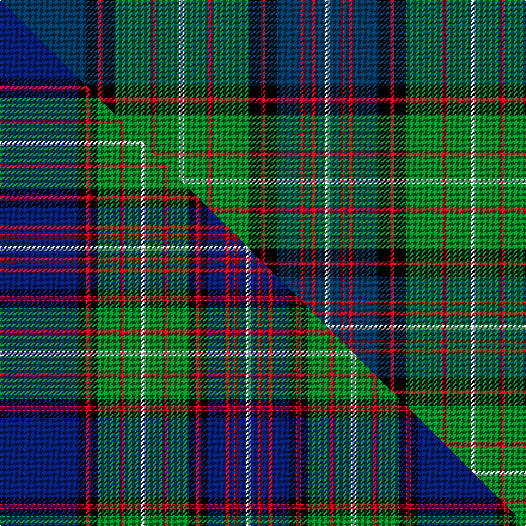

This is one **variant** — a specific cloth: this exact thread count and colourway, with its own
provenance below. It is one weaving of the [sett](/setts/db36k5r2k5g15r2g10w2g10r2g15k5r2k5db10r2db2r2db4w2/) (the scale-free proportion — the
same cloth at any scale or shade), whose colour order is pattern [BKRKGRGWGRGKRKBRBRBW](/stripes/bkrkgrgwgrgkrkbrbrbw/).

Part of the [Ranking](/tartans/r/ra/ranking/) tartan — the named design grouping this sett with its other cloths.

Sourced from house-of-tartan.  It is a [20 stripe tartan](/stripes/stripes20/).

Original link [http://www.house-of-tartan.scotland.net/house/TartanViewjs.asp?colr=Def&tnam=3242](http://www.house-of-tartan.scotland.net/house/TartanViewjs.asp?colr=Def&tnam=3242)

## Provenance

Earliest known date: 2002 Personal/Family tartan for the Ranking family and its close relatives as determined by the current head of the family. A minor variation of Rankine tartan.

Dataset <small>— provenance for this record, inherited from the source manifest</small>

<dl class="dataset-prov">
<dt>source</dt><dd><a href="/sources/house-of-tartan/">House of Tartan</a></dd>
<dt>data captured from</dt><dd><a href="https://github.com/thetartan/tartan-database/blob/master/data/house-of-tartan/data.csv">https://github.com/thetartan/tartan-database/blob/master/data/house-of-tartan/data.csv</a></dd>
<dt>data date</dt><dd>2002 <small>(this record)</small></dd>
<dt>licence</dt><dd><a href="https://creativecommons.org/licenses/by-nc-nd/4.0/">CC BY-NC-ND 4.0</a></dd>
</dl>

Capture chain <small>— the hands this data passed through, oldest first; each capture carries its own licence</small>

<ol class="capture-chain">
<li><a href="http://www.house-of-tartan.scotland.net/">House of Tartan</a> <small>the weaver/retailer's database — the site is now offline; the URL is kept as the ultimate source's identity</small></li>
<li><a href="https://github.com/thetartan/tartan-database">thetartan/tartan-database</a> <small>2016-2017</small> · <a href="https://creativecommons.org/licenses/by-nc-nd/4.0/">CC BY-NC-ND 4.0</a> <small>Levko Kravets's frozen compilation — the capture we vendored, and where its CC licence text came from</small></li>
<li>this dictionary <small>captured 2026-06-10 · commit 5bf86c7566</small> <small>each re-capture is a git commit to data/sources</small></li>
</ol>

## Thread count
DB/72 K10 R4 K10 G30 R4 G20 W4 G20 R4 G30 K10 R4 K10 DB20 R4 DB4 R4 DB8 W/4

One full sett is **476 threads**.

## Palette
<table><thead><tr><th>Colour</th><th>Shade</th><th>OKLCh</th></tr></thead><tbody><tr><td>DB</td><td><code style="background-color:#1C0070;">#1C0070</code> <small style="color:#888">#1C0070</small></td><td><small style="color:#888">oklch(26.3% 0.162 277.1)</small></td></tr><tr><td>DB</td><td><code style="background-color:#003C64;">#003C64</code> <small style="color:#888">#003C64</small></td><td><small style="color:#888">oklch(34.5% 0.089 246.0)</small></td></tr><tr><td>G</td><td><code style="background-color:#008B2A;">#008B2A</code> <small style="color:#888">#008B2A</small></td><td><small style="color:#888">oklch(55.4% 0.170 145.9)</small></td></tr><tr><td>K</td><td><code style="background-color:#000000;">#000000</code> <small style="color:#888">#000000</small></td><td><small style="color:#888">oklch(0.0% 0.000 0.0)</small></td></tr><tr><td>W</td><td><code style="background-color:#F7F7F7;">#F7F7F7</code> <small style="color:#888">#F7F7F7</small></td><td><small style="color:#888">oklch(97.6% 0.000 89.9)</small></td></tr><tr><td>R</td><td><code style="background-color:#D60020;">#D60020</code> <small style="color:#888">#D60020</small></td><td><small style="color:#888">oklch(55.2% 0.224 25.5)</small></td></tr></tbody></table>

# Sample pattern

## Compared to the master

This cloth is one sett of its design; the master sett (the exemplar the design is anchored on) is below for comparison.

Its **ΔTartan distance** from the master is **0.49** — the same measure the nearest-tartans table ranks by (0 is identical; a re-scale of the same cloth is near 0, a recolour or a different proportion further).

<figure class="master-compare" style="margin:0">

this sett
master sett ★

<figcaption style="color:#888;font-size:smaller">One weave of this sett against the <a href="/setts/db33k3r2k3g9r2g7w2g7r2g9k3r2k3db7r2db2r2db3w2/">master sett ★</a>, split on the diagonal: a shared proportion runs seamlessly across it with only the shades shifting; a different proportion breaks on it.</figcaption>
</figure>

## Nearest tartan variants

The nearest existing variants by ΔTartan distance, with this cloth at the top so the swatches line up against it.

ΔTartan

Threads

Variant

Sett

—

476

<a href="/variants/s20/db36k5r2k5g15r2g10w2g10r2g15k5r2k5db10r2db2r2db4w2~x2~db1404245/">Ranking Corporate Tartan</a>

<a href="/ttd/edit/#slug=db33k3r2k3g9r2g7w2g7r2g9k3r2k3db7r2db2r2db3w2~x2&amp;base=db36k5r2k5g15r2g10w2g10r2g15k5r2k5db10r2db2r2db4w2~x2~db1404245" title="compare in the TTD">0.49</a>

350

<a href="/variants/s20/db33k3r2k3g9r2g7w2g7r2g9k3r2k3db7r2db2r2db3w2~x2/">Ranking (Personal)</a>

<a href="/ttd/edit/#slug=db36g10r2g10w2g10r2g10k14r2db12r3db2r2db4w2~x2&amp;base=db36k5r2k5g15r2g10w2g10r2g15k5r2k5db10r2db2r2db4w2~x2~db1404245" title="compare in the TTD">1.55</a>

416

<a href="/variants/s16/db36g10r2g10w2g10r2g10k14r2db12r3db2r2db4w2~x2/">Rankin</a>

<a href="/ttd/edit/#slug=g6w2g24k12db3k2db2k2db12r1db1r3~x2~w4000000-db1406275&amp;base=db36k5r2k5g15r2g10w2g10r2g15k5r2k5db10r2db2r2db4w2~x2~db1404245" title="compare in the TTD">1.76</a>

262

<a href="/variants/s12/g6w2g24k12db3k2db2k2db12r1db1r3~x2~w4000000-db1406275/">Sutherland</a>

<a href="/ttd/edit/#slug=g2y2g2y2g2y2g18k1g2k5db2k1db19w2db2w2db2w2~x2&amp;base=db36k5r2k5g15r2g10w2g10r2g15k5r2k5db10r2db2r2db4w2~x2~db1404245" title="compare in the TTD">1.78</a>

272

<a href="/variants/s18/g2y2g2y2g2y2g18k1g2k5db2k1db19w2db2w2db2w2~x2/">Scottish Islamic</a>

<a href="/ttd/edit/#slug=g16r2g2r1g3r1g2r2g12k12r1db16r2db8y2~x2&amp;base=db36k5r2k5g15r2g10w2g10r2g15k5r2k5db10r2db2r2db4w2~x2~db1404245" title="compare in the TTD">1.78</a>

292

<a href="/variants/s15/g16r2g2r1g3r1g2r2g12k12r1db16r2db8y2~x2/">Cochrane Clan Tartan</a>

<a href="/ttd/edit/#slug=g16r2g2r1g3r1g2r2g12k12r1db16r2db8y2&amp;base=db36k5r2k5g15r2g10w2g10r2g15k5r2k5db10r2db2r2db4w2~x2~db1404245" title="compare in the TTD">1.78</a>

146

<a href="/variants/s15/g16r2g2r1g3r1g2r2g12k12r1db16r2db8y2/">Cochrane</a>

<a href="/ttd/edit/#slug=db30lo2db2lo2db5g5k15db5g20dr2k3dr2g20db5k15g5db20lo2db2~x2~db1403246&amp;base=db36k5r2k5g15r2g10w2g10r2g15k5r2k5db10r2db2r2db4w2~x2~db1404245" title="compare in the TTD">1.85</a>

584

<a href="/variants/s19/db30lo2db2lo2db5g5k15db5g20dr2k3dr2g20db5k15g5db20lo2db2~x2~db1403246/">Pennsylvania American District Tartan</a>

<a href="/ttd/edit/#slug=db15k1db1k1db1k12g9r1g9k1w1k1g9r1g9k12r1db9r2db1r1db6w1~x2&amp;base=db36k5r2k5g15r2g10w2g10r2g15k5r2k5db10r2db2r2db4w2~x2~db1404245" title="compare in the TTD">2.12</a>

388

<a href="/variants/s23/db15k1db1k1db1k12g9r1g9k1w1k1g9r1g9k12r1db9r2db1r1db6w1~x2/">Rankine</a>

<a href="/ttd/edit/#slug=t30y2t2y2t5g5k15t5g20dr2k3dr2g20t5k15g5t20y2t2~x2&amp;base=db36k5r2k5g15r2g10w2g10r2g15k5r2k5db10r2db2r2db4w2~x2~db1404245" title="compare in the TTD">2.12</a>

584

<a href="/variants/s19/t30y2t2y2t5g5k15t5g20dr2k3dr2g20t5k15g5t20y2t2~x2/">Pennsylvania (District)</a>

<a href="/ttd/edit/#slug=g20k1n1k1g20k10n2k2r2db20w1~x2~db1406275&amp;base=db36k5r2k5g15r2g10w2g10r2g15k5r2k5db10r2db2r2db4w2~x2~db1404245" title="compare in the TTD">2.14</a>

278

<a href="/variants/s11/g20k1n1k1g20k10n2k2r2db20w1~x2~db1406275/">Storrie</a>

## Neighbour map

Every grey dot is one of 13656 variants placed by the first two principal components of the ΔTartan feature space (42% of its variance). Red is this tartan; blue dots are its nearest — click one to open its page. The map is a flat projection of a many-dimensional space — [how to read it](/posts/neighbourhood-maps/).

<svg viewBox="0 0 640 380" role="img" style="max-width:100%;height:auto;border:1px solid #e0e0e0;border-radius:4px;display:block" xmlns="http://www.w3.org/2000/svg"><image href="/nn/cloud.v1.png" width="640" height="380"/><a href="/variants/s20/db33k3r2k3g9r2g7w2g7r2g9k3r2k3db7r2db2r2db3w2~x2/"><circle cx="174.1" cy="83.1" r="4" fill="#3465a4"><title>Ranking (Personal)</title></circle></a><a href="/variants/s16/db36g10r2g10w2g10r2g10k14r2db12r3db2r2db4w2~x2/"><circle cx="184.5" cy="102.7" r="4" fill="#3465a4"><title>Rankin</title></circle></a><a href="/variants/s12/g6w2g24k12db3k2db2k2db12r1db1r3~x2~w4000000-db1406275/"><circle cx="171.1" cy="77.8" r="4" fill="#3465a4"><title>Sutherland</title></circle></a><a href="/variants/s18/g2y2g2y2g2y2g18k1g2k5db2k1db19w2db2w2db2w2~x2/"><circle cx="158.7" cy="85.7" r="4" fill="#3465a4"><title>Scottish Islamic</title></circle></a><a href="/variants/s15/g16r2g2r1g3r1g2r2g12k12r1db16r2db8y2~x2/"><circle cx="168.8" cy="117.7" r="4" fill="#3465a4"><title>Cochrane Clan Tartan</title></circle></a><a href="/variants/s15/g16r2g2r1g3r1g2r2g12k12r1db16r2db8y2/"><circle cx="168.8" cy="117.7" r="4" fill="#3465a4"><title>Cochrane</title></circle></a><a href="/variants/s19/db30lo2db2lo2db5g5k15db5g20dr2k3dr2g20db5k15g5db20lo2db2~x2~db1403246/"><circle cx="177.5" cy="118.8" r="4" fill="#3465a4"><title>Pennsylvania American District Tartan</title></circle></a><a href="/variants/s23/db15k1db1k1db1k12g9r1g9k1w1k1g9r1g9k12r1db9r2db1r1db6w1~x2/"><circle cx="119.3" cy="101.4" r="4" fill="#3465a4"><title>Rankine</title></circle></a><a href="/variants/s19/t30y2t2y2t5g5k15t5g20dr2k3dr2g20t5k15g5t20y2t2~x2/"><circle cx="171.8" cy="121.1" r="4" fill="#3465a4"><title>Pennsylvania (District)</title></circle></a><a href="/variants/s11/g20k1n1k1g20k10n2k2r2db20w1~x2~db1406275/"><circle cx="164.1" cy="76.4" r="4" fill="#3465a4"><title>Storrie</title></circle></a><circle cx="159.7" cy="94.9" r="5" fill="#c00000"/><text x="320" y="376" text-anchor="middle" font-size="11" fill="#999">ground</text><text x="11" y="190" text-anchor="middle" font-size="11" fill="#999" transform="rotate(-90 11 190)">complexity</text></svg>

ID: /variants/s20/db36k5r2k5g15r2g10w2g10r2g15k5r2k5db10r2db2r2db4w2~x2~db1404245/
