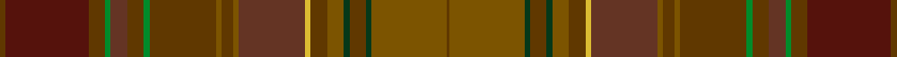

This is one **variant** — a specific cloth: this exact thread count and colourway, with its own
provenance below. It is one weaving of the [sett](/tartans/e/eb/ebronen/) (the scale-free proportion — the
same cloth at any scale or shade), whose colour order is pattern [GBGGGGGGGGGGYGGGGGGG](/stripes/gbggggggggggyggggggg/).

Part of the [Ebronen](/tartans/e/eb/ebronen/) tartan — the named design grouping this sett with its other cloths.

Sourced from register-of-tartans.  It is a [20 stripe tartan](/stripes/stripes20/).

Original link [https://www.tartanregister.gov.uk/tartanDetails.aspx?ref=1070](https://www.tartanregister.gov.uk/tartanDetails.aspx?ref=1070)

Dataset <small>— provenance for this record, inherited from the source manifest</small>

<dl class="dataset-prov">
<dt>source</dt><dd><a href="/sources/register-of-tartans/">Scottish Register of Tartans</a></dd>
<dt>data captured from</dt><dd><a href="https://github.com/thetartan/tartan-database/blob/master/data/register-of-tartans/data.csv">https://github.com/thetartan/tartan-database/blob/master/data/register-of-tartans/data.csv</a></dd>
<dt>data date</dt><dd>2006 <small>(this record)</small></dd>
<dt>licence</dt><dd><a href="https://www.tartanregister.gov.uk/copyright">Crown copyright</a></dd>
</dl>

Capture chain <small>— the hands this data passed through, oldest first; each capture carries its own licence</small>

<ol class="capture-chain">
<li><a href="https://www.tartanregister.gov.uk/">Scottish Register of Tartans</a> · <a href="https://www.tartanregister.gov.uk/copyright">Crown copyright</a> <small>the living register — still published by National Records of Scotland</small></li>
<li><a href="https://github.com/thetartan/tartan-database">thetartan/tartan-database</a> <small>2016-2017</small> · <a href="https://creativecommons.org/licenses/by-nc-nd/4.0/">CC BY-NC-ND 4.0</a> <small>Levko Kravets's frozen compilation — the capture we vendored, and where its CC licence text came from</small></li>
<li>this dictionary <small>captured 2026-06-10 · commit 5bf86c7566</small> <small>each re-capture is a git commit to data/sources</small></li>
</ol>

## Register references

External register numbers recorded for this tartan.

- Scottish Register of Tartans: [1070](https://www.tartanregister.gov.uk/tartanDetails.aspx?ref=1070)
- Scottish Tartans Authority (ITI): 7021

## Thread count
DYi/4 DR60 DYi12 G4 DY12 DYi12 G4 DYi48 Y4 DYi8 Y4 DY48 LY4 DYi12 Y12 DG4 DYi12 DG4 Y54 DYi/2

One full sett is **642 threads**.

## Palette
<table><thead><tr><th>Colour</th><th>Shade</th><th>OKLCh</th></tr></thead><tbody><tr><td>DG</td><td><code style="background-color:#053819;">#053819</code> <small style="color:#888">#053819</small></td><td><small style="color:#888">oklch(30.0% 0.075 151.3)</small></td></tr><tr><td>DR</td><td><code style="background-color:#55120C;">#55120C</code> <small style="color:#888">#55120C</small></td><td><small style="color:#888">oklch(30.0% 0.099 29.3)</small></td></tr><tr><td>LY</td><td><code style="background-color:#DCBC32;">#DCBC32</code> <small style="color:#888">#DCBC32</small></td><td><small style="color:#888">oklch(80.0% 0.150 95.2)</small></td></tr><tr><td>G</td><td><code style="background-color:#008B2A;">#008B2A</code> <small style="color:#888">#008B2A</small></td><td><small style="color:#888">oklch(55.4% 0.170 145.9)</small></td></tr><tr><td>DY</td><td><code style="background-color:#643424;">#643424</code> <small style="color:#888">#643424</small></td><td><small style="color:#888">oklch(38.3% 0.074 39.1)</small></td></tr><tr><td>Y</td><td><code style="background-color:#7C5400;">#7C5400</code> <small style="color:#888">#7C5400</small></td><td><small style="color:#888">oklch(47.7% 0.100 76.9)</small></td></tr><tr><td>DY</td><td><code style="background-color:#603800;">#603800</code> <small style="color:#888">#603800</small></td><td><small style="color:#888">oklch(38.1% 0.084 66.7)</small></td></tr></tbody></table>

# Sample pattern

[Sample sheet (PDF)](swatch.pdf) — the woven sample, thread count and palette on one printable A4, rendered on demand (the same sheet the TTD print page downloads).

## Nearest tartan variants

The nearest existing variants by ΔTartan distance, with this cloth at the top so the swatches line up against it.

ΔTartan

Threads

Variant

Sett

—

642

<a href="/variants/s20/dyi2dr30dyi6g2dy6dyi6g2dyi24y2dyi4y2dy24ly2dyi6y6dg2dyi6dg2y27dyi1~x2~dyi3808066-dy3807039-y4710078/">Ebronen (Personal)</a>

<a href="/ttd/edit/#slug=dy2dr30dy6g2do6dy6dgi2dy24y2dy4y2do24ly2dy6y6dg2dy6dg2y27dy1~x2~dy3808066-g6019141-do3807039-dgi4514144-y4710078&amp;base=dyi2dr30dyi6g2dy6dyi6g2dyi24y2dyi4y2dy24ly2dyi6y6dg2dyi6dg2y27dyi1~x2~dyi3808066-dy3807039-y4710078" title="compare in the TTD">0.30</a>

642

<a href="/variants/s20/dyi2dr30dyi6g2dy6dyi6dgi2dyi24y2dyi4y2dy24ly2dyi6y6dg2dyi6dg2y27dyi1~x2~dyi3808066-g6019141-dy3807039-dgi4514144-y4710078/">Ebronen (Personal)</a>

## Neighbour map

Every grey dot is one of 13662 variants placed by the first two principal components of the ΔTartan feature space (42% of its variance). Red is this tartan; blue dots are its nearest — click one to open its page. The map is a flat projection of a many-dimensional space — [how to read it](/posts/neighbourhood-maps/).

<svg viewBox="0 0 640 380" role="img" style="max-width:100%;height:auto;border:1px solid #e0e0e0;border-radius:4px;display:block" xmlns="http://www.w3.org/2000/svg"><image href="/nn/cloud.v1.png" width="640" height="380"/><a href="/variants/s20/dyi2dr30dyi6g2dy6dyi6dgi2dyi24y2dyi4y2dy24ly2dyi6y6dg2dyi6dg2y27dyi1~x2~dyi3808066-g6019141-dy3807039-dgi4514144-y4710078/"><circle cx="412.2" cy="158.7" r="4" fill="#3465a4"><title>Ebronen (Personal)</title></circle></a><circle cx="426.8" cy="171.3" r="5" fill="#c00000"/><text x="320" y="376" text-anchor="middle" font-size="11" fill="#999">ground</text><text x="11" y="190" text-anchor="middle" font-size="11" fill="#999" transform="rotate(-90 11 190)">complexity</text></svg>

ID: /variants/s20/dyi2dr30dyi6g2dy6dyi6g2dyi24y2dyi4y2dy24ly2dyi6y6dg2dyi6dg2y27dyi1~x2~dyi3808066-dy3807039-y4710078/
