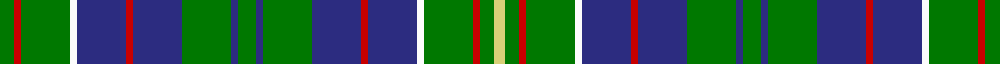

This page is one **sett** — a single exact thread-count. It belongs to the [tartan](/setts/g4r2g14w2db14r2db14g14db2g5db2g14db14r2db14w2g14r2g4ly3/)
(the same proportion at any scale), whose colour order is pattern [GRGWBRBGBGBGBRBWGRGY](/stripes/grgwbrbgbgbgbrbwgrgy/).

Part of the [Hunter of Hunterston](/tartans/hunter-of-hunterston/) tartan — the named design grouping this sett with its other cloths.

Sourced from register-of-tartans.  It is a [20 stripe tartan](/stripes/stripes20/).

Original link https://www.tartanregister.gov.uk/tartanDetails.aspx?ref=1793

## Register references

External register numbers recorded for this tartan.

- Scottish Register of Tartans: [1793](https://www.tartanregister.gov.uk/tartanDetails.aspx?ref=1793)
- Scottish Tartans Authority (ITI): 719
- Scottish Tartans World Register: 719

## Thread count
G/8 R4 G28 W4 DBa28 R4 DBa28 G28 DBa4 G10 DBa4 G28 DBa28 R4 DBa28 W4 G28 R4 G8 LG/6

One full sett is **562 threads**.

## Palette

Palette: <strong>Tartan Register</strong> <small style="color:#888">(6 of 8 colours)</small>
<table><thead><tr><th>Colour</th><th>Threads</th><th>Shade</th><th>Base</th><th>OKLCh</th></tr></thead><tbody><tr><td>G/</td><td style="text-align:right;font-variant-numeric:tabular-nums">8</td><td><code style="background-color:#007800;">#007800</code> <small style="color:#888">#007800</small></td><td>G <code style="background-color:#006100;">#006100</code></td><td><small style="color:#888">oklch(49.6% 0.169 142.5)</small></td></tr><tr><td>R</td><td style="text-align:right;font-variant-numeric:tabular-nums">4</td><td><code style="background-color:#C80000;">#C80000</code> <small style="color:#888">#C80000</small></td><td>R <code style="background-color:#CC0000;">#CC0000</code></td><td><small style="color:#888">oklch(52.3% 0.215 29.2)</small></td></tr><tr><td>G</td><td style="text-align:right;font-variant-numeric:tabular-nums">28</td><td><code style="background-color:#007800;">#007800</code> <small style="color:#888">#007800</small></td><td>G <code style="background-color:#006100;">#006100</code></td><td><small style="color:#888">oklch(49.6% 0.169 142.5)</small></td></tr><tr><td>W</td><td style="text-align:right;font-variant-numeric:tabular-nums">4</td><td><code style="background-color:#FCFCFC;">#FCFCFC</code> <small style="color:#888">#FCFCFC</small></td><td>W <code style="background-color:#F7F7F7;">#F7F7F7</code></td><td><small style="color:#888">oklch(99.1% 0.000 89.9)</small></td></tr><tr><td>DBa</td><td style="text-align:right;font-variant-numeric:tabular-nums">28</td><td><code style="background-color:#2C2C80;">#2C2C80</code> <small style="color:#888">#2C2C80</small></td><td>B <code style="background-color:#2A418A;">#2A418A</code></td><td><small style="color:#888">oklch(35.0% 0.138 276.6)</small></td></tr><tr><td>R</td><td style="text-align:right;font-variant-numeric:tabular-nums">4</td><td><code style="background-color:#C80000;">#C80000</code> <small style="color:#888">#C80000</small></td><td>R <code style="background-color:#CC0000;">#CC0000</code></td><td><small style="color:#888">oklch(52.3% 0.215 29.2)</small></td></tr><tr><td>DBa</td><td style="text-align:right;font-variant-numeric:tabular-nums">28</td><td><code style="background-color:#2C2C80;">#2C2C80</code> <small style="color:#888">#2C2C80</small></td><td>B <code style="background-color:#2A418A;">#2A418A</code></td><td><small style="color:#888">oklch(35.0% 0.138 276.6)</small></td></tr><tr><td>G</td><td style="text-align:right;font-variant-numeric:tabular-nums">28</td><td><code style="background-color:#007800;">#007800</code> <small style="color:#888">#007800</small></td><td>G <code style="background-color:#006100;">#006100</code></td><td><small style="color:#888">oklch(49.6% 0.169 142.5)</small></td></tr><tr><td>DBa</td><td style="text-align:right;font-variant-numeric:tabular-nums">4</td><td><code style="background-color:#2C2C80;">#2C2C80</code> <small style="color:#888">#2C2C80</small></td><td>B <code style="background-color:#2A418A;">#2A418A</code></td><td><small style="color:#888">oklch(35.0% 0.138 276.6)</small></td></tr><tr><td>G</td><td style="text-align:right;font-variant-numeric:tabular-nums">10</td><td><code style="background-color:#007800;">#007800</code> <small style="color:#888">#007800</small></td><td>G <code style="background-color:#006100;">#006100</code></td><td><small style="color:#888">oklch(49.6% 0.169 142.5)</small></td></tr><tr><td>DBa</td><td style="text-align:right;font-variant-numeric:tabular-nums">4</td><td><code style="background-color:#2C2C80;">#2C2C80</code> <small style="color:#888">#2C2C80</small></td><td>B <code style="background-color:#2A418A;">#2A418A</code></td><td><small style="color:#888">oklch(35.0% 0.138 276.6)</small></td></tr><tr><td>G</td><td style="text-align:right;font-variant-numeric:tabular-nums">28</td><td><code style="background-color:#007800;">#007800</code> <small style="color:#888">#007800</small></td><td>G <code style="background-color:#006100;">#006100</code></td><td><small style="color:#888">oklch(49.6% 0.169 142.5)</small></td></tr><tr><td>DBa</td><td style="text-align:right;font-variant-numeric:tabular-nums">28</td><td><code style="background-color:#2C2C80;">#2C2C80</code> <small style="color:#888">#2C2C80</small></td><td>B <code style="background-color:#2A418A;">#2A418A</code></td><td><small style="color:#888">oklch(35.0% 0.138 276.6)</small></td></tr><tr><td>R</td><td style="text-align:right;font-variant-numeric:tabular-nums">4</td><td><code style="background-color:#C80000;">#C80000</code> <small style="color:#888">#C80000</small></td><td>R <code style="background-color:#CC0000;">#CC0000</code></td><td><small style="color:#888">oklch(52.3% 0.215 29.2)</small></td></tr><tr><td>DBa</td><td style="text-align:right;font-variant-numeric:tabular-nums">28</td><td><code style="background-color:#2C2C80;">#2C2C80</code> <small style="color:#888">#2C2C80</small></td><td>B <code style="background-color:#2A418A;">#2A418A</code></td><td><small style="color:#888">oklch(35.0% 0.138 276.6)</small></td></tr><tr><td>W</td><td style="text-align:right;font-variant-numeric:tabular-nums">4</td><td><code style="background-color:#FCFCFC;">#FCFCFC</code> <small style="color:#888">#FCFCFC</small></td><td>W <code style="background-color:#F7F7F7;">#F7F7F7</code></td><td><small style="color:#888">oklch(99.1% 0.000 89.9)</small></td></tr><tr><td>G</td><td style="text-align:right;font-variant-numeric:tabular-nums">28</td><td><code style="background-color:#007800;">#007800</code> <small style="color:#888">#007800</small></td><td>G <code style="background-color:#006100;">#006100</code></td><td><small style="color:#888">oklch(49.6% 0.169 142.5)</small></td></tr><tr><td>R</td><td style="text-align:right;font-variant-numeric:tabular-nums">4</td><td><code style="background-color:#C80000;">#C80000</code> <small style="color:#888">#C80000</small></td><td>R <code style="background-color:#CC0000;">#CC0000</code></td><td><small style="color:#888">oklch(52.3% 0.215 29.2)</small></td></tr><tr><td>G</td><td style="text-align:right;font-variant-numeric:tabular-nums">8</td><td><code style="background-color:#007800;">#007800</code> <small style="color:#888">#007800</small></td><td>G <code style="background-color:#006100;">#006100</code></td><td><small style="color:#888">oklch(49.6% 0.169 142.5)</small></td></tr><tr><td>LG/</td><td style="text-align:right;font-variant-numeric:tabular-nums">6</td><td><code style="background-color:#D8D078;">#D8D078</code> <small style="color:#888">#D8D078</small></td><td>Y <code style="background-color:#F2BF00;">#F2BF00</code></td><td><small style="color:#888">oklch(84.5% 0.110 103.9)</small></td></tr></tbody></table>

## Nearest tartans

The nearest existing variants by ΔTartan distance, with this tartan at the top so the swatches line up against it.

ΔTartan

Tartan

Sett

—

<a href="/ttd/edit/#slug=g4r2g14w2db14r2db14g14db2g5db2g14db14r2db14w2g14r2g4ly3~x2">Hunter of Hunterston</a> <a class="nn-out" href="/variants/s20/g4r2g14w2db14r2db14g14db2g5db2g14db14r2db14w2g14r2g4ly3~x2/" title="open its dictionary page">↗</a>

1.23

<a href="/ttd/edit/#slug=g5db2g14db14r2db14w2g14r2g4ly3~x2&amp;base=g4r2g14w2db14r2db14g14db2g5db2g14db14r2db14w2g14r2g4ly3~x2">Hunter of Hunterston (Clan)</a> <a class="nn-out" href="/variants/s11/g5db2g14db14r2db14w2g14r2g4ly3~x2/" title="open its dictionary page">↗</a>

1.28

<a href="/ttd/edit/#slug=g5k12g6k8g13w2g12w2g13k8b2k2b2k2b14g3~x2&amp;base=g4r2g14w2db14r2db14g14db2g5db2g14db14r2db14w2g14r2g4ly3~x2">O'Connor (Name)</a> <a class="nn-out" href="/variants/s16/g5k12g6k8g13w2g12w2g13k8b2k2b2k2b14g3~x2/" title="open its dictionary page">↗</a>

1.31

<a href="/ttd/edit/#slug=g5k24g12k16g26w4g24w4g26k16dt4k4dt4k4db28g3&amp;base=g4r2g14w2db14r2db14g14db2g5db2g14db14r2db14w2g14r2g4ly3~x2">O'Conner Irish Family Tartan</a> <a class="nn-out" href="/variants/s16/g5k24g12k16g26w4g24w4g26k16dt4k4dt4k4db28g3/" title="open its dictionary page">↗</a>

1.41

<a href="/ttd/edit/#slug=g14t2r3t2k16ly2t16g16r3g16t16ly2k16t2r3t2g14k6~x2&amp;base=g4r2g14w2db14r2db14g14db2g5db2g14db14r2db14w2g14r2g4ly3~x2">Norwich No.038</a> <a class="nn-out" href="/variants/s18/g14t2r3t2k16ly2t16g16r3g16t16ly2k16t2r3t2g14k6~x2/" title="open its dictionary page">↗</a>

1.43

<a href="/ttd/edit/#slug=g6k3g18r4db4w4g18k3g6k3db6k3db18w4db4r4db18k3db6k3~x2&amp;base=g4r2g14w2db14r2db14g14db2g5db2g14db14r2db14w2g14r2g4ly3~x2">Shaw of Carolina (Personal)</a> <a class="nn-out" href="/variants/s20/g6k3g18r4db4w4g18k3g6k3db6k3db18w4db4r4db18k3db6k3~x2/" title="open its dictionary page">↗</a>

1.44

<a href="/ttd/edit/#slug=g5db2g12db12r2db12w2g12r2g4ly3~x2&amp;base=g4r2g14w2db14r2db14g14db2g5db2g14db14r2db14w2g14r2g4ly3~x2">Hunter of Hunterston</a> <a class="nn-out" href="/variants/s11/g5db2g12db12r2db12w2g12r2g4ly3~x2/" title="open its dictionary page">↗</a>

1.44

<a href="/ttd/edit/#slug=k1b8k8g8w2g8k8b1k1b1k1b8k1b1k1b1k8g8ly2g8k8b8k1b1~x2&amp;base=g4r2g14w2db14r2db14g14db2g5db2g14db14r2db14w2g14r2g4ly3~x2">Campbell of Argyll (no guards)</a> <a class="nn-out" href="/variants/s24/k1b8k8g8w2g8k8b1k1b1k1b8k1b1k1b1k8g8ly2g8k8b8k1b1~x2/" title="open its dictionary page">↗</a>

1.45

<a href="/ttd/edit/#slug=k1g1r1g1lo1g1lo1g4db1k1db1k1db1k1db1g7r1~x4&amp;base=g4r2g14w2db14r2db14g14db2g5db2g14db14r2db14w2g14r2g4ly3~x2">Myron</a> <a class="nn-out" href="/variants/s17/k1g1r1g1lo1g1lo1g4db1k1db1k1db1k1db1g7r1~x4/" title="open its dictionary page">↗</a>

1.46

<a href="/ttd/edit/#slug=dg10dgi4dg10w2dg10dgi2dg2dgi20w4dgi4w4dgi4r4dgi20dg2dgi2dg10w2dg10dgi4dg5b4~x2&amp;base=g4r2g14w2db14r2db14g14db2g5db2g14db14r2db14w2g14r2g4ly3~x2">Toshach</a> <a class="nn-out" href="/variants/s22/dg10dgi4dg10w2dg10dgi2dg2dgi20w4dgi4w4dgi4r4dgi20dg2dgi2dg10w2dg10dgi4dg5b4~x2/" title="open its dictionary page">↗</a>

1.46

<a href="/variants/s20/k8w2g11t2k2t2g11db6k7db6g8~x2/">Wilson's No.149</a>

## Neighbour map

Every grey dot is one of 14360 variants placed by the first two principal components of the ΔTartan feature space (44% of its variance). Red is this tartan; blue dots are its nearest — click one to open its page.

<svg viewBox="0 0 640 380" role="img" style="max-width:100%;height:auto;border:1px solid #e0e0e0;border-radius:4px;display:block" xmlns="http://www.w3.org/2000/svg"><image href="/nn/cloud.v1.png" width="640" height="380"/><a href="/variants/s11/g5db2g14db14r2db14w2g14r2g4ly3~x2/"><circle cx="214.1" cy="192.3" r="4" fill="#3465a4"><title>Hunter of Hunterston (Clan)</title></circle></a><a href="/variants/s16/g5k12g6k8g13w2g12w2g13k8b2k2b2k2b14g3~x2/"><circle cx="208.9" cy="207.4" r="4" fill="#3465a4"><title>O'Connor (Name)</title></circle></a><a href="/variants/s16/g5k24g12k16g26w4g24w4g26k16dt4k4dt4k4db28g3/"><circle cx="202.8" cy="180.6" r="4" fill="#3465a4"><title>O'Conner Irish Family Tartan</title></circle></a><a href="/variants/s18/g14t2r3t2k16ly2t16g16r3g16t16ly2k16t2r3t2g14k6~x2/"><circle cx="146.0" cy="167.6" r="4" fill="#3465a4"><title>Norwich No.038</title></circle></a><a href="/variants/s20/g6k3g18r4db4w4g18k3g6k3db6k3db18w4db4r4db18k3db6k3~x2/"><circle cx="142.7" cy="168.6" r="4" fill="#3465a4"><title>Shaw of Carolina (Personal)</title></circle></a><a href="/variants/s11/g5db2g12db12r2db12w2g12r2g4ly3~x2/"><circle cx="208.4" cy="207.1" r="4" fill="#3465a4"><title>Hunter of Hunterston</title></circle></a><a href="/variants/s24/k1b8k8g8w2g8k8b1k1b1k1b8k1b1k1b1k8g8ly2g8k8b8k1b1~x2/"><circle cx="135.1" cy="156.1" r="4" fill="#3465a4"><title>Campbell of Argyll (no guards)</title></circle></a><a href="/variants/s17/k1g1r1g1lo1g1lo1g4db1k1db1k1db1k1db1g7r1~x4/"><circle cx="235.0" cy="163.8" r="4" fill="#3465a4"><title>Myron</title></circle></a><a href="/variants/s22/dg10dgi4dg10w2dg10dgi2dg2dgi20w4dgi4w4dgi4r4dgi20dg2dgi2dg10w2dg10dgi4dg5b4~x2/"><circle cx="205.6" cy="159.6" r="4" fill="#3465a4"><title>Toshach</title></circle></a><a href="/variants/s20/k8w2g11t2k2t2g11db6k7db6g8~x2/"><circle cx="146.1" cy="202.5" r="4" fill="#3465a4"><title>Wilson's No.149</title></circle></a><circle cx="205.4" cy="170.1" r="5" fill="#c00000"/></svg>

ID: /variants/s20/g4r2g14w2db14r2db14g14db2g5db2g14db14r2db14w2g14r2g4ly3~x2/
