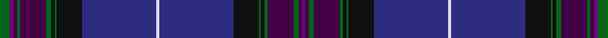

This page is one **sett** — a single exact thread-count. It belongs to the [tartan](/setts/g6dpi2dp2g2dp15g3k2g1k15db43w2db43k15g1k2g2dp15g3dp2dpi2/)
(the same proportion at any scale), whose colour order is pattern [BBGBGKGKBWBKGKGBGBBG](/stripes/bbgbgkgkbwbkgkgbgbbg/).

Part of the [Scottish Pride](/tartans/scottish-pride/) tartan — the named design grouping this sett with its other cloths.

Sourced from register-of-tartans.  It is a [20 stripe tartan](/stripes/stripes20/).

Original link https://www.tartanregister.gov.uk/tartanDetails.aspx?ref=3740

## Register references

External register numbers recorded for this tartan.

- Scottish Register of Tartans: [3740](https://www.tartanregister.gov.uk/tartanDetails.aspx?ref=3740)
- Scottish Tartans Authority (ITI): 6492

## Thread count
G/12 P4 DP4 G4 DP30 G6 K4 G2 K30 DB86 LN4 DB86 K30 G2 K4 G4 DP30 G6 DP4 P/4

One full sett is **696 threads**.

## Palette

Palette: <strong>Tartan Register</strong>
<table><thead><tr><th>Colour</th><th>Threads</th><th>Shade</th><th>Base</th><th>OKLCh</th></tr></thead><tbody><tr><td>G/</td><td style="text-align:right;font-variant-numeric:tabular-nums">12</td><td><code style="background-color:#006818;">#006818</code> <small style="color:#888">#006818</small></td><td>G <code style="background-color:#006100;">#006100</code></td><td><small style="color:#888">oklch(45.0% 0.142 145.0)</small></td></tr><tr><td>P</td><td style="text-align:right;font-variant-numeric:tabular-nums">4</td><td><code style="background-color:#780078;">#780078</code> <small style="color:#888">#780078</small></td><td>B <code style="background-color:#2A418A;">#2A418A</code></td><td><small style="color:#888">oklch(40.2% 0.185 328.4)</small></td></tr><tr><td>DP</td><td style="text-align:right;font-variant-numeric:tabular-nums">4</td><td><code style="background-color:#440044;">#440044</code> <small style="color:#888">#440044</small></td><td>B <code style="background-color:#2A418A;">#2A418A</code></td><td><small style="color:#888">oklch(27.1% 0.125 328.4)</small></td></tr><tr><td>G</td><td style="text-align:right;font-variant-numeric:tabular-nums">4</td><td><code style="background-color:#006818;">#006818</code> <small style="color:#888">#006818</small></td><td>G <code style="background-color:#006100;">#006100</code></td><td><small style="color:#888">oklch(45.0% 0.142 145.0)</small></td></tr><tr><td>DP</td><td style="text-align:right;font-variant-numeric:tabular-nums">30</td><td><code style="background-color:#440044;">#440044</code> <small style="color:#888">#440044</small></td><td>B <code style="background-color:#2A418A;">#2A418A</code></td><td><small style="color:#888">oklch(27.1% 0.125 328.4)</small></td></tr><tr><td>G</td><td style="text-align:right;font-variant-numeric:tabular-nums">6</td><td><code style="background-color:#006818;">#006818</code> <small style="color:#888">#006818</small></td><td>G <code style="background-color:#006100;">#006100</code></td><td><small style="color:#888">oklch(45.0% 0.142 145.0)</small></td></tr><tr><td>K</td><td style="text-align:right;font-variant-numeric:tabular-nums">4</td><td><code style="background-color:#101010;">#101010</code> <small style="color:#888">#101010</small></td><td>K <code style="background-color:#000000;">#000000</code></td><td><small style="color:#888">oklch(17.3% 0.000 89.9)</small></td></tr><tr><td>G</td><td style="text-align:right;font-variant-numeric:tabular-nums">2</td><td><code style="background-color:#006818;">#006818</code> <small style="color:#888">#006818</small></td><td>G <code style="background-color:#006100;">#006100</code></td><td><small style="color:#888">oklch(45.0% 0.142 145.0)</small></td></tr><tr><td>K</td><td style="text-align:right;font-variant-numeric:tabular-nums">30</td><td><code style="background-color:#101010;">#101010</code> <small style="color:#888">#101010</small></td><td>K <code style="background-color:#000000;">#000000</code></td><td><small style="color:#888">oklch(17.3% 0.000 89.9)</small></td></tr><tr><td>DB</td><td style="text-align:right;font-variant-numeric:tabular-nums">86</td><td><code style="background-color:#2C2C80;">#2C2C80</code> <small style="color:#888">#2C2C80</small></td><td>B <code style="background-color:#2A418A;">#2A418A</code></td><td><small style="color:#888">oklch(35.0% 0.138 276.6)</small></td></tr><tr><td>LN</td><td style="text-align:right;font-variant-numeric:tabular-nums">4</td><td><code style="background-color:#E0E0E0;">#E0E0E0</code> <small style="color:#888">#E0E0E0</small></td><td>W <code style="background-color:#F7F7F7;">#F7F7F7</code></td><td><small style="color:#888">oklch(90.7% 0.000 89.9)</small></td></tr><tr><td>DB</td><td style="text-align:right;font-variant-numeric:tabular-nums">86</td><td><code style="background-color:#2C2C80;">#2C2C80</code> <small style="color:#888">#2C2C80</small></td><td>B <code style="background-color:#2A418A;">#2A418A</code></td><td><small style="color:#888">oklch(35.0% 0.138 276.6)</small></td></tr><tr><td>K</td><td style="text-align:right;font-variant-numeric:tabular-nums">30</td><td><code style="background-color:#101010;">#101010</code> <small style="color:#888">#101010</small></td><td>K <code style="background-color:#000000;">#000000</code></td><td><small style="color:#888">oklch(17.3% 0.000 89.9)</small></td></tr><tr><td>G</td><td style="text-align:right;font-variant-numeric:tabular-nums">2</td><td><code style="background-color:#006818;">#006818</code> <small style="color:#888">#006818</small></td><td>G <code style="background-color:#006100;">#006100</code></td><td><small style="color:#888">oklch(45.0% 0.142 145.0)</small></td></tr><tr><td>K</td><td style="text-align:right;font-variant-numeric:tabular-nums">4</td><td><code style="background-color:#101010;">#101010</code> <small style="color:#888">#101010</small></td><td>K <code style="background-color:#000000;">#000000</code></td><td><small style="color:#888">oklch(17.3% 0.000 89.9)</small></td></tr><tr><td>G</td><td style="text-align:right;font-variant-numeric:tabular-nums">4</td><td><code style="background-color:#006818;">#006818</code> <small style="color:#888">#006818</small></td><td>G <code style="background-color:#006100;">#006100</code></td><td><small style="color:#888">oklch(45.0% 0.142 145.0)</small></td></tr><tr><td>DP</td><td style="text-align:right;font-variant-numeric:tabular-nums">30</td><td><code style="background-color:#440044;">#440044</code> <small style="color:#888">#440044</small></td><td>B <code style="background-color:#2A418A;">#2A418A</code></td><td><small style="color:#888">oklch(27.1% 0.125 328.4)</small></td></tr><tr><td>G</td><td style="text-align:right;font-variant-numeric:tabular-nums">6</td><td><code style="background-color:#006818;">#006818</code> <small style="color:#888">#006818</small></td><td>G <code style="background-color:#006100;">#006100</code></td><td><small style="color:#888">oklch(45.0% 0.142 145.0)</small></td></tr><tr><td>DP</td><td style="text-align:right;font-variant-numeric:tabular-nums">4</td><td><code style="background-color:#440044;">#440044</code> <small style="color:#888">#440044</small></td><td>B <code style="background-color:#2A418A;">#2A418A</code></td><td><small style="color:#888">oklch(27.1% 0.125 328.4)</small></td></tr><tr><td>P/</td><td style="text-align:right;font-variant-numeric:tabular-nums">4</td><td><code style="background-color:#780078;">#780078</code> <small style="color:#888">#780078</small></td><td>B <code style="background-color:#2A418A;">#2A418A</code></td><td><small style="color:#888">oklch(40.2% 0.185 328.4)</small></td></tr></tbody></table>

## Nearest tartans

The nearest existing variants by ΔTartan distance, with this tartan at the top so the swatches line up against it.

ΔTartan

Tartan

Sett

—

<a href="/ttd/edit/#slug=g6dpi2dp2g2dp15g3k2g1k15db43w2db43k15g1k2g2dp15g3dp2dpi2~x2">Scottish Pride</a> <a class="nn-out" href="/variants/s20/g6dpi2dp2g2dp15g3k2g1k15db43w2db43k15g1k2g2dp15g3dp2dpi2~x2/" title="open its dictionary page">↗</a>

1.13

<a href="/variants/s18/db5w1db44dp1g12k12dp5k2m2k3~x2/">Heart of Scotland (Lochcarron)</a>

1.24

<a href="/variants/s20/db9dg2dpi2dp2dg18dpi2k2dg1k19db33w2~x2/">Highland Pride of Scotland</a>

1.38

<a href="/ttd/edit/#slug=g6dpi2dp2g2dp15g3k2g1k15db43w2~x2&amp;base=g6dpi2dp2g2dp15g3k2g1k15db43w2db43k15g1k2g2dp15g3dp2dpi2~x2">Scottish Pride (Fashion)</a> <a class="nn-out" href="/variants/s11/g6dpi2dp2g2dp15g3k2g1k15db43w2~x2/" title="open its dictionary page">↗</a>

1.43

<a href="/variants/s18/db6w1db40m1k12dg12m6dg2dp2dg4~x2/">Scotland the Brave</a>

1.47

<a href="/variants/s22/dt36r3dt1r2dt3r6db1r2db35w1db1lo2~x2/">Kirkcaldy Tartan Army</a>

1.52

<a href="/ttd/edit/#slug=db37dp2db2dp3k13dp10w2dp10y1dp2y2dp2y9dp13~x2&amp;base=g6dpi2dp2g2dp15g3k2g1k15db43w2db43k15g1k2g2dp15g3dp2dpi2~x2">Strathtummel (District?)</a> <a class="nn-out" href="/variants/s14/db37dp2db2dp3k13dp10w2dp10y1dp2y2dp2y9dp13~x2/" title="open its dictionary page">↗</a>

1.60

<a href="/ttd/edit/#slug=dp42dt3g1dt2r1dt2dp2db20dt1r2dt3g1dt2r1dt2dp2g3dt1g2lo1g2db2~x2&amp;base=g6dpi2dp2g2dp15g3k2g1k15db43w2db43k15g1k2g2dp15g3dp2dpi2~x2">Monarch of the Glen</a> <a class="nn-out" href="/variants/s22/dp42dt3g1dt2r1dt2dp2db20dt1r2dt3g1dt2r1dt2dp2g3dt1g2lo1g2db2~x2/" title="open its dictionary page">↗</a>

1.67

<a href="/variants/s14/db37ki2db2ki3k13ki10w2ki10dg1ki2dg2ki2dg9ki13~x2/">Strathtummel</a>

1.67

<a href="/ttd/edit/#slug=dt36r3dt1r2dt3r6db1r2db35w1db1lo2~x2&amp;base=g6dpi2dp2g2dp15g3k2g1k15db43w2db43k15g1k2g2dp15g3dp2dpi2~x2">Kirkcaldy Tartan Army (Corporate)</a> <a class="nn-out" href="/variants/s12/dt36r3dt1r2dt3r6db1r2db35w1db1lo2~x2/" title="open its dictionary page">↗</a>

1.73

<a href="/ttd/edit/#slug=db66k20dbi7y4dbi5y4dbi5y4dbi7k2lr6&amp;base=g6dpi2dp2g2dp15g3k2g1k15db43w2db43k15g1k2g2dp15g3dp2dpi2~x2">Muir Homes</a> <a class="nn-out" href="/variants/s11/db66k20dbi7y4dbi5y4dbi5y4dbi7k2lr6/" title="open its dictionary page">↗</a>

## Neighbour map

Every grey dot is one of 14360 variants placed by the first two principal components of the ΔTartan feature space (44% of its variance). Red is this tartan; blue dots are its nearest — click one to open its page.

<svg viewBox="0 0 640 380" role="img" style="max-width:100%;height:auto;border:1px solid #e0e0e0;border-radius:4px;display:block" xmlns="http://www.w3.org/2000/svg"><image href="/nn/cloud.v1.png" width="640" height="380"/><a href="/variants/s18/db5w1db44dp1g12k12dp5k2m2k3~x2/"><circle cx="365.8" cy="80.6" r="4" fill="#3465a4"><title>Heart of Scotland (Lochcarron)</title></circle></a><a href="/variants/s20/db9dg2dpi2dp2dg18dpi2k2dg1k19db33w2~x2/"><circle cx="285.4" cy="100.1" r="4" fill="#3465a4"><title>Highland Pride of Scotland</title></circle></a><a href="/variants/s11/g6dpi2dp2g2dp15g3k2g1k15db43w2~x2/"><circle cx="313.8" cy="96.0" r="4" fill="#3465a4"><title>Scottish Pride (Fashion)</title></circle></a><a href="/variants/s18/db6w1db40m1k12dg12m6dg2dp2dg4~x2/"><circle cx="321.9" cy="78.0" r="4" fill="#3465a4"><title>Scotland the Brave</title></circle></a><a href="/variants/s22/dt36r3dt1r2dt3r6db1r2db35w1db1lo2~x2/"><circle cx="360.8" cy="73.9" r="4" fill="#3465a4"><title>Kirkcaldy Tartan Army</title></circle></a><a href="/variants/s14/db37dp2db2dp3k13dp10w2dp10y1dp2y2dp2y9dp13~x2/"><circle cx="310.5" cy="125.4" r="4" fill="#3465a4"><title>Strathtummel (District?)</title></circle></a><a href="/variants/s22/dp42dt3g1dt2r1dt2dp2db20dt1r2dt3g1dt2r1dt2dp2g3dt1g2lo1g2db2~x2/"><circle cx="363.7" cy="52.2" r="4" fill="#3465a4"><title>Monarch of the Glen</title></circle></a><a href="/variants/s14/db37ki2db2ki3k13ki10w2ki10dg1ki2dg2ki2dg9ki13~x2/"><circle cx="290.2" cy="123.1" r="4" fill="#3465a4"><title>Strathtummel</title></circle></a><a href="/variants/s12/dt36r3dt1r2dt3r6db1r2db35w1db1lo2~x2/"><circle cx="355.7" cy="111.4" r="4" fill="#3465a4"><title>Kirkcaldy Tartan Army (Corporate)</title></circle></a><a href="/variants/s11/db66k20dbi7y4dbi5y4dbi5y4dbi7k2lr6/"><circle cx="350.6" cy="120.8" r="4" fill="#3465a4"><title>Muir Homes</title></circle></a><circle cx="332.1" cy="81.6" r="5" fill="#c00000"/></svg>

ID: /variants/s20/g6dpi2dp2g2dp15g3k2g1k15db43w2db43k15g1k2g2dp15g3dp2dpi2~x2/
