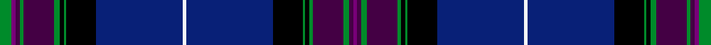

This page is one **sett** — a single exact thread-count. It belongs to the [tartan](/setts/g6dpi2dp2g2dp15g3k2g1k15db43w2db43k15g1k2g2dp15g3dp2dpi2/)
(the same proportion at any scale), whose colour order is pattern [BBGBGKGKBWBKGKGBGBBG](/stripes/bbgbgkgkbwbkgkgbgbbg/).

Sourced from register-of-tartans.  It is a [20 stripe tartan](/stripes/stripes20/).

Original link https://www.tartanregister.gov.uk/tartanDetails.aspx?ref=3740

## Register references

External register numbers recorded for this tartan.

- Scottish Register of Tartans: [3740](https://www.tartanregister.gov.uk/tartanDetails.aspx?ref=3740)
- Scottish Tartans Authority (ITI): 6492

## Thread count
G/12 DPi4 DP4 G4 DP30 G6 K4 G2 K30 DB86 W4 DB86 K30 G2 K4 G4 DP30 G6 DP4 DPi/4

One full sett is **696 threads**.

## Palette
<table><thead><tr><th>Colour</th><th>Shade</th><th>OKLCh</th></tr></thead><tbody><tr><td>DB</td><td><code style="background-color:#082077;">#082077</code> <small style="color:#888">#082077</small></td><td><small style="color:#888">oklch(30.0% 0.149 265.1)</small></td></tr><tr><td>DP</td><td><code style="background-color:#440044;">#440044</code> <small style="color:#888">#440044</small></td><td><small style="color:#888">oklch(27.1% 0.125 328.4)</small></td></tr><tr><td>G</td><td><code style="background-color:#008B2A;">#008B2A</code> <small style="color:#888">#008B2A</small></td><td><small style="color:#888">oklch(55.4% 0.170 145.9)</small></td></tr><tr><td>K</td><td><code style="background-color:#000000;">#000000</code> <small style="color:#888">#000000</small></td><td><small style="color:#888">oklch(0.0% 0.000 0.0)</small></td></tr><tr><td>LN</td><td><code style="background-color:#F7F7F7;">#F7F7F7</code> <small style="color:#888">#F7F7F7</small></td><td><small style="color:#888">oklch(97.6% 0.000 89.9)</small></td></tr><tr><td>P</td><td><code style="background-color:#780078;">#780078</code> <small style="color:#888">#780078</small></td><td><small style="color:#888">oklch(40.2% 0.185 328.4)</small></td></tr></tbody></table>

# Sample pattern

ID: /variants/s20/g6dpi2dp2g2dp15g3k2g1k15db43w2db43k15g1k2g2dp15g3dp2dpi2~x2~dpi1607327-dp1105325/
