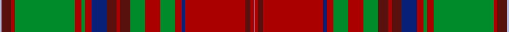
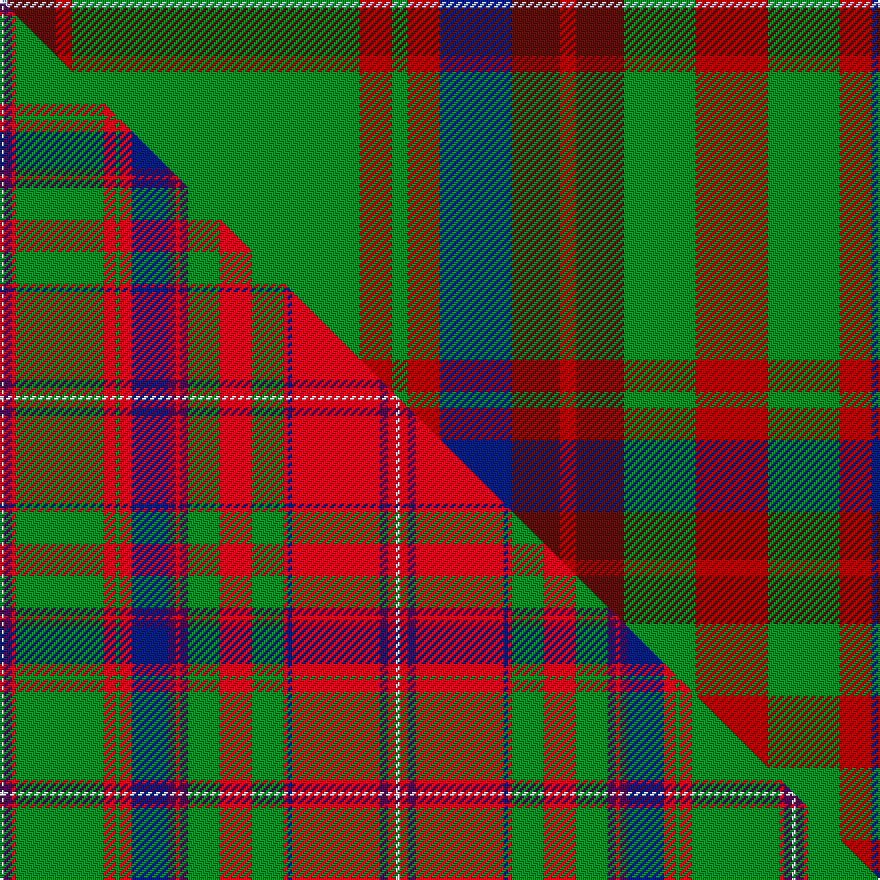

This page is one **sett** — a single exact thread-count. It belongs to the [tartan](/setts/lb2dr12r4g72r8g4r8db18dr12r4dr12g18r18g18r8db4r72dr6r4lb1/)
(the same proportion at any scale), whose colour order is pattern [WBRGRGRBBRBGRGRBRBRW](/stripes/wbrgrgrbbrbgrgrbrbrw/).

Part of the [MacDougall](/tartans/macdougall-2/) tartan — the named design grouping this sett with its other cloths.

Sourced from weddslist.  It is a [20 stripe tartan](/stripes/stripes20/).

Original link http://www.weddslist.com/cgi-bin/tartans/pg.pl?source=tinsel

2 attestations — the source records this cloth was collapsed from (oldest owns this page)

<ul>
<li>undated — MacDougall (weddslist, <a href="http://www.weddslist.com/cgi-bin/tartans/pg.pl?source=tinsel">record</a>) </li>
<li>undated — MacDougall (weddslist, <a href="http://www.weddslist.com/cgi-bin/tartans/pg.pl?source=x">record</a>) </li>
</ul>

## Thread count
LB/4 DR24 R8 G144 R16 G8 R16 DB36 DR24 R8 DR24 G36 R36 G36 R16 DB8 R144 DR12 R8 LB/2

One full sett is **1214 threads**.

## Palette
<table><thead><tr><th>Colour</th><th>Shade</th><th>OKLCh</th></tr></thead><tbody><tr><td>LB</td><td><code style="background-color:#B5BBDE;">#B5BBDE</code> <small style="color:#888">#B5BBDE</small></td><td><small style="color:#888">oklch(79.9% 0.050 277.6)</small></td></tr><tr><td>DB</td><td><code style="background-color:#082077;">#082077</code> <small style="color:#888">#082077</small></td><td><small style="color:#888">oklch(30.0% 0.149 265.1)</small></td></tr><tr><td>G</td><td><code style="background-color:#008B2A;">#008B2A</code> <small style="color:#888">#008B2A</small></td><td><small style="color:#888">oklch(55.4% 0.170 145.9)</small></td></tr><tr><td>R</td><td><code style="background-color:#AA0000;">#AA0000</code> <small style="color:#888">#AA0000</small></td><td><small style="color:#888">oklch(46.3% 0.190 29.2)</small></td></tr><tr><td>DR</td><td><code style="background-color:#59110D;">#59110D</code> <small style="color:#888">#59110D</small></td><td><small style="color:#888">oklch(30.7% 0.105 28.2)</small></td></tr></tbody></table>

# Sample pattern

## Compared to the master

This cloth is one sett of its design; the master sett (the exemplar the design is anchored on) is below for comparison.

Its **ΔTartan distance** from the master is **1.56** — the same measure the nearest-tartans table ranks by (0 is identical; a re-scale of the same cloth is near 0, a recolour or a different proportion further).

<figure class="master-compare" style="margin:0">

this sett
master sett ★

<figcaption style="color:#888;font-size:smaller">One weave of this sett against the <a href="/setts/w1dp2r1g22r3g1r3db9dp2r1dp2g8r8g8r1db1r22dp2r2w1/">master sett ★</a>, split on the diagonal: a shared proportion runs seamlessly across it with only the shades shifting; a different proportion breaks on it.</figcaption>
</figure>

## Nearest tartan variants

The nearest existing variants by ΔTartan distance, with this cloth at the top so the swatches line up against it.

ΔTartan

Threads

Variant

Sett

—

1214

<a href="/variants/s20/lb2dr12r4g72r8g4r8db18dr12r4dr12g18r18g18r8db4r72dr6r4lb1~x2~r1908029/">MacDougall</a>

<a href="/ttd/edit/#slug=lb1r12ri4g72ri8g4ri8db18r12ri4r12g18ri18g18ri8db4ri72r6ri4lb1~x2~r1707016-ri2008029&amp;base=lb2dr12r4g72r8g4r8db18dr12r4dr12g18r18g18r8db4r72dr6r4lb1~x2~r1908029" title="compare in the TTD">0.01</a>

1212

<a href="/variants/s20/lb1r12ri4g72ri8g4ri8db18r12ri4r12g18ri18g18ri8db4ri72r6ri4lb1~x2~r1707016-ri2008029/">MacDougal 2</a>

<a href="/ttd/edit/#slug=lb1r12ri4g72ri8g4ri8db18r12ri4r12g18ri18g18ri8db4ri72r6ri4lb1~x2~r1707016-ri2209032&amp;base=lb2dr12r4g72r8g4r8db18dr12r4dr12g18r18g18r8db4r72dr6r4lb1~x2~r1908029" title="compare in the TTD">0.01</a>

1212

<a href="/variants/s20/lb1r12ri4g72ri8g4ri8db18r12ri4r12g18ri18g18ri8db4ri72r6ri4lb1~x2~r1707016-ri2209032/">MacDougall (Logan)</a>

<a href="/ttd/edit/#slug=lb2dp10r3ri4g72ri7g4ri10db24dp6r5ri4r5dp7g24ri24g24ri3db3ri74dp7r5ri6lb2~x2~r2208029-ri2209032&amp;base=lb2dr12r4g72r8g4r8db18dr12r4dr12g18r18g18r8db4r72dr6r4lb1~x2~r1908029" title="compare in the TTD">1.74</a>

1332

<a href="/variants/s24/lb2dp10r3ri4g72ri7g4ri10db24dp6r5ri4r5dp7g24ri24g24ri3db3ri74dp7r5ri6lb2~x2~r2208029-ri2209032/">MacDougall of MacDougall</a>

<a href="/ttd/edit/#slug=lb1r5b2ri3g24ri5g2ri5db11r3b2ri2b2r3g11ri11g11ri2db2ri25r3b2ri5lb1~x2~r1707016-ri2008029&amp;base=lb2dr12r4g72r8g4r8db18dr12r4dr12g18r18g18r8db4r72dr6r4lb1~x2~r1908029" title="compare in the TTD">2.37</a>

568

<a href="/variants/s24/lb1r5b2ri3g24ri5g2ri5db11r3b2ri2b2r3g11ri11g11ri2db2ri25r3b2ri5lb1~x2~r1707016-ri2008029/">MacDougall 5</a>

## Neighbour map

Every grey dot is one of 13620 variants placed by the first two principal components of the ΔTartan feature space (42% of its variance). Red is this tartan; blue dots are its nearest — click one to open its page.

<svg viewBox="0 0 640 380" role="img" style="max-width:100%;height:auto;border:1px solid #e0e0e0;border-radius:4px;display:block" xmlns="http://www.w3.org/2000/svg"><image href="/nn/cloud.v1.png" width="640" height="380"/><a href="/variants/s20/lb1r12ri4g72ri8g4ri8db18r12ri4r12g18ri18g18ri8db4ri72r6ri4lb1~x2~r1707016-ri2008029/"><circle cx="296.1" cy="69.7" r="4" fill="#3465a4"><title>MacDougal 2</title></circle></a><a href="/variants/s20/lb1r12ri4g72ri8g4ri8db18r12ri4r12g18ri18g18ri8db4ri72r6ri4lb1~x2~r1707016-ri2209032/"><circle cx="286.7" cy="65.6" r="4" fill="#3465a4"><title>MacDougall (Logan)</title></circle></a><a href="/variants/s24/lb2dp10r3ri4g72ri7g4ri10db24dp6r5ri4r5dp7g24ri24g24ri3db3ri74dp7r5ri6lb2~x2~r2208029-ri2209032/"><circle cx="235.1" cy="49.6" r="4" fill="#3465a4"><title>MacDougall of MacDougall</title></circle></a><a href="/variants/s24/lb1r5b2ri3g24ri5g2ri5db11r3b2ri2b2r3g11ri11g11ri2db2ri25r3b2ri5lb1~x2~r1707016-ri2008029/"><circle cx="222.7" cy="86.3" r="4" fill="#3465a4"><title>MacDougall 5</title></circle></a><circle cx="295.2" cy="72.8" r="5" fill="#c00000"/><text x="320" y="376" text-anchor="middle" font-size="11" fill="#999">ground</text><text x="11" y="190" text-anchor="middle" font-size="11" fill="#999" transform="rotate(-90 11 190)">complexity</text></svg>

ID: /variants/s20/lb2dr12r4g72r8g4r8db18dr12r4dr12g18r18g18r8db4r72dr6r4lb1~x2~r1908029/
