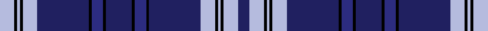

This page is one **sett** — a single exact thread-count. It belongs to the [tartan](/setts/lb5k1lb1k1lb5db18k1dbi4k1db9k1dbi4k1db18lb5k1lb1k1lb5db4/)
(the same proportion at any scale), whose colour order is pattern [BWKWKWBKBKBKBKBWKWKW](/stripes/bwkwkwbkbkbkbkbwkwkw/).

Sourced from register-of-tartans.  It is a [20 stripe tartan](/stripes/stripes20/).

Original link https://www.tartanregister.gov.uk/tartanDetails.aspx?ref=1823

## Provenance

Earliest known date: January 1997 Indigo Blue Works is a UK blue (indigo) denim material weaver and this tartan was designed to promote their products in the Japaneses market. (STS data). The tartan was launched at a filmed ceremony in Pitlochry.

2 attestations — the source records this cloth was collapsed from (oldest owns this page)

<ul>
<li>01/01/1997 — Indigo Blue (register-of-tartans, <a href="https://www.tartanregister.gov.uk/tartanDetails.aspx?ref=1823">record</a>)  <em>Indigo Blue Works is a UK blue (indigo) denim material weaver and this tartan was designed to promote their products in the Japaneses market. (Scottish Tartans Society data). The tartan was launched at a filmed ceremony in Pitlochry.</em></li>
<li>undated — Indigo Blue Works Corporate Tartan (house-of-tartan, <a href="http://www.house-of-tartan.scotland.net/house/TartanViewjs.asp?colr=Def&tnam=2352">record</a>) </li>
</ul>

## Register references

External register numbers recorded for this tartan.

- Scottish Register of Tartans: [1823](https://www.tartanregister.gov.uk/tartanDetails.aspx?ref=1823)
- Scottish Tartans Authority (ITI): 2352
- Scottish Tartans World Register: 2352

## Thread count
LB/10 K2 LB2 K2 LB10 DB36 K2 DBi8 K2 DB18 K2 DBi8 K2 DB36 LB10 K2 LB2 K2 LB10 DB/8

One full sett is **330 threads**.

## Palette
<table><thead><tr><th>Colour</th><th>Shade</th><th>OKLCh</th></tr></thead><tbody><tr><td>B</td><td><code style="background-color:#B5BBDE;">#B5BBDE</code> <small style="color:#888">#B5BBDE</small></td><td><small style="color:#888">oklch(79.9% 0.050 277.6)</small></td></tr><tr><td>DB</td><td><code style="background-color:#2C2C80;">#2C2C80</code> <small style="color:#888">#2C2C80</small></td><td><small style="color:#888">oklch(35.0% 0.138 276.6)</small></td></tr><tr><td>DBa</td><td><code style="background-color:#202060;">#202060</code> <small style="color:#888">#202060</small></td><td><small style="color:#888">oklch(28.9% 0.111 276.9)</small></td></tr><tr><td>K</td><td><code style="background-color:#000000;">#000000</code> <small style="color:#888">#000000</small></td><td><small style="color:#888">oklch(0.0% 0.000 0.0)</small></td></tr></tbody></table>

# Sample pattern

ID: /variants/s20/lb5k1lb1k1lb5db18k1dbi4k1db9k1dbi4k1db18lb5k1lb1k1lb5db4~x2~db1204274-dbi1406275/
