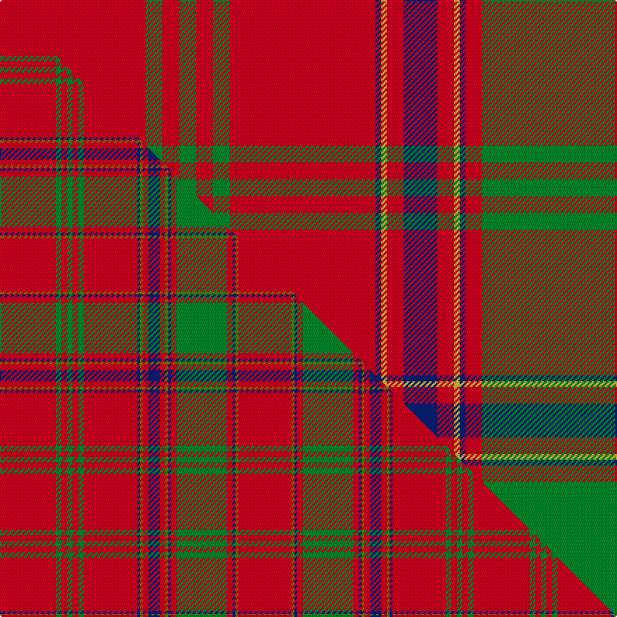

This page is one **sett** — a single exact thread-count. It belongs to the [tartan](/setts/r26g3r3g3r3g3r26db1ly1r3db6r3ly1db1r3g26r3db1ly1r13/)
(the same proportion at any scale), whose colour order is pattern [RGRGRGRBYRBRYBRGRBYR](/stripes/rgrgrgrbyrbrybrgrbyr/).

Part of the [Munro](/tartans/munro-2/) tartan — the named design grouping this sett with its other cloths.

Sourced from logan-1831.  It is a [20 stripe tartan](/stripes/stripes20/).

Original link /posts/logans-scottish-gael/

## Provenance

<figure class="logan-scan">

<figcaption>Logan, The Scottish Gaël (1831), vol. II p. 407 — page-scan crop (292,1082)–(545,1867)</figcaption>
</figure>

James Logan recorded the **Munro** sett in 1831, on page 407 of the *Table of Clan Tartans* in *The Scottish Gaël* — the earliest systematic published collection of clan setts. Logan gives the stripe widths in eighths of an inch, measured across the cloth and reflected about each end (a half-sett):

> 6½ red · ½ yellow · ½ blue · 1½ red · 13 green · 1½ red · ½ blue · ½ yellow · 1½ red · 3 blue · 1½ red · ½ yellow · ½ blue · 13 red · 1½ green · 1½ red · 1½ green · 1½ red · 1½ green · 13 red

In threads (at 8 to the eighth-inch) that is `R/52 Y4 B4 R12 G104 R12 B4 Y4 R12 B24 R12 Y4 B4 R104 G12 R12 G12 R12 G12 R/104`. Logan named his colours rather than dyeing to a standard, so the palette here is the Dictionary's modern reading of his names.

See [Logan's Scottish Gaël](/posts/logans-scottish-gael/) for the full table and method.

## Related setts

Later records of the **Munro** name adjusted Logan's counts: [Munro](/setts/s17/r24y1b1r3g16r3b1y1r3b6r3y1b1r16g2ra2g2~b2c2c80-g006818-rc80000-racc4438-ye8c000~x4/); [Munro (Black and Red)](/setts/s5/k18r4k18r32w3~k101010-rc80000-wfcfcfc~x2/); [Munro (Culloden)](/setts/s14/b6r8b1r2y5r5b5r5y1r2b1r2b1r6~b202060-rc80000-ye8c000~x2/); [Munro (Logan)](/setts/s17/r19y1b1r2g18r2b1y1r2b4r2y1b1r19g2r2g2~b2c2c80-g006818-rc80000-ye8c000~x2/). Compare their thread counts with Logan's above.

## Thread count
R/104 G12 R12 G12 R12 G12 R104 DB4 LY4 R12 DB24 R12 LY4 DB4 R12 G104 R12 DB4 LY4 R/52

One full sett is **884 threads**.

## Palette
<table><thead><tr><th>Colour</th><th>Shade</th><th>OKLCh</th></tr></thead><tbody><tr><td>DB</td><td><code style="background-color:#082077;">#082077</code> <small style="color:#888">#082077</small></td><td><small style="color:#888">oklch(30.0% 0.149 265.1)</small></td></tr><tr><td>G</td><td><code style="background-color:#008B2A;">#008B2A</code> <small style="color:#888">#008B2A</small></td><td><small style="color:#888">oklch(55.4% 0.170 145.9)</small></td></tr><tr><td>R</td><td><code style="background-color:#D60020;">#D60020</code> <small style="color:#888">#D60020</small></td><td><small style="color:#888">oklch(55.2% 0.224 25.5)</small></td></tr><tr><td>LY</td><td><code style="background-color:#DCBC32;">#DCBC32</code> <small style="color:#888">#DCBC32</small></td><td><small style="color:#888">oklch(80.0% 0.150 95.2)</small></td></tr></tbody></table>

# Sample pattern

## Compared to the master

This cloth is one sett of its design; the master sett (the exemplar the design is anchored on) is below for comparison.

Its **ΔTartan distance** from the master is **0.45** — the same measure the nearest-tartans table ranks by (0 is identical; a re-scale of the same cloth is near 0, a recolour or a different proportion further).

<figure class="master-compare" style="margin:0">

this sett
master sett ★

<figcaption style="color:#888;font-size:smaller">One weave of this sett against the <a href="/setts/r20g2r2g2r2g2r19db1y1r2db4r2y1db1r2g18r2db1y1r19/">master sett ★</a>, split on the diagonal: a shared proportion runs seamlessly across it with only the shades shifting; a different proportion breaks on it.</figcaption>
</figure>

## Nearest tartan variants

The nearest existing variants by ΔTartan distance, with this cloth at the top so the swatches line up against it.

ΔTartan

Threads

Variant

Sett

—

884

<a href="/variants/s20/r26g3r3g3r3g3r26db1ly1r3db6r3ly1db1r3g26r3db1ly1r13~x4/">Munro</a>

<a href="/ttd/edit/#slug=r20g2r2g2r2g2r19db1y1r2db4r2y1db1r2g18r2db1y1r19~x2&amp;base=r26g3r3g3r3g3r26db1ly1r3db6r3ly1db1r3g26r3db1ly1r13~x4" title="compare in the TTD">0.45</a>

338

<a href="/variants/s20/r20g2r2g2r2g2r19db1y1r2db4r2y1db1r2g18r2db1y1r19~x2/">Munro</a>

<a href="/ttd/edit/#slug=r32g8r4g8r8db8r12lb1r1g18r1lb1r32lb1r1g18r1lb1r12g6r1lb1r4~x2&amp;base=r26g3r3g3r3g3r26db1ly1r3db6r3ly1db1r3g26r3db1ly1r13~x4" title="compare in the TTD">1.45</a>

648

<a href="/variants/s23/r32g8r4g8r8db8r12lb1r1g18r1lb1r32lb1r1g18r1lb1r12g6r1lb1r4~x2/">MacAlister (Cockburn Collection 1810-20)</a>

<a href="/ttd/edit/#slug=r32g8r4g8r8db8r12w1r1g18r1w1r32w1r1g18r1w1r12g6r1w1r4~x2&amp;base=r26g3r3g3r3g3r26db1ly1r3db6r3ly1db1r3g26r3db1ly1r13~x4" title="compare in the TTD">1.51</a>

648

<a href="/variants/s23/r32g8r4g8r8db8r12w1r1g18r1w1r32w1r1g18r1w1r12g6r1w1r4~x2/">MacAlister CC</a>

<a href="/ttd/edit/#slug=r24y1db1r3g16r3db1y1r3db6r3y1db1r16g2r2g2~x2&amp;base=r26g3r3g3r3g3r26db1ly1r3db6r3ly1db1r3g26r3db1ly1r13~x4" title="compare in the TTD">1.51</a>

292

<a href="/variants/s17/r24y1db1r3g16r3db1y1r3db6r3y1db1r16g2r2g2~x2/">Munro</a>

<a href="/ttd/edit/#slug=r40w2db1r3g31r3db1w2r3db8r3w2db1r34g4r4g4~x2&amp;base=r26g3r3g3r3g3r26db1ly1r3db6r3ly1db1r3g26r3db1ly1r13~x4" title="compare in the TTD">2.01</a>

496

<a href="/variants/s17/r40w2db1r3g31r3db1w2r3db8r3w2db1r34g4r4g4~x2/">Dalziel #1</a>

<a href="/ttd/edit/#slug=r19y1db1r2g18r2db1y1r2db4r2y1db1r19g2r2g2~x2&amp;base=r26g3r3g3r3g3r26db1ly1r3db6r3ly1db1r3g26r3db1ly1r13~x4" title="compare in the TTD">2.05</a>

278

<a href="/variants/s17/r19y1db1r2g18r2db1y1r2db4r2y1db1r19g2r2g2~x2/">Munro (Logan)</a>

<a href="/ttd/edit/#slug=r24w1db2r4g32r4db2w1r4db6r4w1db2r32g2r3g6~x2&amp;base=r26g3r3g3r3g3r26db1ly1r3db6r3ly1db1r3g26r3db1ly1r13~x4" title="compare in the TTD">2.10</a>

460

<a href="/variants/s17/r24w1db2r4g32r4db2w1r4db6r4w1db2r32g2r3g6~x2/">Dalzell</a>

<a href="/ttd/edit/#slug=r13g2r13dy2r4dy2r4dy2r42dy2r4dy2r4dy2r13g2r13g8r2g36r2g2~x2&amp;base=r26g3r3g3r3g3r26db1ly1r3db6r3ly1db1r3g26r3db1ly1r13~x4" title="compare in the TTD">2.27</a>

674

<a href="/variants/s22/r13g2r13dy2r4dy2r4dy2r42dy2r4dy2r4dy2r13g2r13g8r2g36r2g2~x2/">Unidentified Cant #05</a>

<a href="/ttd/edit/#slug=w8r83g7r5g7r7g28r7g28r7g7r5g7r83w4r4w8&amp;base=r26g3r3g3r3g3r26db1ly1r3db6r3ly1db1r3g26r3db1ly1r13~x4" title="compare in the TTD">2.37</a>

594

<a href="/variants/s17/w8r83g7r5g7r7g28r7g28r7g7r5g7r83w4r4w8/">Rothesay (Red)</a>

<a href="/ttd/edit/#slug=ri24y1db1ri3g16ri3db1y1ri3db6ri3y1db1ri16g2r2g2~x2~ri2109032-r1807008&amp;base=r26g3r3g3r3g3r26db1ly1r3db6r3ly1db1r3g26r3db1ly1r13~x4" title="compare in the TTD">2.52</a>

292

<a href="/variants/s17/ri24y1db1ri3g16ri3db1y1ri3db6ri3y1db1ri16g2r2g2~x2~ri2109032-r1807008/">Munro Clan Tartan</a>

## Neighbour map

Every grey dot is one of 13620 variants placed by the first two principal components of the ΔTartan feature space (42% of its variance). Red is this tartan; blue dots are its nearest — click one to open its page.

<svg viewBox="0 0 640 380" role="img" style="max-width:100%;height:auto;border:1px solid #e0e0e0;border-radius:4px;display:block" xmlns="http://www.w3.org/2000/svg"><image href="/nn/cloud.v1.png" width="640" height="380"/><a href="/variants/s20/r20g2r2g2r2g2r19db1y1r2db4r2y1db1r2g18r2db1y1r19~x2/"><circle cx="428.7" cy="102.1" r="4" fill="#3465a4"><title>Munro</title></circle></a><a href="/variants/s23/r32g8r4g8r8db8r12lb1r1g18r1lb1r32lb1r1g18r1lb1r12g6r1lb1r4~x2/"><circle cx="387.6" cy="90.6" r="4" fill="#3465a4"><title>MacAlister (Cockburn Collection 1810-20)</title></circle></a><a href="/variants/s23/r32g8r4g8r8db8r12w1r1g18r1w1r32w1r1g18r1w1r12g6r1w1r4~x2/"><circle cx="380.4" cy="88.3" r="4" fill="#3465a4"><title>MacAlister CC</title></circle></a><a href="/variants/s17/r24y1db1r3g16r3db1y1r3db6r3y1db1r16g2r2g2~x2/"><circle cx="399.1" cy="104.3" r="4" fill="#3465a4"><title>Munro</title></circle></a><a href="/variants/s17/r40w2db1r3g31r3db1w2r3db8r3w2db1r34g4r4g4~x2/"><circle cx="401.2" cy="74.7" r="4" fill="#3465a4"><title>Dalziel #1</title></circle></a><a href="/variants/s17/r19y1db1r2g18r2db1y1r2db4r2y1db1r19g2r2g2~x2/"><circle cx="381.2" cy="111.0" r="4" fill="#3465a4"><title>Munro (Logan)</title></circle></a><a href="/variants/s17/r24w1db2r4g32r4db2w1r4db6r4w1db2r32g2r3g6~x2/"><circle cx="370.7" cy="90.6" r="4" fill="#3465a4"><title>Dalzell</title></circle></a><a href="/variants/s22/r13g2r13dy2r4dy2r4dy2r42dy2r4dy2r4dy2r13g2r13g8r2g36r2g2~x2/"><circle cx="440.2" cy="114.9" r="4" fill="#3465a4"><title>Unidentified Cant #05</title></circle></a><a href="/variants/s17/w8r83g7r5g7r7g28r7g28r7g7r5g7r83w4r4w8/"><circle cx="435.1" cy="116.2" r="4" fill="#3465a4"><title>Rothesay (Red)</title></circle></a><a href="/variants/s17/ri24y1db1ri3g16ri3db1y1ri3db6ri3y1db1ri16g2r2g2~x2~ri2109032-r1807008/"><circle cx="374.0" cy="95.3" r="4" fill="#3465a4"><title>Munro Clan Tartan</title></circle></a><circle cx="405.9" cy="92.0" r="5" fill="#c00000"/><text x="320" y="376" text-anchor="middle" font-size="11" fill="#999">ground</text><text x="11" y="190" text-anchor="middle" font-size="11" fill="#999" transform="rotate(-90 11 190)">complexity</text></svg>

ID: /variants/s20/r26g3r3g3r3g3r26db1ly1r3db6r3ly1db1r3g26r3db1ly1r13~x4/
