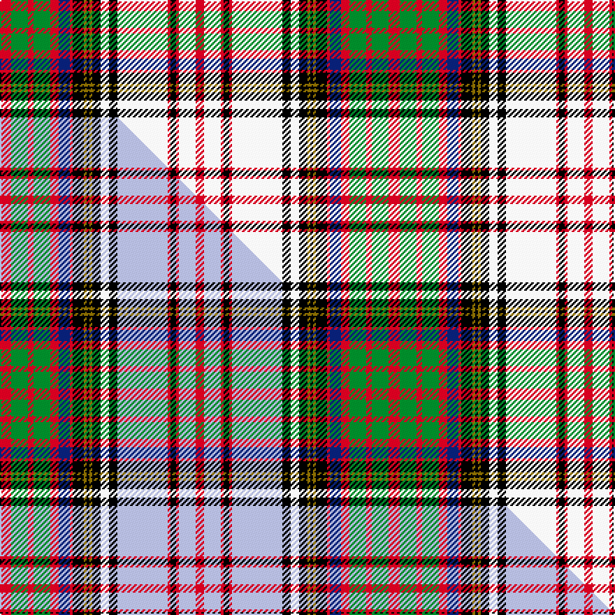

This is one **variant** — a specific cloth: this exact thread count and colourway, with its own
provenance below. It is one weaving of the [sett](/tartans/a/an/anderson-16/) (the scale-free proportion — the
same cloth at any scale or shade), whose colour order is pattern [RGRGRBRKGKGKWKWRKRWR](/stripes/rgrgrbrkgkgkwkwrkrwr/).

Part of the [Anderson](/tartans/a/an/anderson-16/) tartan — the named design grouping this sett with its other cloths.

Sourced from weddslist.  It is a [20 stripe tartan](/stripes/stripes20/).

Original link [http://www.weddslist.com/cgi-bin/tartans/pg.pl?source=rb](http://www.weddslist.com/cgi-bin/tartans/pg.pl?source=rb)

Dataset <small>— provenance for this record, inherited from the source manifest</small>

<dl class="dataset-prov">
<dt>source</dt><dd><a href="/sources/weddslist/">Weddslist</a></dd>
<dt>data captured from</dt><dd><a href="https://github.com/thetartan/tartan-database/blob/master/data/weddslist/data.csv">https://github.com/thetartan/tartan-database/blob/master/data/weddslist/data.csv</a></dd>
<dt>data date</dt><dd>2016-11-17 <small>(dataset default)</small></dd>
<dt>licence</dt><dd><a href="https://creativecommons.org/licenses/by-nc-nd/4.0/">CC BY-NC-ND 4.0</a></dd>
</dl>

Capture chain <small>— the hands this data passed through, oldest first; each capture carries its own licence</small>

<ol class="capture-chain">
<li><a href="https://www.weddslist.com/tartans/">Weddslist</a> <small>the living privately compiled reference</small></li>
<li><a href="https://github.com/thetartan/tartan-database">thetartan/tartan-database</a> <small>2016-2017</small> · <a href="https://creativecommons.org/licenses/by-nc-nd/4.0/">CC BY-NC-ND 4.0</a> <small>Levko Kravets's frozen compilation — the capture we vendored, and where its CC licence text came from</small></li>
<li>this dictionary <small>captured 2026-06-10 · commit 5bf86c7566</small> <small>each re-capture is a git commit to data/sources</small></li>
</ol>

## Thread count
R/8 G12 R4 G12 R6 DB8 R2 K8 Y2 K2 Y2 K6 W6 K6 W36 R2 K4 R2 W12 R/6

One full sett is **278 threads**.

## Palette
<table><thead><tr><th>Colour</th><th>Shade</th><th>OKLCh</th></tr></thead><tbody><tr><td>DB</td><td><code style="background-color:#082077;">#082077</code> <small style="color:#888">#082077</small></td><td><small style="color:#888">oklch(30.0% 0.149 265.1)</small></td></tr><tr><td>G</td><td><code style="background-color:#008B2A;">#008B2A</code> <small style="color:#888">#008B2A</small></td><td><small style="color:#888">oklch(55.4% 0.170 145.9)</small></td></tr><tr><td>K</td><td><code style="background-color:#000000;">#000000</code> <small style="color:#888">#000000</small></td><td><small style="color:#888">oklch(0.0% 0.000 0.0)</small></td></tr><tr><td>W</td><td><code style="background-color:#F7F7F7;">#F7F7F7</code> <small style="color:#888">#F7F7F7</small></td><td><small style="color:#888">oklch(97.6% 0.000 89.9)</small></td></tr><tr><td>R</td><td><code style="background-color:#D60020;">#D60020</code> <small style="color:#888">#D60020</small></td><td><small style="color:#888">oklch(55.2% 0.224 25.5)</small></td></tr><tr><td>Y</td><td><code style="background-color:#8B6E00;">#8B6E00</code> <small style="color:#888">#8B6E00</small></td><td><small style="color:#888">oklch(55.1% 0.113 90.4)</small></td></tr></tbody></table>

# Sample pattern

## Compared to the master

This cloth is one sett of its design; the master sett (the exemplar the design is anchored on) is below for comparison.

Its **ΔTartan distance** from the master is **2.40** — the same measure the nearest-tartans table ranks by (0 is identical; a re-scale of the same cloth is near 0, a recolour or a different proportion further).

<figure class="master-compare" style="margin:0">

this sett
master sett ★

<figcaption style="color:#888;font-size:smaller">One weave of this sett against the <a href="/setts/r4g6r2g6r3db4r1k4y1k1y1k3w3k3lb18r1k2r1lb6r3/">master sett ★</a>, split on the diagonal: a shared proportion runs seamlessly across it with only the shades shifting; a different proportion breaks on it.</figcaption>
</figure>

## Nearest tartan variants

The nearest existing variants by ΔTartan distance, with this cloth at the top so the swatches line up against it.

ΔTartan

Threads

Variant

Sett

—

278

<a href="/variants/s20/r4g6r2g6r3db4r1k4y1k1y1k3w3k3w18r1k2r1w6r3~x2/">Anderson</a>

<a href="/ttd/edit/#slug=r3g6k1r2k1g6db5r1k3y1k1y1k3w3k3w18k1r2k1w6r3&amp;base=r4g6r2g6r3db4r1k4y1k1y1k3w3k3w18r1k2r1w6r3~x2" title="compare in the TTD">1.00</a>

136

<a href="/variants/s21/r3g6k1r2k1g6db5r1k3y1k1y1k3w3k3w18k1r2k1w6r3/">Anderson P</a>

<a href="/ttd/edit/#slug=r4g1w19db4w4db1k5y3k2db1w4g15r6g3r5g1w3~x2&amp;base=r4g6r2g6r3db4r1k4y1k1y1k3w3k3w18r1k2r1w6r3~x2" title="compare in the TTD">1.35</a>

310

<a href="/variants/s17/r4g1w19db4w4db1k5y3k2db1w4g15r6g3r5g1w3~x2/">Victoria</a>

<a href="/ttd/edit/#slug=k3r1g2r2w20db3w3r7k2r2k2r2k7g2k2g2k2g8y3~x2&amp;base=r4g6r2g6r3db4r1k4y1k1y1k3w3k3w18r1k2r1w6r3~x2" title="compare in the TTD">1.57</a>

288

<a href="/variants/s19/k3r1g2r2w20db3w3r7k2r2k2r2k7g2k2g2k2g8y3~x2/">Princess Beatrice, dress</a>

<a href="/ttd/edit/#slug=k1o4w13o1k5dp4w1dp4k5w1k3r5n3w1n3r5k13r1w20n3r1~x2&amp;base=r4g6r2g6r3db4r1k4y1k1y1k3w3k3w18r1k2r1w6r3~x2" title="compare in the TTD">1.64</a>

384

<a href="/variants/s21/k1o4w13o1k5dp4w1dp4k5w1k3r5n3w1n3r5k13r1w20n3r1~x2/">Aberdeen (Johnston and Smith)</a>

<a href="/ttd/edit/#slug=k4r1k1r2w24db2w3r8g2r2g2r2k8g2k2g2k2g8y2~x2&amp;base=r4g6r2g6r3db4r1k4y1k1y1k3w3k3w18r1k2r1w6r3~x2" title="compare in the TTD">1.76</a>

304

<a href="/variants/s19/k4r1k1r2w24db2w3r8g2r2g2r2k8g2k2g2k2g8y2~x2/">Princess Beatrice Dress Royal Family Tartan</a>

<a href="/ttd/edit/#slug=k3r1k2r2w20db3w3r8k2r2k2r2k8g2k2g2k2g8dy2~x2&amp;base=r4g6r2g6r3db4r1k4y1k1y1k3w3k3w18r1k2r1w6r3~x2" title="compare in the TTD">1.86</a>

294

<a href="/variants/s19/k3r1k2r2w20db3w3r8k2r2k2r2k8g2k2g2k2g8dy2~x2/">Princess Beatrice Dress (1880)</a>

<a href="/ttd/edit/#slug=k1dp4w13dp1k5b4w1b4k5w1k3r5n3w1n3r5k13r1w20n3r1~x2&amp;base=r4g6r2g6r3db4r1k4y1k1y1k3w3k3w18r1k2r1w6r3~x2" title="compare in the TTD">1.89</a>

384

<a href="/variants/s21/k1dp4w13dp1k5b4w1b4k5w1k3r5n3w1n3r5k13r1w20n3r1~x2/">Aberdeen Dress (Dance)</a>

<a href="/ttd/edit/#slug=dy5k3g2r20db10w2g1dy1w20k4dy3~x2~db1406275&amp;base=r4g6r2g6r3db4r1k4y1k1y1k3w3k3w18r1k2r1w6r3~x2" title="compare in the TTD">2.03</a>

268

<a href="/variants/s11/dy5k3g2r20db10w2g1dy1w20k4dy3~x2~db1406275/">MacCulloch Dress Clan/Family Tartan</a>

<a href="/ttd/edit/#slug=r8lb16k2r4k2lb51k8w8k6y4k4y4k12r4k12r4g16k2r4k2r16g8&amp;base=r4g6r2g6r3db4r1k4y1k1y1k3w3k3w18r1k2r1w6r3~x2" title="compare in the TTD">2.10</a>

378

<a href="/variants/s22/r8lb16k2r4k2lb51k8w8k6y4k4y4k12r4k12r4g16k2r4k2r16g8/">Anderson (MacGregor-Hastie #1)</a>

<a href="/ttd/edit/#slug=w23db5w5k7y3k3w2k3g16r8g3r6w3r6g3r8g16k3w2k3y3k7w5db5w23r5~x2&amp;base=r4g6r2g6r3db4r1k4y1k1y1k3w3k3w18r1k2r1w6r3~x2" title="compare in the TTD">2.16</a>

648

<a href="/variants/s26/w23db5w5k7y3k3w2k3g16r8g3r6w3r6g3r8g16k3w2k3y3k7w5db5w23r5~x2/">Victoria Highland Dress Artifact Tartan</a>

## Neighbour map

Every grey dot is one of 13656 variants placed by the first two principal components of the ΔTartan feature space (42% of its variance). Red is this tartan; blue dots are its nearest — click one to open its page. The map is a flat projection of a many-dimensional space — [how to read it](/posts/neighbourhood-maps/).

<svg viewBox="0 0 640 380" role="img" style="max-width:100%;height:auto;border:1px solid #e0e0e0;border-radius:4px;display:block" xmlns="http://www.w3.org/2000/svg"><image href="/nn/cloud.v1.png" width="640" height="380"/><a href="/variants/s21/r3g6k1r2k1g6db5r1k3y1k1y1k3w3k3w18k1r2k1w6r3/"><circle cx="88.7" cy="67.8" r="4" fill="#3465a4"><title>Anderson P</title></circle></a><a href="/variants/s17/r4g1w19db4w4db1k5y3k2db1w4g15r6g3r5g1w3~x2/"><circle cx="100.4" cy="86.8" r="4" fill="#3465a4"><title>Victoria</title></circle></a><a href="/variants/s19/k3r1g2r2w20db3w3r7k2r2k2r2k7g2k2g2k2g8y3~x2/"><circle cx="66.2" cy="69.8" r="4" fill="#3465a4"><title>Princess Beatrice, dress</title></circle></a><a href="/variants/s21/k1o4w13o1k5dp4w1dp4k5w1k3r5n3w1n3r5k13r1w20n3r1~x2/"><circle cx="91.4" cy="65.5" r="4" fill="#3465a4"><title>Aberdeen (Johnston and Smith)</title></circle></a><a href="/variants/s19/k4r1k1r2w24db2w3r8g2r2g2r2k8g2k2g2k2g8y2~x2/"><circle cx="96.6" cy="52.3" r="4" fill="#3465a4"><title>Princess Beatrice Dress Royal Family Tartan</title></circle></a><a href="/variants/s19/k3r1k2r2w20db3w3r8k2r2k2r2k8g2k2g2k2g8dy2~x2/"><circle cx="68.3" cy="67.9" r="4" fill="#3465a4"><title>Princess Beatrice Dress (1880)</title></circle></a><a href="/variants/s21/k1dp4w13dp1k5b4w1b4k5w1k3r5n3w1n3r5k13r1w20n3r1~x2/"><circle cx="90.8" cy="66.4" r="4" fill="#3465a4"><title>Aberdeen Dress (Dance)</title></circle></a><a href="/variants/s11/dy5k3g2r20db10w2g1dy1w20k4dy3~x2~db1406275/"><circle cx="88.4" cy="69.0" r="4" fill="#3465a4"><title>MacCulloch Dress Clan/Family Tartan</title></circle></a><a href="/variants/s22/r8lb16k2r4k2lb51k8w8k6y4k4y4k12r4k12r4g16k2r4k2r16g8/"><circle cx="95.9" cy="50.3" r="4" fill="#3465a4"><title>Anderson (MacGregor-Hastie #1)</title></circle></a><a href="/variants/s26/w23db5w5k7y3k3w2k3g16r8g3r6w3r6g3r8g16k3w2k3y3k7w5db5w23r5~x2/"><circle cx="55.0" cy="97.2" r="4" fill="#3465a4"><title>Victoria Highland Dress Artifact Tartan</title></circle></a><circle cx="86.1" cy="76.1" r="5" fill="#c00000"/><text x="320" y="376" text-anchor="middle" font-size="11" fill="#999">ground</text><text x="11" y="190" text-anchor="middle" font-size="11" fill="#999" transform="rotate(-90 11 190)">complexity</text></svg>

ID: /variants/s20/r4g6r2g6r3db4r1k4y1k1y1k3w3k3w18r1k2r1w6r3~x2/
