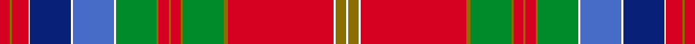
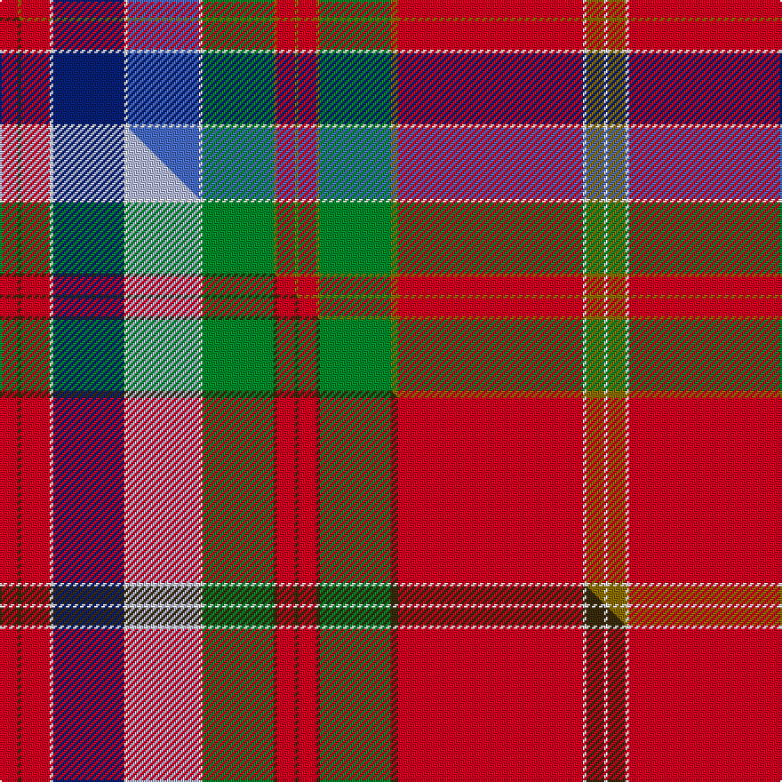

This page is one **sett** — a single exact thread-count. It belongs to the [tartan](/setts/r5y1r8w1db20w1b20w1g20y1r5y1r5y1g20y2r52w1y5w1/)
(the same proportion at any scale), whose colour order is pattern [RGRWBWBWGGRGRGGGRWGW](/stripes/rgrwbwbwggrgrgggrwgw/).

Part of the [Whitworth](/tartans/whitworth/) tartan — the named design grouping this sett with its other cloths.

Sourced from weddslist.  It is a [20 stripe tartan](/stripes/stripes20/).

Original link http://www.weddslist.com/cgi-bin/tartans/pg.pl?source=sts

## Thread count
R/10 Y2 R16 W2 DB40 W2 B40 W2 G40 Y2 R10 Y2 R10 Y2 G40 Y4 R104 W2 Y10 W/2

One full sett is **672 threads**.

## Palette
<table><thead><tr><th>Colour</th><th>Shade</th><th>OKLCh</th></tr></thead><tbody><tr><td>B</td><td><code style="background-color:#466CC8;">#466CC8</code> <small style="color:#888">#466CC8</small></td><td><small style="color:#888">oklch(55.1% 0.149 265.0)</small></td></tr><tr><td>DB</td><td><code style="background-color:#082077;">#082077</code> <small style="color:#888">#082077</small></td><td><small style="color:#888">oklch(30.0% 0.149 265.1)</small></td></tr><tr><td>G</td><td><code style="background-color:#008B2A;">#008B2A</code> <small style="color:#888">#008B2A</small></td><td><small style="color:#888">oklch(55.4% 0.170 145.9)</small></td></tr><tr><td>W</td><td><code style="background-color:#F7F7F7;">#F7F7F7</code> <small style="color:#888">#F7F7F7</small></td><td><small style="color:#888">oklch(97.6% 0.000 89.9)</small></td></tr><tr><td>R</td><td><code style="background-color:#D60020;">#D60020</code> <small style="color:#888">#D60020</small></td><td><small style="color:#888">oklch(55.2% 0.224 25.5)</small></td></tr><tr><td>Y</td><td><code style="background-color:#8B6E00;">#8B6E00</code> <small style="color:#888">#8B6E00</small></td><td><small style="color:#888">oklch(55.1% 0.113 90.4)</small></td></tr></tbody></table>

# Sample pattern

## Compared to the master

This cloth is one sett of its design; the master sett (the exemplar the design is anchored on) is below for comparison.

Its **ΔTartan distance** from the master is **0.43** — the same measure the nearest-tartans table ranks by (0 is identical; a re-scale of the same cloth is near 0, a recolour or a different proportion further).

<figure class="master-compare" style="margin:0">

this sett
master sett ★

<figcaption style="color:#888;font-size:smaller">One weave of this sett against the <a href="/setts/r5dy1r8w1db20w1lb20w1g20dy1r5dy1r5dy1g20dy2r52w1dy5w1/">master sett ★</a>, split on the diagonal: a shared proportion runs seamlessly across it with only the shades shifting; a different proportion breaks on it.</figcaption>
</figure>

## Nearest variants

The nearest existing variants by ΔTartan distance, with this cloth at the top so the swatches line up against it.

ΔTartan

Threads

Variant

Sett

—

672

<a href="/variants/s20/r5y1r8w1db20w1b20w1g20y1r5y1r5y1g20y2r52w1y5w1~x2/">Whitworth</a>

<a href="/ttd/edit/#slug=r5y1r8w1db20w1lb20w1g20y1r5y1r5y1g20y2r52w1y5w1~x2&amp;base=r5y1r8w1db20w1b20w1g20y1r5y1r5y1g20y2r52w1y5w1~x2" title="compare in the TTD">0.00</a>

672

<a href="/variants/s20/r5y1r8w1db20w1lb20w1g20y1r5y1r5y1g20y2r52w1y5w1~x2/">Whitworth Artifact Tartan</a>

## Neighbour map

Every grey dot is one of 13620 variants placed by the first two principal components of the ΔTartan feature space (42% of its variance). Red is this tartan; blue dots are its nearest — click one to open its page.

<svg viewBox="0 0 640 380" role="img" style="max-width:100%;height:auto;border:1px solid #e0e0e0;border-radius:4px;display:block" xmlns="http://www.w3.org/2000/svg"><image href="/nn/cloud.v1.png" width="640" height="380"/><a href="/variants/s20/r5y1r8w1db20w1lb20w1g20y1r5y1r5y1g20y2r52w1y5w1~x2/"><circle cx="247.5" cy="39.8" r="4" fill="#3465a4"><title>Whitworth Artifact Tartan</title></circle></a><circle cx="254.1" cy="42.2" r="5" fill="#c00000"/><text x="320" y="376" text-anchor="middle" font-size="11" fill="#999">ground</text><text x="11" y="190" text-anchor="middle" font-size="11" fill="#999" transform="rotate(-90 11 190)">complexity</text></svg>

ID: /variants/s20/r5y1r8w1db20w1b20w1g20y1r5y1r5y1g20y2r52w1y5w1~x2/
