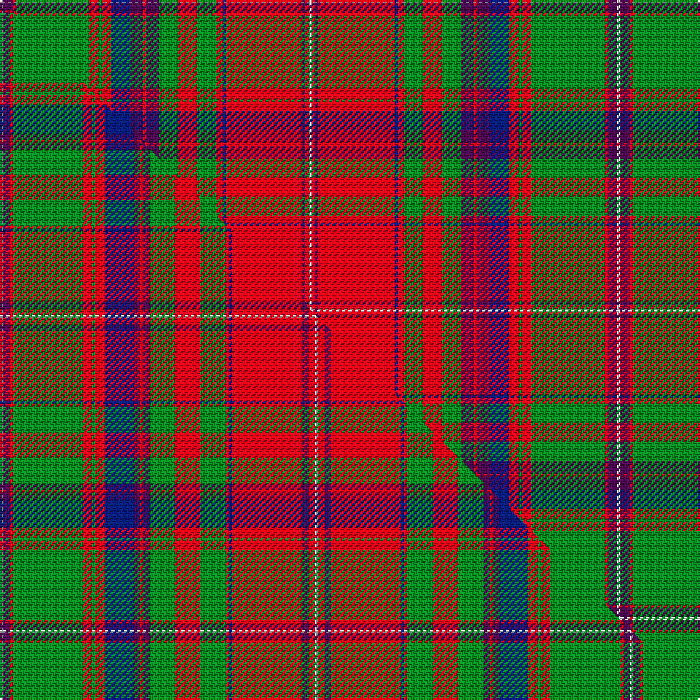

This is one **variant** — a specific cloth: this exact thread count and colourway, with its own
provenance below. It is one weaving of the [sett](/setts/w1dp3r1g23r3g1r3db6dp4r1dp4g6r6g6r2db1r24dp1r1w1/) (the scale-free proportion — the
same cloth at any scale or shade), whose colour order is pattern [WBRGRGRBBRBGRGRBRBRW](/stripes/wbrgrgrbbrbgrgrbrbrw/).

Part of the [MacDougall](/tartans/m/ma/macdougall-9/) tartan — the named design grouping this sett with its other cloths.

Sourced from weddslist.  It is a [20 stripe tartan](/stripes/stripes20/).

Original link [http://www.weddslist.com/cgi-bin/tartans/pg.pl?source=rb](http://www.weddslist.com/cgi-bin/tartans/pg.pl?source=rb)

Dataset <small>— provenance for this record, inherited from the source manifest</small>

<dl class="dataset-prov">
<dt>source</dt><dd><a href="/sources/weddslist/">Weddslist</a></dd>
<dt>data captured from</dt><dd><a href="https://github.com/thetartan/tartan-database/blob/master/data/weddslist/data.csv">https://github.com/thetartan/tartan-database/blob/master/data/weddslist/data.csv</a></dd>
<dt>data date</dt><dd>2016-11-17 <small>(dataset default)</small></dd>
<dt>licence</dt><dd><a href="https://creativecommons.org/licenses/by-nc-nd/4.0/">CC BY-NC-ND 4.0</a></dd>
</dl>

Capture chain <small>— the hands this data passed through, oldest first; each capture carries its own licence</small>

<ol class="capture-chain">
<li><a href="https://www.weddslist.com/tartans/">Weddslist</a> <small>the living privately compiled reference</small></li>
<li><a href="https://github.com/thetartan/tartan-database">thetartan/tartan-database</a> <small>2016-2017</small> · <a href="https://creativecommons.org/licenses/by-nc-nd/4.0/">CC BY-NC-ND 4.0</a> <small>Levko Kravets's frozen compilation — the capture we vendored, and where its CC licence text came from</small></li>
<li>this dictionary <small>captured 2026-06-10 · commit 5bf86c7566</small> <small>each re-capture is a git commit to data/sources</small></li>
</ol>

## Thread count
W/2 DP6 R2 G46 R6 G2 R6 DB12 DP8 R2 DP8 G12 R12 G12 R4 DB2 R48 DP2 R2 W/2

One full sett is **388 threads**.

## Palette
<table><thead><tr><th>Colour</th><th>Shade</th><th>OKLCh</th></tr></thead><tbody><tr><td>DB</td><td><code style="background-color:#082077;">#082077</code> <small style="color:#888">#082077</small></td><td><small style="color:#888">oklch(30.0% 0.149 265.1)</small></td></tr><tr><td>G</td><td><code style="background-color:#008B2A;">#008B2A</code> <small style="color:#888">#008B2A</small></td><td><small style="color:#888">oklch(55.4% 0.170 145.9)</small></td></tr><tr><td>W</td><td><code style="background-color:#F7F7F7;">#F7F7F7</code> <small style="color:#888">#F7F7F7</small></td><td><small style="color:#888">oklch(97.6% 0.000 89.9)</small></td></tr><tr><td>R</td><td><code style="background-color:#D60020;">#D60020</code> <small style="color:#888">#D60020</small></td><td><small style="color:#888">oklch(55.2% 0.224 25.5)</small></td></tr><tr><td>DP</td><td><code style="background-color:#4B0B4F;">#4B0B4F</code> <small style="color:#888">#4B0B4F</small></td><td><small style="color:#888">oklch(30.1% 0.125 325.4)</small></td></tr></tbody></table>

# Sample pattern

## Compared to the master

This cloth is one sett of its design; the master sett (the exemplar the design is anchored on) is below for comparison.

Its **ΔTartan distance** from the master is **0.28** — the same measure the nearest-tartans table ranks by (0 is identical; a re-scale of the same cloth is near 0, a recolour or a different proportion further).

<figure class="master-compare" style="margin:0">

this sett
master sett ★

<figcaption style="color:#888;font-size:smaller">One weave of this sett against the <a href="/setts/w1dp2r1g22r3g1r3db9dp2r1dp2g8r8g8r1db1r22dp2r2w1/">master sett ★</a>, split on the diagonal: a shared proportion runs seamlessly across it with only the shades shifting; a different proportion breaks on it.</figcaption>
</figure>

## Nearest tartan variants

The nearest existing variants by ΔTartan distance, with this cloth at the top so the swatches line up against it.

ΔTartan

Threads

Variant

Sett

—

388

<a href="/variants/s20/w1dp3r1g23r3g1r3db6dp4r1dp4g6r6g6r2db1r24dp1r1w1~x2/">MacDougall</a>

<a href="/ttd/edit/#slug=w1dp2r1g22r3g1r3db9dp2r1dp2g8r8g8r1db1r22dp2r2w1~x2&amp;base=w1dp3r1g23r3g1r3db6dp4r1dp4g6r6g6r2db1r24dp1r1w1~x2" title="compare in the TTD">0.28</a>

396

<a href="/variants/s20/w1dp2r1g22r3g1r3db9dp2r1dp2g8r8g8r1db1r22dp2r2w1~x2/">MacDougall (Paton)</a>

<a href="/ttd/edit/#slug=w2r2lp2r22db2r2g8r8g8lp2r2lp2db9r3g1r3g22r2lp2w2~x2&amp;base=w1dp3r1g23r3g1r3db6dp4r1dp4g6r6g6r2db1r24dp1r1w1~x2" title="compare in the TTD">0.35</a>

416

<a href="/variants/s20/w2r2lp2r22db2r2g8r8g8lp2r2lp2db9r3g1r3g22r2lp2w2~x2/">MacDougall Clan Tartan</a>

<a href="/ttd/edit/#slug=g14r6ri2db3r65db2lb2r6db34r6lb2db2r4g66r12ri2db2lb4~r2109032-ri2406019&amp;base=w1dp3r1g23r3g1r3db6dp4r1dp4g6r6g6r2db1r24dp1r1w1~x2" title="compare in the TTD">1.63</a>

450

<a href="/variants/s18/g14r6ri2db3r65db2lb2r6db34r6lb2db2r4g66r12ri2db2lb4~r2109032-ri2406019/">Stewart of Ardshiel Clan Tartan</a>

<a href="/ttd/edit/#slug=ri6r3ri6db22ri7r2w1ri2db2ri2w1r2ri7g22ri7g2ri2r2~x2~ri2109032-r1807008&amp;base=w1dp3r1g23r3g1r3db6dp4r1dp4g6r6g6r2db1r24dp1r1w1~x2" title="compare in the TTD">1.96</a>

376

<a href="/variants/s18/ri6r3ri6db22ri7r2w1ri2db2ri2w1r2ri7g22ri7g2ri2r2~x2~ri2109032-r1807008/">MacColl Hunting</a>

<a href="/ttd/edit/#slug=r12dp2r4dp4r39lb2r4dp11r6g4r6g45r4dp4db10&amp;base=w1dp3r1g23r3g1r3db6dp4r1dp4g6r6g6r2db1r24dp1r1w1~x2" title="compare in the TTD">1.99</a>

292

<a href="/variants/s15/r12dp2r4dp4r39lb2r4dp11r6g4r6g45r4dp4db10/">Grant or New Bruce Clan Tartan</a>

<a href="/ttd/edit/#slug=g10r2db2r30dp3r2w1r2dp3r30db2r2g10r10g10dp4r2dp4db10r4g2r4g30r2dp3w1~x2&amp;base=w1dp3r1g23r3g1r3db6dp4r1dp4g6r6g6r2db1r24dp1r1w1~x2" title="compare in the TTD">2.05</a>

718

<a href="/variants/s26/g10r2db2r30dp3r2w1r2dp3r30db2r2g10r10g10dp4r2dp4db10r4g2r4g30r2dp3w1~x2/">MacDougal</a>

<a href="/ttd/edit/#slug=ri7r3ri6db26ri8b2ri2db2ri2g1r2ri8g26ri8g2ri2r2~x2~ri2008029-r1707016&amp;base=w1dp3r1g23r3g1r3db6dp4r1dp4g6r6g6r2db1r24dp1r1w1~x2" title="compare in the TTD">2.11</a>

418

<a href="/variants/s17/ri7r3ri6db26ri8b2ri2db2ri2g1r2ri8g26ri8g2ri2r2~x2~ri2008029-r1707016/">MacColl, Ancient</a>

<a href="/ttd/edit/#slug=lb2dp10b3r4g72r7g4r10db24dp6b5r4b5dp7g24r24g24r3db3r74dp7b5r6lb2~x2&amp;base=w1dp3r1g23r3g1r3db6dp4r1dp4g6r6g6r2db1r24dp1r1w1~x2" title="compare in the TTD">2.29</a>

1332

<a href="/variants/s24/lb2dp10b3r4g72r7g4r10db24dp6b5r4b5dp7g24r24g24r3db3r74dp7b5r6lb2~x2/">MacDougall, of MacDougall</a>

<a href="/ttd/edit/#slug=dp1r1dp1r6g26dp14r20lb1r1lb1r2lr1~x2~r2109032-lr3303019&amp;base=w1dp3r1g23r3g1r3db6dp4r1dp4g6r6g6r2db1r24dp1r1w1~x2" title="compare in the TTD">2.35</a>

296

<a href="/variants/s12/dp1r1dp1r6g26dp14r20lb1r1lb1r2lr1~x2~r2109032-lr3303019/">Scobie (Name)</a>

<a href="/ttd/edit/#slug=r5g10r2db2r30dp3r2w1r2dp3r30db2r2g10r10g10dp4r2dp4db10r4g2r4g30r2dp3w1~x2&amp;base=w1dp3r1g23r3g1r3db6dp4r1dp4g6r6g6r2db1r24dp1r1w1~x2" title="compare in the TTD">2.39</a>

748

<a href="/variants/s27/r5g10r2db2r30dp3r2w1r2dp3r30db2r2g10r10g10dp4r2dp4db10r4g2r4g30r2dp3w1~x2/">MacDougall Clan Tartan</a>

## Neighbour map

Every grey dot is one of 13656 variants placed by the first two principal components of the ΔTartan feature space (42% of its variance). Red is this tartan; blue dots are its nearest — click one to open its page. The map is a flat projection of a many-dimensional space — [how to read it](/posts/neighbourhood-maps/).

<svg viewBox="0 0 640 380" role="img" style="max-width:100%;height:auto;border:1px solid #e0e0e0;border-radius:4px;display:block" xmlns="http://www.w3.org/2000/svg"><image href="/nn/cloud.v1.png" width="640" height="380"/><a href="/variants/s20/w1dp2r1g22r3g1r3db9dp2r1dp2g8r8g8r1db1r22dp2r2w1~x2/"><circle cx="242.3" cy="95.1" r="4" fill="#3465a4"><title>MacDougall (Paton)</title></circle></a><a href="/variants/s20/w2r2lp2r22db2r2g8r8g8lp2r2lp2db9r3g1r3g22r2lp2w2~x2/"><circle cx="229.9" cy="99.7" r="4" fill="#3465a4"><title>MacDougall Clan Tartan</title></circle></a><a href="/variants/s18/g14r6ri2db3r65db2lb2r6db34r6lb2db2r4g66r12ri2db2lb4~r2109032-ri2406019/"><circle cx="271.4" cy="69.2" r="4" fill="#3465a4"><title>Stewart of Ardshiel Clan Tartan</title></circle></a><a href="/variants/s18/ri6r3ri6db22ri7r2w1ri2db2ri2w1r2ri7g22ri7g2ri2r2~x2~ri2109032-r1807008/"><circle cx="218.8" cy="102.8" r="4" fill="#3465a4"><title>MacColl Hunting</title></circle></a><a href="/variants/s15/r12dp2r4dp4r39lb2r4dp11r6g4r6g45r4dp4db10/"><circle cx="282.4" cy="105.2" r="4" fill="#3465a4"><title>Grant or New Bruce Clan Tartan</title></circle></a><a href="/variants/s26/g10r2db2r30dp3r2w1r2dp3r30db2r2g10r10g10dp4r2dp4db10r4g2r4g30r2dp3w1~x2/"><circle cx="284.1" cy="72.1" r="4" fill="#3465a4"><title>MacDougal</title></circle></a><a href="/variants/s17/ri7r3ri6db26ri8b2ri2db2ri2g1r2ri8g26ri8g2ri2r2~x2~ri2008029-r1707016/"><circle cx="236.5" cy="100.4" r="4" fill="#3465a4"><title>MacColl, Ancient</title></circle></a><a href="/variants/s24/lb2dp10b3r4g72r7g4r10db24dp6b5r4b5dp7g24r24g24r3db3r74dp7b5r6lb2~x2/"><circle cx="235.2" cy="51.8" r="4" fill="#3465a4"><title>MacDougall, of MacDougall</title></circle></a><a href="/variants/s12/dp1r1dp1r6g26dp14r20lb1r1lb1r2lr1~x2~r2109032-lr3303019/"><circle cx="269.3" cy="106.4" r="4" fill="#3465a4"><title>Scobie (Name)</title></circle></a><a href="/variants/s27/r5g10r2db2r30dp3r2w1r2dp3r30db2r2g10r10g10dp4r2dp4db10r4g2r4g30r2dp3w1~x2/"><circle cx="290.3" cy="70.7" r="4" fill="#3465a4"><title>MacDougall Clan Tartan</title></circle></a><circle cx="249.8" cy="87.2" r="5" fill="#c00000"/><text x="320" y="376" text-anchor="middle" font-size="11" fill="#999">ground</text><text x="11" y="190" text-anchor="middle" font-size="11" fill="#999" transform="rotate(-90 11 190)">complexity</text></svg>

ID: /variants/s20/w1dp3r1g23r3g1r3db6dp4r1dp4g6r6g6r2db1r24dp1r1w1~x2/
