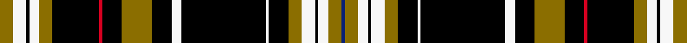

This page is one **sett** — a single exact thread-count. It belongs to the [tartan](/setts/y8w8k2w6y8k28r2k12y18k12w6k51w2k12y8w8k2w6y8db2/)
(the same proportion at any scale), whose colour order is pattern [BGWKWGKWKWKGKRKGWKWG](/stripes/bgwkwgkwkwkgkrkgwkwg/).

Sourced from tartans-authority.  It is a [20 stripe tartan](/stripes/stripes20/).

Original link http://www.tartansauthority.com/tartan-ferret/display/10104/

2 attestations — the source records this cloth was collapsed from (oldest owns this page)

<ul>
<li>August 2008 — Mizzou (Corporate) (tartans-authority, <a href="http://www.tartansauthority.com/tartan-ferret/display/10104/">record</a>)  <em>Asymmetric. From the Missouri University (Mizzou) website: "For senior textile and apparel management major Lauren Drufke-Mahe, a love of fashion and an eye for design helped her create the official MU Tiger Tartan. Tartans are plaid designs historically worn by Scottish clans as a way to form a sense of collective identity and unity. More than 6,000 people voted online and chose Drufke-Mahe's tartan design to represent Mizzou." Marketed through Thistle and Clover of St. Charles, Missouri. www.thistleandclover.com.</em></li>
<li>20/06/2009 — Mizzou Plaid (register-of-tartans, <a href="https://www.tartanregister.gov.uk/tartanDetails.aspx?ref=10104">record</a>)  <em>This tartan emerged as a result of a semester project and contest of the Textile and Apparel Management Department at the University of Missouri. Approximately 100 students, enrolled in various classes, participated in the creation. Black and gold are the official colours of the University of Missouri, crimson red and blue are used to incorporate the University's historical colours.</em></li>
</ul>

## Register references

External register numbers recorded for this tartan.

- Scottish Register of Tartans: [10104](https://www.tartanregister.gov.uk/tartanDetails.aspx?ref=10104)
- Scottish Tartans Authority (ITI): 10104

## Thread count
Y/8 W8 K2 W6 Y8 K28 R2 K12 Y18 K12 W6 K51 W2 K12 Y8 W8 K2 W6 Y8 DB/2

One full sett is **408 threads**.

## Palette
<table><thead><tr><th>Colour</th><th>Shade</th><th>OKLCh</th></tr></thead><tbody><tr><td>DB</td><td><code style="background-color:#082077;">#082077</code> <small style="color:#888">#082077</small></td><td><small style="color:#888">oklch(30.0% 0.149 265.1)</small></td></tr><tr><td>K</td><td><code style="background-color:#000000;">#000000</code> <small style="color:#888">#000000</small></td><td><small style="color:#888">oklch(0.0% 0.000 0.0)</small></td></tr><tr><td>W</td><td><code style="background-color:#F7F7F7;">#F7F7F7</code> <small style="color:#888">#F7F7F7</small></td><td><small style="color:#888">oklch(97.6% 0.000 89.9)</small></td></tr><tr><td>R</td><td><code style="background-color:#D60020;">#D60020</code> <small style="color:#888">#D60020</small></td><td><small style="color:#888">oklch(55.2% 0.224 25.5)</small></td></tr><tr><td>Y</td><td><code style="background-color:#8B6E00;">#8B6E00</code> <small style="color:#888">#8B6E00</small></td><td><small style="color:#888">oklch(55.1% 0.113 90.4)</small></td></tr></tbody></table>

# Sample pattern

## Nearest variants

The nearest existing variants by ΔTartan distance, with this cloth at the top so the swatches line up against it.

ΔTartan

Threads

Variant

Sett

—

408

<a href="/variants/s20/y8w8k2w6y8k28r2k12y18k12w6k51w2k12y8w8k2w6y8db2/">Mizzou (Corporate)</a>

<a href="/ttd/edit/#slug=y8w8k2w6y8k28r2k12y18k12w6k51w2k12y8w8k2w6y8db2~r2109032&amp;base=y8w8k2w6y8k28r2k12y18k12w6k51w2k12y8w8k2w6y8db2" title="compare in the TTD">0.00</a>

408

<a href="/variants/s20/y8w8k2w6y8k28r2k12y18k12w6k51w2k12y8w8k2w6y8db2~r2109032/">Mizzou American Corporate Tartan</a>

## Neighbour map

Every grey dot is one of 13620 variants placed by the first two principal components of the ΔTartan feature space (42% of its variance). Red is this tartan; blue dots are its nearest — click one to open its page.

<svg viewBox="0 0 640 380" role="img" style="max-width:100%;height:auto;border:1px solid #e0e0e0;border-radius:4px;display:block" xmlns="http://www.w3.org/2000/svg"><image href="/nn/cloud.v1.png" width="640" height="380"/><a href="/variants/s20/y8w8k2w6y8k28r2k12y18k12w6k51w2k12y8w8k2w6y8db2~r2109032/"><circle cx="230.2" cy="65.9" r="4" fill="#3465a4"><title>Mizzou American Corporate Tartan</title></circle></a><circle cx="230.2" cy="65.9" r="5" fill="#c00000"/><text x="320" y="376" text-anchor="middle" font-size="11" fill="#999">ground</text><text x="11" y="190" text-anchor="middle" font-size="11" fill="#999" transform="rotate(-90 11 190)">complexity</text></svg>

ID: /variants/s20/y8w8k2w6y8k28r2k12y18k12w6k51w2k12y8w8k2w6y8db2/
