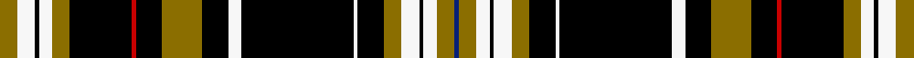

This page is one **sett** — a single exact thread-count. It belongs to the [tartan](/setts/y8w8k2w6y8k28r2k12y18k12w6k51w2k12y8w8k2w6y8db2/)
(the same proportion at any scale), whose colour order is pattern [BGWKWGKWKWKGKRKGWKWG](/stripes/bgwkwgkwkwkgkrkgwkwg/).

Sourced from house-of-tartan.  It is a [20 stripe tartan](/stripes/stripes20/).

Original link http://www.house-of-tartan.scotland.net/house/TartanViewjs.asp?colr=Def&tnam=10104

## Provenance

Earliest known date: August 2008 From the Missouri University (Mizzou) website: "For senior textile and apparel management major Lauren Drufke-Mahe, a love of fashion and an eye for design helped her create the official MU Tiger Tartan. Tartans are plaid designs historically worn by Scottish clans as a way to form a sense of collective identity and unity. More than 6,000 people voted online and chose Drufke-Mahe's tartan design to represent Mizzou."

## Thread count
Y/8 W8 K2 W6 Y8 K28 R2 K12 Y18 K12 W6 K51 W2 K12 Y8 W8 K2 W6 Y8 DB/2

One full sett is **408 threads**.

## Palette
<table><thead><tr><th>Colour</th><th>Shade</th><th>OKLCh</th></tr></thead><tbody><tr><td>DB</td><td><code style="background-color:#082077;">#082077</code> <small style="color:#888">#082077</small></td><td><small style="color:#888">oklch(30.0% 0.149 265.1)</small></td></tr><tr><td>K</td><td><code style="background-color:#000000;">#000000</code> <small style="color:#888">#000000</small></td><td><small style="color:#888">oklch(0.0% 0.000 0.0)</small></td></tr><tr><td>W</td><td><code style="background-color:#F7F7F7;">#F7F7F7</code> <small style="color:#888">#F7F7F7</small></td><td><small style="color:#888">oklch(97.6% 0.000 89.9)</small></td></tr><tr><td>R</td><td><code style="background-color:#E86000;">#E86000</code> <small style="color:#888">#E86000</small></td><td><small style="color:#888">oklch(65.3% 0.187 44.9)</small></td></tr><tr><td>LO</td><td><code style="background-color:#FF9C34;">#FF9C34</code> <small style="color:#888">#FF9C34</small></td><td><small style="color:#888">oklch(77.9% 0.161 61.8)</small></td></tr><tr><td>R</td><td><code style="background-color:#C80000;">#C80000</code> <small style="color:#888">#C80000</small></td><td><small style="color:#888">oklch(52.3% 0.215 29.2)</small></td></tr><tr><td>Y</td><td><code style="background-color:#8B6E00;">#8B6E00</code> <small style="color:#888">#8B6E00</small></td><td><small style="color:#888">oklch(55.1% 0.113 90.4)</small></td></tr></tbody></table>

# Sample pattern

## Nearest tartan variants

The nearest existing variants by ΔTartan distance, with this cloth at the top so the swatches line up against it.

ΔTartan

Threads

Variant

Sett

—

408

<a href="/variants/s20/y8w8k2w6y8k28r2k12y18k12w6k51w2k12y8w8k2w6y8db2~r2109032/">Mizzou American Corporate Tartan</a>

<a href="/ttd/edit/#slug=y8w8k2w6y8k28r2k12y18k12w6k51w2k12y8w8k2w6y8db2&amp;base=y8w8k2w6y8k28r2k12y18k12w6k51w2k12y8w8k2w6y8db2~r2109032" title="compare in the TTD">0.00</a>

408

<a href="/variants/s20/y8w8k2w6y8k28r2k12y18k12w6k51w2k12y8w8k2w6y8db2/">Mizzou (Corporate)</a>

## Neighbour map

Every grey dot is one of 13620 variants placed by the first two principal components of the ΔTartan feature space (42% of its variance). Red is this tartan; blue dots are its nearest — click one to open its page.

<svg viewBox="0 0 640 380" role="img" style="max-width:100%;height:auto;border:1px solid #e0e0e0;border-radius:4px;display:block" xmlns="http://www.w3.org/2000/svg"><image href="/nn/cloud.v1.png" width="640" height="380"/><a href="/variants/s20/y8w8k2w6y8k28r2k12y18k12w6k51w2k12y8w8k2w6y8db2/"><circle cx="230.2" cy="65.9" r="4" fill="#3465a4"><title>Mizzou (Corporate)</title></circle></a><circle cx="230.2" cy="65.9" r="5" fill="#c00000"/><text x="320" y="376" text-anchor="middle" font-size="11" fill="#999">ground</text><text x="11" y="190" text-anchor="middle" font-size="11" fill="#999" transform="rotate(-90 11 190)">complexity</text></svg>

ID: /variants/s20/y8w8k2w6y8k28r2k12y18k12w6k51w2k12y8w8k2w6y8db2~r2109032/
