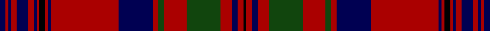

This page is one **sett** — a single exact thread-count. It belongs to the [tartan](/setts/db2r1db1r2db4r2db1r1k2r1db1r24db12r2dg2r8dg12r4db2r2k1/)
(the same proportion at any scale), whose colour order is pattern [BRBRBRBRKRBRBRGRGRBRK](/stripes/brbrbrbrkrbrbrgrgrbrk/).

Part of the [Murray of Tullibardine](/tartans/murray-of-tullibardine/) tartan — the named design grouping this sett with its other cloths.

Sourced from weddslist.  It is a [21 stripe tartan](/stripes/stripes21/).

Original link http://www.weddslist.com/cgi-bin/tartans/pg.pl?source=x

## Also known as

This cloth is also recorded under:

- Murray of Tullibardine #2
- Murray of Tullibardine #3
- Murray of Tullibardine #4
- Murray of Tullibardine 4

## Thread count
DB/2 DR1 DB1 DR2 DB4 DR2 DB1 DR1 K2 DR1 DB1 DR24 DB12 DR2 DG2 DR8 DG12 DR4 DB2 DR2 K/1

One full sett is **171 threads**.

## Palette

Palette: <strong>Ingles Buchan</strong> <small style="color:#888">(1 of 4 colours)</small>
<table><thead><tr><th>Colour</th><th>Threads</th><th>Shade</th><th>Base</th><th>OKLCh</th></tr></thead><tbody><tr><td>DB/</td><td style="text-align:right;font-variant-numeric:tabular-nums">2</td><td><code style="background-color:#000052;">#000052</code> <small style="color:#888">#000052</small></td><td>B <code style="background-color:#2A418A;">#2A418A</code></td><td><small style="color:#888">oklch(19.8% 0.137 264.1)</small></td></tr><tr><td>DR</td><td style="text-align:right;font-variant-numeric:tabular-nums">1</td><td><code style="background-color:#AA0000;">#AA0000</code> <small style="color:#888">#AA0000</small></td><td>R <code style="background-color:#CC0000;">#CC0000</code></td><td><small style="color:#888">oklch(46.3% 0.190 29.2)</small></td></tr><tr><td>DB</td><td style="text-align:right;font-variant-numeric:tabular-nums">1</td><td><code style="background-color:#000052;">#000052</code> <small style="color:#888">#000052</small></td><td>B <code style="background-color:#2A418A;">#2A418A</code></td><td><small style="color:#888">oklch(19.8% 0.137 264.1)</small></td></tr><tr><td>DR</td><td style="text-align:right;font-variant-numeric:tabular-nums">2</td><td><code style="background-color:#AA0000;">#AA0000</code> <small style="color:#888">#AA0000</small></td><td>R <code style="background-color:#CC0000;">#CC0000</code></td><td><small style="color:#888">oklch(46.3% 0.190 29.2)</small></td></tr><tr><td>DB</td><td style="text-align:right;font-variant-numeric:tabular-nums">4</td><td><code style="background-color:#000052;">#000052</code> <small style="color:#888">#000052</small></td><td>B <code style="background-color:#2A418A;">#2A418A</code></td><td><small style="color:#888">oklch(19.8% 0.137 264.1)</small></td></tr><tr><td>DR</td><td style="text-align:right;font-variant-numeric:tabular-nums">2</td><td><code style="background-color:#AA0000;">#AA0000</code> <small style="color:#888">#AA0000</small></td><td>R <code style="background-color:#CC0000;">#CC0000</code></td><td><small style="color:#888">oklch(46.3% 0.190 29.2)</small></td></tr><tr><td>DB</td><td style="text-align:right;font-variant-numeric:tabular-nums">1</td><td><code style="background-color:#000052;">#000052</code> <small style="color:#888">#000052</small></td><td>B <code style="background-color:#2A418A;">#2A418A</code></td><td><small style="color:#888">oklch(19.8% 0.137 264.1)</small></td></tr><tr><td>DR</td><td style="text-align:right;font-variant-numeric:tabular-nums">1</td><td><code style="background-color:#AA0000;">#AA0000</code> <small style="color:#888">#AA0000</small></td><td>R <code style="background-color:#CC0000;">#CC0000</code></td><td><small style="color:#888">oklch(46.3% 0.190 29.2)</small></td></tr><tr><td>K</td><td style="text-align:right;font-variant-numeric:tabular-nums">2</td><td><code style="background-color:#000000;">#000000</code> <small style="color:#888">#000000</small></td><td>K <code style="background-color:#000000;">#000000</code></td><td><small style="color:#888">oklch(0.0% 0.000 0.0)</small></td></tr><tr><td>DR</td><td style="text-align:right;font-variant-numeric:tabular-nums">1</td><td><code style="background-color:#AA0000;">#AA0000</code> <small style="color:#888">#AA0000</small></td><td>R <code style="background-color:#CC0000;">#CC0000</code></td><td><small style="color:#888">oklch(46.3% 0.190 29.2)</small></td></tr><tr><td>DB</td><td style="text-align:right;font-variant-numeric:tabular-nums">1</td><td><code style="background-color:#000052;">#000052</code> <small style="color:#888">#000052</small></td><td>B <code style="background-color:#2A418A;">#2A418A</code></td><td><small style="color:#888">oklch(19.8% 0.137 264.1)</small></td></tr><tr><td>DR</td><td style="text-align:right;font-variant-numeric:tabular-nums">24</td><td><code style="background-color:#AA0000;">#AA0000</code> <small style="color:#888">#AA0000</small></td><td>R <code style="background-color:#CC0000;">#CC0000</code></td><td><small style="color:#888">oklch(46.3% 0.190 29.2)</small></td></tr><tr><td>DB</td><td style="text-align:right;font-variant-numeric:tabular-nums">12</td><td><code style="background-color:#000052;">#000052</code> <small style="color:#888">#000052</small></td><td>B <code style="background-color:#2A418A;">#2A418A</code></td><td><small style="color:#888">oklch(19.8% 0.137 264.1)</small></td></tr><tr><td>DR</td><td style="text-align:right;font-variant-numeric:tabular-nums">2</td><td><code style="background-color:#AA0000;">#AA0000</code> <small style="color:#888">#AA0000</small></td><td>R <code style="background-color:#CC0000;">#CC0000</code></td><td><small style="color:#888">oklch(46.3% 0.190 29.2)</small></td></tr><tr><td>DG</td><td style="text-align:right;font-variant-numeric:tabular-nums">2</td><td><code style="background-color:#11450D;">#11450D</code> <small style="color:#888">#11450D</small></td><td>G <code style="background-color:#006100;">#006100</code></td><td><small style="color:#888">oklch(34.4% 0.101 142.1)</small></td></tr><tr><td>DR</td><td style="text-align:right;font-variant-numeric:tabular-nums">8</td><td><code style="background-color:#AA0000;">#AA0000</code> <small style="color:#888">#AA0000</small></td><td>R <code style="background-color:#CC0000;">#CC0000</code></td><td><small style="color:#888">oklch(46.3% 0.190 29.2)</small></td></tr><tr><td>DG</td><td style="text-align:right;font-variant-numeric:tabular-nums">12</td><td><code style="background-color:#11450D;">#11450D</code> <small style="color:#888">#11450D</small></td><td>G <code style="background-color:#006100;">#006100</code></td><td><small style="color:#888">oklch(34.4% 0.101 142.1)</small></td></tr><tr><td>DR</td><td style="text-align:right;font-variant-numeric:tabular-nums">4</td><td><code style="background-color:#AA0000;">#AA0000</code> <small style="color:#888">#AA0000</small></td><td>R <code style="background-color:#CC0000;">#CC0000</code></td><td><small style="color:#888">oklch(46.3% 0.190 29.2)</small></td></tr><tr><td>DB</td><td style="text-align:right;font-variant-numeric:tabular-nums">2</td><td><code style="background-color:#000052;">#000052</code> <small style="color:#888">#000052</small></td><td>B <code style="background-color:#2A418A;">#2A418A</code></td><td><small style="color:#888">oklch(19.8% 0.137 264.1)</small></td></tr><tr><td>DR</td><td style="text-align:right;font-variant-numeric:tabular-nums">2</td><td><code style="background-color:#AA0000;">#AA0000</code> <small style="color:#888">#AA0000</small></td><td>R <code style="background-color:#CC0000;">#CC0000</code></td><td><small style="color:#888">oklch(46.3% 0.190 29.2)</small></td></tr><tr><td>K/</td><td style="text-align:right;font-variant-numeric:tabular-nums">1</td><td><code style="background-color:#000000;">#000000</code> <small style="color:#888">#000000</small></td><td>K <code style="background-color:#000000;">#000000</code></td><td><small style="color:#888">oklch(0.0% 0.000 0.0)</small></td></tr></tbody></table>

## Nearest tartans

The nearest existing variants by ΔTartan distance, with this tartan at the top so the swatches line up against it.

ΔTartan

Tartan

Sett

—

<a href="/ttd/edit/#slug=db2r1db1r2db4r2db1r1k2r1db1r24db12r2dg2r8dg12r4db2r2k1">Murray of Tullibardine</a> <a class="nn-out" href="/variants/s21/db2r1db1r2db4r2db1r1k2r1db1r24db12r2dg2r8dg12r4db2r2k1/" title="open its dictionary page">↗</a>

0.98

<a href="/ttd/edit/#slug=db2r1db1r2db4r2db1r1k2r1db1r24db12r2g2r8g12r4db2r2k1~x2&amp;base=db2r1db1r2db4r2db1r1k2r1db1r24db12r2dg2r8dg12r4db2r2k1">Murray of Tullibardine 1</a> <a class="nn-out" href="/variants/s21/db2r1db1r2db4r2db1r1k2r1db1r24db12r2g2r8g12r4db2r2k1~x2/" title="open its dictionary page">↗</a>

1.02

<a href="/variants/s16/r12g6k6g2k1g1k6r24w2~x2/">Hunter of Bute (Personal)</a>

1.03

<a href="/ttd/edit/#slug=db7r2db2r5db24r6db2r2k8r2db2r50db50r10g10r50g50r30db22r24k3&amp;base=db2r1db1r2db4r2db1r1k2r1db1r24db12r2dg2r8dg12r4db2r2k1">Murray of Tullibardine - 1820 (Clan)</a> <a class="nn-out" href="/variants/s21/db7r2db2r5db24r6db2r2k8r2db2r50db50r10g10r50g50r30db22r24k3/" title="open its dictionary page">↗</a>

1.05

<a href="/ttd/edit/#slug=db2r1db1r2db4r2db1r1db2r1db1r24db12r2dg2r8dg12r4db2r2db1&amp;base=db2r1db1r2db4r2db1r1k2r1db1r24db12r2dg2r8dg12r4db2r2k1">Murray of Tullibardine</a> <a class="nn-out" href="/variants/s21/db2r1db1r2db4r2db1r1db2r1db1r24db12r2dg2r8dg12r4db2r2db1/" title="open its dictionary page">↗</a>

1.13

<a href="/ttd/edit/#slug=db2r1db1r2db4r2db1r1k2r1db1r24db12r2dg2r8dg12r4db2r2k1~x2&amp;base=db2r1db1r2db4r2db1r1k2r1db1r24db12r2dg2r8dg12r4db2r2k1">Murray of Tullibardine #2</a> <a class="nn-out" href="/variants/s21/db2r1db1r2db4r2db1r1k2r1db1r24db12r2dg2r8dg12r4db2r2k1~x2/" title="open its dictionary page">↗</a>

1.18

<a href="/ttd/edit/#slug=db2r1db1r2db4r2db1r1k2r1db1r24db12r2k2r8k12r4db2r2k1~x4&amp;base=db2r1db1r2db4r2db1r1k2r1db1r24db12r2dg2r8dg12r4db2r2k1">Murray (Bed hanging)</a> <a class="nn-out" href="/variants/s21/db2r1db1r2db4r2db1r1k2r1db1r24db12r2k2r8k12r4db2r2k1~x4/" title="open its dictionary page">↗</a>

1.25

<a href="/ttd/edit/#slug=dt16r1dt2r3dt1r9dt1r3dt2r1dt6dg3lb3dg5r28w3r3w3~x2&amp;base=db2r1db1r2db4r2db1r1k2r1db1r24db12r2dg2r8dg12r4db2r2k1">Royal Bahrain (Royal)</a> <a class="nn-out" href="/variants/s18/dt16r1dt2r3dt1r9dt1r3dt2r1dt6dg3lb3dg5r28w3r3w3~x2/" title="open its dictionary page">↗</a>

1.26

<a href="/ttd/edit/#slug=r3db2b1r2dg24r4dg2r2db8r2dg2r24db2b1r2dg2~x2&amp;base=db2r1db1r2db4r2db1r1k2r1db1r24db12r2dg2r8dg12r4db2r2k1">Stewart of Appin</a> <a class="nn-out" href="/variants/s16/r3db2b1r2dg24r4dg2r2db8r2dg2r24db2b1r2dg2~x2/" title="open its dictionary page">↗</a>

1.26

<a href="/ttd/edit/#slug=r4b1db1r32b2r2db12r2dg16r4b1r4db2~x2&amp;base=db2r1db1r2db4r2db1r1k2r1db1r24db12r2dg2r8dg12r4db2r2k1">MacGillivray</a> <a class="nn-out" href="/variants/s13/r4b1db1r32b2r2db12r2dg16r4b1r4db2~x2/" title="open its dictionary page">↗</a>

1.26

<a href="/ttd/edit/#slug=r4b1db1r32b2r2db12r2dg16r4b1r4db2&amp;base=db2r1db1r2db4r2db1r1k2r1db1r24db12r2dg2r8dg12r4db2r2k1">MacGillivray</a> <a class="nn-out" href="/variants/s13/r4b1db1r32b2r2db12r2dg16r4b1r4db2/" title="open its dictionary page">↗</a>

## Neighbour map

Every grey dot is one of 14360 variants placed by the first two principal components of the ΔTartan feature space (44% of its variance). Red is this tartan; blue dots are its nearest — click one to open its page.

<svg viewBox="0 0 640 380" role="img" style="max-width:100%;height:auto;border:1px solid #e0e0e0;border-radius:4px;display:block" xmlns="http://www.w3.org/2000/svg"><image href="/nn/cloud.v1.png" width="640" height="380"/><a href="/variants/s21/db2r1db1r2db4r2db1r1k2r1db1r24db12r2g2r8g12r4db2r2k1~x2/"><circle cx="340.6" cy="88.6" r="4" fill="#3465a4"><title>Murray of Tullibardine 1</title></circle></a><a href="/variants/s16/r12g6k6g2k1g1k6r24w2~x2/"><circle cx="357.2" cy="126.0" r="4" fill="#3465a4"><title>Hunter of Bute (Personal)</title></circle></a><a href="/variants/s21/db7r2db2r5db24r6db2r2k8r2db2r50db50r10g10r50g50r30db22r24k3/"><circle cx="309.5" cy="106.5" r="4" fill="#3465a4"><title>Murray of Tullibardine - 1820 (Clan)</title></circle></a><a href="/variants/s21/db2r1db1r2db4r2db1r1db2r1db1r24db12r2dg2r8dg12r4db2r2db1/"><circle cx="349.1" cy="99.0" r="4" fill="#3465a4"><title>Murray of Tullibardine</title></circle></a><a href="/variants/s21/db2r1db1r2db4r2db1r1k2r1db1r24db12r2dg2r8dg12r4db2r2k1~x2/"><circle cx="342.0" cy="85.6" r="4" fill="#3465a4"><title>Murray of Tullibardine #2</title></circle></a><a href="/variants/s21/db2r1db1r2db4r2db1r1k2r1db1r24db12r2k2r8k12r4db2r2k1~x4/"><circle cx="361.8" cy="101.9" r="4" fill="#3465a4"><title>Murray (Bed hanging)</title></circle></a><a href="/variants/s18/dt16r1dt2r3dt1r9dt1r3dt2r1dt6dg3lb3dg5r28w3r3w3~x2/"><circle cx="312.8" cy="83.9" r="4" fill="#3465a4"><title>Royal Bahrain (Royal)</title></circle></a><a href="/variants/s16/r3db2b1r2dg24r4dg2r2db8r2dg2r24db2b1r2dg2~x2/"><circle cx="333.7" cy="111.0" r="4" fill="#3465a4"><title>Stewart of Appin</title></circle></a><a href="/variants/s13/r4b1db1r32b2r2db12r2dg16r4b1r4db2~x2/"><circle cx="389.9" cy="106.0" r="4" fill="#3465a4"><title>MacGillivray</title></circle></a><a href="/variants/s13/r4b1db1r32b2r2db12r2dg16r4b1r4db2/"><circle cx="389.9" cy="106.0" r="4" fill="#3465a4"><title>MacGillivray</title></circle></a><circle cx="338.8" cy="93.6" r="5" fill="#c00000"/></svg>

ID: /variants/s21/db2r1db1r2db4r2db1r1k2r1db1r24db12r2dg2r8dg12r4db2r2k1/
