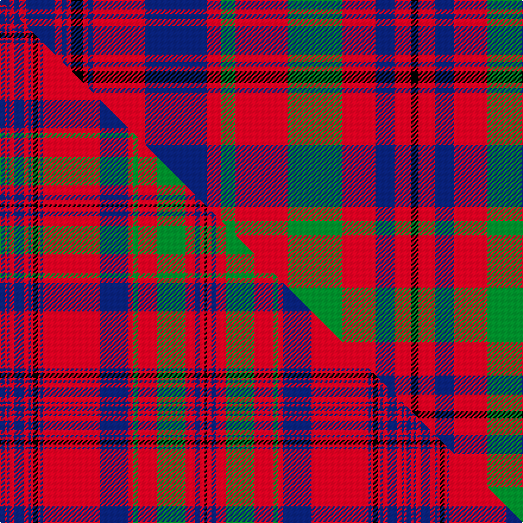

This is one **variant** — a specific cloth: this exact thread count and colourway, with its own
provenance below. It is one weaving of the [sett](/setts/db4r2db2r3db12r3db2r2k5r2db2r22db26r6g6r22g23r14db8r7k3/) (the scale-free proportion — the
same cloth at any scale or shade), whose colour order is pattern [BRBRBRBRKRBRBRGRGRBRK](/stripes/brbrbrbrkrbrbrgrgrbrk/).

Part of the [Murray of Tullibardine](/tartans/m/mu/murray-of-tullibardine/) tartan — the named design grouping this sett with its other cloths.

Sourced from register-of-tartans.  It is a [21 stripe tartan](/stripes/stripes21/).

Original link [https://www.tartanregister.gov.uk/tartanDetails.aspx?ref=3070](https://www.tartanregister.gov.uk/tartanDetails.aspx?ref=3070)

2 attestations — the source records this cloth was collapsed from (oldest owns this page)

<ul>
<li>undated — Murray of Tullibardine (register-of-tartans, <a href="https://www.tartanregister.gov.uk/tartanDetails.aspx?ref=3070">record</a>)  <em>Wilsons of Bannockburn a weaving firm founded c1770 near Stirling. The Pattern books are in the National Museum of Antiquities, Edinburgh. Copies of the Pattern books and letters are in the Scottish Tartans Society archive. Green lightened here to show sett.</em></li>
<li>undated — Murray of Tullibardine 2 (weddslist, <a href="http://www.weddslist.com/cgi-bin/tartans/pg.pl?source=sts">record</a>) </li>
</ul>

Dataset <small>— provenance for this record, inherited from the source manifest</small>

<dl class="dataset-prov">
<dt>source</dt><dd><a href="/sources/register-of-tartans/">Scottish Register of Tartans</a></dd>
<dt>data captured from</dt><dd><a href="https://github.com/thetartan/tartan-database/blob/master/data/register-of-tartans/data.csv">https://github.com/thetartan/tartan-database/blob/master/data/register-of-tartans/data.csv</a></dd>
<dt>data date</dt><dd>2017-01-06 <small>(dataset default)</small></dd>
<dt>licence</dt><dd><a href="https://www.tartanregister.gov.uk/copyright">Crown copyright</a></dd>
</dl>

Capture chain <small>— the hands this data passed through, oldest first; each capture carries its own licence</small>

<ol class="capture-chain">
<li><a href="https://www.tartanregister.gov.uk/">Scottish Register of Tartans</a> · <a href="https://www.tartanregister.gov.uk/copyright">Crown copyright</a> <small>the living register — still published by National Records of Scotland</small></li>
<li><a href="https://github.com/thetartan/tartan-database">thetartan/tartan-database</a> <small>2016-2017</small> · <a href="https://creativecommons.org/licenses/by-nc-nd/4.0/">CC BY-NC-ND 4.0</a> <small>Levko Kravets's frozen compilation — the capture we vendored, and where its CC licence text came from</small></li>
<li>this dictionary <small>captured 2026-06-10 · commit 5bf86c7566</small> <small>each re-capture is a git commit to data/sources</small></li>
</ol>

## Register references

External register numbers recorded for this tartan.

- Scottish Register of Tartans: [3070](https://www.tartanregister.gov.uk/tartanDetails.aspx?ref=3070)
- Scottish Tartans World Register: 440

## Thread count
DB/8 R4 DB4 R6 DB24 R6 DB4 R4 K10 R4 DB4 R44 DB52 R12 G12 R44 G46 R28 DB16 R14 K/6

One full sett is **690 threads**.

## Palette
<table><thead><tr><th>Colour</th><th>Shade</th><th>OKLCh</th></tr></thead><tbody><tr><td>DB</td><td><code style="background-color:#082077;">#082077</code> <small style="color:#888">#082077</small></td><td><small style="color:#888">oklch(30.0% 0.149 265.1)</small></td></tr><tr><td>G</td><td><code style="background-color:#008B2A;">#008B2A</code> <small style="color:#888">#008B2A</small></td><td><small style="color:#888">oklch(55.4% 0.170 145.9)</small></td></tr><tr><td>K</td><td><code style="background-color:#000000;">#000000</code> <small style="color:#888">#000000</small></td><td><small style="color:#888">oklch(0.0% 0.000 0.0)</small></td></tr><tr><td>R</td><td><code style="background-color:#D60020;">#D60020</code> <small style="color:#888">#D60020</small></td><td><small style="color:#888">oklch(55.2% 0.224 25.5)</small></td></tr></tbody></table>

# Sample pattern

## Compared to the master

This cloth is one sett of its design; the master sett (the exemplar the design is anchored on) is below for comparison.

Its **ΔTartan distance** from the master is **0.51** — the same measure the nearest-tartans table ranks by (0 is identical; a re-scale of the same cloth is near 0, a recolour or a different proportion further).

<figure class="master-compare" style="margin:0">

this sett
master sett ★

<figcaption style="color:#888;font-size:smaller">One weave of this sett against the <a href="/setts/db2r1db1r2db4r2db1r1k2r1db1r24db12r2g2r8g12r4db2r2k1/">master sett ★</a>, split on the diagonal: a shared proportion runs seamlessly across it with only the shades shifting; a different proportion breaks on it.</figcaption>
</figure>

## Nearest tartan variants

The nearest existing variants by ΔTartan distance, with this cloth at the top so the swatches line up against it.

ΔTartan

Threads

Variant

Sett

—

690

<a href="/variants/s21/db4r2db2r3db12r3db2r2k5r2db2r22db26r6g6r22g23r14db8r7k3~x2/">Murray of Tullibardine</a>

<a href="/ttd/edit/#slug=db4r1db1r2db10r2db1r1k1r1db1r12db6r4g4r12g10r6db4r2k2~x4&amp;base=db4r2db2r3db12r3db2r2k5r2db2r22db26r6g6r22g23r14db8r7k3~x2" title="compare in the TTD">0.34</a>

672

<a href="/variants/s21/db4r1db1r2db10r2db1r1k1r1db1r12db6r4g4r12g10r6db4r2k2~x4/">MacLeod of Tullibardine</a>

<a href="/ttd/edit/#slug=db2r1db1r2db4r2db1r1k2r1db1r24db12r2g2r8g12r4db2r2k1~x2&amp;base=db4r2db2r3db12r3db2r2k5r2db2r22db26r6g6r22g23r14db8r7k3~x2" title="compare in the TTD">0.51</a>

342

<a href="/variants/s21/db2r1db1r2db4r2db1r1k2r1db1r24db12r2g2r8g12r4db2r2k1~x2/">Murray of Tullibardine Family Tartan</a>

<a href="/ttd/edit/#slug=db2r1db1r2db4r2db1r1k2r1db1r24db12r2g2r8g12r4db2r2k1&amp;base=db4r2db2r3db12r3db2r2k5r2db2r22db26r6g6r22g23r14db8r7k3~x2" title="compare in the TTD">0.51</a>

171

<a href="/variants/s21/db2r1db1r2db4r2db1r1k2r1db1r24db12r2g2r8g12r4db2r2k1/">Murray of Tullibardine</a>

<a href="/ttd/edit/#slug=db7r2db2r5db24r6db2r2k8r2db2r50db50r10dg10r50dg50r30db22r24k3&amp;base=db4r2db2r3db12r3db2r2k5r2db2r22db26r6g6r22g23r14db8r7k3~x2" title="compare in the TTD">0.60</a>

712

<a href="/variants/s21/db7r2db2r5db24r6db2r2k8r2db2r50db50r10dg10r50dg50r30db22r24k3/">Murray of Tullibardine - 1820 (Clan)</a>

<a href="/ttd/edit/#slug=db6r5db4r3db6r4db4r5db9r5db4r3k8r3db4r36db27r4g4r14g27r9db6r6k3&amp;base=db4r2db2r3db12r3db2r2k5r2db2r22db26r6g6r22g23r14db8r7k3~x2" title="compare in the TTD">1.00</a>

409

<a href="/variants/s25/db6r5db4r3db6r4db4r5db9r5db4r3k8r3db4r36db27r4g4r14g27r9db6r6k3/">Murray of Tullibardine #4</a>

<a href="/ttd/edit/#slug=db4r1db1r2db11r2db1r1y1r1db1r16db8r4g4r16g11r8db4r2y2~x2&amp;base=db4r2db2r3db12r3db2r2k5r2db2r22db26r6g6r22g23r14db8r7k3~x2" title="compare in the TTD">1.01</a>

392

<a href="/variants/s21/db4r1db1r2db11r2db1r1y1r1db1r16db8r4g4r16g11r8db4r2y2~x2/">MacLeod Red</a>

<a href="/ttd/edit/#slug=b14k7b21k2b2k2b2k4b7r25w2r2k3r16b9r2k4r2k4r2~x2&amp;base=db4r2db2r3db12r3db2r2k5r2db2r22db26r6g6r22g23r14db8r7k3~x2" title="compare in the TTD">2.31</a>

496

<a href="/variants/s20/b14k7b21k2b2k2b2k4b7r25w2r2k3r16b9r2k4r2k4r2~x2/">Club World</a>

<a href="/ttd/edit/#slug=db14k7db21k2db2k2db2k4db7r25w2r2k3r16db9r2k4r2k4r2~x2&amp;base=db4r2db2r3db12r3db2r2k5r2db2r22db26r6g6r22g23r14db8r7k3~x2" title="compare in the TTD">2.73</a>

496

<a href="/variants/s20/db14k7db21k2db2k2db2k4db7r25w2r2k3r16db9r2k4r2k4r2~x2/">Club World (Corporate)</a>

<a href="/ttd/edit/#slug=dg20r3dg20r20db3r3db6r3db3r20db3r3db6r3db3r20w3r4db20r4&amp;base=db4r2db2r3db12r3db2r2k5r2db2r22db26r6g6r22g23r14db8r7k3~x2" title="compare in the TTD">2.96</a>

316

<a href="/variants/s20/dg20r3dg20r20db3r3db6r3db3r20db3r3db6r3db3r20w3r4db20r4/">MacRae Red Clan Tartan</a>

<a href="/ttd/edit/#slug=db3r2g4r7k2y2k2y2k5db4r21db4k5y2k2y2k2r7g4r2db3y2~x4&amp;base=db4r2db2r3db12r3db2r2k5r2db2r22db26r6g6r22g23r14db8r7k3~x2" title="compare in the TTD">2.99</a>

692

<a href="/variants/s22/db3r2g4r7k2y2k2y2k5db4r21db4k5y2k2y2k2r7g4r2db3y2~x4/">Hepburn</a>

## Neighbour map

Every grey dot is one of 13621 variants placed by the first two principal components of the ΔTartan feature space (42% of its variance). Red is this tartan; blue dots are its nearest — click one to open its page.

<svg viewBox="0 0 640 380" role="img" style="max-width:100%;height:auto;border:1px solid #e0e0e0;border-radius:4px;display:block" xmlns="http://www.w3.org/2000/svg"><image href="/nn/cloud.v1.png" width="640" height="380"/><a href="/variants/s21/db4r1db1r2db10r2db1r1k1r1db1r12db6r4g4r12g10r6db4r2k2~x4/"><circle cx="224.7" cy="129.1" r="4" fill="#3465a4"><title>MacLeod of Tullibardine</title></circle></a><a href="/variants/s21/db2r1db1r2db4r2db1r1k2r1db1r24db12r2g2r8g12r4db2r2k1~x2/"><circle cx="292.0" cy="73.1" r="4" fill="#3465a4"><title>Murray of Tullibardine Family Tartan</title></circle></a><a href="/variants/s21/db2r1db1r2db4r2db1r1k2r1db1r24db12r2g2r8g12r4db2r2k1/"><circle cx="292.0" cy="73.1" r="4" fill="#3465a4"><title>Murray of Tullibardine</title></circle></a><a href="/variants/s21/db7r2db2r5db24r6db2r2k8r2db2r50db50r10dg10r50dg50r30db22r24k3/"><circle cx="269.2" cy="92.0" r="4" fill="#3465a4"><title>Murray of Tullibardine - 1820 (Clan)</title></circle></a><a href="/variants/s25/db6r5db4r3db6r4db4r5db9r5db4r3k8r3db4r36db27r4g4r14g27r9db6r6k3/"><circle cx="209.8" cy="112.9" r="4" fill="#3465a4"><title>Murray of Tullibardine #4</title></circle></a><a href="/variants/s21/db4r1db1r2db11r2db1r1y1r1db1r16db8r4g4r16g11r8db4r2y2~x2/"><circle cx="289.9" cy="127.7" r="4" fill="#3465a4"><title>MacLeod Red</title></circle></a><a href="/variants/s20/b14k7b21k2b2k2b2k4b7r25w2r2k3r16b9r2k4r2k4r2~x2/"><circle cx="184.8" cy="114.3" r="4" fill="#3465a4"><title>Club World</title></circle></a><a href="/variants/s20/db14k7db21k2db2k2db2k4db7r25w2r2k3r16db9r2k4r2k4r2~x2/"><circle cx="189.0" cy="114.5" r="4" fill="#3465a4"><title>Club World (Corporate)</title></circle></a><a href="/variants/s20/dg20r3dg20r20db3r3db6r3db3r20db3r3db6r3db3r20w3r4db20r4/"><circle cx="236.6" cy="170.2" r="4" fill="#3465a4"><title>MacRae Red Clan Tartan</title></circle></a><a href="/variants/s22/db3r2g4r7k2y2k2y2k5db4r21db4k5y2k2y2k2r7g4r2db3y2~x4/"><circle cx="144.7" cy="105.9" r="4" fill="#3465a4"><title>Hepburn</title></circle></a><circle cx="215.8" cy="122.2" r="5" fill="#c00000"/><text x="320" y="376" text-anchor="middle" font-size="11" fill="#999">ground</text><text x="11" y="190" text-anchor="middle" font-size="11" fill="#999" transform="rotate(-90 11 190)">complexity</text></svg>

ID: /variants/s21/db4r2db2r3db12r3db2r2k5r2db2r22db26r6g6r22g23r14db8r7k3~x2/
