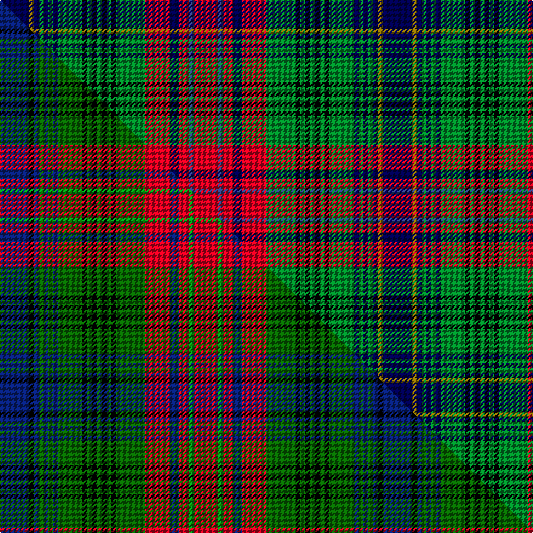

This page is one **sett** — a single exact thread-count. It belongs to the [tartan](/setts/db6y1db1g1db1g1db1g5k1g1k1g1k1g1k1g6r5db2r2dbi1r5/)
(the same proportion at any scale), whose colour order is pattern [BGBGBGBGKGKGKGKGRBRBR](/stripes/bgbgbgbgkgkgkgkgrbrbr/).

Part of the [Recovery](/tartans/recovery/) tartan — the named design grouping this sett with its other cloths.

Sourced from weddslist.  It is a [21 stripe tartan](/stripes/stripes21/).

Original link http://www.weddslist.com/cgi-bin/tartans/pg.pl?source=sts

## Thread count
DB/24 Y4 DB4 G4 DB4 G4 DB4 G20 K4 G4 K4 G4 K4 G4 K4 G24 R20 DB8 R8 DBi4 R/20

One full sett is **316 threads**.

## Palette
<table><thead><tr><th>Colour</th><th>Shade</th><th>OKLCh</th></tr></thead><tbody><tr><td>DB</td><td><code style="background-color:#304080;">#304080</code> <small style="color:#888">#304080</small></td><td><small style="color:#888">oklch(39.4% 0.109 270.2)</small></td></tr><tr><td>DB</td><td><code style="background-color:#000050;">#000050</code> <small style="color:#888">#000050</small></td><td><small style="color:#888">oklch(19.5% 0.135 264.1)</small></td></tr><tr><td>G</td><td><code style="background-color:#008B2A;">#008B2A</code> <small style="color:#888">#008B2A</small></td><td><small style="color:#888">oklch(55.4% 0.170 145.9)</small></td></tr><tr><td>K</td><td><code style="background-color:#000000;">#000000</code> <small style="color:#888">#000000</small></td><td><small style="color:#888">oklch(0.0% 0.000 0.0)</small></td></tr><tr><td>R</td><td><code style="background-color:#D60020;">#D60020</code> <small style="color:#888">#D60020</small></td><td><small style="color:#888">oklch(55.2% 0.224 25.5)</small></td></tr><tr><td>Y</td><td><code style="background-color:#8B6E00;">#8B6E00</code> <small style="color:#888">#8B6E00</small></td><td><small style="color:#888">oklch(55.1% 0.113 90.4)</small></td></tr></tbody></table>

# Sample pattern

## Compared to the master

This cloth is one sett of its design; the master sett (the exemplar the design is anchored on) is below for comparison.

Its **ΔTartan distance** from the master is **0.93** — the same measure the nearest-tartans table ranks by (0 is identical; a re-scale of the same cloth is near 0, a recolour or a different proportion further).

<figure class="master-compare" style="margin:0">

this sett
master sett ★

<figcaption style="color:#888;font-size:smaller">One weave of this sett against the <a href="/setts/db6k1db1dg1db1dg1db1dg5k1dg1k1dg1k1dg1k1dg6r5db2r2g1r5/">master sett ★</a>, split on the diagonal: a shared proportion runs seamlessly across it with only the shades shifting; a different proportion breaks on it.</figcaption>
</figure>

## Nearest tartan variants

The nearest existing variants by ΔTartan distance, with this cloth at the top so the swatches line up against it.

ΔTartan

Threads

Variant

Sett

—

316

<a href="/variants/s21/db6y1db1g1db1g1db1g5k1g1k1g1k1g1k1g6r5db2r2dbi1r5~x4~db0805267-dbi1604274/">Recovery</a>

<a href="/ttd/edit/#slug=db6ly1db1dg1db1dg1db1dg5k1dg1k1dg1k1dg1k1dg6r5db2r2g1r5~x4~dg1806142-g2408144&amp;base=db6y1db1g1db1g1db1g5k1g1k1g1k1g1k1g6r5db2r2dbi1r5~x4~db0805267-dbi1604274" title="compare in the TTD">0.30</a>

316

<a href="/variants/s21/db6ly1db1dg1db1dg1db1dg5k1dg1k1dg1k1dg1k1dg6r5db2r2g1r5~x4~dg1806142-g2408144/">Recovery (Corporate)</a>

<a href="/ttd/edit/#slug=db6k1db1dg1db1dg1db1dg5k1dg1k1dg1k1dg1k1dg6r5db2r2g1r5~x4~dg1806142-g2408144&amp;base=db6y1db1g1db1g1db1g5k1g1k1g1k1g1k1g6r5db2r2dbi1r5~x4~db0805267-dbi1604274" title="compare in the TTD">1.80</a>

316

<a href="/variants/s21/db6k1db1dg1db1dg1db1dg5k1dg1k1dg1k1dg1k1dg6r5db2r2g1r5~x4~dg1806142-g2408144/">Recovery</a>

## Neighbour map

Every grey dot is one of 13620 variants placed by the first two principal components of the ΔTartan feature space (42% of its variance). Red is this tartan; blue dots are its nearest — click one to open its page.

<svg viewBox="0 0 640 380" role="img" style="max-width:100%;height:auto;border:1px solid #e0e0e0;border-radius:4px;display:block" xmlns="http://www.w3.org/2000/svg"><image href="/nn/cloud.v1.png" width="640" height="380"/><a href="/variants/s21/db6ly1db1dg1db1dg1db1dg5k1dg1k1dg1k1dg1k1dg6r5db2r2g1r5~x4~dg1806142-g2408144/"><circle cx="87.9" cy="139.6" r="4" fill="#3465a4"><title>Recovery (Corporate)</title></circle></a><a href="/variants/s21/db6k1db1dg1db1dg1db1dg5k1dg1k1dg1k1dg1k1dg6r5db2r2g1r5~x4~dg1806142-g2408144/"><circle cx="88.3" cy="139.6" r="4" fill="#3465a4"><title>Recovery</title></circle></a><circle cx="74.4" cy="135.8" r="5" fill="#c00000"/><text x="320" y="376" text-anchor="middle" font-size="11" fill="#999">ground</text><text x="11" y="190" text-anchor="middle" font-size="11" fill="#999" transform="rotate(-90 11 190)">complexity</text></svg>

ID: /variants/s21/db6y1db1g1db1g1db1g5k1g1k1g1k1g1k1g6r5db2r2dbi1r5~x4~db0805267-dbi1604274/
