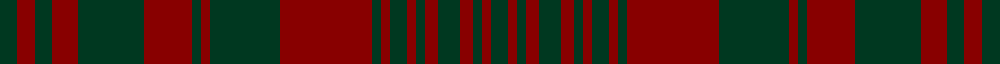

This page is one **sett** — a single exact thread-count. It belongs to the [tartan](/setts/dg4r4dg4r6dg15r11dg2r2dg16r21dg2r2dg4r2dg2r3dg5r3dg2r2dg4/)
(the same proportion at any scale), whose colour order is pattern [GRGRGRGRGRGRGRGRGRGRG](/stripes/grgrgrgrgrgrgrgrgrgrg/).

Sourced from tartans-authority.  It is a [21 stripe tartan](/stripes/stripes21/).

Original link http://www.tartansauthority.com/tartan-ferret/display/8856/

## Register references

External register numbers recorded for this tartan.

- Scottish Tartans Authority (ITI): 8856

## Thread count
DG/8 DR8 DG8 DR12 DG30 DR22 DG4 DR4 DG32 DR42 DG4 DR4 DG8 DR4 DG4 DR6 DG10 DR6 DG4 DR4 DG/8

One full sett is **448 threads**.

## Palette

Palette: <strong>Tartan Register</strong>
<table><thead><tr><th>Colour</th><th>Threads</th><th>Shade</th><th>Base</th><th>OKLCh</th></tr></thead><tbody><tr><td>DG/</td><td style="text-align:right;font-variant-numeric:tabular-nums">8</td><td><code style="background-color:#003820;">#003820</code> <small style="color:#888">#003820</small></td><td>G <code style="background-color:#006100;">#006100</code></td><td><small style="color:#888">oklch(30.0% 0.070 158.3)</small></td></tr><tr><td>DR</td><td style="text-align:right;font-variant-numeric:tabular-nums">8</td><td><code style="background-color:#880000;">#880000</code> <small style="color:#888">#880000</small></td><td>R <code style="background-color:#CC0000;">#CC0000</code></td><td><small style="color:#888">oklch(39.4% 0.162 29.2)</small></td></tr><tr><td>DG</td><td style="text-align:right;font-variant-numeric:tabular-nums">8</td><td><code style="background-color:#003820;">#003820</code> <small style="color:#888">#003820</small></td><td>G <code style="background-color:#006100;">#006100</code></td><td><small style="color:#888">oklch(30.0% 0.070 158.3)</small></td></tr><tr><td>DR</td><td style="text-align:right;font-variant-numeric:tabular-nums">12</td><td><code style="background-color:#880000;">#880000</code> <small style="color:#888">#880000</small></td><td>R <code style="background-color:#CC0000;">#CC0000</code></td><td><small style="color:#888">oklch(39.4% 0.162 29.2)</small></td></tr><tr><td>DG</td><td style="text-align:right;font-variant-numeric:tabular-nums">30</td><td><code style="background-color:#003820;">#003820</code> <small style="color:#888">#003820</small></td><td>G <code style="background-color:#006100;">#006100</code></td><td><small style="color:#888">oklch(30.0% 0.070 158.3)</small></td></tr><tr><td>DR</td><td style="text-align:right;font-variant-numeric:tabular-nums">22</td><td><code style="background-color:#880000;">#880000</code> <small style="color:#888">#880000</small></td><td>R <code style="background-color:#CC0000;">#CC0000</code></td><td><small style="color:#888">oklch(39.4% 0.162 29.2)</small></td></tr><tr><td>DG</td><td style="text-align:right;font-variant-numeric:tabular-nums">4</td><td><code style="background-color:#003820;">#003820</code> <small style="color:#888">#003820</small></td><td>G <code style="background-color:#006100;">#006100</code></td><td><small style="color:#888">oklch(30.0% 0.070 158.3)</small></td></tr><tr><td>DR</td><td style="text-align:right;font-variant-numeric:tabular-nums">4</td><td><code style="background-color:#880000;">#880000</code> <small style="color:#888">#880000</small></td><td>R <code style="background-color:#CC0000;">#CC0000</code></td><td><small style="color:#888">oklch(39.4% 0.162 29.2)</small></td></tr><tr><td>DG</td><td style="text-align:right;font-variant-numeric:tabular-nums">32</td><td><code style="background-color:#003820;">#003820</code> <small style="color:#888">#003820</small></td><td>G <code style="background-color:#006100;">#006100</code></td><td><small style="color:#888">oklch(30.0% 0.070 158.3)</small></td></tr><tr><td>DR</td><td style="text-align:right;font-variant-numeric:tabular-nums">42</td><td><code style="background-color:#880000;">#880000</code> <small style="color:#888">#880000</small></td><td>R <code style="background-color:#CC0000;">#CC0000</code></td><td><small style="color:#888">oklch(39.4% 0.162 29.2)</small></td></tr><tr><td>DG</td><td style="text-align:right;font-variant-numeric:tabular-nums">4</td><td><code style="background-color:#003820;">#003820</code> <small style="color:#888">#003820</small></td><td>G <code style="background-color:#006100;">#006100</code></td><td><small style="color:#888">oklch(30.0% 0.070 158.3)</small></td></tr><tr><td>DR</td><td style="text-align:right;font-variant-numeric:tabular-nums">4</td><td><code style="background-color:#880000;">#880000</code> <small style="color:#888">#880000</small></td><td>R <code style="background-color:#CC0000;">#CC0000</code></td><td><small style="color:#888">oklch(39.4% 0.162 29.2)</small></td></tr><tr><td>DG</td><td style="text-align:right;font-variant-numeric:tabular-nums">8</td><td><code style="background-color:#003820;">#003820</code> <small style="color:#888">#003820</small></td><td>G <code style="background-color:#006100;">#006100</code></td><td><small style="color:#888">oklch(30.0% 0.070 158.3)</small></td></tr><tr><td>DR</td><td style="text-align:right;font-variant-numeric:tabular-nums">4</td><td><code style="background-color:#880000;">#880000</code> <small style="color:#888">#880000</small></td><td>R <code style="background-color:#CC0000;">#CC0000</code></td><td><small style="color:#888">oklch(39.4% 0.162 29.2)</small></td></tr><tr><td>DG</td><td style="text-align:right;font-variant-numeric:tabular-nums">4</td><td><code style="background-color:#003820;">#003820</code> <small style="color:#888">#003820</small></td><td>G <code style="background-color:#006100;">#006100</code></td><td><small style="color:#888">oklch(30.0% 0.070 158.3)</small></td></tr><tr><td>DR</td><td style="text-align:right;font-variant-numeric:tabular-nums">6</td><td><code style="background-color:#880000;">#880000</code> <small style="color:#888">#880000</small></td><td>R <code style="background-color:#CC0000;">#CC0000</code></td><td><small style="color:#888">oklch(39.4% 0.162 29.2)</small></td></tr><tr><td>DG</td><td style="text-align:right;font-variant-numeric:tabular-nums">10</td><td><code style="background-color:#003820;">#003820</code> <small style="color:#888">#003820</small></td><td>G <code style="background-color:#006100;">#006100</code></td><td><small style="color:#888">oklch(30.0% 0.070 158.3)</small></td></tr><tr><td>DR</td><td style="text-align:right;font-variant-numeric:tabular-nums">6</td><td><code style="background-color:#880000;">#880000</code> <small style="color:#888">#880000</small></td><td>R <code style="background-color:#CC0000;">#CC0000</code></td><td><small style="color:#888">oklch(39.4% 0.162 29.2)</small></td></tr><tr><td>DG</td><td style="text-align:right;font-variant-numeric:tabular-nums">4</td><td><code style="background-color:#003820;">#003820</code> <small style="color:#888">#003820</small></td><td>G <code style="background-color:#006100;">#006100</code></td><td><small style="color:#888">oklch(30.0% 0.070 158.3)</small></td></tr><tr><td>DR</td><td style="text-align:right;font-variant-numeric:tabular-nums">4</td><td><code style="background-color:#880000;">#880000</code> <small style="color:#888">#880000</small></td><td>R <code style="background-color:#CC0000;">#CC0000</code></td><td><small style="color:#888">oklch(39.4% 0.162 29.2)</small></td></tr><tr><td>DG/</td><td style="text-align:right;font-variant-numeric:tabular-nums">8</td><td><code style="background-color:#003820;">#003820</code> <small style="color:#888">#003820</small></td><td>G <code style="background-color:#006100;">#006100</code></td><td><small style="color:#888">oklch(30.0% 0.070 158.3)</small></td></tr></tbody></table>

## Nearest tartans

The nearest existing variants by ΔTartan distance, with this tartan at the top so the swatches line up against it.

ΔTartan

Tartan

Sett

—

<a href="/ttd/edit/#slug=dg4r4dg4r6dg15r11dg2r2dg16r21dg2r2dg4r2dg2r3dg5r3dg2r2dg4~x2">Murray of Dunmore (Clan)</a> <a class="nn-out" href="/variants/s21/dg4r4dg4r6dg15r11dg2r2dg16r21dg2r2dg4r2dg2r3dg5r3dg2r2dg4~x2/" title="open its dictionary page">↗</a>

1.70

<a href="/ttd/edit/#slug=r24dg2r2dg20r25dg2r2dg2r2dg20~x2&amp;base=dg4r4dg4r6dg15r11dg2r2dg16r21dg2r2dg4r2dg2r3dg5r3dg2r2dg4~x2">Donachie of Brockloch (Clan)</a> <a class="nn-out" href="/variants/s10/r24dg2r2dg20r25dg2r2dg2r2dg20~x2/" title="open its dictionary page">↗</a>

1.76

<a href="/ttd/edit/#slug=dp27dg12dp54dg56dp10dg14dp10dg56dp62dg12dp62dg56dp4dg4dp8dg4dp4dg56dp4dg4dp8dg4dp4dg56dp54dg12dp27&amp;base=dg4r4dg4r6dg15r11dg2r2dg16r21dg2r2dg4r2dg2r3dg5r3dg2r2dg4~x2">Rae (Wilsons) (Clan)</a> <a class="nn-out" href="/variants/s27/dp27dg12dp54dg56dp10dg14dp10dg56dp62dg12dp62dg56dp4dg4dp8dg4dp4dg56dp4dg4dp8dg4dp4dg56dp54dg12dp27/" title="open its dictionary page">↗</a>

1.91

<a href="/ttd/edit/#slug=g4r4g2r2g2r18db4g4r2g2r2g3r4g2r2g2r2db4g4r2g4~x2&amp;base=dg4r4dg4r6dg15r11dg2r2dg16r21dg2r2dg4r2dg2r3dg5r3dg2r2dg4~x2">Matheson (WCWM)</a> <a class="nn-out" href="/variants/s21/g4r4g2r2g2r18db4g4r2g2r2g3r4g2r2g2r2db4g4r2g4~x2/" title="open its dictionary page">↗</a>

1.97

<a href="/ttd/edit/#slug=dg4do14r1do1dg1do1r1do14r14do1r1dg1~x4&amp;base=dg4r4dg4r6dg15r11dg2r2dg16r21dg2r2dg4r2dg2r3dg5r3dg2r2dg4~x2">Frame (Ferniegair) (Personal)</a> <a class="nn-out" href="/variants/s12/dg4do14r1do1dg1do1r1do14r14do1r1dg1~x4/" title="open its dictionary page">↗</a>

2.05

<a href="/ttd/edit/#slug=r12db1r1g8r2db1r1db3r1db1r12g1r1g8~x4&amp;base=dg4r4dg4r6dg15r11dg2r2dg16r21dg2r2dg4r2dg2r3dg5r3dg2r2dg4~x2">MacDonald of Aird &amp; Valley (Clan?)</a> <a class="nn-out" href="/variants/s14/r12db1r1g8r2db1r1db3r1db1r12g1r1g8~x4/" title="open its dictionary page">↗</a>

2.05

<a href="/variants/s30/dy13r1dy2r2dy2r1dy2r5dy11r1dy2g2dy2r1dy2g7~x2/">Sarna (Town)</a>

2.06

<a href="/ttd/edit/#slug=r12g2r1g1r1g1r6g12r1k1r12k1r1k1r3~x4&amp;base=dg4r4dg4r6dg15r11dg2r2dg16r21dg2r2dg4r2dg2r3dg5r3dg2r2dg4~x2">MacDonell of Keppoch #3</a> <a class="nn-out" href="/variants/s15/r12g2r1g1r1g1r6g12r1k1r12k1r1k1r3~x4/" title="open its dictionary page">↗</a>

2.07

<a href="/ttd/edit/#slug=dy13r1dy2r2dy2r1dy2r5dy11r1dy2g2dy2r1dy2g7~x2&amp;base=dg4r4dg4r6dg15r11dg2r2dg16r21dg2r2dg4r2dg2r3dg5r3dg2r2dg4~x2">Sarna (District)</a> <a class="nn-out" href="/variants/s16/dy13r1dy2r2dy2r1dy2r5dy11r1dy2g2dy2r1dy2g7~x2/" title="open its dictionary page">↗</a>

2.09

<a href="/ttd/edit/#slug=o24dg2o2dg20o25dg2o2dg2o2dg20~x2&amp;base=dg4r4dg4r6dg15r11dg2r2dg16r21dg2r2dg4r2dg2r3dg5r3dg2r2dg4~x2">Donachie of Brockloch</a> <a class="nn-out" href="/variants/s10/o24dg2o2dg20o25dg2o2dg2o2dg20~x2/" title="open its dictionary page">↗</a>

2.12

<a href="/ttd/edit/#slug=dg4dy14r1dy1dg1dy1r1dy14r14dy1r1dg1~x4&amp;base=dg4r4dg4r6dg15r11dg2r2dg16r21dg2r2dg4r2dg2r3dg5r3dg2r2dg4~x2">Frame - Ferniegair (Personal)</a> <a class="nn-out" href="/variants/s12/dg4dy14r1dy1dg1dy1r1dy14r14dy1r1dg1~x4/" title="open its dictionary page">↗</a>

## Neighbour map

Every grey dot is one of 14360 variants placed by the first two principal components of the ΔTartan feature space (44% of its variance). Red is this tartan; blue dots are its nearest — click one to open its page.

<svg viewBox="0 0 640 380" role="img" style="max-width:100%;height:auto;border:1px solid #e0e0e0;border-radius:4px;display:block" xmlns="http://www.w3.org/2000/svg"><image href="/nn/cloud.v1.png" width="640" height="380"/><a href="/variants/s10/r24dg2r2dg20r25dg2r2dg2r2dg20~x2/"><circle cx="449.3" cy="235.3" r="4" fill="#3465a4"><title>Donachie of Brockloch (Clan)</title></circle></a><a href="/variants/s27/dp27dg12dp54dg56dp10dg14dp10dg56dp62dg12dp62dg56dp4dg4dp8dg4dp4dg56dp4dg4dp8dg4dp4dg56dp54dg12dp27/"><circle cx="389.7" cy="189.5" r="4" fill="#3465a4"><title>Rae (Wilsons) (Clan)</title></circle></a><a href="/variants/s21/g4r4g2r2g2r18db4g4r2g2r2g3r4g2r2g2r2db4g4r2g4~x2/"><circle cx="322.0" cy="186.9" r="4" fill="#3465a4"><title>Matheson (WCWM)</title></circle></a><a href="/variants/s12/dg4do14r1do1dg1do1r1do14r14do1r1dg1~x4/"><circle cx="440.3" cy="193.6" r="4" fill="#3465a4"><title>Frame (Ferniegair) (Personal)</title></circle></a><a href="/variants/s14/r12db1r1g8r2db1r1db3r1db1r12g1r1g8~x4/"><circle cx="380.1" cy="183.2" r="4" fill="#3465a4"><title>MacDonald of Aird &amp; Valley (Clan?)</title></circle></a><a href="/variants/s30/dy13r1dy2r2dy2r1dy2r5dy11r1dy2g2dy2r1dy2g7~x2/"><circle cx="465.5" cy="183.2" r="4" fill="#3465a4"><title>Sarna (Town)</title></circle></a><a href="/variants/s15/r12g2r1g1r1g1r6g12r1k1r12k1r1k1r3~x4/"><circle cx="465.2" cy="184.2" r="4" fill="#3465a4"><title>MacDonell of Keppoch #3</title></circle></a><a href="/variants/s16/dy13r1dy2r2dy2r1dy2r5dy11r1dy2g2dy2r1dy2g7~x2/"><circle cx="478.7" cy="214.3" r="4" fill="#3465a4"><title>Sarna (District)</title></circle></a><a href="/variants/s10/o24dg2o2dg20o25dg2o2dg2o2dg20~x2/"><circle cx="497.3" cy="267.4" r="4" fill="#3465a4"><title>Donachie of Brockloch</title></circle></a><a href="/variants/s12/dg4dy14r1dy1dg1dy1r1dy14r14dy1r1dg1~x4/"><circle cx="445.6" cy="193.0" r="4" fill="#3465a4"><title>Frame - Ferniegair (Personal)</title></circle></a><circle cx="425.8" cy="222.7" r="5" fill="#c00000"/></svg>

ID: /variants/s21/dg4r4dg4r6dg15r11dg2r2dg16r21dg2r2dg4r2dg2r3dg5r3dg2r2dg4~x2/
