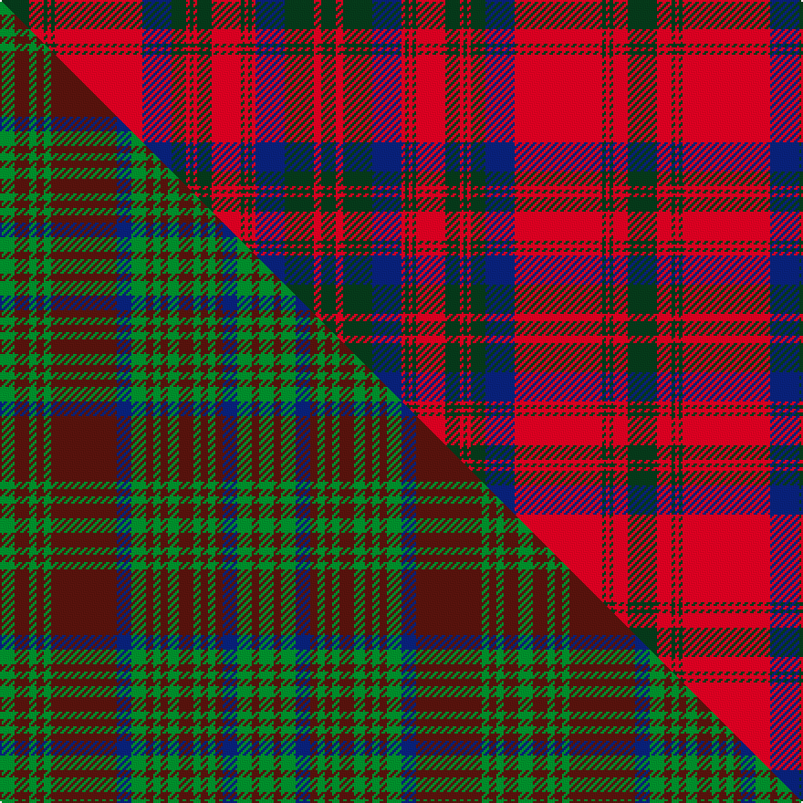

This page is one **sett** — a single exact thread-count. It belongs to the [tartan](/setts/dg8r4dg1r1dg1r24db8dg4r1dg1r1dg4r8dg1r1dg1r1db8dg8r2dg4/)
(the same proportion at any scale), whose colour order is pattern [GRGBRGRGRGRGRGBRGRGRG](/stripes/grgbrgrgrgrgrgbrgrgrg/).

Part of the [Matheson](/tartans/matheson/) tartan — the named design grouping this sett with its other cloths.

Sourced from house-of-tartan.  It is a [21 stripe tartan](/stripes/stripes21/).

Original link http://www.house-of-tartan.scotland.net/house/TartanViewjs.asp?colr=Def&tnam=860

## Provenance

Earliest known date: 1850 The design usually worn by Mathesons is given by Smith although earlier versions are recorded. McIan's drawing could be taken to represent either of the two red designs of which this is one. The Mathesons were involved with other clans who settled in Lochalsh, and in particular with the MacDonells of Glengarry and the MacKenzies of Kintail. The tartan has a design structure which relates to the Glengarry which dates at least to c.1816 when a sample was certified by the chief.

## Thread count
DG/16 R8 DG2 R2 DG2 R48 DB16 DG8 R2 DG2 R2 DG8 R16 DG2 R2 DG2 R2 DB16 DG16 R4 DG/8

One full sett is **344 threads**.

## Palette
<table><thead><tr><th>Colour</th><th>Shade</th><th>OKLCh</th></tr></thead><tbody><tr><td>DB</td><td><code style="background-color:#082077;">#082077</code> <small style="color:#888">#082077</small></td><td><small style="color:#888">oklch(30.0% 0.149 265.1)</small></td></tr><tr><td>DG</td><td><code style="background-color:#053819;">#053819</code> <small style="color:#888">#053819</small></td><td><small style="color:#888">oklch(30.0% 0.075 151.3)</small></td></tr><tr><td>R</td><td><code style="background-color:#D60020;">#D60020</code> <small style="color:#888">#D60020</small></td><td><small style="color:#888">oklch(55.2% 0.224 25.5)</small></td></tr></tbody></table>

# Sample pattern

## Compared to the master

This cloth is one sett of its design; the master sett (the exemplar the design is anchored on) is below for comparison.

Its **ΔTartan distance** from the master is **0.64** — the same measure the nearest-tartans table ranks by (0 is identical; a re-scale of the same cloth is near 0, a recolour or a different proportion further).

<figure class="master-compare" style="margin:0">

this sett
master sett ★

<figcaption style="color:#888;font-size:smaller">One weave of this sett against the <a href="/setts/g4dr4g2dr2g2dr18db4g4dr2g2dr2g3dr4g2dr2g2dr2db4g4dr2g4/">master sett ★</a>, split on the diagonal: a shared proportion runs seamlessly across it with only the shades shifting; a different proportion breaks on it.</figcaption>
</figure>

## Nearest tartan variants

The nearest existing variants by ΔTartan distance, with this cloth at the top so the swatches line up against it.

ΔTartan

Threads

Variant

Sett

—

344

<a href="/variants/s21/dg8r4dg1r1dg1r24db8dg4r1dg1r1dg4r8dg1r1dg1r1db8dg8r2dg4~x2/">Matheson Clan Tartan</a>

<a href="/ttd/edit/#slug=g8r4g1r1g1r24db8g4r1g1r1g4r8g1r1g1r1db8g8r2g4&amp;base=dg8r4dg1r1dg1r24db8dg4r1dg1r1dg4r8dg1r1dg1r1db8dg8r2dg4~x2" title="compare in the TTD">0.16</a>

172

<a href="/variants/s21/g8r4g1r1g1r24db8g4r1g1r1g4r8g1r1g1r1db8g8r2g4/">Matheson</a>

<a href="/ttd/edit/#slug=g8r4g1r1g1r24db8g4r1g1r1g4r8g1r1g1r1db8g8r2g4~x2&amp;base=dg8r4dg1r1dg1r24db8dg4r1dg1r1dg4r8dg1r1dg1r1db8dg8r2dg4~x2" title="compare in the TTD">0.16</a>

344

<a href="/variants/s21/g8r4g1r1g1r24db8g4r1g1r1g4r8g1r1g1r1db8g8r2g4~x2/">Matheson</a>

<a href="/ttd/edit/#slug=g8r4g1r1g1r14db8g4r1g1r1g4r8g1r1g1r1db8g8r2g4~x4&amp;base=dg8r4dg1r1dg1r24db8dg4r1dg1r1dg4r8dg1r1dg1r1db8dg8r2dg4~x2" title="compare in the TTD">0.40</a>

608

<a href="/variants/s21/g8r4g1r1g1r14db8g4r1g1r1g4r8g1r1g1r1db8g8r2g4~x4/">Matheson (Clan)</a>

<a href="/ttd/edit/#slug=db4r1db1r4db12r4db1r1g4r1db1r26db26r4g4r26g21r13db6r5g1~x2&amp;base=dg8r4dg1r1dg1r24db8dg4r1dg1r1dg4r8dg1r1dg1r1db8dg8r2dg4~x2" title="compare in the TTD">1.59</a>

654

<a href="/variants/s21/db4r1db1r4db12r4db1r1g4r1db1r26db26r4g4r26g21r13db6r5g1~x2/">Murray of Tullibardine (plaid)</a>

<a href="/ttd/edit/#slug=g8r4g1r1g1r24dp8g4r1g1r1g4r8g1r1g1r1dp8g8r2g4~x2&amp;base=dg8r4dg1r1dg1r24db8dg4r1dg1r1dg4r8dg1r1dg1r1db8dg8r2dg4~x2" title="compare in the TTD">2.00</a>

344

<a href="/variants/s21/g8r4g1r1g1r24dp8g4r1g1r1g4r8g1r1g1r1dp8g8r2g4~x2/">Matheson Dress</a>

<a href="/ttd/edit/#slug=db2r1db1r2db4r2db1r1db2r1db1r24db12r2g2r8g12r4db2r2db1&amp;base=dg8r4dg1r1dg1r24db8dg4r1dg1r1dg4r8dg1r1dg1r1db8dg8r2dg4~x2" title="compare in the TTD">2.05</a>

171

<a href="/variants/s21/db2r1db1r2db4r2db1r1db2r1db1r24db12r2g2r8g12r4db2r2db1/">Murray of Tullibardine</a>

<a href="/ttd/edit/#slug=r18db1r1db2r1db1r18db18r2db18r18g2r4g2r18g18r2g18~x2&amp;base=dg8r4dg1r1dg1r24db8dg4r1dg1r1dg4r8dg1r1dg1r1db8dg8r2dg4~x2" title="compare in the TTD">2.53</a>

576

<a href="/variants/s18/r18db1r1db2r1db1r18db18r2db18r18g2r4g2r18g18r2g18~x2/">Ross #5</a>

<a href="/ttd/edit/#slug=db3r1db1r3db9r3db1r1db3r1db1r18db14r3db1r1db1r3g4r14g10r10db5r4db1~x2&amp;base=dg8r4dg1r1dg1r24db8dg4r1dg1r1dg4r8dg1r1dg1r1db8dg8r2dg4~x2" title="compare in the TTD">2.58</a>

456

<a href="/variants/s25/db3r1db1r3db9r3db1r1db3r1db1r18db14r3db1r1db1r3g4r14g10r10db5r4db1~x2/">Campbell of Loudoun, Plaid</a>

<a href="/ttd/edit/#slug=dg2r3db2r48dg60r21dg2r21db60r48db2r3dg2&amp;base=dg8r4dg1r1dg1r24db8dg4r1dg1r1dg4r8dg1r1dg1r1db8dg8r2dg4~x2" title="compare in the TTD">2.63</a>

544

<a href="/variants/s13/dg2r3db2r48dg60r21dg2r21db60r48db2r3dg2/">Fraser, Isabella (Artefact)</a>

<a href="/ttd/edit/#slug=r18db1r1db2r1db1r18db18r2db18r18g2r4g2r18g18r2g9~x4&amp;base=dg8r4dg1r1dg1r24db8dg4r1dg1r1dg4r8dg1r1dg1r1db8dg8r2dg4~x2" title="compare in the TTD">2.64</a>

1116

<a href="/variants/s18/r18db1r1db2r1db1r18db18r2db18r18g2r4g2r18g18r2g9~x4/">Ross</a>

## Neighbour map

Every grey dot is one of 13620 variants placed by the first two principal components of the ΔTartan feature space (42% of its variance). Red is this tartan; blue dots are its nearest — click one to open its page.

<svg viewBox="0 0 640 380" role="img" style="max-width:100%;height:auto;border:1px solid #e0e0e0;border-radius:4px;display:block" xmlns="http://www.w3.org/2000/svg"><image href="/nn/cloud.v1.png" width="640" height="380"/><a href="/variants/s21/g8r4g1r1g1r24db8g4r1g1r1g4r8g1r1g1r1db8g8r2g4/"><circle cx="307.4" cy="119.3" r="4" fill="#3465a4"><title>Matheson</title></circle></a><a href="/variants/s21/g8r4g1r1g1r24db8g4r1g1r1g4r8g1r1g1r1db8g8r2g4~x2/"><circle cx="307.4" cy="119.3" r="4" fill="#3465a4"><title>Matheson</title></circle></a><a href="/variants/s21/g8r4g1r1g1r14db8g4r1g1r1g4r8g1r1g1r1db8g8r2g4~x4/"><circle cx="248.8" cy="160.3" r="4" fill="#3465a4"><title>Matheson (Clan)</title></circle></a><a href="/variants/s21/db4r1db1r4db12r4db1r1g4r1db1r26db26r4g4r26g21r13db6r5g1~x2/"><circle cx="321.0" cy="115.0" r="4" fill="#3465a4"><title>Murray of Tullibardine (plaid)</title></circle></a><a href="/variants/s21/g8r4g1r1g1r24dp8g4r1g1r1g4r8g1r1g1r1dp8g8r2g4~x2/"><circle cx="319.2" cy="120.8" r="4" fill="#3465a4"><title>Matheson Dress</title></circle></a><a href="/variants/s21/db2r1db1r2db4r2db1r1db2r1db1r24db12r2g2r8g12r4db2r2db1/"><circle cx="344.9" cy="104.1" r="4" fill="#3465a4"><title>Murray of Tullibardine</title></circle></a><a href="/variants/s18/r18db1r1db2r1db1r18db18r2db18r18g2r4g2r18g18r2g18~x2/"><circle cx="296.0" cy="151.8" r="4" fill="#3465a4"><title>Ross #5</title></circle></a><a href="/variants/s25/db3r1db1r3db9r3db1r1db3r1db1r18db14r3db1r1db1r3g4r14g10r10db5r4db1~x2/"><circle cx="319.9" cy="125.3" r="4" fill="#3465a4"><title>Campbell of Loudoun, Plaid</title></circle></a><a href="/variants/s13/dg2r3db2r48dg60r21dg2r21db60r48db2r3dg2/"><circle cx="350.6" cy="130.8" r="4" fill="#3465a4"><title>Fraser, Isabella (Artefact)</title></circle></a><a href="/variants/s18/r18db1r1db2r1db1r18db18r2db18r18g2r4g2r18g18r2g9~x4/"><circle cx="313.7" cy="148.6" r="4" fill="#3465a4"><title>Ross</title></circle></a><circle cx="317.0" cy="118.6" r="5" fill="#c00000"/><text x="320" y="376" text-anchor="middle" font-size="11" fill="#999">ground</text><text x="11" y="190" text-anchor="middle" font-size="11" fill="#999" transform="rotate(-90 11 190)">complexity</text></svg>

ID: /variants/s21/dg8r4dg1r1dg1r24db8dg4r1dg1r1dg4r8dg1r1dg1r1db8dg8r2dg4~x2/
