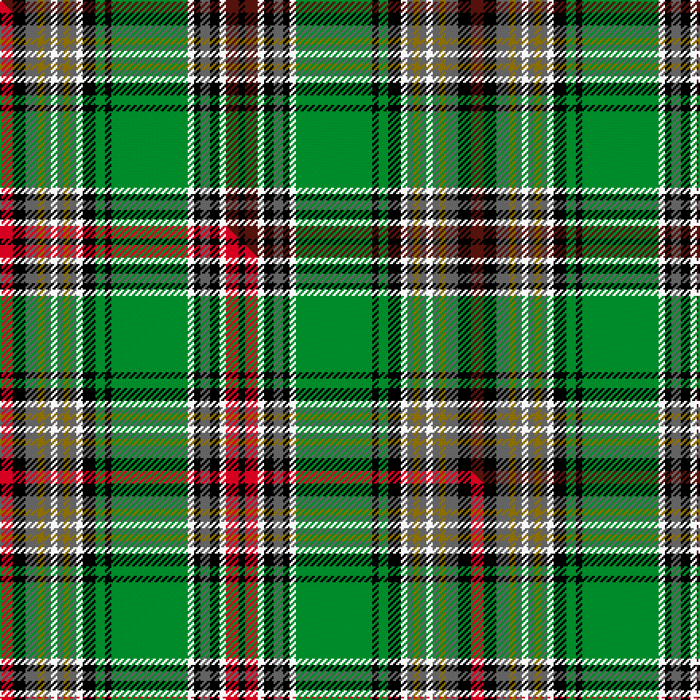

This page is one **sett** — a single exact thread-count. It belongs to the [tartan](/setts/dr4k4n4y2n2w2n2y2n2w2k4g3k2g24w2k2n3k3w2dr4k2/)
(the same proportion at any scale), whose colour order is pattern [BKBGBWBGBWKGKGWKBKWBK](/stripes/bkbgbwbgbwkgkgwkbkwbk/).

Part of the [Murtaugh Hunting](/tartans/murtaugh-hunting/) tartan — the named design grouping this sett with its other cloths.

Sourced from house-of-tartan.  It is a [21 stripe tartan](/stripes/stripes21/).

Original link http://www.house-of-tartan.scotland.net/house/TartanViewjs.asp?colr=Def&tnam=5818

## Provenance

Earliest known date: 2003 After original Murtaugh by Don Smith, Heraldic Graphics

Dataset <small>— provenance for this record, inherited from the source manifest</small>

<dl class="dataset-prov">
<dt>source</dt><dd><a href="/sources/house-of-tartan/">House of Tartan</a></dd>
<dt>data captured from</dt><dd><a href="https://github.com/thetartan/tartan-database/blob/master/data/house-of-tartan/data.csv">https://github.com/thetartan/tartan-database/blob/master/data/house-of-tartan/data.csv</a></dd>
<dt>data date</dt><dd>2017-01-10 <small>(dataset default)</small></dd>
<dt>licence</dt><dd><a href="https://creativecommons.org/licenses/by-nc-nd/4.0/">CC BY-NC-ND 4.0</a></dd>
</dl>

Capture chain <small>— the hands this data passed through, oldest first; each capture carries its own licence</small>

<ol class="capture-chain">
<li><a href="http://www.house-of-tartan.scotland.net/">House of Tartan</a> <small>the weaver/retailer's database — the site is now offline; the URL is kept as the ultimate source's identity</small></li>
<li><a href="https://github.com/thetartan/tartan-database">thetartan/tartan-database</a> <small>2016-2017</small> · <a href="https://creativecommons.org/licenses/by-nc-nd/4.0/">CC BY-NC-ND 4.0</a> <small>Levko Kravets's frozen compilation — the capture we vendored, and where its CC licence text came from</small></li>
<li>this dictionary <small>captured 2026-06-10 · commit 5bf86c7566</small> <small>each re-capture is a git commit to data/sources</small></li>
</ol>

## Thread count
DR/8 K8 N8 Y4 N4 W4 N4 Y4 N4 W4 K8 G6 K4 G48 W4 K4 N6 K6 W4 DR8 K/4

One full sett is **296 threads**.

## Palette
<table><thead><tr><th>Colour</th><th>Shade</th><th>OKLCh</th></tr></thead><tbody><tr><td>DR</td><td><code style="background-color:#55120C;">#55120C</code> <small style="color:#888">#55120C</small></td><td><small style="color:#888">oklch(30.0% 0.099 29.3)</small></td></tr><tr><td>G</td><td><code style="background-color:#008B2A;">#008B2A</code> <small style="color:#888">#008B2A</small></td><td><small style="color:#888">oklch(55.4% 0.170 145.9)</small></td></tr><tr><td>K</td><td><code style="background-color:#000000;">#000000</code> <small style="color:#888">#000000</small></td><td><small style="color:#888">oklch(0.0% 0.000 0.0)</small></td></tr><tr><td>W</td><td><code style="background-color:#F7F7F7;">#F7F7F7</code> <small style="color:#888">#F7F7F7</small></td><td><small style="color:#888">oklch(97.6% 0.000 89.9)</small></td></tr><tr><td>N</td><td><code style="background-color:#636363;">#636363</code> <small style="color:#888">#636363</small></td><td><small style="color:#888">oklch(50.0% 0.000 89.9)</small></td></tr><tr><td>Y</td><td><code style="background-color:#8B6E00;">#8B6E00</code> <small style="color:#888">#8B6E00</small></td><td><small style="color:#888">oklch(55.1% 0.113 90.4)</small></td></tr></tbody></table>

# Sample pattern

## Compared to the master

This cloth is one sett of its design; the master sett (the exemplar the design is anchored on) is below for comparison.

Its **ΔTartan distance** from the master is **0.06** — the same measure the nearest-tartans table ranks by (0 is identical; a re-scale of the same cloth is near 0, a recolour or a different proportion further).

<figure class="master-compare" style="margin:0">

this sett
master sett ★

<figcaption style="color:#888;font-size:smaller">One weave of this sett against the <a href="/setts/r4k4n4y2n2w2n2y2n2w2k4g3k2g24w2k2n3k3w2r4k2/">master sett ★</a>, split on the diagonal: a shared proportion runs seamlessly across it with only the shades shifting; a different proportion breaks on it.</figcaption>
</figure>

## Nearest tartan variants

The nearest existing variants by ΔTartan distance, with this cloth at the top so the swatches line up against it.

ΔTartan

Threads

Variant

Sett

—

296

<a href="/variants/s21/dr4k4n4y2n2w2n2y2n2w2k4g3k2g24w2k2n3k3w2dr4k2~x2/">Murtaugh Hunting Tartan</a>

<a href="/ttd/edit/#slug=r4k4n4y2n2w2n2y2n2w2k4g3k2g24w2k2n3k3w2r4k2~x2&amp;base=dr4k4n4y2n2w2n2y2n2w2k4g3k2g24w2k2n3k3w2dr4k2~x2" title="compare in the TTD">0.06</a>

296

<a href="/variants/s21/r4k4n4y2n2w2n2y2n2w2k4g3k2g24w2k2n3k3w2r4k2~x2/">Murtaugh Hunting</a>

<a href="/ttd/edit/#slug=y2w1y12dt6k3w1g1w1g4w2k1w1r1~x4&amp;base=dr4k4n4y2n2w2n2y2n2w2k4g3k2g24w2k2n3k3w2dr4k2~x2" title="compare in the TTD">1.95</a>

276

<a href="/variants/s13/y2w1y12dt6k3w1g1w1g4w2k1w1r1~x4/">Diana Princess of Wales Memorial</a>

<a href="/ttd/edit/#slug=g16k1b2k1lo4k1lo4k1b2k1dr16w2dr16k1b2k1lo4k1lo4k1b2k1g16b2~x4&amp;base=dr4k4n4y2n2w2n2y2n2w2k4g3k2g24w2k2n3k3w2dr4k2~x2" title="compare in the TTD">2.14</a>

744

<a href="/variants/s24/g16k1b2k1lo4k1lo4k1b2k1dr16w2dr16k1b2k1lo4k1lo4k1b2k1g16b2~x4/">Baxter Clan/Family Tartan</a>

<a href="/ttd/edit/#slug=g20k2w2k2y2k2g19r5k19r5t20k2g2k2g2k2t20~x2&amp;base=dr4k4n4y2n2w2n2y2n2w2k4g3k2g24w2k2n3k3w2dr4k2~x2" title="compare in the TTD">2.30</a>

432

<a href="/variants/s17/g20k2w2k2y2k2g19r5k19r5t20k2g2k2g2k2t20~x2/">MacNicol Htg (Clan)</a>

<a href="/ttd/edit/#slug=g3dg2g2dg16g2dg2g2dg2g4n4k2n2k2n2k24r2k2w3~x2~g2203152-dg1806142&amp;base=dr4k4n4y2n2w2n2y2n2w2k4g3k2g24w2k2n3k3w2dr4k2~x2" title="compare in the TTD">2.37</a>

300

<a href="/variants/s18/g3dg2g2dg16g2dg2g2dg2g4n4k2n2k2n2k24r2k2w3~x2~g2203152-dg1806142/">Barkway (Name)</a>

<a href="/ttd/edit/#slug=g6ly6g1k15g2k2o2g2o2k2o2g2o2k2o2g2o2k2g2w15g1k2~x2~ly2705081-o2503076&amp;base=dr4k4n4y2n2w2n2y2n2w2k4g3k2g24w2k2n3k3w2dr4k2~x2" title="compare in the TTD">2.43</a>

288

<a href="/variants/s22/g6lyi6g1k15g2k2ly2g2ly2k2ly2g2ly2k2ly2g2ly2k2g2w15g1k2~x2~lyi2705081-ly2503076/">Int. College of Dentists (Canada)</a>

<a href="/ttd/edit/#slug=r3g2w2g3db3g20k20db2k2db2ly15db3ly3~x2&amp;base=dr4k4n4y2n2w2n2y2n2w2k4g3k2g24w2k2n3k3w2dr4k2~x2" title="compare in the TTD">2.51</a>

308

<a href="/variants/s13/r3g2w2g3db3g20k20db2k2db2ly15db3ly3~x2/">U.S. Ancient Order of Hibernians (Co</a>

<a href="/ttd/edit/#slug=dt10k1r1k3r1k1dt1r1dt3r1dt1y1dg3y1dg1ly1y3ly1y1ly10~x4~dt1201180-dg1501120&amp;base=dr4k4n4y2n2w2n2y2n2w2k4g3k2g24w2k2n3k3w2dr4k2~x2" title="compare in the TTD">2.53</a>

288

<a href="/variants/s20/dy10k1r1k3r1k1dy1r1dy3r1dy1y1dg3y1dg1ly1y3ly1y1ly10~x4~dy1201180-dg1501120/">Spice of Life</a>

<a href="/ttd/edit/#slug=g6y6g1k15g2k2ly2g2ly2k2ly2g2ly2k2ly2g2ly2k2g2w15g1k2~x2&amp;base=dr4k4n4y2n2w2n2y2n2w2k4g3k2g24w2k2n3k3w2dr4k2~x2" title="compare in the TTD">2.57</a>

288

<a href="/variants/s22/g6y6g1k15g2k2ly2g2ly2k2ly2g2ly2k2ly2g2ly2k2g2w15g1k2~x2/">International College of Dentists (Canadian Section) Dress</a>

<a href="/ttd/edit/#slug=g6y6g1k15g2k2ly2g2ly2k2ly2g2ly2k2ly2g2ly2k2g2dg15g1k2~x2&amp;base=dr4k4n4y2n2w2n2y2n2w2k4g3k2g24w2k2n3k3w2dr4k2~x2" title="compare in the TTD">2.60</a>

288

<a href="/variants/s22/g6y6g1k15g2k2ly2g2ly2k2ly2g2ly2k2ly2g2ly2k2g2dg15g1k2~x2/">International College of Dentists (Canadian Section)</a>

## Neighbour map

Every grey dot is one of 13620 variants placed by the first two principal components of the ΔTartan feature space (42% of its variance). Red is this tartan; blue dots are its nearest — click one to open its page.

<svg viewBox="0 0 640 380" role="img" style="max-width:100%;height:auto;border:1px solid #e0e0e0;border-radius:4px;display:block" xmlns="http://www.w3.org/2000/svg"><image href="/nn/cloud.v1.png" width="640" height="380"/><a href="/variants/s21/r4k4n4y2n2w2n2y2n2w2k4g3k2g24w2k2n3k3w2r4k2~x2/"><circle cx="81.9" cy="80.1" r="4" fill="#3465a4"><title>Murtaugh Hunting</title></circle></a><a href="/variants/s13/y2w1y12dt6k3w1g1w1g4w2k1w1r1~x4/"><circle cx="95.6" cy="91.9" r="4" fill="#3465a4"><title>Diana Princess of Wales Memorial</title></circle></a><a href="/variants/s24/g16k1b2k1lo4k1lo4k1b2k1dr16w2dr16k1b2k1lo4k1lo4k1b2k1g16b2~x4/"><circle cx="102.0" cy="70.8" r="4" fill="#3465a4"><title>Baxter Clan/Family Tartan</title></circle></a><a href="/variants/s17/g20k2w2k2y2k2g19r5k19r5t20k2g2k2g2k2t20~x2/"><circle cx="91.2" cy="115.2" r="4" fill="#3465a4"><title>MacNicol Htg (Clan)</title></circle></a><a href="/variants/s18/g3dg2g2dg16g2dg2g2dg2g4n4k2n2k2n2k24r2k2w3~x2~g2203152-dg1806142/"><circle cx="119.3" cy="83.9" r="4" fill="#3465a4"><title>Barkway (Name)</title></circle></a><a href="/variants/s22/g6lyi6g1k15g2k2ly2g2ly2k2ly2g2ly2k2ly2g2ly2k2g2w15g1k2~x2~lyi2705081-ly2503076/"><circle cx="83.5" cy="91.2" r="4" fill="#3465a4"><title>Int. College of Dentists (Canada)</title></circle></a><a href="/variants/s13/r3g2w2g3db3g20k20db2k2db2ly15db3ly3~x2/"><circle cx="70.8" cy="117.6" r="4" fill="#3465a4"><title>U.S. Ancient Order of Hibernians (Co</title></circle></a><a href="/variants/s20/dy10k1r1k3r1k1dy1r1dy3r1dy1y1dg3y1dg1ly1y3ly1y1ly10~x4~dy1201180-dg1501120/"><circle cx="79.6" cy="96.1" r="4" fill="#3465a4"><title>Spice of Life</title></circle></a><a href="/variants/s22/g6y6g1k15g2k2ly2g2ly2k2ly2g2ly2k2ly2g2ly2k2g2w15g1k2~x2/"><circle cx="81.2" cy="91.1" r="4" fill="#3465a4"><title>International College of Dentists (Canadian Section) Dress</title></circle></a><a href="/variants/s22/g6y6g1k15g2k2ly2g2ly2k2ly2g2ly2k2ly2g2ly2k2g2dg15g1k2~x2/"><circle cx="95.4" cy="95.9" r="4" fill="#3465a4"><title>International College of Dentists (Canadian Section)</title></circle></a><circle cx="86.1" cy="83.9" r="5" fill="#c00000"/><text x="320" y="376" text-anchor="middle" font-size="11" fill="#999">ground</text><text x="11" y="190" text-anchor="middle" font-size="11" fill="#999" transform="rotate(-90 11 190)">complexity</text></svg>

ID: /variants/s21/dr4k4n4y2n2w2n2y2n2w2k4g3k2g24w2k2n3k3w2dr4k2~x2/
