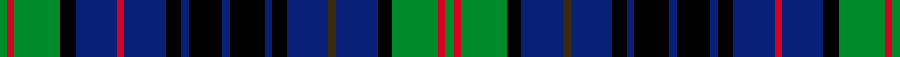

This is one **variant** — a specific cloth: this exact thread count and colourway, with its own
provenance below. It is one weaving of the [sett](/setts/g2r2g12k4db11dy2db11k4db2k9db2k9db2k4db11r2db11k4g12r2g2/) (the scale-free proportion — the
same cloth at any scale or shade), whose colour order is pattern [GRGKBGBKBKBKBKBRBKGRG](/stripes/grgkbgbkbkbkbkbrbkgrg/).

Part of the [Allen](/tartans/a/al/allen-4/) tartan — the named design grouping this sett with its other cloths.

Sourced from register-of-tartans.  It is a [21 stripe tartan](/stripes/stripes21/).

Original link [https://www.tartanregister.gov.uk/tartanDetails.aspx?ref=56](https://www.tartanregister.gov.uk/tartanDetails.aspx?ref=56)

2 attestations — the source records this cloth was collapsed from (oldest owns this page)

<ul>
<li>01/01/1997 — Allen (1998) (register-of-tartans, <a href="https://www.tartanregister.gov.uk/tartanDetails.aspx?ref=56">record</a>)  <em>Designed for Christopher Allen Holler of Winter Park Florida and for use by anyone of the name Allen or any of its variations.</em></li>
<li>pre 1998 — Allen (1998) (Name) (tartans-authority, <a href="https://www.tartanregister.gov.uk/tartanDetails.aspx?ref=2482">record</a>)  <em>Designed for Christopher Allen Holler of Winter Park Florida and for use by anyone of the name Allen or any of its variations. (STS). There now appear to be two Allen tartans in this category see ITI 2519. This is what can happen when reference to one major information source on tartan is either not available or is not made.</em></li>
</ul>

Dataset <small>— provenance for this record, inherited from the source manifest</small>

<dl class="dataset-prov">
<dt>source</dt><dd><a href="/sources/register-of-tartans/">Scottish Register of Tartans</a></dd>
<dt>data captured from</dt><dd><a href="https://github.com/thetartan/tartan-database/blob/master/data/register-of-tartans/data.csv">https://github.com/thetartan/tartan-database/blob/master/data/register-of-tartans/data.csv</a></dd>
<dt>data date</dt><dd>1997 <small>(this record)</small></dd>
<dt>licence</dt><dd><a href="https://www.tartanregister.gov.uk/copyright">Crown copyright</a></dd>
</dl>

Capture chain <small>— the hands this data passed through, oldest first; each capture carries its own licence</small>

<ol class="capture-chain">
<li><a href="https://www.tartanregister.gov.uk/">Scottish Register of Tartans</a> · <a href="https://www.tartanregister.gov.uk/copyright">Crown copyright</a> <small>the living register — still published by National Records of Scotland</small></li>
<li><a href="https://github.com/thetartan/tartan-database">thetartan/tartan-database</a> <small>2016-2017</small> · <a href="https://creativecommons.org/licenses/by-nc-nd/4.0/">CC BY-NC-ND 4.0</a> <small>Levko Kravets's frozen compilation — the capture we vendored, and where its CC licence text came from</small></li>
<li>this dictionary <small>captured 2026-06-10 · commit 5bf86c7566</small> <small>each re-capture is a git commit to data/sources</small></li>
</ol>

## Register references

External register numbers recorded for this tartan.

- Scottish Register of Tartans: [56](https://www.tartanregister.gov.uk/tartanDetails.aspx?ref=56)
- Scottish Tartans Authority (ITI): 2482
- Scottish Tartans World Register: 2482

## Thread count
G/4 R4 G24 K8 DB22 R4 DB22 K8 DB4 K18 DB4 K18 DB4 K8 DB22 DY4 DB22 K8 G24 R4 G/4

One full sett is **472 threads**.

## Palette
<table><thead><tr><th>Colour</th><th>Shade</th><th>OKLCh</th></tr></thead><tbody><tr><td>DB</td><td><code style="background-color:#082077;">#082077</code> <small style="color:#888">#082077</small></td><td><small style="color:#888">oklch(30.0% 0.149 265.1)</small></td></tr><tr><td>G</td><td><code style="background-color:#008B2A;">#008B2A</code> <small style="color:#888">#008B2A</small></td><td><small style="color:#888">oklch(55.4% 0.170 145.9)</small></td></tr><tr><td>K</td><td><code style="background-color:#000000;">#000000</code> <small style="color:#888">#000000</small></td><td><small style="color:#888">oklch(0.0% 0.000 0.0)</small></td></tr><tr><td>R</td><td><code style="background-color:#D60020;">#D60020</code> <small style="color:#888">#D60020</small></td><td><small style="color:#888">oklch(55.2% 0.224 25.5)</small></td></tr><tr><td>DY</td><td><code style="background-color:#3A2B0D;">#3A2B0D</code> <small style="color:#888">#3A2B0D</small></td><td><small style="color:#888">oklch(30.0% 0.049 82.0)</small></td></tr></tbody></table>

# Sample pattern

## Nearest tartan variants

The nearest existing variants by ΔTartan distance, with this cloth at the top so the swatches line up against it.

ΔTartan

Threads

Variant

Sett

—

472

<a href="/variants/s21/g2r2g12k4db11dy2db11k4db2k9db2k9db2k4db11r2db11k4g12r2g2~x2/">Allen (1998)</a>

<a href="/ttd/edit/#slug=g2r2g12k4db11r2db11k4db2k9db2k9db2k4db11y2db11k4g12r2g2~x2&amp;base=g2r2g12k4db11dy2db11k4db2k9db2k9db2k4db11r2db11k4g12r2g2~x2" title="compare in the TTD">0.01</a>

472

<a href="/variants/s21/g2r2g12k4db11r2db11k4db2k9db2k9db2k4db11y2db11k4g12r2g2~x2/">Allen, Christopher Holler</a>

<a href="/ttd/edit/#slug=g8k1g8k8r1db8w1db8r1k8r1~x4&amp;base=g2r2g12k4db11dy2db11k4db2k9db2k9db2k4db11r2db11k4g12r2g2~x2" title="compare in the TTD">1.82</a>

388

<a href="/variants/s11/g8k1g8k8r1db8w1db8r1k8r1~x4/">Hunter of Peebleshire</a>

<a href="/ttd/edit/#slug=db14k3db3k3db3k14g14k3w3k3g14k14db14k3r3k3db14k14g14k3w3k3g14k14db3k3db3k3db7~x4&amp;base=g2r2g12k4db11dy2db11k4db2k9db2k9db2k4db11r2db11k4g12r2g2~x2" title="compare in the TTD">2.13</a>

1612

<a href="/variants/s29/db14k3db3k3db3k14g14k3w3k3g14k14db14k3r3k3db14k14g14k3w3k3g14k14db3k3db3k3db7~x4/">MacKenzie</a>

<a href="/ttd/edit/#slug=g12k5db18k5w5k5db18k3db6k3db6k5g12r5~x2&amp;base=g2r2g12k4db11dy2db11k4db2k9db2k9db2k4db11r2db11k4g12r2g2~x2" title="compare in the TTD">2.16</a>

398

<a href="/variants/s14/g12k5db18k5w5k5db18k3db6k3db6k5g12r5~x2/">Encyclopaedia Britannica (Corporate)</a>

<a href="/ttd/edit/#slug=db18k3db6k3db6k5g12r4g12k5db18k4w5k4~x2&amp;base=g2r2g12k4db11dy2db11k4db2k9db2k9db2k4db11r2db11k4g12r2g2~x2" title="compare in the TTD">2.18</a>

376

<a href="/variants/s14/db18k3db6k3db6k5g12r4g12k5db18k4w5k4~x2/">Encyclopaedia Britannica</a>

<a href="/ttd/edit/#slug=k1g6k6db1k1db1k1db7k1db1k1db1k6g6k1r1k1g6k6db6k1db1k1db6k6g6k1ly1~x4&amp;base=g2r2g12k4db11dy2db11k4db2k9db2k9db2k4db11r2db11k4g12r2g2~x2" title="compare in the TTD">2.18</a>

664

<a href="/variants/s28/k1g6k6db1k1db1k1db7k1db1k1db1k6g6k1r1k1g6k6db6k1db1k1db6k6g6k1ly1~x4/">MacEwen (Clans Originaux)</a>

<a href="/ttd/edit/#slug=dt6k1dt1k1dt1k7g6y1dt1lb1dt1y1g6k7dt7k1dt1~x4~dt1204274&amp;base=g2r2g12k4db11dy2db11k4db2k9db2k9db2k4db11r2db11k4g12r2g2~x2" title="compare in the TTD">2.20</a>

372

<a href="/variants/s17/db6k1db1k1db1k7g6y1db1lb1db1y1g6k7db7k1db1~x4~db1204274/">Polaris Corporate Tartan</a>

<a href="/ttd/edit/#slug=db6k1db1k1db1k6g6k1w2k1g6k6db6k1r2~x2&amp;base=g2r2g12k4db11dy2db11k4db2k9db2k9db2k4db11r2db11k4g12r2g2~x2" title="compare in the TTD">2.27</a>

172

<a href="/variants/s15/db6k1db1k1db1k6g6k1w2k1g6k6db6k1r2~x2/">MacKenzie MINI Clan Miniature Tartan</a>

<a href="/ttd/edit/#slug=db29k15g5r5g8k4y4k4g8r5g5k15db7k15~x2&amp;base=g2r2g12k4db11dy2db11k4db2k9db2k9db2k4db11r2db11k4g12r2g2~x2" title="compare in the TTD">2.32</a>

428

<a href="/variants/s14/db29k15g5r5g8k4y4k4g8r5g5k15db7k15~x2/">MacLellan Clan Tartan</a>

<a href="/ttd/edit/#slug=db16k16g2db2g2db2g16db2g2db2g2db16ly8k2db2k2ly8k16db16k2r5k2~x2&amp;base=g2r2g12k4db11dy2db11k4db2k9db2k9db2k4db11r2db11k4g12r2g2~x2" title="compare in the TTD">2.35</a>

536

<a href="/variants/s22/db16k16g2db2g2db2g16db2g2db2g2db16ly8k2db2k2ly8k16db16k2r5k2~x2/">Lamquet (2015)</a>

## Neighbour map

Every grey dot is one of 13621 variants placed by the first two principal components of the ΔTartan feature space (42% of its variance). Red is this tartan; blue dots are its nearest — click one to open its page.

<svg viewBox="0 0 640 380" role="img" style="max-width:100%;height:auto;border:1px solid #e0e0e0;border-radius:4px;display:block" xmlns="http://www.w3.org/2000/svg"><image href="/nn/cloud.v1.png" width="640" height="380"/><a href="/variants/s21/g2r2g12k4db11r2db11k4db2k9db2k9db2k4db11y2db11k4g12r2g2~x2/"><circle cx="116.4" cy="165.6" r="4" fill="#3465a4"><title>Allen, Christopher Holler</title></circle></a><a href="/variants/s11/g8k1g8k8r1db8w1db8r1k8r1~x4/"><circle cx="87.3" cy="151.9" r="4" fill="#3465a4"><title>Hunter of Peebleshire</title></circle></a><a href="/variants/s29/db14k3db3k3db3k14g14k3w3k3g14k14db14k3r3k3db14k14g14k3w3k3g14k14db3k3db3k3db7~x4/"><circle cx="83.2" cy="155.5" r="4" fill="#3465a4"><title>MacKenzie</title></circle></a><a href="/variants/s14/g12k5db18k5w5k5db18k3db6k3db6k5g12r5~x2/"><circle cx="117.1" cy="185.0" r="4" fill="#3465a4"><title>Encyclopaedia Britannica (Corporate)</title></circle></a><a href="/variants/s14/db18k3db6k3db6k5g12r4g12k5db18k4w5k4~x2/"><circle cx="127.0" cy="181.4" r="4" fill="#3465a4"><title>Encyclopaedia Britannica</title></circle></a><a href="/variants/s28/k1g6k6db1k1db1k1db7k1db1k1db1k6g6k1r1k1g6k6db6k1db1k1db6k6g6k1ly1~x4/"><circle cx="112.1" cy="133.8" r="4" fill="#3465a4"><title>MacEwen (Clans Originaux)</title></circle></a><a href="/variants/s17/db6k1db1k1db1k7g6y1db1lb1db1y1g6k7db7k1db1~x4~db1204274/"><circle cx="119.6" cy="152.8" r="4" fill="#3465a4"><title>Polaris Corporate Tartan</title></circle></a><a href="/variants/s15/db6k1db1k1db1k6g6k1w2k1g6k6db6k1r2~x2/"><circle cx="84.5" cy="169.4" r="4" fill="#3465a4"><title>MacKenzie MINI Clan Miniature Tartan</title></circle></a><a href="/variants/s14/db29k15g5r5g8k4y4k4g8r5g5k15db7k15~x2/"><circle cx="119.5" cy="167.4" r="4" fill="#3465a4"><title>MacLellan Clan Tartan</title></circle></a><a href="/variants/s22/db16k16g2db2g2db2g16db2g2db2g2db16ly8k2db2k2ly8k16db16k2r5k2~x2/"><circle cx="108.9" cy="126.6" r="4" fill="#3465a4"><title>Lamquet (2015)</title></circle></a><circle cx="117.8" cy="166.0" r="5" fill="#c00000"/><text x="320" y="376" text-anchor="middle" font-size="11" fill="#999">ground</text><text x="11" y="190" text-anchor="middle" font-size="11" fill="#999" transform="rotate(-90 11 190)">complexity</text></svg>

ID: /variants/s21/g2r2g12k4db11dy2db11k4db2k9db2k9db2k4db11r2db11k4g12r2g2~x2/
