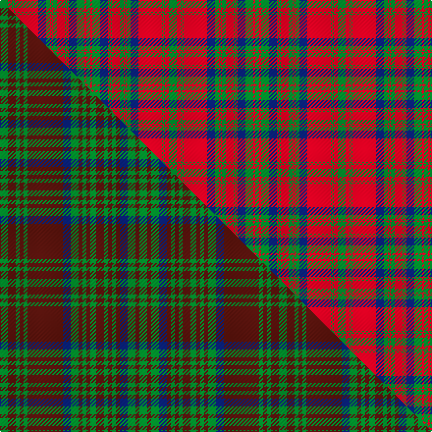

This is one **variant** — a specific cloth: this exact thread count and colourway, with its own
provenance below. It is one weaving of the [sett](/setts/g8r4g1r1g1r24db8g4r1g1r1g4r8g1r1g1r1db8g8r2g4/) (the scale-free proportion — the
same cloth at any scale or shade), whose colour order is pattern [GRGBRGRGRGRGRGBRGRGRG](/stripes/grgbrgrgrgrgrgbrgrgrg/).

Part of the [Matheson](/tartans/m/ma/matheson/) tartan — the named design grouping this sett with its other cloths.

Sourced from weddslist.  It is a [21 stripe tartan](/stripes/stripes21/).

Original link [http://www.weddslist.com/cgi-bin/tartans/pg.pl?source=rb](http://www.weddslist.com/cgi-bin/tartans/pg.pl?source=rb)

2 attestations — the source records this cloth was collapsed from (oldest owns this page)

<ul>
<li>undated — Matheson (weddslist, <a href="http://www.weddslist.com/cgi-bin/tartans/pg.pl?source=rb">record</a>) </li>
<li>undated — Matheson (weddslist, <a href="http://www.weddslist.com/cgi-bin/tartans/pg.pl?source=x">record</a>) </li>
</ul>

Dataset <small>— provenance for this record, inherited from the source manifest</small>

<dl class="dataset-prov">
<dt>source</dt><dd><a href="/sources/weddslist/">Weddslist</a></dd>
<dt>data captured from</dt><dd><a href="https://github.com/thetartan/tartan-database/blob/master/data/weddslist/data.csv">https://github.com/thetartan/tartan-database/blob/master/data/weddslist/data.csv</a></dd>
<dt>data date</dt><dd>2016-11-17 <small>(dataset default)</small></dd>
<dt>licence</dt><dd><a href="https://creativecommons.org/licenses/by-nc-nd/4.0/">CC BY-NC-ND 4.0</a></dd>
</dl>

Capture chain <small>— the hands this data passed through, oldest first; each capture carries its own licence</small>

<ol class="capture-chain">
<li><a href="https://www.weddslist.com/tartans/">Weddslist</a> <small>the living privately compiled reference</small></li>
<li><a href="https://github.com/thetartan/tartan-database">thetartan/tartan-database</a> <small>2016-2017</small> · <a href="https://creativecommons.org/licenses/by-nc-nd/4.0/">CC BY-NC-ND 4.0</a> <small>Levko Kravets's frozen compilation — the capture we vendored, and where its CC licence text came from</small></li>
<li>this dictionary <small>captured 2026-06-10 · commit 5bf86c7566</small> <small>each re-capture is a git commit to data/sources</small></li>
</ol>

## Thread count
G/8 R4 G1 R1 G1 R24 DB8 G4 R1 G1 R1 G4 R8 G1 R1 G1 R1 DB8 G8 R2 G/4

One full sett is **172 threads**.

## Palette
<table><thead><tr><th>Colour</th><th>Shade</th><th>OKLCh</th></tr></thead><tbody><tr><td>DB</td><td><code style="background-color:#082077;">#082077</code> <small style="color:#888">#082077</small></td><td><small style="color:#888">oklch(30.0% 0.149 265.1)</small></td></tr><tr><td>G</td><td><code style="background-color:#008B2A;">#008B2A</code> <small style="color:#888">#008B2A</small></td><td><small style="color:#888">oklch(55.4% 0.170 145.9)</small></td></tr><tr><td>R</td><td><code style="background-color:#D60020;">#D60020</code> <small style="color:#888">#D60020</small></td><td><small style="color:#888">oklch(55.2% 0.224 25.5)</small></td></tr></tbody></table>

# Sample pattern

## Compared to the master

This cloth is one sett of its design; the master sett (the exemplar the design is anchored on) is below for comparison.

Its **ΔTartan distance** from the master is **0.62** — the same measure the nearest-tartans table ranks by (0 is identical; a re-scale of the same cloth is near 0, a recolour or a different proportion further).

<figure class="master-compare" style="margin:0">

this sett
master sett ★

<figcaption style="color:#888;font-size:smaller">One weave of this sett against the <a href="/setts/g4dr4g2dr2g2dr18db4g4dr2g2dr2g3dr4g2dr2g2dr2db4g4dr2g4/">master sett ★</a>, split on the diagonal: a shared proportion runs seamlessly across it with only the shades shifting; a different proportion breaks on it.</figcaption>
</figure>

## Nearest tartan variants

The nearest existing variants by ΔTartan distance, with this cloth at the top so the swatches line up against it.

ΔTartan

Threads

Variant

Sett

—

172

<a href="/variants/s21/g8r4g1r1g1r24db8g4r1g1r1g4r8g1r1g1r1db8g8r2g4/">Matheson</a>

<a href="/ttd/edit/#slug=g8r4g1r1g1r24db8g4r1g1r1g4r8g1r1g1r1db8g8r2g4~x2&amp;base=g8r4g1r1g1r24db8g4r1g1r1g4r8g1r1g1r1db8g8r2g4" title="compare in the TTD">0.00</a>

344

<a href="/variants/s21/g8r4g1r1g1r24db8g4r1g1r1g4r8g1r1g1r1db8g8r2g4~x2/">Matheson</a>

<a href="/ttd/edit/#slug=dg8r4dg1r1dg1r24db8dg4r1dg1r1dg4r8dg1r1dg1r1db8dg8r2dg4~x2&amp;base=g8r4g1r1g1r24db8g4r1g1r1g4r8g1r1g1r1db8g8r2g4" title="compare in the TTD">0.16</a>

344

<a href="/variants/s21/dg8r4dg1r1dg1r24db8dg4r1dg1r1dg4r8dg1r1dg1r1db8dg8r2dg4~x2/">Matheson Clan Tartan</a>

<a href="/ttd/edit/#slug=g8r4g1r1g1r14db8g4r1g1r1g4r8g1r1g1r1db8g8r2g4~x4&amp;base=g8r4g1r1g1r24db8g4r1g1r1g4r8g1r1g1r1db8g8r2g4" title="compare in the TTD">0.28</a>

608

<a href="/variants/s21/g8r4g1r1g1r14db8g4r1g1r1g4r8g1r1g1r1db8g8r2g4~x4/">Matheson (Clan)</a>

<a href="/ttd/edit/#slug=g18r2g18r18g2r4g2r18db18r2db18r18db1r1db2r1db1r18db1r1g2r1db1r18g18r2g18~x2&amp;base=g8r4g1r1g1r24db8g4r1g1r1g4r8g1r1g1r1db8g8r2g4" title="compare in the TTD">1.89</a>

824

<a href="/variants/s27/g18r2g18r18g2r4g2r18db18r2db18r18db1r1db2r1db1r18db1r1g2r1db1r18g18r2g18~x2/">Ross (Clan)</a>

<a href="/ttd/edit/#slug=g18r2g18r18g2r4g2r18db18r2db18r18db1r1db2r1db1r18db1r1db2r1db1r18g18r2g18~x2&amp;base=g8r4g1r1g1r24db8g4r1g1r1g4r8g1r1g1r1db8g8r2g4" title="compare in the TTD">1.91</a>

824

<a href="/variants/s27/g18r2g18r18g2r4g2r18db18r2db18r18db1r1db2r1db1r18db1r1db2r1db1r18g18r2g18~x2/">Ross Clan Tartan</a>

<a href="/ttd/edit/#slug=g18r2g18r18g2r4g2r18db18r2db18r18db1r1db2r1db1r18db1r1db2r1db1r18g18r2g18&amp;base=g8r4g1r1g1r24db8g4r1g1r1g4r8g1r1g1r1db8g8r2g4" title="compare in the TTD">1.91</a>

412

<a href="/variants/s27/g18r2g18r18g2r4g2r18db18r2db18r18db1r1db2r1db1r18db1r1db2r1db1r18g18r2g18/">Ross</a>

<a href="/ttd/edit/#slug=g8r4g1r1g1r24dp8g4r1g1r1g4r8g1r1g1r1dp8g8r2g4~x2&amp;base=g8r4g1r1g1r24db8g4r1g1r1g4r8g1r1g1r1db8g8r2g4" title="compare in the TTD">2.00</a>

344

<a href="/variants/s21/g8r4g1r1g1r24dp8g4r1g1r1g4r8g1r1g1r1dp8g8r2g4~x2/">Matheson Dress</a>

<a href="/ttd/edit/#slug=db18r2db18r18g2r4g2r18g18r2g18r2g18r18db1r1db2r1db1r18~x2&amp;base=g8r4g1r1g1r24db8g4r1g1r1g4r8g1r1g1r1db8g8r2g4" title="compare in the TTD">2.12</a>

656

<a href="/variants/s20/db18r2db18r18g2r4g2r18g18r2g18r2g18r18db1r1db2r1db1r18~x2/">Ross</a>

<a href="/ttd/edit/#slug=db4r1db1r4db12r4db1r1g4r1db1r26db26r4g4r26g21r13db6r5g1~x2&amp;base=g8r4g1r1g1r24db8g4r1g1r1g4r8g1r1g1r1db8g8r2g4" title="compare in the TTD">2.28</a>

654

<a href="/variants/s21/db4r1db1r4db12r4db1r1g4r1db1r26db26r4g4r26g21r13db6r5g1~x2/">Murray of Tullibardine (plaid)</a>

<a href="/ttd/edit/#slug=r3db2lb1r2g24r4g2r2db8r2g2r24db2lb1r2g2~x2&amp;base=g8r4g1r1g1r24db8g4r1g1r1g4r8g1r1g1r1db8g8r2g4" title="compare in the TTD">2.38</a>

322

<a href="/variants/s16/r3db2lb1r2g24r4g2r2db8r2g2r24db2lb1r2g2~x2/">Stewart of Appin - 1906</a>

## Neighbour map

Every grey dot is one of 13656 variants placed by the first two principal components of the ΔTartan feature space (42% of its variance). Red is this tartan; blue dots are its nearest — click one to open its page. The map is a flat projection of a many-dimensional space — [how to read it](/posts/neighbourhood-maps/).

<svg viewBox="0 0 640 380" role="img" style="max-width:100%;height:auto;border:1px solid #e0e0e0;border-radius:4px;display:block" xmlns="http://www.w3.org/2000/svg"><image href="/nn/cloud.v1.png" width="640" height="380"/><a href="/variants/s21/g8r4g1r1g1r24db8g4r1g1r1g4r8g1r1g1r1db8g8r2g4~x2/"><circle cx="307.6" cy="119.0" r="4" fill="#3465a4"><title>Matheson</title></circle></a><a href="/variants/s21/dg8r4dg1r1dg1r24db8dg4r1dg1r1dg4r8dg1r1dg1r1db8dg8r2dg4~x2/"><circle cx="317.2" cy="118.3" r="4" fill="#3465a4"><title>Matheson Clan Tartan</title></circle></a><a href="/variants/s21/g8r4g1r1g1r14db8g4r1g1r1g4r8g1r1g1r1db8g8r2g4~x4/"><circle cx="248.9" cy="160.0" r="4" fill="#3465a4"><title>Matheson (Clan)</title></circle></a><a href="/variants/s27/g18r2g18r18g2r4g2r18db18r2db18r18db1r1db2r1db1r18db1r1g2r1db1r18g18r2g18~x2/"><circle cx="277.5" cy="134.1" r="4" fill="#3465a4"><title>Ross (Clan)</title></circle></a><a href="/variants/s27/g18r2g18r18g2r4g2r18db18r2db18r18db1r1db2r1db1r18db1r1db2r1db1r18g18r2g18~x2/"><circle cx="276.0" cy="133.8" r="4" fill="#3465a4"><title>Ross Clan Tartan</title></circle></a><a href="/variants/s27/g18r2g18r18g2r4g2r18db18r2db18r18db1r1db2r1db1r18db1r1db2r1db1r18g18r2g18/"><circle cx="276.0" cy="133.8" r="4" fill="#3465a4"><title>Ross</title></circle></a><a href="/variants/s21/g8r4g1r1g1r24dp8g4r1g1r1g4r8g1r1g1r1dp8g8r2g4~x2/"><circle cx="319.5" cy="120.4" r="4" fill="#3465a4"><title>Matheson Dress</title></circle></a><a href="/variants/s20/db18r2db18r18g2r4g2r18g18r2g18r2g18r18db1r1db2r1db1r18~x2/"><circle cx="273.6" cy="151.4" r="4" fill="#3465a4"><title>Ross</title></circle></a><a href="/variants/s21/db4r1db1r4db12r4db1r1g4r1db1r26db26r4g4r26g21r13db6r5g1~x2/"><circle cx="321.2" cy="114.6" r="4" fill="#3465a4"><title>Murray of Tullibardine (plaid)</title></circle></a><a href="/variants/s16/r3db2lb1r2g24r4g2r2db8r2g2r24db2lb1r2g2~x2/"><circle cx="306.9" cy="104.6" r="4" fill="#3465a4"><title>Stewart of Appin - 1906</title></circle></a><circle cx="307.6" cy="119.0" r="5" fill="#c00000"/><text x="320" y="376" text-anchor="middle" font-size="11" fill="#999">ground</text><text x="11" y="190" text-anchor="middle" font-size="11" fill="#999" transform="rotate(-90 11 190)">complexity</text></svg>

ID: /variants/s21/g8r4g1r1g1r24db8g4r1g1r1g4r8g1r1g1r1db8g8r2g4/
