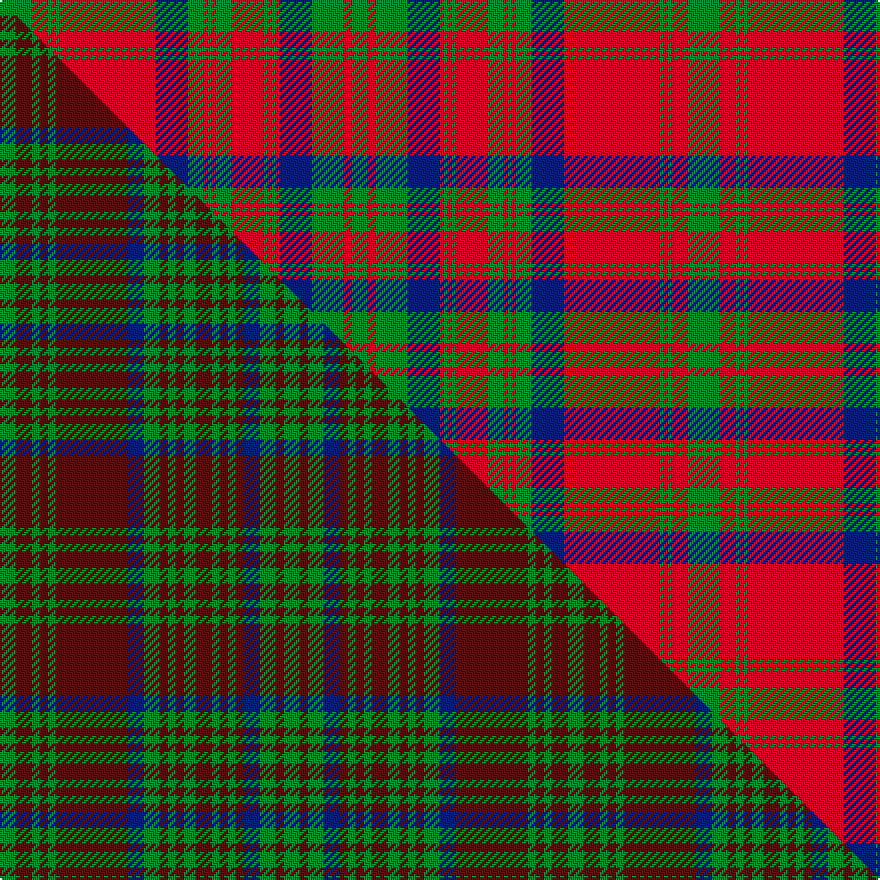

This page is one **sett** — a single exact thread-count. It belongs to the [tartan](/setts/g8r4g1r1g1r24db8g4r1g1r1g4r8g1r1g1r1db8g8r2g4/)
(the same proportion at any scale), whose colour order is pattern [GRGBRGRGRGRGRGBRGRGRG](/stripes/grgbrgrgrgrgrgbrgrgrg/).

Part of the [Matheson](/tartans/matheson/) tartan — the named design grouping this sett with its other cloths.

Sourced from weddslist.  It is a [21 stripe tartan](/stripes/stripes21/).

Original link http://www.weddslist.com/cgi-bin/tartans/pg.pl?source=sts

2 attestations — the source records this cloth was collapsed from (oldest owns this page)

<ul>
<li>undated — Matheson (weddslist, <a href="http://www.weddslist.com/cgi-bin/tartans/pg.pl?source=sts">record</a>) </li>
<li>undated — Matheson (weddslist, <a href="http://www.weddslist.com/cgi-bin/tartans/pg.pl?source=tinsel">record</a>) </li>
</ul>

## Thread count
G/16 R8 G2 R2 G2 R48 DB16 G8 R2 G2 R2 G8 R16 G2 R2 G2 R2 DB16 G16 R4 G/8

One full sett is **344 threads**.

## Palette
<table><thead><tr><th>Colour</th><th>Shade</th><th>OKLCh</th></tr></thead><tbody><tr><td>DB</td><td><code style="background-color:#082077;">#082077</code> <small style="color:#888">#082077</small></td><td><small style="color:#888">oklch(30.0% 0.149 265.1)</small></td></tr><tr><td>G</td><td><code style="background-color:#008B2A;">#008B2A</code> <small style="color:#888">#008B2A</small></td><td><small style="color:#888">oklch(55.4% 0.170 145.9)</small></td></tr><tr><td>R</td><td><code style="background-color:#D60020;">#D60020</code> <small style="color:#888">#D60020</small></td><td><small style="color:#888">oklch(55.2% 0.224 25.5)</small></td></tr></tbody></table>

# Sample pattern

## Compared to the master

This cloth is one sett of its design; the master sett (the exemplar the design is anchored on) is below for comparison.

Its **ΔTartan distance** from the master is **2.59** — the same measure the nearest-tartans table ranks by (0 is identical; a re-scale of the same cloth is near 0, a recolour or a different proportion further).

<figure class="master-compare" style="margin:0">

this sett
master sett ★

<figcaption style="color:#888;font-size:smaller">One weave of this sett against the <a href="/setts/g4dr4g2dr2g2dr18db4g4dr2g2dr2g3dr4g2dr2g2dr2db4g4dr2g4/">master sett ★</a>, split on the diagonal: a shared proportion runs seamlessly across it with only the shades shifting; a different proportion breaks on it.</figcaption>
</figure>

## Nearest tartan variants

The nearest existing variants by ΔTartan distance, with this cloth at the top so the swatches line up against it.

ΔTartan

Threads

Variant

Sett

—

344

<a href="/variants/s21/g8r4g1r1g1r24db8g4r1g1r1g4r8g1r1g1r1db8g8r2g4~x2/">Matheson</a>

<a href="/ttd/edit/#slug=g8r4g1r1g1r24db8g4r1g1r1g4r8g1r1g1r1db8g8r2g4&amp;base=g8r4g1r1g1r24db8g4r1g1r1g4r8g1r1g1r1db8g8r2g4~x2" title="compare in the TTD">0.00</a>

172

<a href="/variants/s21/g8r4g1r1g1r24db8g4r1g1r1g4r8g1r1g1r1db8g8r2g4/">Matheson</a>

<a href="/ttd/edit/#slug=dg8r4dg1r1dg1r24db8dg4r1dg1r1dg4r8dg1r1dg1r1db8dg8r2dg4~x2&amp;base=g8r4g1r1g1r24db8g4r1g1r1g4r8g1r1g1r1db8g8r2g4~x2" title="compare in the TTD">0.00</a>

344

<a href="/variants/s21/dg8r4dg1r1dg1r24db8dg4r1dg1r1dg4r8dg1r1dg1r1db8dg8r2dg4~x2/">Matheson Clan Tartan</a>

<a href="/ttd/edit/#slug=g8r4g1r1g1r14db8g4r1g1r1g4r8g1r1g1r1db8g8r2g4~x4&amp;base=g8r4g1r1g1r24db8g4r1g1r1g4r8g1r1g1r1db8g8r2g4~x2" title="compare in the TTD">0.31</a>

608

<a href="/variants/s21/g8r4g1r1g1r14db8g4r1g1r1g4r8g1r1g1r1db8g8r2g4~x4/">Matheson (Clan)</a>

<a href="/ttd/edit/#slug=g8r4g1r1g1r24dp8g4r1g1r1g4r8g1r1g1r1dp8g8r2g4~x2&amp;base=g8r4g1r1g1r24db8g4r1g1r1g4r8g1r1g1r1db8g8r2g4~x2" title="compare in the TTD">2.00</a>

344

<a href="/variants/s21/g8r4g1r1g1r24dp8g4r1g1r1g4r8g1r1g1r1dp8g8r2g4~x2/">Matheson Dress</a>

<a href="/ttd/edit/#slug=r8g3r1g1r1g22db8g3r1g1r1g3r6g1r1g1r2db6g5r3g4~x2&amp;base=g8r4g1r1g1r24db8g4r1g1r1g4r8g1r1g1r1db8g8r2g4~x2" title="compare in the TTD">2.79</a>

304

<a href="/variants/s21/r8g3r1g1r1g22db8g3r1g1r1g3r6g1r1g1r2db6g5r3g4~x2/">Matheson Hunting (STS incomplete sett)</a>

## Neighbour map

Every grey dot is one of 13620 variants placed by the first two principal components of the ΔTartan feature space (42% of its variance). Red is this tartan; blue dots are its nearest — click one to open its page.

<svg viewBox="0 0 640 380" role="img" style="max-width:100%;height:auto;border:1px solid #e0e0e0;border-radius:4px;display:block" xmlns="http://www.w3.org/2000/svg"><image href="/nn/cloud.v1.png" width="640" height="380"/><a href="/variants/s21/g8r4g1r1g1r24db8g4r1g1r1g4r8g1r1g1r1db8g8r2g4/"><circle cx="307.4" cy="119.3" r="4" fill="#3465a4"><title>Matheson</title></circle></a><a href="/variants/s21/dg8r4dg1r1dg1r24db8dg4r1dg1r1dg4r8dg1r1dg1r1db8dg8r2dg4~x2/"><circle cx="317.0" cy="118.6" r="4" fill="#3465a4"><title>Matheson Clan Tartan</title></circle></a><a href="/variants/s21/g8r4g1r1g1r14db8g4r1g1r1g4r8g1r1g1r1db8g8r2g4~x4/"><circle cx="248.8" cy="160.3" r="4" fill="#3465a4"><title>Matheson (Clan)</title></circle></a><a href="/variants/s21/g8r4g1r1g1r24dp8g4r1g1r1g4r8g1r1g1r1dp8g8r2g4~x2/"><circle cx="319.2" cy="120.8" r="4" fill="#3465a4"><title>Matheson Dress</title></circle></a><a href="/variants/s21/r8g3r1g1r1g22db8g3r1g1r1g3r6g1r1g1r2db6g5r3g4~x2/"><circle cx="332.2" cy="127.4" r="4" fill="#3465a4"><title>Matheson Hunting (STS incomplete sett)</title></circle></a><circle cx="307.4" cy="119.3" r="5" fill="#c00000"/><text x="320" y="376" text-anchor="middle" font-size="11" fill="#999">ground</text><text x="11" y="190" text-anchor="middle" font-size="11" fill="#999" transform="rotate(-90 11 190)">complexity</text></svg>

ID: /variants/s21/g8r4g1r1g1r24db8g4r1g1r1g4r8g1r1g1r1db8g8r2g4~x2/
