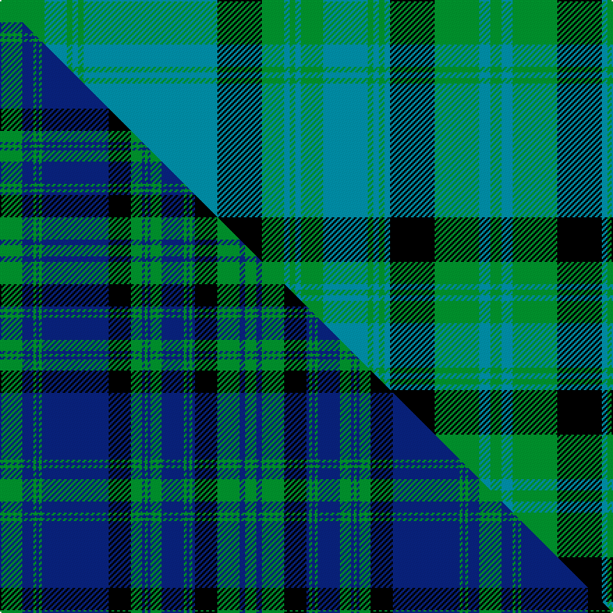

This is one **variant** — a specific cloth: this exact thread count and colourway, with its own
provenance below. It is one weaving of the [sett](/tartans/m/ma/matheson-hunting-3/) (the scale-free proportion — the
same cloth at any scale or shade), whose colour order is pattern [GBGBGBKGBGBGBGBGBKGBG](/stripes/gbgbgbkgbgbgbgbgbkgbg/).

Part of the [Matheson Hunting](/tartans/m/ma/matheson-hunting-3/) tartan — the named design grouping this sett with its other cloths.

Sourced from tartans-authority.  It is a [21 stripe tartan](/stripes/stripes21/).

Original link <code>http://www.tartansauthority.com/tartan-ferret/display/693/</code> — retired · [Internet Archive copy](https://web.archive.org/web/*/http://www.tartansauthority.com/tartan-ferret/display/693/*)

Dataset <small>— provenance for this record, inherited from the source manifest</small>

<dl class="dataset-prov">
<dt>source</dt><dd><a href="/sources/tartans-authority/">Scottish Tartans Authority</a></dd>
<dt>data captured from</dt><dd><a href="https://github.com/thetartan/tartan-database/blob/master/data/tartans-authority/data.csv">https://github.com/thetartan/tartan-database/blob/master/data/tartans-authority/data.csv</a></dd>
<dt>data date</dt><dd>pre 1906 <small>(this record)</small></dd>
<dt>licence</dt><dd><a href="https://creativecommons.org/licenses/by-nc-nd/4.0/">CC BY-NC-ND 4.0</a></dd>
</dl>

Capture chain <small>— the hands this data passed through, oldest first; each capture carries its own licence</small>

<ol class="capture-chain">
<li><a href="https://www.tartansauthority.com/">Scottish Tartans Authority</a> <small>the heritage body’s archive — its tartan-ferret record browser is retired; dead record links are shown unlinked, with an Internet Archive copy (ITI numbers are not SRT references)</small></li>
<li><a href="https://github.com/thetartan/tartan-database">thetartan/tartan-database</a> <small>2016-2017</small> · <a href="https://creativecommons.org/licenses/by-nc-nd/4.0/">CC BY-NC-ND 4.0</a> <small>Levko Kravets's frozen compilation — the capture we vendored, and where its CC licence text came from</small></li>
<li>this dictionary <small>captured 2026-06-10 · commit 5bf86c7566</small> <small>each re-capture is a git commit to data/sources</small></li>
</ol>

## Register references

External register numbers recorded for this tartan.

- Scottish Tartans Authority (ITI): 693

## Thread count
G/32 T16 G4 T4 G4 T96 K32 G16 T4 G4 T4 G16 T32 G4 T4 G4 T4 K32 G32 T8 G/8

One full sett is **680 threads**.

## Palette
<table><thead><tr><th>Colour</th><th>Shade</th><th>OKLCh</th></tr></thead><tbody><tr><td>T</td><td><code style="background-color:#00879F;">#00879F</code> <small style="color:#888">#00879F</small></td><td><small style="color:#888">oklch(57.4% 0.102 216.1)</small></td></tr><tr><td>G</td><td><code style="background-color:#008B2A;">#008B2A</code> <small style="color:#888">#008B2A</small></td><td><small style="color:#888">oklch(55.4% 0.170 145.9)</small></td></tr><tr><td>K</td><td><code style="background-color:#000000;">#000000</code> <small style="color:#888">#000000</small></td><td><small style="color:#888">oklch(0.0% 0.000 0.0)</small></td></tr></tbody></table>

# Sample pattern

## Compared to the master

This cloth is one sett of its design; the master sett (the exemplar the design is anchored on) is below for comparison.

Its **ΔTartan distance** from the master is **0.24** — the same measure the nearest-tartans table ranks by (0 is identical; a re-scale of the same cloth is near 0, a recolour or a different proportion further).

<figure class="master-compare" style="margin:0">

this sett
master sett ★

<figcaption style="color:#888;font-size:smaller">One weave of this sett against the <a href="/setts/g8db4g1db1g1db24k8g4db1g1db1g4db8g1db1g1db1k8g8db2g4/">master sett ★</a>, split on the diagonal: a shared proportion runs seamlessly across it with only the shades shifting; a different proportion breaks on it.</figcaption>
</figure>

## Nearest tartan variants

The nearest existing variants by ΔTartan distance, with this cloth at the top so the swatches line up against it.

ΔTartan

Threads

Variant

Sett

—

680

<a href="/variants/s21/g8t4g1t1g1t24k8g4t1g1t1g4t8g1t1g1t1k8g8t2g2~x4/">Matheson Htg (Clan)</a>

<a href="/ttd/edit/#slug=g8db4g1db1g1db24k8g4db1g1db1g4db8g1db1g1db1k8g8db2g4~x2&amp;base=g8t4g1t1g1t24k8g4t1g1t1g4t8g1t1g1t1k8g8t2g2~x4" title="compare in the TTD">0.24</a>

344

<a href="/variants/s21/g8db4g1db1g1db24k8g4db1g1db1g4db8g1db1g1db1k8g8db2g4~x2/">Matheson Hunting</a>

<a href="/ttd/edit/#slug=k16t1k1t1k1t9g18t1~x4&amp;base=g8t4g1t1g1t24k8g4t1g1t1g4t8g1t1g1t1k8g8t2g2~x4" title="compare in the TTD">2.56</a>

316

<a href="/variants/s8/k16t1k1t1k1t9g18t1~x4/">Kelvingrove</a>

<a href="/ttd/edit/#slug=r4db2g7db15g3db3g3db7g28k7g6k2~x2&amp;base=g8t4g1t1g1t24k8g4t1g1t1g4t8g1t1g1t1k8g8t2g2~x4" title="compare in the TTD">3.50</a>

336

<a href="/variants/s12/r4db2g7db15g3db3g3db7g28k7g6k2~x2/">Walker Hunting</a>

<a href="/ttd/edit/#slug=db28k1db1k1db3k12g24y1g1y2g1y1g24k12db18k1db4&amp;base=g8t4g1t1g1t24k8g4t1g1t1g4t8g1t1g1t1k8g8t2g2~x4" title="compare in the TTD">3.70</a>

238

<a href="/variants/s17/db28k1db1k1db3k12g24y1g1y2g1y1g24k12db18k1db4/">Gordon VS</a>

<a href="/ttd/edit/#slug=db28k1db1k1db3k12g24y1g1y2g1y1g24k12db18k1db4~x2&amp;base=g8t4g1t1g1t24k8g4t1g1t1g4t8g1t1g1t1k8g8t2g2~x4" title="compare in the TTD">3.70</a>

476

<a href="/variants/s17/db28k1db1k1db3k12g24y1g1y2g1y1g24k12db18k1db4~x2/">Gordon Old Clan/Family Tartan</a>

<a href="/ttd/edit/#slug=g2db1lb6db10g4db1g1r1g1db1g18r1g4db6lb6db1~x4&amp;base=g8t4g1t1g1t24k8g4t1g1t1g4t8g1t1g1t1k8g8t2g2~x4" title="compare in the TTD">3.83</a>

500

<a href="/variants/s16/g2db1lb6db10g4db1g1r1g1db1g18r1g4db6lb6db1~x4/">Tiger</a>

<a href="/ttd/edit/#slug=g2db1lb6db6g4r1g18db1g1r1g1db1g4db10lb6db1~x4&amp;base=g8t4g1t1g1t24k8g4t1g1t1g4t8g1t1g1t1k8g8t2g2~x4" title="compare in the TTD">3.83</a>

500

<a href="/variants/s16/g2db1lb6db6g4r1g18db1g1r1g1db1g4db10lb6db1~x4/">Pina (Corporate)</a>

## Neighbour map

Every grey dot is one of 13657 variants placed by the first two principal components of the ΔTartan feature space (42% of its variance). Red is this tartan; blue dots are its nearest — click one to open its page. The map is a flat projection of a many-dimensional space — [how to read it](/posts/neighbourhood-maps/).

<svg viewBox="0 0 640 380" role="img" style="max-width:100%;height:auto;border:1px solid #e0e0e0;border-radius:4px;display:block" xmlns="http://www.w3.org/2000/svg"><image href="/nn/cloud.v1.png" width="640" height="380"/><a href="/variants/s21/g8db4g1db1g1db24k8g4db1g1db1g4db8g1db1g1db1k8g8db2g4~x2/"><circle cx="264.1" cy="109.4" r="4" fill="#3465a4"><title>Matheson Hunting</title></circle></a><a href="/variants/s8/k16t1k1t1k1t9g18t1~x4/"><circle cx="241.9" cy="137.1" r="4" fill="#3465a4"><title>Kelvingrove</title></circle></a><a href="/variants/s12/r4db2g7db15g3db3g3db7g28k7g6k2~x2/"><circle cx="260.6" cy="129.3" r="4" fill="#3465a4"><title>Walker Hunting</title></circle></a><a href="/variants/s17/db28k1db1k1db3k12g24y1g1y2g1y1g24k12db18k1db4/"><circle cx="219.0" cy="98.7" r="4" fill="#3465a4"><title>Gordon VS</title></circle></a><a href="/variants/s17/db28k1db1k1db3k12g24y1g1y2g1y1g24k12db18k1db4~x2/"><circle cx="219.0" cy="98.7" r="4" fill="#3465a4"><title>Gordon Old Clan/Family Tartan</title></circle></a><a href="/variants/s16/g2db1lb6db10g4db1g1r1g1db1g18r1g4db6lb6db1~x4/"><circle cx="259.5" cy="139.1" r="4" fill="#3465a4"><title>Tiger</title></circle></a><a href="/variants/s16/g2db1lb6db6g4r1g18db1g1r1g1db1g4db10lb6db1~x4/"><circle cx="259.5" cy="139.1" r="4" fill="#3465a4"><title>Pina (Corporate)</title></circle></a><circle cx="270.1" cy="113.1" r="5" fill="#c00000"/><text x="320" y="376" text-anchor="middle" font-size="11" fill="#999">ground</text><text x="11" y="190" text-anchor="middle" font-size="11" fill="#999" transform="rotate(-90 11 190)">complexity</text></svg>

ID: /variants/s21/g8t4g1t1g1t24k8g4t1g1t1g4t8g1t1g1t1k8g8t2g2~x4/
