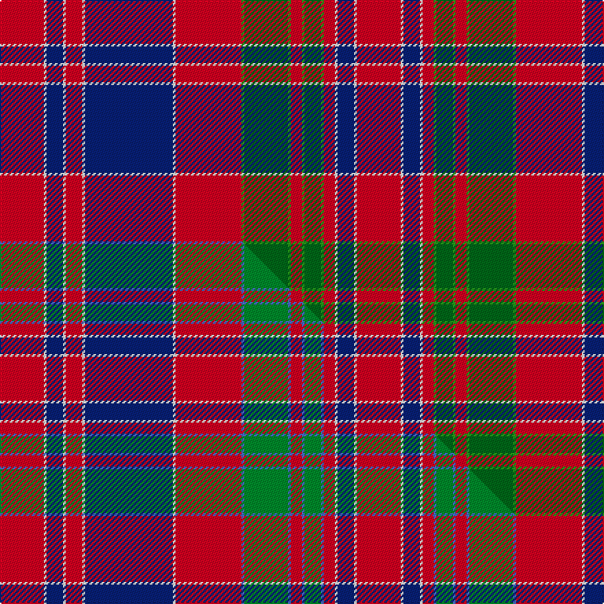

This page is one **sett** — a single exact thread-count. It belongs to the [tartan](/setts/r16w1db6w1r6w1db32w1r24g1dg16g1r4g1dg6g1r4w1db6w1r16/)
(the same proportion at any scale), whose colour order is pattern [RWBWRGGGRGGGRWBWRWBWR](/stripes/rwbwrgggrgggrwbwrwbwr/).

Part of the [MacDonald of Boisdale](/tartans/macdonald-of-boisdale/) tartan — the named design grouping this sett with its other cloths.

Sourced from house-of-tartan.  It is a [21 stripe tartan](/stripes/stripes21/).

Original link [http://www.house-of-tartan.scotland.net/house/TartanViewjs.asp?colr=Def&tnam=1668](http://www.house-of-tartan.scotland.net/house/TartanViewjs.asp?colr=Def&tnam=1668)

## Provenance

Earliest known date: 1810-15 Highland Society of London. The Setts No: 118.

Dataset <small>— provenance for this record, inherited from the source manifest</small>

<dl class="dataset-prov">
<dt>source</dt><dd><a href="/sources/house-of-tartan/">House of Tartan</a></dd>
<dt>data captured from</dt><dd><a href="https://github.com/thetartan/tartan-database/blob/master/data/house-of-tartan/data.csv">https://github.com/thetartan/tartan-database/blob/master/data/house-of-tartan/data.csv</a></dd>
<dt>data date</dt><dd>2017-01-10 <small>(dataset default)</small></dd>
<dt>licence</dt><dd><a href="https://creativecommons.org/licenses/by-nc-nd/4.0/">CC BY-NC-ND 4.0</a></dd>
</dl>

Capture chain <small>— the hands this data passed through, oldest first; each capture carries its own licence</small>

<ol class="capture-chain">
<li><a href="http://www.house-of-tartan.scotland.net/">House of Tartan</a> <small>the weaver/retailer's database — the site is now offline; the URL is kept as the ultimate source's identity</small></li>
<li><a href="https://github.com/thetartan/tartan-database">thetartan/tartan-database</a> <small>2016-2017</small> · <a href="https://creativecommons.org/licenses/by-nc-nd/4.0/">CC BY-NC-ND 4.0</a> <small>Levko Kravets's frozen compilation — the capture we vendored, and where its CC licence text came from</small></li>
<li>this dictionary <small>captured 2026-06-10 · commit 5bf86c7566</small> <small>each re-capture is a git commit to data/sources</small></li>
</ol>

## Thread count
R/32 W2 DB12 W2 R12 W2 DB64 W2 R48 G2 DG32 G2 R8 G2 DG12 G2 R8 W2 DB12 W2 R/32

One full sett is **520 threads**.

## Palette
<table><thead><tr><th>Colour</th><th>Shade</th><th>OKLCh</th></tr></thead><tbody><tr><td>DB</td><td><code style="background-color:#082077;">#082077</code> <small style="color:#888">#082077</small></td><td><small style="color:#888">oklch(30.0% 0.149 265.1)</small></td></tr><tr><td>DG</td><td><code style="background-color:#006818;">#006818</code> <small style="color:#888">#006818</small></td><td><small style="color:#888">oklch(45.0% 0.142 145.0)</small></td></tr><tr><td>G</td><td><code style="background-color:#289C18;">#289C18</code> <small style="color:#888">#289C18</small></td><td><small style="color:#888">oklch(60.6% 0.191 141.6)</small></td></tr><tr><td>W</td><td><code style="background-color:#F7F7F7;">#F7F7F7</code> <small style="color:#888">#F7F7F7</small></td><td><small style="color:#888">oklch(97.6% 0.000 89.9)</small></td></tr><tr><td>R</td><td><code style="background-color:#D60020;">#D60020</code> <small style="color:#888">#D60020</small></td><td><small style="color:#888">oklch(55.2% 0.224 25.5)</small></td></tr></tbody></table>

# Sample pattern

## Compared to the master

This cloth is one sett of its design; the master sett (the exemplar the design is anchored on) is below for comparison.

Its **ΔTartan distance** from the master is **1.20** — the same measure the nearest-tartans table ranks by (0 is identical; a re-scale of the same cloth is near 0, a recolour or a different proportion further).

<figure class="master-compare" style="margin:0">

this sett
master sett ★

<figcaption style="color:#888;font-size:smaller">One weave of this sett against the <a href="/setts/r16w1db6w1r6w1db32w1r24b1g16b1r4b1g6b1r4w1db6w1r16/">master sett ★</a>, split on the diagonal: a shared proportion runs seamlessly across it with only the shades shifting; a different proportion breaks on it.</figcaption>
</figure>

## Nearest tartan variants

The nearest existing variants by ΔTartan distance, with this cloth at the top so the swatches line up against it.

ΔTartan

Threads

Variant

Sett

—

520

<a href="/variants/s21/r16w1db6w1r6w1db32w1r24g1dg16g1r4g1dg6g1r4w1db6w1r16~x2~g2408144-dg1806142/">MacDonald of Boisdale Clan Tartan</a>

<a href="/ttd/edit/#slug=r16w1db6w1r6w1db32w1r24b1g16b1r4b1g6b1r4w1db6w1r16~x2&amp;base=r16w1db6w1r6w1db32w1r24g1dg16g1r4g1dg6g1r4w1db6w1r16~x2~g2408144-dg1806142" title="compare in the TTD">1.20</a>

520

<a href="/variants/s21/r16w1db6w1r6w1db32w1r24b1g16b1r4b1g6b1r4w1db6w1r16~x2/">MacDonald of Boisdale</a>

<a href="/ttd/edit/#slug=db16r1db2r3db1r9db1r3db2r1db6g3lb3g5r28w3r3w3~x2&amp;base=r16w1db6w1r6w1db32w1r24g1dg16g1r4g1dg6g1r4w1db6w1r16~x2~g2408144-dg1806142" title="compare in the TTD">1.58</a>

334

<a href="/variants/s18/db16r1db2r3db1r9db1r3db2r1db6g3lb3g5r28w3r3w3~x2/">Bahrain, Royal</a>

<a href="/ttd/edit/#slug=db3dp12w6r6g46r14g6r14db14dp8w6r6w6dp8g12r16g12r6db6r86dp10w6r10db3&amp;base=r16w1db6w1r6w1db32w1r24g1dg16g1r4g1dg6g1r4w1db6w1r16~x2~g2408144-dg1806142" title="compare in the TTD">1.89</a>

638

<a href="/variants/s24/db3dp12w6r6g46r14g6r14db14dp8w6r6w6dp8g12r16g12r6db6r86dp10w6r10db3/">MacDougall Plaid</a>

<a href="/ttd/edit/#slug=r16lr1db7lr1r6lr1db34lr1r26g1dg16g1r4g1dg7g1r4lr1db7lr1r16~x2~g2408144-dg1806142&amp;base=r16w1db6w1r6w1db32w1r24g1dg16g1r4g1dg6g1r4w1db6w1r16~x2~g2408144-dg1806142" title="compare in the TTD">1.90</a>

548

<a href="/variants/s21/r16lr1db7lr1r6lr1db34lr1r26g1dg16g1r4g1dg7g1r4lr1db7lr1r16~x2~g2408144-dg1806142/">MacDonald of Boisdale</a>

<a href="/ttd/edit/#slug=db19r2g3r2db2r20g1y1r1g2r2db18r2g2r22g3w1r3~x2&amp;base=r16w1db6w1r6w1db32w1r24g1dg16g1r4g1dg6g1r4w1db6w1r16~x2~g2408144-dg1806142" title="compare in the TTD">2.08</a>

380

<a href="/variants/s18/db19r2g3r2db2r20g1y1r1g2r2db18r2g2r22g3w1r3~x2/">Hebridean, South Uist</a>

<a href="/ttd/edit/#slug=lb3ly8r2ly8db11r2ly4ri4r27db1r2db2r2db13r2~x2~r1706009-ri2109032&amp;base=r16w1db6w1r6w1db32w1r24g1dg16g1r4g1dg6g1r4w1db6w1r16~x2~g2408144-dg1806142" title="compare in the TTD">2.37</a>

354

<a href="/variants/s15/lb3ly8r2ly8db11r2ly4ri4r27db1r2db2r2db13r2~x2~r1706009-ri2109032/">Strathdon (District?)</a>

<a href="/ttd/edit/#slug=lb33dy22db4dy22r3m2r3m2r3m2r3m2r3m2r3m2r3dy22db4~x2~r2510029-m2610337&amp;base=r16w1db6w1r6w1db32w1r24g1dg16g1r4g1dg6g1r4w1db6w1r16~x2~g2408144-dg1806142" title="compare in the TTD">2.46</a>

486

<a href="/variants/s19/lb33dy22db4dy22r3m2r3m2r3m2r3m2r3m2r3m2r3dy22db4~x2~r2510029-m2610337/">Commonwealth Games Scotland, Team Scotland 2014</a>

<a href="/ttd/edit/#slug=g10r2db2r30dp3r2w1r2dp3r30db2r2g10r10g10dp4r2dp4db10r4g2r4g30r2dp3w1~x2&amp;base=r16w1db6w1r6w1db32w1r24g1dg16g1r4g1dg6g1r4w1db6w1r16~x2~g2408144-dg1806142" title="compare in the TTD">2.51</a>

718

<a href="/variants/s26/g10r2db2r30dp3r2w1r2dp3r30db2r2g10r10g10dp4r2dp4db10r4g2r4g30r2dp3w1~x2/">MacDougal</a>

<a href="/ttd/edit/#slug=db5r3w2db1w2r3g9y2w1y2g9r1g1r27db1r1db1r27db1r1db9w1db1w4~x2&amp;base=r16w1db6w1r6w1db32w1r24g1dg16g1r4g1dg6g1r4w1db6w1r16~x2~g2408144-dg1806142" title="compare in the TTD">2.59</a>

442

<a href="/variants/s24/db5r3w2db1w2r3g9y2w1y2g9r1g1r27db1r1db1r27db1r1db9w1db1w4~x2/">Hebridean, North Uist</a>

<a href="/ttd/edit/#slug=r5g10r2db2r30dp3r2w1r2dp3r30db2r2g10r10g10dp4r2dp4db10r4g2r4g30r2dp3w1~x2&amp;base=r16w1db6w1r6w1db32w1r24g1dg16g1r4g1dg6g1r4w1db6w1r16~x2~g2408144-dg1806142" title="compare in the TTD">2.64</a>

748

<a href="/variants/s27/r5g10r2db2r30dp3r2w1r2dp3r30db2r2g10r10g10dp4r2dp4db10r4g2r4g30r2dp3w1~x2/">MacDougall - 1970 (H of E)</a>

## Neighbour map

Every grey dot is one of 13621 variants placed by the first two principal components of the ΔTartan feature space (42% of its variance). Red is this tartan; blue dots are its nearest — click one to open its page.

<svg viewBox="0 0 640 380" role="img" style="max-width:100%;height:auto;border:1px solid #e0e0e0;border-radius:4px;display:block" xmlns="http://www.w3.org/2000/svg"><image href="/nn/cloud.v1.png" width="640" height="380"/><a href="/variants/s21/r16w1db6w1r6w1db32w1r24b1g16b1r4b1g6b1r4w1db6w1r16~x2/"><circle cx="264.3" cy="71.0" r="4" fill="#3465a4"><title>MacDonald of Boisdale</title></circle></a><a href="/variants/s18/db16r1db2r3db1r9db1r3db2r1db6g3lb3g5r28w3r3w3~x2/"><circle cx="283.9" cy="77.6" r="4" fill="#3465a4"><title>Bahrain, Royal</title></circle></a><a href="/variants/s24/db3dp12w6r6g46r14g6r14db14dp8w6r6w6dp8g12r16g12r6db6r86dp10w6r10db3/"><circle cx="259.0" cy="67.6" r="4" fill="#3465a4"><title>MacDougall Plaid</title></circle></a><a href="/variants/s21/r16lr1db7lr1r6lr1db34lr1r26g1dg16g1r4g1dg7g1r4lr1db7lr1r16~x2~g2408144-dg1806142/"><circle cx="273.5" cy="71.1" r="4" fill="#3465a4"><title>MacDonald of Boisdale</title></circle></a><a href="/variants/s18/db19r2g3r2db2r20g1y1r1g2r2db18r2g2r22g3w1r3~x2/"><circle cx="297.2" cy="89.5" r="4" fill="#3465a4"><title>Hebridean, South Uist</title></circle></a><a href="/variants/s15/lb3ly8r2ly8db11r2ly4ri4r27db1r2db2r2db13r2~x2~r1706009-ri2109032/"><circle cx="222.5" cy="101.0" r="4" fill="#3465a4"><title>Strathdon (District?)</title></circle></a><a href="/variants/s19/lb33dy22db4dy22r3m2r3m2r3m2r3m2r3m2r3m2r3dy22db4~x2~r2510029-m2610337/"><circle cx="221.4" cy="94.9" r="4" fill="#3465a4"><title>Commonwealth Games Scotland, Team Scotland 2014</title></circle></a><a href="/variants/s26/g10r2db2r30dp3r2w1r2dp3r30db2r2g10r10g10dp4r2dp4db10r4g2r4g30r2dp3w1~x2/"><circle cx="283.8" cy="72.4" r="4" fill="#3465a4"><title>MacDougal</title></circle></a><a href="/variants/s24/db5r3w2db1w2r3g9y2w1y2g9r1g1r27db1r1db1r27db1r1db9w1db1w4~x2/"><circle cx="295.8" cy="56.4" r="4" fill="#3465a4"><title>Hebridean, North Uist</title></circle></a><a href="/variants/s27/r5g10r2db2r30dp3r2w1r2dp3r30db2r2g10r10g10dp4r2dp4db10r4g2r4g30r2dp3w1~x2/"><circle cx="289.9" cy="70.9" r="4" fill="#3465a4"><title>MacDougall - 1970 (H of E)</title></circle></a><circle cx="266.2" cy="71.5" r="5" fill="#c00000"/><text x="320" y="376" text-anchor="middle" font-size="11" fill="#999">ground</text><text x="11" y="190" text-anchor="middle" font-size="11" fill="#999" transform="rotate(-90 11 190)">complexity</text></svg>

ID: /variants/s21/r16w1db6w1r6w1db32w1r24g1dg16g1r4g1dg6g1r4w1db6w1r16~x2~g2408144-dg1806142/
