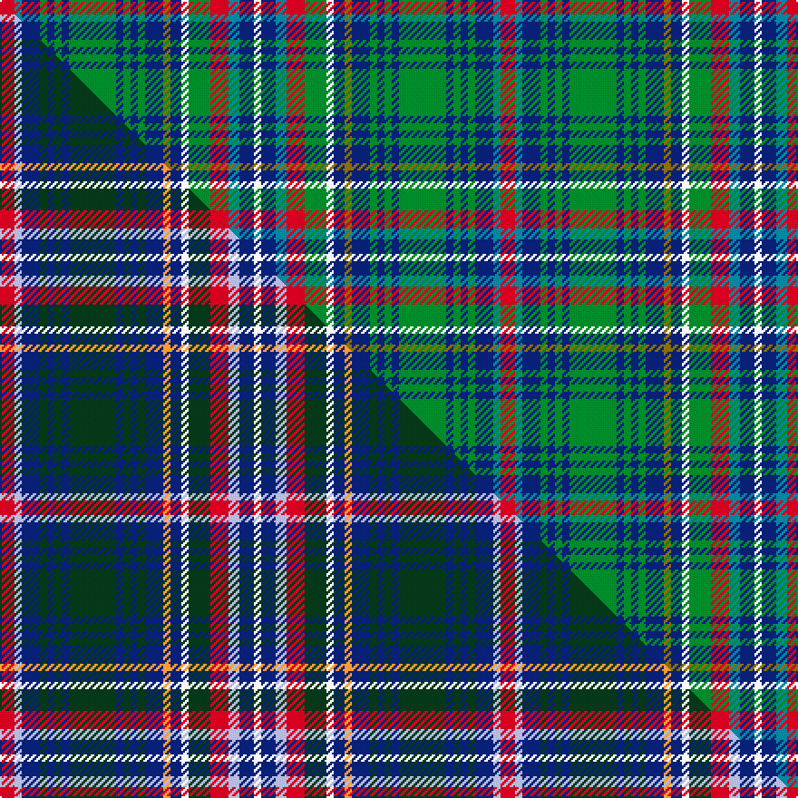

This is one **variant** — a specific cloth: this exact thread count and colourway, with its own
provenance below. It is one weaving of the [sett](/tartans/l/lu/lundie/) (the scale-free proportion — the
same cloth at any scale or shade), whose colour order is pattern [RBBGBGBGBGBGBGBWGRBBW](/stripes/rbbgbgbgbgbgbgbwgrbbw/).

Part of the [Lundie](/tartans/l/lu/lundie/) tartan — the named design grouping this sett with its other cloths.

Sourced from tartans-authority.  It is a [21 stripe tartan](/stripes/stripes21/).

Original link <code>http://www.tartansauthority.com/tartan-ferret/display/10022/</code> — retired · [Internet Archive copy](https://web.archive.org/web/*/http://www.tartansauthority.com/tartan-ferret/display/10022/*)

Dataset <small>— provenance for this record, inherited from the source manifest</small>

<dl class="dataset-prov">
<dt>source</dt><dd><a href="/sources/tartans-authority/">Scottish Tartans Authority</a></dd>
<dt>data captured from</dt><dd><a href="https://github.com/thetartan/tartan-database/blob/master/data/tartans-authority/data.csv">https://github.com/thetartan/tartan-database/blob/master/data/tartans-authority/data.csv</a></dd>
<dt>data date</dt><dd>Dec. 2008 <small>(this record)</small></dd>
<dt>licence</dt><dd><a href="https://creativecommons.org/licenses/by-nc-nd/4.0/">CC BY-NC-ND 4.0</a></dd>
</dl>

Capture chain <small>— the hands this data passed through, oldest first; each capture carries its own licence</small>

<ol class="capture-chain">
<li><a href="https://www.tartansauthority.com/">Scottish Tartans Authority</a> <small>the heritage body’s archive — its tartan-ferret record browser is retired; dead record links are shown unlinked, with an Internet Archive copy (ITI numbers are not SRT references)</small></li>
<li><a href="https://github.com/thetartan/tartan-database">thetartan/tartan-database</a> <small>2016-2017</small> · <a href="https://creativecommons.org/licenses/by-nc-nd/4.0/">CC BY-NC-ND 4.0</a> <small>Levko Kravets's frozen compilation — the capture we vendored, and where its CC licence text came from</small></li>
<li>this dictionary <small>captured 2026-06-10 · commit 5bf86c7566</small> <small>each re-capture is a git commit to data/sources</small></li>
</ol>

## Register references

External register numbers recorded for this tartan.

- Scottish Tartans Authority (ITI): 10022

## Thread count
R/8 T4 DB10 G4 DB4 G4 DB4 G26 DB4 G4 DB4 G4 DB10 Y4 DB6 W4 G12 R10 T6 DB8 W/4

One full sett is **276 threads**.

## Palette
<table><thead><tr><th>Colour</th><th>Shade</th><th>OKLCh</th></tr></thead><tbody><tr><td>T</td><td><code style="background-color:#00879F;">#00879F</code> <small style="color:#888">#00879F</small></td><td><small style="color:#888">oklch(57.4% 0.102 216.1)</small></td></tr><tr><td>DB</td><td><code style="background-color:#082077;">#082077</code> <small style="color:#888">#082077</small></td><td><small style="color:#888">oklch(30.0% 0.149 265.1)</small></td></tr><tr><td>G</td><td><code style="background-color:#008B2A;">#008B2A</code> <small style="color:#888">#008B2A</small></td><td><small style="color:#888">oklch(55.4% 0.170 145.9)</small></td></tr><tr><td>W</td><td><code style="background-color:#F7F7F7;">#F7F7F7</code> <small style="color:#888">#F7F7F7</small></td><td><small style="color:#888">oklch(97.6% 0.000 89.9)</small></td></tr><tr><td>R</td><td><code style="background-color:#D60020;">#D60020</code> <small style="color:#888">#D60020</small></td><td><small style="color:#888">oklch(55.2% 0.224 25.5)</small></td></tr><tr><td>Y</td><td><code style="background-color:#8B6E00;">#8B6E00</code> <small style="color:#888">#8B6E00</small></td><td><small style="color:#888">oklch(55.1% 0.113 90.4)</small></td></tr></tbody></table>

# Sample pattern

## Compared to the master

This cloth is one sett of its design; the master sett (the exemplar the design is anchored on) is below for comparison.

Its **ΔTartan distance** from the master is **0.42** — the same measure the nearest-tartans table ranks by (0 is identical; a re-scale of the same cloth is near 0, a recolour or a different proportion further).

<figure class="master-compare" style="margin:0">

this sett
master sett ★

<figcaption style="color:#888;font-size:smaller">One weave of this sett against the <a href="/setts/r4lb2db5dg2db2dg2db2dg13db2dg2db2dg2db5lo2db3w2dg6r5lb3db4w2/">master sett ★</a>, split on the diagonal: a shared proportion runs seamlessly across it with only the shades shifting; a different proportion breaks on it.</figcaption>
</figure>

## Nearest tartan variants

The nearest existing variants by ΔTartan distance, with this cloth at the top so the swatches line up against it.

ΔTartan

Threads

Variant

Sett

—

276

<a href="/variants/s21/r4t2db5g2db2g2db2g13db2g2db2g2db5y2db3w2g6r5t3db4w2~x2/">Lundie (Personal)</a>

<a href="/ttd/edit/#slug=r4lb2db5dg2db2dg2db2dg13db2dg2db2dg2db5lo2db3w2dg6r5lb3db4w2~x2&amp;base=r4t2db5g2db2g2db2g13db2g2db2g2db5y2db3w2g6r5t3db4w2~x2" title="compare in the TTD">0.42</a>

276

<a href="/variants/s21/r4lb2db5dg2db2dg2db2dg13db2dg2db2dg2db5lo2db3w2dg6r5lb3db4w2~x2/">Lundie</a>

<a href="/ttd/edit/#slug=db6b2db2b2db2dg6g8dg1w2dg1g8o2dg4db8b2db2~x2&amp;base=r4t2db5g2db2g2db2g13db2g2db2g2db5y2db3w2g6r5t3db4w2~x2" title="compare in the TTD">2.70</a>

216

<a href="/variants/s16/db6b2db2b2db2dg6g8dg1w2dg1g8o2dg4db8b2db2~x2/">Forbes, of Druminnor</a>

<a href="/ttd/edit/#slug=db8r2db3r4db13w2dr13w2g13r4g4y2g8~x2&amp;base=r4t2db5g2db2g2db2g13db2g2db2g2db5y2db3w2g6r5t3db4w2~x2" title="compare in the TTD">2.84</a>

280

<a href="/variants/s13/db8r2db3r4db13w2dr13w2g13r4g4y2g8~x2/">Bowie (Dalgety) Family Tartan</a>

<a href="/ttd/edit/#slug=db8r2db3r4db13w2o13w2g13r4g4y2g8~x2&amp;base=r4t2db5g2db2g2db2g13db2g2db2g2db5y2db3w2g6r5t3db4w2~x2" title="compare in the TTD">2.86</a>

280

<a href="/variants/s13/db8r2db3r4db13w2o13w2g13r4g4y2g8~x2/">Bowie</a>

<a href="/ttd/edit/#slug=r3ly3dt18dy15t16w3t16dy15t18ly3r3~x2~ly3307090-dt1204274-dy1603076&amp;base=r4t2db5g2db2g2db2g13db2g2db2g2db5y2db3w2g6r5t3db4w2~x2" title="compare in the TTD">2.88</a>

440

<a href="/variants/s11/r3ly3db18dy15t16w3t16dy15t18ly3r3~x2~ly3307090-db1204274-dy1603076/">Hirter Karo</a>

<a href="/ttd/edit/#slug=db6ly2db2ly2db2do6g8do1w2do1g8dy2do4db8ly2db2~x2&amp;base=r4t2db5g2db2g2db2g13db2g2db2g2db5y2db3w2g6r5t3db4w2~x2" title="compare in the TTD">2.96</a>

216

<a href="/variants/s16/db6ly2db2ly2db2do6g8do1w2do1g8dy2do4db8ly2db2~x2/">Forbes of Druminnor Artifact Tartan</a>

<a href="/ttd/edit/#slug=db9n3db2w2db9n6db3w3db3g18dg8r2~x2&amp;base=r4t2db5g2db2g2db2g13db2g2db2g2db5y2db3w2g6r5t3db4w2~x2" title="compare in the TTD">3.03</a>

250

<a href="/variants/s12/db9n3db2w2db9n6db3w3db3g18dg8r2~x2/">Patterson, William J.M. (Personal)</a>

<a href="/ttd/edit/#slug=g7dy1w1dy1ly1dy7db7dy1db7dy7g7dy1r1~x4&amp;base=r4t2db5g2db2g2db2g13db2g2db2g2db5y2db3w2g6r5t3db4w2~x2" title="compare in the TTD">3.03</a>

360

<a href="/variants/s13/g7dy1w1dy1ly1dy7db7dy1db7dy7g7dy1r1~x4/">Hash House Harriers Hunting (Corp)</a>

<a href="/ttd/edit/#slug=g7dy1w1dy1ly1dy7db7dy1db7dy7g7dy1r1~x4~r2109032&amp;base=r4t2db5g2db2g2db2g13db2g2db2g2db5y2db3w2g6r5t3db4w2~x2" title="compare in the TTD">3.06</a>

360

<a href="/variants/s13/g7dy1w1dy1ly1dy7db7dy1db7dy7g7dy1r1~x4~r2109032/">Hash House Harriers Hunting</a>

<a href="/ttd/edit/#slug=g8r3g3r5g26dy7lb3db28r3db6~x2&amp;base=r4t2db5g2db2g2db2g13db2g2db2g2db5y2db3w2g6r5t3db4w2~x2" title="compare in the TTD">3.17</a>

340

<a href="/variants/s10/g8r3g3r5g26dy7lb3db28r3db6~x2/">Stewart of Appin Hunting</a>

## Neighbour map

Every grey dot is one of 13657 variants placed by the first two principal components of the ΔTartan feature space (42% of its variance). Red is this tartan; blue dots are its nearest — click one to open its page. The map is a flat projection of a many-dimensional space — [how to read it](/posts/neighbourhood-maps/).

<svg viewBox="0 0 640 380" role="img" style="max-width:100%;height:auto;border:1px solid #e0e0e0;border-radius:4px;display:block" xmlns="http://www.w3.org/2000/svg"><image href="/nn/cloud.v1.png" width="640" height="380"/><a href="/variants/s21/r4lb2db5dg2db2dg2db2dg13db2dg2db2dg2db5lo2db3w2dg6r5lb3db4w2~x2/"><circle cx="112.1" cy="164.3" r="4" fill="#3465a4"><title>Lundie</title></circle></a><a href="/variants/s16/db6b2db2b2db2dg6g8dg1w2dg1g8o2dg4db8b2db2~x2/"><circle cx="122.7" cy="184.1" r="4" fill="#3465a4"><title>Forbes, of Druminnor</title></circle></a><a href="/variants/s13/db8r2db3r4db13w2dr13w2g13r4g4y2g8~x2/"><circle cx="94.8" cy="186.5" r="4" fill="#3465a4"><title>Bowie (Dalgety) Family Tartan</title></circle></a><a href="/variants/s13/db8r2db3r4db13w2o13w2g13r4g4y2g8~x2/"><circle cx="99.9" cy="189.1" r="4" fill="#3465a4"><title>Bowie</title></circle></a><a href="/variants/s11/r3ly3db18dy15t16w3t16dy15t18ly3r3~x2~ly3307090-db1204274-dy1603076/"><circle cx="174.6" cy="200.3" r="4" fill="#3465a4"><title>Hirter Karo</title></circle></a><a href="/variants/s16/db6ly2db2ly2db2do6g8do1w2do1g8dy2do4db8ly2db2~x2/"><circle cx="122.8" cy="188.5" r="4" fill="#3465a4"><title>Forbes of Druminnor Artifact Tartan</title></circle></a><a href="/variants/s12/db9n3db2w2db9n6db3w3db3g18dg8r2~x2/"><circle cx="138.1" cy="174.1" r="4" fill="#3465a4"><title>Patterson, William J.M. (Personal)</title></circle></a><a href="/variants/s13/g7dy1w1dy1ly1dy7db7dy1db7dy7g7dy1r1~x4/"><circle cx="157.9" cy="186.1" r="4" fill="#3465a4"><title>Hash House Harriers Hunting (Corp)</title></circle></a><a href="/variants/s13/g7dy1w1dy1ly1dy7db7dy1db7dy7g7dy1r1~x4~r2109032/"><circle cx="158.5" cy="186.4" r="4" fill="#3465a4"><title>Hash House Harriers Hunting</title></circle></a><a href="/variants/s10/g8r3g3r5g26dy7lb3db28r3db6~x2/"><circle cx="184.3" cy="153.1" r="4" fill="#3465a4"><title>Stewart of Appin Hunting</title></circle></a><circle cx="114.6" cy="170.0" r="5" fill="#c00000"/><text x="320" y="376" text-anchor="middle" font-size="11" fill="#999">ground</text><text x="11" y="190" text-anchor="middle" font-size="11" fill="#999" transform="rotate(-90 11 190)">complexity</text></svg>

ID: /variants/s21/r4t2db5g2db2g2db2g13db2g2db2g2db5y2db3w2g6r5t3db4w2~x2/
