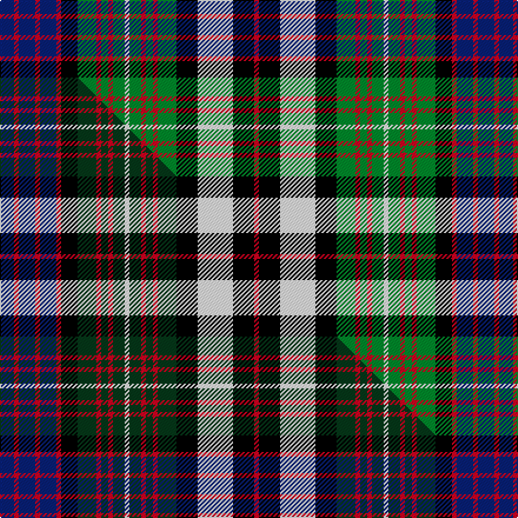

This is one **variant** — a specific cloth: this exact thread count and colourway, with its own
provenance below. It is one weaving of the [sett](/setts/db6r2db7r2db7r2k7g8r2g3r2g5w2g5r2g3r2g8k9w15k9r2/) (the scale-free proportion — the
same cloth at any scale or shade), whose colour order is pattern [BRBRBRKGRGRGWGRGRGKWKR](/stripes/brbrbrkgrgrgwgrgrgkwkr/).

Part of the [MacDonell of Glengarry Dress](/tartans/m/ma/macdonell-of-glengarry-dress/) tartan — the named design grouping this sett with its other cloths.

Sourced from weddslist.  It is a [22 stripe tartan](/stripes/stripes22/).

Original link [http://www.weddslist.com/cgi-bin/tartans/pg.pl?source=sts](http://www.weddslist.com/cgi-bin/tartans/pg.pl?source=sts)

Dataset <small>— provenance for this record, inherited from the source manifest</small>

<dl class="dataset-prov">
<dt>source</dt><dd><a href="/sources/weddslist/">Weddslist</a></dd>
<dt>data captured from</dt><dd><a href="https://github.com/thetartan/tartan-database/blob/master/data/weddslist/data.csv">https://github.com/thetartan/tartan-database/blob/master/data/weddslist/data.csv</a></dd>
<dt>data date</dt><dd>2016-11-17 <small>(dataset default)</small></dd>
<dt>licence</dt><dd><a href="https://creativecommons.org/licenses/by-nc-nd/4.0/">CC BY-NC-ND 4.0</a></dd>
</dl>

Capture chain <small>— the hands this data passed through, oldest first; each capture carries its own licence</small>

<ol class="capture-chain">
<li><a href="https://www.weddslist.com/tartans/">Weddslist</a> <small>the living privately compiled reference</small></li>
<li><a href="https://github.com/thetartan/tartan-database">thetartan/tartan-database</a> <small>2016-2017</small> · <a href="https://creativecommons.org/licenses/by-nc-nd/4.0/">CC BY-NC-ND 4.0</a> <small>Levko Kravets's frozen compilation — the capture we vendored, and where its CC licence text came from</small></li>
<li>this dictionary <small>captured 2026-06-10 · commit 5bf86c7566</small> <small>each re-capture is a git commit to data/sources</small></li>
</ol>

## Thread count
DB/12 R4 DB14 R4 DB14 R4 K14 G16 R4 G6 R4 G10 W4 G10 R4 G6 R4 G16 K18 W30 K18 R/4

One full sett is **424 threads**.

## Palette
<table><thead><tr><th>Colour</th><th>Shade</th><th>OKLCh</th></tr></thead><tbody><tr><td>DB</td><td><code style="background-color:#082077;">#082077</code> <small style="color:#888">#082077</small></td><td><small style="color:#888">oklch(30.0% 0.149 265.1)</small></td></tr><tr><td>G</td><td><code style="background-color:#008B2A;">#008B2A</code> <small style="color:#888">#008B2A</small></td><td><small style="color:#888">oklch(55.4% 0.170 145.9)</small></td></tr><tr><td>K</td><td><code style="background-color:#000000;">#000000</code> <small style="color:#888">#000000</small></td><td><small style="color:#888">oklch(0.0% 0.000 0.0)</small></td></tr><tr><td>W</td><td><code style="background-color:#F7F7F7;">#F7F7F7</code> <small style="color:#888">#F7F7F7</small></td><td><small style="color:#888">oklch(97.6% 0.000 89.9)</small></td></tr><tr><td>R</td><td><code style="background-color:#D60020;">#D60020</code> <small style="color:#888">#D60020</small></td><td><small style="color:#888">oklch(55.2% 0.224 25.5)</small></td></tr></tbody></table>

# Sample pattern

## Compared to the master

This cloth is one sett of its design; the master sett (the exemplar the design is anchored on) is below for comparison.

Its **ΔTartan distance** from the master is **0.14** — the same measure the nearest-tartans table ranks by (0 is identical; a re-scale of the same cloth is near 0, a recolour or a different proportion further).

<figure class="master-compare" style="margin:0">

this sett
master sett ★

<figcaption style="color:#888;font-size:smaller">One weave of this sett against the <a href="/setts/db6r2db7r2db7r2k7dg8r2dg3r2dg5w2dg5r2dg3r2dg8k9w15k9r2/">master sett ★</a>, split on the diagonal: a shared proportion runs seamlessly across it with only the shades shifting; a different proportion breaks on it.</figcaption>
</figure>

## Nearest tartan variants

The nearest existing variants by ΔTartan distance, with this cloth at the top so the swatches line up against it.

ΔTartan

Threads

Variant

Sett

—

424

<a href="/variants/s22/db6r2db7r2db7r2k7g8r2g3r2g5w2g5r2g3r2g8k9w15k9r2~x2/">MacDonell of Glengarry, dress</a>

<a href="/ttd/edit/#slug=db6r2db7r2db7r2k7dg8r2dg3r2dg5w2dg5r2dg3r2dg8k9w15k9r2~x2&amp;base=db6r2db7r2db7r2k7g8r2g3r2g5w2g5r2g3r2g8k9w15k9r2~x2" title="compare in the TTD">0.14</a>

424

<a href="/variants/s22/db6r2db7r2db7r2k7dg8r2dg3r2dg5w2dg5r2dg3r2dg8k9w15k9r2~x2/">MacDonell of Glengarry Dress</a>

<a href="/ttd/edit/#slug=db10k2g2r2g2k2w2k2w4k1w2~x4&amp;base=db6r2db7r2db7r2k7g8r2g3r2g5w2g5r2g3r2g8k9w15k9r2~x2" title="compare in the TTD">1.64</a>

200

<a href="/variants/s11/db10k2g2r2g2k2w2k2w4k1w2~x4/">Highfield Dress</a>

<a href="/ttd/edit/#slug=k12g12y3g12k9w5db6w19db2w6db2w19db6w5k9g12w3k12db10k2db2k2db10~x2&amp;base=db6r2db7r2db7r2k7g8r2g3r2g5w2g5r2g3r2g8k9w15k9r2~x2" title="compare in the TTD">1.98</a>

676

<a href="/variants/s23/k12g12y3g12k9w5db6w19db2w6db2w19db6w5k9g12w3k12db10k2db2k2db10~x2/">Campbell dress</a>

<a href="/ttd/edit/#slug=db4k3g17k17db15k3r4k3db15k17w3db4w25db3w6db3w25db4w3k17g17k3~x2&amp;base=db6r2db7r2db7r2k7g8r2g3r2g5w2g5r2g3r2g8k9w15k9r2~x2" title="compare in the TTD">1.98</a>

830

<a href="/variants/s22/db4k3g17k17db15k3r4k3db15k17w3db4w25db3w6db3w25db4w3k17g17k3~x2/">Argyle Dress</a>

<a href="/ttd/edit/#slug=db10k10g9k2w2k2g9k10w2db2w14db2w2db2w14db2w2k10db10r2~x2&amp;base=db6r2db7r2db7r2k7g8r2g3r2g5w2g5r2g3r2g8k9w15k9r2~x2" title="compare in the TTD">2.00</a>

448

<a href="/variants/s20/db10k10g9k2w2k2g9k10w2db2w14db2w2db2w14db2w2k10db10r2~x2/">MacKenzie Dress Clan Tartan</a>

<a href="/ttd/edit/#slug=db12k2db6k2db12k12g14k2w4k2g14k10w6db6w18db3w4db3w18db6w6k10g14k2y4k2&amp;base=db6r2db7r2db7r2k7g8r2g3r2g5w2g5r2g3r2g8k9w15k9r2~x2" title="compare in the TTD">2.01</a>

374

<a href="/variants/s26/db12k2db6k2db12k12g14k2w4k2g14k10w6db6w18db3w4db3w18db6w6k10g14k2y4k2/">Campbell of Loch Neil Dress Clan Tartan</a>

<a href="/ttd/edit/#slug=k20g14k2y4k2g14k10w6db6w18db3w4db3w18db6w6k10g14k2w4k2g14k12db12k2db6k2db12&amp;base=db6r2db7r2db7r2k7g8r2g3r2g5w2g5r2g3r2g8k9w15k9r2~x2" title="compare in the TTD">2.08</a>

424

<a href="/variants/s28/k20g14k2y4k2g14k10w6db6w18db3w4db3w18db6w6k10g14k2w4k2g14k12db12k2db6k2db12/">Campbell of Loch Neil Dress</a>

<a href="/ttd/edit/#slug=k11g15k2y3k2g15k11w5k5w19k2w5k2w19k5w5k11g15k2w3k2g15k11db11k3db11~x2&amp;base=db6r2db7r2db7r2k7g8r2g3r2g5w2g5r2g3r2g8k9w15k9r2~x2" title="compare in the TTD">2.13</a>

796

<a href="/variants/s26/k11g15k2y3k2g15k11w5k5w19k2w5k2w19k5w5k11g15k2w3k2g15k11db11k3db11~x2/">Campbell of Argyll Dress Trade Tartan</a>

<a href="/ttd/edit/#slug=k20w3lb20k3r3dg20r10w3k20~x2&amp;base=db6r2db7r2db7r2k7g8r2g3r2g5w2g5r2g3r2g8k9w15k9r2~x2" title="compare in the TTD">2.16</a>

328

<a href="/variants/s9/k20w3lb20k3r3dg20r10w3k20~x2/">Soutar/Souter</a>

<a href="/ttd/edit/#slug=r5k3db10k3g20k3r5k3db5k3r5db5k3db5r5k3db5k3r5k3g20k3db10k3r5w3~x2&amp;base=db6r2db7r2db7r2k7g8r2g3r2g5w2g5r2g3r2g8k9w15k9r2~x2" title="compare in the TTD">2.24</a>

568

<a href="/variants/s26/r5k3db10k3g20k3r5k3db5k3r5db5k3db5r5k3db5k3r5k3g20k3db10k3r5w3~x2/">Schneidersohne Centenary</a>

## Neighbour map

Every grey dot is one of 13621 variants placed by the first two principal components of the ΔTartan feature space (42% of its variance). Red is this tartan; blue dots are its nearest — click one to open its page. The map is a flat projection of a many-dimensional space — [how to read it](/posts/neighbourhood-maps/).

<svg viewBox="0 0 640 380" role="img" style="max-width:100%;height:auto;border:1px solid #e0e0e0;border-radius:4px;display:block" xmlns="http://www.w3.org/2000/svg"><image href="/nn/cloud.v1.png" width="640" height="380"/><a href="/variants/s22/db6r2db7r2db7r2k7dg8r2dg3r2dg5w2dg5r2dg3r2dg8k9w15k9r2~x2/"><circle cx="25.6" cy="150.6" r="4" fill="#3465a4"><title>MacDonell of Glengarry Dress</title></circle></a><a href="/variants/s11/db10k2g2r2g2k2w2k2w4k1w2~x4/"><circle cx="34.1" cy="138.2" r="4" fill="#3465a4"><title>Highfield Dress</title></circle></a><a href="/variants/s23/k12g12y3g12k9w5db6w19db2w6db2w19db6w5k9g12w3k12db10k2db2k2db10~x2/"><circle cx="38.5" cy="146.1" r="4" fill="#3465a4"><title>Campbell dress</title></circle></a><a href="/variants/s22/db4k3g17k17db15k3r4k3db15k17w3db4w25db3w6db3w25db4w3k17g17k3~x2/"><circle cx="39.1" cy="134.0" r="4" fill="#3465a4"><title>Argyle Dress</title></circle></a><a href="/variants/s20/db10k10g9k2w2k2g9k10w2db2w14db2w2db2w14db2w2k10db10r2~x2/"><circle cx="39.2" cy="149.8" r="4" fill="#3465a4"><title>MacKenzie Dress Clan Tartan</title></circle></a><a href="/variants/s26/db12k2db6k2db12k12g14k2w4k2g14k10w6db6w18db3w4db3w18db6w6k10g14k2y4k2/"><circle cx="26.9" cy="139.5" r="4" fill="#3465a4"><title>Campbell of Loch Neil Dress Clan Tartan</title></circle></a><a href="/variants/s28/k20g14k2y4k2g14k10w6db6w18db3w4db3w18db6w6k10g14k2w4k2g14k12db12k2db6k2db12/"><circle cx="25.9" cy="133.2" r="4" fill="#3465a4"><title>Campbell of Loch Neil Dress</title></circle></a><a href="/variants/s26/k11g15k2y3k2g15k11w5k5w19k2w5k2w19k5w5k11g15k2w3k2g15k11db11k3db11~x2/"><circle cx="48.5" cy="135.5" r="4" fill="#3465a4"><title>Campbell of Argyll Dress Trade Tartan</title></circle></a><a href="/variants/s9/k20w3lb20k3r3dg20r10w3k20~x2/"><circle cx="33.9" cy="156.3" r="4" fill="#3465a4"><title>Soutar/Souter</title></circle></a><a href="/variants/s26/r5k3db10k3g20k3r5k3db5k3r5db5k3db5r5k3db5k3r5k3g20k3db10k3r5w3~x2/"><circle cx="41.6" cy="139.0" r="4" fill="#3465a4"><title>Schneidersohne Centenary</title></circle></a><circle cx="19.9" cy="152.0" r="5" fill="#c00000"/><text x="320" y="376" text-anchor="middle" font-size="11" fill="#999">ground</text><text x="11" y="190" text-anchor="middle" font-size="11" fill="#999" transform="rotate(-90 11 190)">complexity</text></svg>

ID: /variants/s22/db6r2db7r2db7r2k7g8r2g3r2g5w2g5r2g3r2g8k9w15k9r2~x2/
