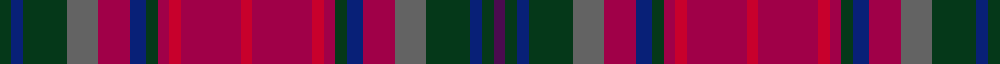

This is one **variant** — a specific cloth: this exact thread count and colourway, with its own
provenance below. It is one weaving of the [sett](/setts/dg3db3dg11n8r8db4dg3r3ri3r15ri3r15ri3r3dg3db4r8n8dg11db3dg3dp3/) (the scale-free proportion — the
same cloth at any scale or shade), whose colour order is pattern [BGBGBRBGRRRRRRRGBRBGBG](/stripes/bgbgbrbgrrrrrrrgbrbgbg/).

Sourced from register-of-tartans.  It is a [22 stripe tartan](/stripes/stripes22/).

Original link [https://www.tartanregister.gov.uk/tartanDetails.aspx?ref=3985](https://www.tartanregister.gov.uk/tartanDetails.aspx?ref=3985)

Dataset <small>— provenance for this record, inherited from the source manifest</small>

<dl class="dataset-prov">
<dt>source</dt><dd><a href="/sources/register-of-tartans/">Scottish Register of Tartans</a></dd>
<dt>data captured from</dt><dd><a href="https://github.com/thetartan/tartan-database/blob/master/data/register-of-tartans/data.csv">https://github.com/thetartan/tartan-database/blob/master/data/register-of-tartans/data.csv</a></dd>
<dt>data date</dt><dd>01/12/2002 <small>(this record)</small></dd>
<dt>licence</dt><dd><a href="https://www.tartanregister.gov.uk/copyright">Crown copyright</a></dd>
</dl>

Capture chain <small>— the hands this data passed through, oldest first; each capture carries its own licence</small>

<ol class="capture-chain">
<li><a href="https://www.tartanregister.gov.uk/">Scottish Register of Tartans</a> · <a href="https://www.tartanregister.gov.uk/copyright">Crown copyright</a> <small>the living register — still published by National Records of Scotland</small></li>
<li><a href="https://github.com/thetartan/tartan-database">thetartan/tartan-database</a> <small>2016-2017</small> · <a href="https://creativecommons.org/licenses/by-nc-nd/4.0/">CC BY-NC-ND 4.0</a> <small>Levko Kravets's frozen compilation — the capture we vendored, and where its CC licence text came from</small></li>
<li>this dictionary <small>captured 2026-06-10 · commit 5bf86c7566</small> <small>each re-capture is a git commit to data/sources</small></li>
</ol>

## Register references

External register numbers recorded for this tartan.

- Scottish Register of Tartans: [3985](https://www.tartanregister.gov.uk/tartanDetails.aspx?ref=3985)
- Scottish Tartans Authority (ITI): 5826

## Thread count
DG/6 DB6 DG22 N16 R16 DB8 DG6 R6 Ri6 R30 Ri6 R30 Ri6 R6 DG6 DB8 R16 N16 DG22 DB6 DG6 DP/6

One full sett is **500 threads**.

## Palette
<table><thead><tr><th>Colour</th><th>Shade</th><th>OKLCh</th></tr></thead><tbody><tr><td>DB</td><td><code style="background-color:#082077;">#082077</code> <small style="color:#888">#082077</small></td><td><small style="color:#888">oklch(30.0% 0.149 265.1)</small></td></tr><tr><td>DG</td><td><code style="background-color:#053819;">#053819</code> <small style="color:#888">#053819</small></td><td><small style="color:#888">oklch(30.0% 0.075 151.3)</small></td></tr><tr><td>N</td><td><code style="background-color:#636363;">#636363</code> <small style="color:#888">#636363</small></td><td><small style="color:#888">oklch(50.0% 0.000 89.9)</small></td></tr><tr><td>DP</td><td><code style="background-color:#4B0B4F;">#4B0B4F</code> <small style="color:#888">#4B0B4F</small></td><td><small style="color:#888">oklch(30.1% 0.125 325.4)</small></td></tr><tr><td>R</td><td><code style="background-color:#A00048;">#A00048</code> <small style="color:#888">#A00048</small></td><td><small style="color:#888">oklch(45.4% 0.182 5.3)</small></td></tr><tr><td>R</td><td><code style="background-color:#C8002C;">#C8002C</code> <small style="color:#888">#C8002C</small></td><td><small style="color:#888">oklch(52.6% 0.212 22.0)</small></td></tr></tbody></table>

# Sample pattern

## Nearest tartan variants

The nearest existing variants by ΔTartan distance, with this cloth at the top so the swatches line up against it.

ΔTartan

Threads

Variant

Sett

—

500

<a href="/variants/s22/dg3db3dg11n8r8db4dg3r3ri3r15ri3r15ri3r3dg3db4r8n8dg11db3dg3dp3~x2~r1807008-ri2108022/">Strathgaela</a>

<a href="/ttd/edit/#slug=dp3dg3db3dg11n8r8db4dg3r3ri3r15ri3~x2~r1807008-ri2108022&amp;base=dg3db3dg11n8r8db4dg3r3ri3r15ri3r15ri3r3dg3db4r8n8dg11db3dg3dp3~x2~r1807008-ri2108022" title="compare in the TTD">2.69</a>

256

<a href="/variants/s12/dp3dg3db3dg11n8r8db4dg3r3ri3r15ri3~x2~r1807008-ri2108022/">Strathgaela (Corporate)</a>

## Neighbour map

Every grey dot is one of 13621 variants placed by the first two principal components of the ΔTartan feature space (42% of its variance). Red is this tartan; blue dots are its nearest — click one to open its page.

<svg viewBox="0 0 640 380" role="img" style="max-width:100%;height:auto;border:1px solid #e0e0e0;border-radius:4px;display:block" xmlns="http://www.w3.org/2000/svg"><image href="/nn/cloud.v1.png" width="640" height="380"/><a href="/variants/s12/dp3dg3db3dg11n8r8db4dg3r3ri3r15ri3~x2~r1807008-ri2108022/"><circle cx="193.0" cy="217.8" r="4" fill="#3465a4"><title>Strathgaela (Corporate)</title></circle></a><circle cx="188.0" cy="195.0" r="5" fill="#c00000"/><text x="320" y="376" text-anchor="middle" font-size="11" fill="#999">ground</text><text x="11" y="190" text-anchor="middle" font-size="11" fill="#999" transform="rotate(-90 11 190)">complexity</text></svg>

ID: /variants/s22/dg3db3dg11n8r8db4dg3r3ri3r15ri3r15ri3r3dg3db4r8n8dg11db3dg3dp3~x2~r1807008-ri2108022/
