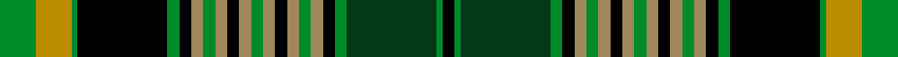

This is one **variant** — a specific cloth: this exact thread count and colourway, with its own
provenance below. It is one weaving of the [sett](/tartans/i/in/int-college-of-dentists/) (the scale-free proportion — the
same cloth at any scale or shade), whose colour order is pattern [GYGKGKYGYKYGYKYGYKGGGK](/stripes/gygkgkygykygykygykgggk/).

Part of the [Int. College of Dentists](/tartans/i/in/int-college-of-dentists/) tartan — the named design grouping this sett with its other cloths.

Sourced from tartans-authority.  It is a [22 stripe tartan](/stripes/stripes22/).

Original link <code>http://www.tartansauthority.com/tartan-ferret/display/10482/</code> — retired · [Internet Archive copy](https://web.archive.org/web/*/http://www.tartansauthority.com/tartan-ferret/display/10482/*)

Dataset <small>— provenance for this record, inherited from the source manifest</small>

<dl class="dataset-prov">
<dt>source</dt><dd><a href="/sources/tartans-authority/">Scottish Tartans Authority</a></dd>
<dt>data captured from</dt><dd><a href="https://github.com/thetartan/tartan-database/blob/master/data/tartans-authority/data.csv">https://github.com/thetartan/tartan-database/blob/master/data/tartans-authority/data.csv</a></dd>
<dt>data date</dt><dd>31st August 2011 <small>(this record)</small></dd>
<dt>licence</dt><dd><a href="https://creativecommons.org/licenses/by-nc-nd/4.0/">CC BY-NC-ND 4.0</a></dd>
</dl>

Capture chain <small>— the hands this data passed through, oldest first; each capture carries its own licence</small>

<ol class="capture-chain">
<li><a href="https://www.tartansauthority.com/">Scottish Tartans Authority</a> <small>the heritage body’s archive — its tartan-ferret record browser is retired; dead record links are shown unlinked, with an Internet Archive copy (ITI numbers are not SRT references)</small></li>
<li><a href="https://github.com/thetartan/tartan-database">thetartan/tartan-database</a> <small>2016-2017</small> · <a href="https://creativecommons.org/licenses/by-nc-nd/4.0/">CC BY-NC-ND 4.0</a> <small>Levko Kravets's frozen compilation — the capture we vendored, and where its CC licence text came from</small></li>
<li>this dictionary <small>captured 2026-06-10 · commit 5bf86c7566</small> <small>each re-capture is a git commit to data/sources</small></li>
</ol>

## Register references

External register numbers recorded for this tartan.

- Scottish Register of Tartans: [10482](https://www.tartanregister.gov.uk/tartanDetails?ref=10482)
- Scottish Tartans Authority (ITI): 10482

## Thread count
G/12 LYi12 G2 K30 G4 K4 LY4 G4 LY4 K4 LY4 G4 LY4 K4 LY4 G4 LY4 K4 G4 DG30 G2 K/4

One full sett is **288 threads**.

## Palette
<table><thead><tr><th>Colour</th><th>Shade</th><th>OKLCh</th></tr></thead><tbody><tr><td>DG</td><td><code style="background-color:#053819;">#053819</code> <small style="color:#888">#053819</small></td><td><small style="color:#888">oklch(30.0% 0.075 151.3)</small></td></tr><tr><td>LY</td><td><code style="background-color:#BC8C00;">#BC8C00</code> <small style="color:#888">#BC8C00</small></td><td><small style="color:#888">oklch(66.8% 0.137 84.1)</small></td></tr><tr><td>G</td><td><code style="background-color:#008B2A;">#008B2A</code> <small style="color:#888">#008B2A</small></td><td><small style="color:#888">oklch(55.4% 0.170 145.9)</small></td></tr><tr><td>K</td><td><code style="background-color:#000000;">#000000</code> <small style="color:#888">#000000</small></td><td><small style="color:#888">oklch(0.0% 0.000 0.0)</small></td></tr><tr><td>LY</td><td><code style="background-color:#A08858;">#A08858</code> <small style="color:#888">#A08858</small></td><td><small style="color:#888">oklch(63.7% 0.071 84.0)</small></td></tr></tbody></table>

# Sample pattern

[Sample sheet (PDF)](swatch.pdf) — the woven sample, thread count and palette on one printable A4, rendered on demand (the same sheet the TTD print page downloads).

## Nearest tartan variants

The nearest existing variants by ΔTartan distance, with this cloth at the top so the swatches line up against it.

ΔTartan

Threads

Variant

Sett

—

288

<a href="/variants/s22/g6lyi6g1k15g2k2ly2g2ly2k2ly2g2ly2k2ly2g2ly2k2g2dg15g1k2~x2~lyi6614084-ly6307084/">Int. College of Dentists (Canada)</a>

<a href="/ttd/edit/#slug=g6y6g1k15g2k2ly2g2ly2k2ly2g2ly2k2ly2g2ly2k2g2dg15g1k2~x2&amp;base=g6lyi6g1k15g2k2ly2g2ly2k2ly2g2ly2k2ly2g2ly2k2g2dg15g1k2~x2~lyi6614084-ly6307084" title="compare in the TTD">1.00</a>

288

<a href="/variants/s22/g6y6g1k15g2k2ly2g2ly2k2ly2g2ly2k2ly2g2ly2k2g2dg15g1k2~x2/">International College of Dentists (Canadian Section)</a>

<a href="/ttd/edit/#slug=g24k3g3k3g3k18dt2lb2dt2lb2dt13w3dt13lb2dt2lb2dt2k18g19k4g4~x2&amp;base=g6lyi6g1k15g2k2ly2g2ly2k2ly2g2ly2k2ly2g2ly2k2g2dg15g1k2~x2~lyi6614084-ly6307084" title="compare in the TTD">2.11</a>

520

<a href="/variants/s21/g24k3g3k3g3k18dt2lb2dt2lb2dt13w3dt13lb2dt2lb2dt2k18g19k4g4~x2/">Dorris (Corporate)</a>

<a href="/ttd/edit/#slug=g24k3g3k3g3k18dt2t2dt2t2dt13w3dt13t2dt2t2dt2k18g19k4g4~x2~t5912243&amp;base=g6lyi6g1k15g2k2ly2g2ly2k2ly2g2ly2k2ly2g2ly2k2g2dg15g1k2~x2~lyi6614084-ly6307084" title="compare in the TTD">2.24</a>

520

<a href="/variants/s21/g24k3g3k3g3k18dt2t2dt2t2dt13w3dt13t2dt2t2dt2k18g19k4g4~x2~t5912243/">Dorris</a>

<a href="/ttd/edit/#slug=g6lyi6g1k15g2k2ly2g2ly2k2ly2g2ly2k2ly2g2ly2k2g2w15g1k2~x2~lyi6614084-ly6307084&amp;base=g6lyi6g1k15g2k2ly2g2ly2k2ly2g2ly2k2ly2g2ly2k2g2dg15g1k2~x2~lyi6614084-ly6307084" title="compare in the TTD">2.55</a>

288

<a href="/variants/s22/g6lyi6g1k15g2k2ly2g2ly2k2ly2g2ly2k2ly2g2ly2k2g2w15g1k2~x2~lyi6614084-ly6307084/">Int. College of Dentists (Canada)</a>

<a href="/ttd/edit/#slug=g20k1g1k6w1k6dp1k1dp4r3dp14r3dp4k1dp1k6w1k6g1k1g8~x2&amp;base=g6lyi6g1k15g2k2ly2g2ly2k2ly2g2ly2k2ly2g2ly2k2g2dg15g1k2~x2~lyi6614084-ly6307084" title="compare in the TTD">2.61</a>

304

<a href="/variants/s21/g20k1g1k6w1k6dp1k1dp4r3dp14r3dp4k1dp1k6w1k6g1k1g8~x2/">New Hampshire District Tartan</a>

<a href="/ttd/edit/#slug=g5dg22g13k5w4k7g5k2dy7k2dg2g6dg1k2w2~x2&amp;base=g6lyi6g1k15g2k2ly2g2ly2k2ly2g2ly2k2ly2g2ly2k2g2dg15g1k2~x2~lyi6614084-ly6307084" title="compare in the TTD">2.64</a>

326

<a href="/variants/s15/g5dg22g13k5w4k7g5k2dy7k2dg2g6dg1k2w2~x2/">Ireland's National</a>

<a href="/ttd/edit/#slug=dr4k4n4y2n2w2n2y2n2w2k4g3k2g24w2k2n3k3w2dr4k2~x2&amp;base=g6lyi6g1k15g2k2ly2g2ly2k2ly2g2ly2k2ly2g2ly2k2g2dg15g1k2~x2~lyi6614084-ly6307084" title="compare in the TTD">2.64</a>

296

<a href="/variants/s21/dr4k4n4y2n2w2n2y2n2w2k4g3k2g24w2k2n3k3w2dr4k2~x2/">Murtaugh Hunting Tartan</a>

<a href="/ttd/edit/#slug=db36k5r2k5g15r2g10w2g10r2g15k5r2k5db10r2db2r2db4w2~x2~db3409246&amp;base=g6lyi6g1k15g2k2ly2g2ly2k2ly2g2ly2k2ly2g2ly2k2g2dg15g1k2~x2~lyi6614084-ly6307084" title="compare in the TTD">2.76</a>

476

<a href="/variants/s20/db36k5r2k5g15r2g10w2g10r2g15k5r2k5db10r2db2r2db4w2~x2~db3409246/">Ranking Corporate Tartan</a>

<a href="/ttd/edit/#slug=g6y6g1k15g2k2ly2g2ly2k2ly2g2ly2k2ly2g2ly2k2g2w15g1k2~x2&amp;base=g6lyi6g1k15g2k2ly2g2ly2k2ly2g2ly2k2ly2g2ly2k2g2dg15g1k2~x2~lyi6614084-ly6307084" title="compare in the TTD">2.77</a>

288

<a href="/variants/s22/g6y6g1k15g2k2ly2g2ly2k2ly2g2ly2k2ly2g2ly2k2g2w15g1k2~x2/">International College of Dentists (Canadian Section) Dress</a>

<a href="/ttd/edit/#slug=g3dg2g2dg16g2dg2g2dg2g4n4k2n2k2n2k24r2k2w3~x2~g5408159-dg4514144&amp;base=g6lyi6g1k15g2k2ly2g2ly2k2ly2g2ly2k2ly2g2ly2k2g2dg15g1k2~x2~lyi6614084-ly6307084" title="compare in the TTD">2.84</a>

300

<a href="/variants/s18/g3dg2g2dg16g2dg2g2dg2g4n4k2n2k2n2k24r2k2w3~x2~g5408159-dg4514144/">Barkway (Name)</a>

## Neighbour map

Every grey dot is one of 13662 variants placed by the first two principal components of the ΔTartan feature space (42% of its variance). Red is this tartan; blue dots are its nearest — click one to open its page. The map is a flat projection of a many-dimensional space — [how to read it](/posts/neighbourhood-maps/).

<svg viewBox="0 0 640 380" role="img" style="max-width:100%;height:auto;border:1px solid #e0e0e0;border-radius:4px;display:block" xmlns="http://www.w3.org/2000/svg"><image href="/nn/cloud.v1.png" width="640" height="380"/><a href="/variants/s22/g6y6g1k15g2k2ly2g2ly2k2ly2g2ly2k2ly2g2ly2k2g2dg15g1k2~x2/"><circle cx="95.2" cy="95.8" r="4" fill="#3465a4"><title>International College of Dentists (Canadian Section)</title></circle></a><a href="/variants/s21/g24k3g3k3g3k18dt2lb2dt2lb2dt13w3dt13lb2dt2lb2dt2k18g19k4g4~x2/"><circle cx="121.7" cy="113.4" r="4" fill="#3465a4"><title>Dorris (Corporate)</title></circle></a><a href="/variants/s21/g24k3g3k3g3k18dt2t2dt2t2dt13w3dt13t2dt2t2dt2k18g19k4g4~x2~t5912243/"><circle cx="126.2" cy="115.3" r="4" fill="#3465a4"><title>Dorris</title></circle></a><a href="/variants/s22/g6lyi6g1k15g2k2ly2g2ly2k2ly2g2ly2k2ly2g2ly2k2g2w15g1k2~x2~lyi6614084-ly6307084/"><circle cx="83.4" cy="91.1" r="4" fill="#3465a4"><title>Int. College of Dentists (Canada)</title></circle></a><a href="/variants/s21/g20k1g1k6w1k6dp1k1dp4r3dp14r3dp4k1dp1k6w1k6g1k1g8~x2/"><circle cx="132.6" cy="84.5" r="4" fill="#3465a4"><title>New Hampshire District Tartan</title></circle></a><a href="/variants/s15/g5dg22g13k5w4k7g5k2dy7k2dg2g6dg1k2w2~x2/"><circle cx="127.9" cy="115.2" r="4" fill="#3465a4"><title>Ireland's National</title></circle></a><a href="/variants/s21/dr4k4n4y2n2w2n2y2n2w2k4g3k2g24w2k2n3k3w2dr4k2~x2/"><circle cx="86.0" cy="83.9" r="4" fill="#3465a4"><title>Murtaugh Hunting Tartan</title></circle></a><a href="/variants/s20/db36k5r2k5g15r2g10w2g10r2g15k5r2k5db10r2db2r2db4w2~x2~db3409246/"><circle cx="159.7" cy="95.0" r="4" fill="#3465a4"><title>Ranking Corporate Tartan</title></circle></a><a href="/variants/s22/g6y6g1k15g2k2ly2g2ly2k2ly2g2ly2k2ly2g2ly2k2g2w15g1k2~x2/"><circle cx="81.1" cy="91.0" r="4" fill="#3465a4"><title>International College of Dentists (Canadian Section) Dress</title></circle></a><a href="/variants/s18/g3dg2g2dg16g2dg2g2dg2g4n4k2n2k2n2k24r2k2w3~x2~g5408159-dg4514144/"><circle cx="119.0" cy="83.8" r="4" fill="#3465a4"><title>Barkway (Name)</title></circle></a><circle cx="104.1" cy="98.2" r="5" fill="#c00000"/><text x="320" y="376" text-anchor="middle" font-size="11" fill="#999">ground</text><text x="11" y="190" text-anchor="middle" font-size="11" fill="#999" transform="rotate(-90 11 190)">complexity</text></svg>

ID: /variants/s22/g6lyi6g1k15g2k2ly2g2ly2k2ly2g2ly2k2ly2g2ly2k2g2dg15g1k2~x2~lyi6614084-ly6307084/
