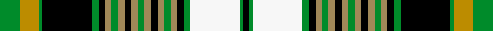

This page is one **sett** — a single exact thread-count. It belongs to the [tartan](/setts/g6lyi6g1k15g2k2ly2g2ly2k2ly2g2ly2k2ly2g2ly2k2g2w15g1k2/)
(the same proportion at any scale), whose colour order is pattern [GYGKGKYGYKYGYKYGYKGWGK](/stripes/gygkgkygykygykygykgwgk/).

Sourced from tartans-authority.  It is a [22 stripe tartan](/stripes/stripes22/).

Original link http://www.tartansauthority.com/tartan-ferret/display/10746/

## Register references

External register numbers recorded for this tartan.

- Scottish Tartans Authority (ITI): 10746

## Thread count
G/12 LYi12 G2 K30 G4 K4 LY4 G4 LY4 K4 LY4 G4 LY4 K4 LY4 G4 LY4 K4 G4 W30 G2 K/4

One full sett is **288 threads**.

## Palette
<table><thead><tr><th>Colour</th><th>Shade</th><th>OKLCh</th></tr></thead><tbody><tr><td>LY</td><td><code style="background-color:#BC8C00;">#BC8C00</code> <small style="color:#888">#BC8C00</small></td><td><small style="color:#888">oklch(66.8% 0.137 84.1)</small></td></tr><tr><td>G</td><td><code style="background-color:#008B2A;">#008B2A</code> <small style="color:#888">#008B2A</small></td><td><small style="color:#888">oklch(55.4% 0.170 145.9)</small></td></tr><tr><td>K</td><td><code style="background-color:#000000;">#000000</code> <small style="color:#888">#000000</small></td><td><small style="color:#888">oklch(0.0% 0.000 0.0)</small></td></tr><tr><td>W</td><td><code style="background-color:#F7F7F7;">#F7F7F7</code> <small style="color:#888">#F7F7F7</small></td><td><small style="color:#888">oklch(97.6% 0.000 89.9)</small></td></tr><tr><td>LY</td><td><code style="background-color:#A08858;">#A08858</code> <small style="color:#888">#A08858</small></td><td><small style="color:#888">oklch(63.7% 0.071 84.0)</small></td></tr></tbody></table>

# Sample pattern

ID: /variants/s22/g6lyi6g1k15g2k2ly2g2ly2k2ly2g2ly2k2ly2g2ly2k2g2w15g1k2~x2~lyi2705081-ly2503076/
