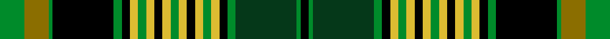

This page is one **sett** — a single exact thread-count. It belongs to the [tartan](/setts/g6y6g1k15g2k2ly2g2ly2k2ly2g2ly2k2ly2g2ly2k2g2dg15g1k2/)
(the same proportion at any scale), whose colour order is pattern [GGGKGKYGYKYGYKYGYKGGGK](/stripes/gggkgkygykygykygykgggk/).

Sourced from register-of-tartans.  It is a [22 stripe tartan](/stripes/stripes22/).

Original link https://www.tartanregister.gov.uk/tartanDetails.aspx?ref=10482

## Register references

External register numbers recorded for this tartan.

- Scottish Register of Tartans: [10482](https://www.tartanregister.gov.uk/tartanDetails.aspx?ref=10482)

## Thread count
G/12 Y12 G2 K30 G4 K4 LY4 G4 LY4 K4 LY4 G4 LY4 K4 LY4 G4 LY4 K4 G4 DG30 G2 K/4

One full sett is **288 threads**.

## Palette
<table><thead><tr><th>Colour</th><th>Shade</th><th>OKLCh</th></tr></thead><tbody><tr><td>DG</td><td><code style="background-color:#053819;">#053819</code> <small style="color:#888">#053819</small></td><td><small style="color:#888">oklch(30.0% 0.075 151.3)</small></td></tr><tr><td>G</td><td><code style="background-color:#008B2A;">#008B2A</code> <small style="color:#888">#008B2A</small></td><td><small style="color:#888">oklch(55.4% 0.170 145.9)</small></td></tr><tr><td>K</td><td><code style="background-color:#000000;">#000000</code> <small style="color:#888">#000000</small></td><td><small style="color:#888">oklch(0.0% 0.000 0.0)</small></td></tr><tr><td>LY</td><td><code style="background-color:#DCBC32;">#DCBC32</code> <small style="color:#888">#DCBC32</small></td><td><small style="color:#888">oklch(80.0% 0.150 95.2)</small></td></tr><tr><td>Y</td><td><code style="background-color:#8B6E00;">#8B6E00</code> <small style="color:#888">#8B6E00</small></td><td><small style="color:#888">oklch(55.1% 0.113 90.4)</small></td></tr></tbody></table>

# Sample pattern

ID: /variants/s22/g6y6g1k15g2k2ly2g2ly2k2ly2g2ly2k2ly2g2ly2k2g2dg15g1k2~x2/
