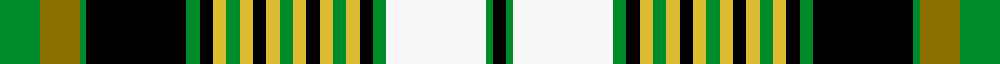

This is one **variant** — a specific cloth: this exact thread count and colourway, with its own
provenance below. It is one weaving of the [sett](/setts/g6y6g1k15g2k2ly2g2ly2k2ly2g2ly2k2ly2g2ly2k2g2w15g1k2/) (the scale-free proportion — the
same cloth at any scale or shade), whose colour order is pattern [GGGKGKYGYKYGYKYGYKGWGK](/stripes/gggkgkygykygykygykgwgk/).

Part of the [International College of Dentist](/tartans/i/in/international-college-of-dentist/) tartan — the named design grouping this sett with its other cloths.

Sourced from register-of-tartans.  It is a [22 stripe tartan](/stripes/stripes22/).

Original link [https://www.tartanregister.gov.uk/tartanDetails.aspx?ref=10746](https://www.tartanregister.gov.uk/tartanDetails.aspx?ref=10746)

## Provenance

Earliest known date: 14/09/2012 The International College of Dentists (ICD) is a worldwide honorary dental organisation established in 1927. Fellowship is by invitation only and recognises the professional achievements and service of individual dentists. The ICD is dedicated to the progress of dentistry and it funds many humanitarian projects throughout the world. Colours: the green and gold in this tartan are the colours of the ICD and the "houndstooth" portion is made up of 15 lines to represent the 15 sections of the College. The Canadian Section is the first section to have its own tartan. The tartan will be woven and made into items such as bow-ties and sashes, and worn at the annual convocation. The Dress version of the tartan is the same as the original design (STR ref.10482) except for the substitution of white 30 instead of dark green 30 in the threadcount.

2 attestations — the source records this cloth was collapsed from (oldest owns this page)

<ul>
<li>14/09/2012 — International College of Dentists (Canadian Section) Dress (register-of-tartans, <a href="https://www.tartanregister.gov.uk/tartanDetails.aspx?ref=10746">record</a>)  <em>The International College of Dentists (ICD) is a worldwide honorary dental organisation established in 1927. Fellowship is by invitation only and recognises the professional achievements and service of individual dentists. The ICD is dedicated to the progress of dentistry and it funds many humanitarian projects throughout the world. Colours: the green and gold in this tartan are the colours of the ICD and the "houndstooth" portion is made up of 15 lines to represent the 15 sections of the College. The Canadian Section is the first section to have its own tartan. The tartan will be woven and made into items such as bow-ties and sashes, and worn at the annual convocation. The Dress version of the tartan is the same as the original design (STR ref.10482) except for the substitution of white 30 instead of dark green 30 in the threadcount.</em></li>
<li>14/09/2012 — International College of Dentist Corporate Tartan (house-of-tartan, <a href="http://www.house-of-tartan.scotland.net/house/TartanViewjs.asp?colr=Def&tnam=10746">record</a>) </li>
</ul>

Dataset <small>— provenance for this record, inherited from the source manifest</small>

<dl class="dataset-prov">
<dt>source</dt><dd><a href="/sources/register-of-tartans/">Scottish Register of Tartans</a></dd>
<dt>data captured from</dt><dd><a href="https://github.com/thetartan/tartan-database/blob/master/data/register-of-tartans/data.csv">https://github.com/thetartan/tartan-database/blob/master/data/register-of-tartans/data.csv</a></dd>
<dt>data date</dt><dd>14/09/2012 <small>(this record)</small></dd>
<dt>licence</dt><dd><a href="https://www.tartanregister.gov.uk/copyright">Crown copyright</a></dd>
</dl>

Capture chain <small>— the hands this data passed through, oldest first; each capture carries its own licence</small>

<ol class="capture-chain">
<li><a href="https://www.tartanregister.gov.uk/">Scottish Register of Tartans</a> · <a href="https://www.tartanregister.gov.uk/copyright">Crown copyright</a> <small>the living register — still published by National Records of Scotland</small></li>
<li><a href="https://github.com/thetartan/tartan-database">thetartan/tartan-database</a> <small>2016-2017</small> · <a href="https://creativecommons.org/licenses/by-nc-nd/4.0/">CC BY-NC-ND 4.0</a> <small>Levko Kravets's frozen compilation — the capture we vendored, and where its CC licence text came from</small></li>
<li>this dictionary <small>captured 2026-06-10 · commit 5bf86c7566</small> <small>each re-capture is a git commit to data/sources</small></li>
</ol>

## Register references

External register numbers recorded for this tartan.

- Scottish Register of Tartans: [10746](https://www.tartanregister.gov.uk/tartanDetails.aspx?ref=10746)

## Thread count
G/12 Y12 G2 K30 G4 K4 LY4 G4 LY4 K4 LY4 G4 LY4 K4 LY4 G4 LY4 K4 G4 W30 G2 K/4

One full sett is **288 threads**.

## Palette
<table><thead><tr><th>Colour</th><th>Shade</th><th>OKLCh</th></tr></thead><tbody><tr><td>G</td><td><code style="background-color:#008B2A;">#008B2A</code> <small style="color:#888">#008B2A</small></td><td><small style="color:#888">oklch(55.4% 0.170 145.9)</small></td></tr><tr><td>K</td><td><code style="background-color:#000000;">#000000</code> <small style="color:#888">#000000</small></td><td><small style="color:#888">oklch(0.0% 0.000 0.0)</small></td></tr><tr><td>LY</td><td><code style="background-color:#DCBC32;">#DCBC32</code> <small style="color:#888">#DCBC32</small></td><td><small style="color:#888">oklch(80.0% 0.150 95.2)</small></td></tr><tr><td>W</td><td><code style="background-color:#F7F7F7;">#F7F7F7</code> <small style="color:#888">#F7F7F7</small></td><td><small style="color:#888">oklch(97.6% 0.000 89.9)</small></td></tr><tr><td>Y</td><td><code style="background-color:#8B6E00;">#8B6E00</code> <small style="color:#888">#8B6E00</small></td><td><small style="color:#888">oklch(55.1% 0.113 90.4)</small></td></tr></tbody></table>

# Sample pattern

## Nearest tartan variants

The nearest existing variants by ΔTartan distance, with this cloth at the top so the swatches line up against it.

ΔTartan

Threads

Variant

Sett

—

288

<a href="/variants/s22/g6y6g1k15g2k2ly2g2ly2k2ly2g2ly2k2ly2g2ly2k2g2w15g1k2~x2/">International College of Dentists (Canadian Section) Dress</a>

<a href="/ttd/edit/#slug=g6ly6g1k15g2k2o2g2o2k2o2g2o2k2o2g2o2k2g2w15g1k2~x2~ly2705081-o2503076&amp;base=g6y6g1k15g2k2ly2g2ly2k2ly2g2ly2k2ly2g2ly2k2g2w15g1k2~x2" title="compare in the TTD">1.00</a>

288

<a href="/variants/s22/g6lyi6g1k15g2k2ly2g2ly2k2ly2g2ly2k2ly2g2ly2k2g2w15g1k2~x2~lyi2705081-ly2503076/">Int. College of Dentists (Canada)</a>

<a href="/ttd/edit/#slug=g6y6g1k15g2k2ly2g2ly2k2ly2g2ly2k2ly2g2ly2k2g2dg15g1k2~x2&amp;base=g6y6g1k15g2k2ly2g2ly2k2ly2g2ly2k2ly2g2ly2k2g2w15g1k2~x2" title="compare in the TTD">2.36</a>

288

<a href="/variants/s22/g6y6g1k15g2k2ly2g2ly2k2ly2g2ly2k2ly2g2ly2k2g2dg15g1k2~x2/">International College of Dentists (Canadian Section)</a>

<a href="/ttd/edit/#slug=r4k4n4y2n2w2n2y2n2w2k4g3k2g24w2k2n3k3w2r4k2~x2&amp;base=g6y6g1k15g2k2ly2g2ly2k2ly2g2ly2k2ly2g2ly2k2g2w15g1k2~x2" title="compare in the TTD">2.44</a>

296

<a href="/variants/s21/r4k4n4y2n2w2n2y2n2w2k4g3k2g24w2k2n3k3w2r4k2~x2/">Murtaugh Hunting</a>

<a href="/ttd/edit/#slug=dr4k4n4y2n2w2n2y2n2w2k4g3k2g24w2k2n3k3w2dr4k2~x2&amp;base=g6y6g1k15g2k2ly2g2ly2k2ly2g2ly2k2ly2g2ly2k2g2w15g1k2~x2" title="compare in the TTD">2.57</a>

296

<a href="/variants/s21/dr4k4n4y2n2w2n2y2n2w2k4g3k2g24w2k2n3k3w2dr4k2~x2/">Murtaugh Hunting Tartan</a>

<a href="/ttd/edit/#slug=y2w1y12dt6k3w1g1w1g4w2k1w1r1~x4&amp;base=g6y6g1k15g2k2ly2g2ly2k2ly2g2ly2k2ly2g2ly2k2g2w15g1k2~x2" title="compare in the TTD">2.59</a>

276

<a href="/variants/s13/y2w1y12dt6k3w1g1w1g4w2k1w1r1~x4/">Diana Princess of Wales Memorial</a>

<a href="/ttd/edit/#slug=g6ly6g1k15g2k2o2g2o2k2o2g2o2k2o2g2o2k2g2dg15g1k2~x2~ly2705081-o2503076&amp;base=g6y6g1k15g2k2ly2g2ly2k2ly2g2ly2k2ly2g2ly2k2g2w15g1k2~x2" title="compare in the TTD">2.77</a>

288

<a href="/variants/s22/g6lyi6g1k15g2k2ly2g2ly2k2ly2g2ly2k2ly2g2ly2k2g2dg15g1k2~x2~lyi2705081-ly2503076/">Int. College of Dentists (Canada)</a>

<a href="/ttd/edit/#slug=k3dr1g2dr2w20db3w3dr7k2dr2k2dr2k7g2k2g2k2g8dy3~x4&amp;base=g6y6g1k15g2k2ly2g2ly2k2ly2g2ly2k2ly2g2ly2k2g2w15g1k2~x2" title="compare in the TTD">2.80</a>

576

<a href="/variants/s19/k3dr1g2dr2w20db3w3dr7k2dr2k2dr2k7g2k2g2k2g8dy3~x4/">Princess Beatrice Dress (Dance)</a>

<a href="/ttd/edit/#slug=r16lb10k14w2k4w3k4g26r11k4r4w2~x2&amp;base=g6y6g1k15g2k2ly2g2ly2k2ly2g2ly2k2ly2g2ly2k2g2w15g1k2~x2" title="compare in the TTD">2.91</a>

364

<a href="/variants/s12/r16lb10k14w2k4w3k4g26r11k4r4w2~x2/">Stewart/Stuart - Prince Charles Edward</a>

<a href="/ttd/edit/#slug=g16k1b2k1lo4k1lo4k1b2k1dr16w2dr16k1b2k1lo4k1lo4k1b2k1g16b2~x4&amp;base=g6y6g1k15g2k2ly2g2ly2k2ly2g2ly2k2ly2g2ly2k2g2w15g1k2~x2" title="compare in the TTD">2.97</a>

744

<a href="/variants/s24/g16k1b2k1lo4k1lo4k1b2k1dr16w2dr16k1b2k1lo4k1lo4k1b2k1g16b2~x4/">Baxter Clan/Family Tartan</a>

<a href="/ttd/edit/#slug=k3lb4r5k2lb5k2r5k2g25k3lb11k2r5k1w3~x2&amp;base=g6y6g1k15g2k2ly2g2ly2k2ly2g2ly2k2ly2g2ly2k2g2w15g1k2~x2" title="compare in the TTD">2.98</a>

300

<a href="/variants/s15/k3lb4r5k2lb5k2r5k2g25k3lb11k2r5k1w3~x2/">Un-named (D C Dalgliesh)</a>

## Neighbour map

Every grey dot is one of 13621 variants placed by the first two principal components of the ΔTartan feature space (42% of its variance). Red is this tartan; blue dots are its nearest — click one to open its page. The map is a flat projection of a many-dimensional space — [how to read it](/posts/neighbourhood-maps/).

<svg viewBox="0 0 640 380" role="img" style="max-width:100%;height:auto;border:1px solid #e0e0e0;border-radius:4px;display:block" xmlns="http://www.w3.org/2000/svg"><image href="/nn/cloud.v1.png" width="640" height="380"/><a href="/variants/s22/g6lyi6g1k15g2k2ly2g2ly2k2ly2g2ly2k2ly2g2ly2k2g2w15g1k2~x2~lyi2705081-ly2503076/"><circle cx="83.4" cy="91.3" r="4" fill="#3465a4"><title>Int. College of Dentists (Canada)</title></circle></a><a href="/variants/s22/g6y6g1k15g2k2ly2g2ly2k2ly2g2ly2k2ly2g2ly2k2g2dg15g1k2~x2/"><circle cx="95.3" cy="95.9" r="4" fill="#3465a4"><title>International College of Dentists (Canadian Section)</title></circle></a><a href="/variants/s21/r4k4n4y2n2w2n2y2n2w2k4g3k2g24w2k2n3k3w2r4k2~x2/"><circle cx="81.8" cy="80.1" r="4" fill="#3465a4"><title>Murtaugh Hunting</title></circle></a><a href="/variants/s21/dr4k4n4y2n2w2n2y2n2w2k4g3k2g24w2k2n3k3w2dr4k2~x2/"><circle cx="86.0" cy="83.9" r="4" fill="#3465a4"><title>Murtaugh Hunting Tartan</title></circle></a><a href="/variants/s13/y2w1y12dt6k3w1g1w1g4w2k1w1r1~x4/"><circle cx="95.4" cy="92.0" r="4" fill="#3465a4"><title>Diana Princess of Wales Memorial</title></circle></a><a href="/variants/s22/g6lyi6g1k15g2k2ly2g2ly2k2ly2g2ly2k2ly2g2ly2k2g2dg15g1k2~x2~lyi2705081-ly2503076/"><circle cx="104.2" cy="98.2" r="4" fill="#3465a4"><title>Int. College of Dentists (Canada)</title></circle></a><a href="/variants/s19/k3dr1g2dr2w20db3w3dr7k2dr2k2dr2k7g2k2g2k2g8dy3~x4/"><circle cx="67.6" cy="73.7" r="4" fill="#3465a4"><title>Princess Beatrice Dress (Dance)</title></circle></a><a href="/variants/s12/r16lb10k14w2k4w3k4g26r11k4r4w2~x2/"><circle cx="60.5" cy="112.8" r="4" fill="#3465a4"><title>Stewart/Stuart - Prince Charles Edward</title></circle></a><a href="/variants/s24/g16k1b2k1lo4k1lo4k1b2k1dr16w2dr16k1b2k1lo4k1lo4k1b2k1g16b2~x4/"><circle cx="101.9" cy="70.7" r="4" fill="#3465a4"><title>Baxter Clan/Family Tartan</title></circle></a><a href="/variants/s15/k3lb4r5k2lb5k2r5k2g25k3lb11k2r5k1w3~x2/"><circle cx="117.7" cy="86.9" r="4" fill="#3465a4"><title>Un-named (D C Dalgliesh)</title></circle></a><circle cx="81.0" cy="91.2" r="5" fill="#c00000"/><text x="320" y="376" text-anchor="middle" font-size="11" fill="#999">ground</text><text x="11" y="190" text-anchor="middle" font-size="11" fill="#999" transform="rotate(-90 11 190)">complexity</text></svg>

ID: /variants/s22/g6y6g1k15g2k2ly2g2ly2k2ly2g2ly2k2ly2g2ly2k2g2w15g1k2~x2/
