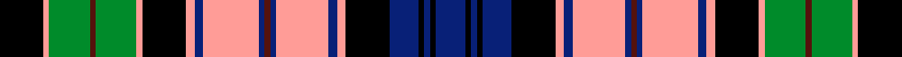

This is one **variant** — a specific cloth: this exact thread count and colourway, with its own
provenance below. It is one weaving of the [sett](/tartans/c/co/colquhoun-dress-2/) (the scale-free proportion — the
same cloth at any scale or shade), whose colour order is pattern [BKBKBKYBYBBBYBYKYGBGYK](/stripes/bkbkbkybybbbybykygbgyk/).

Part of the [Colquhoun Dress](/tartans/c/co/colquhoun-dress-2/) tartan — the named design grouping this sett with its other cloths.

Sourced from register-of-tartans.  It is a [22 stripe tartan](/stripes/stripes22/).

Original link [https://www.tartanregister.gov.uk/tartanDetails.aspx?ref=717](https://www.tartanregister.gov.uk/tartanDetails.aspx?ref=717)

2 attestations — the source records this cloth was collapsed from (oldest owns this page)

<ul>
<li>01/01/1960 — Colquhoun Dress (register-of-tartans, <a href="https://www.tartanregister.gov.uk/tartanDetails.aspx?ref=717">record</a>)  <em>This asymmetric thread count was noted by the Scottish Tartans Society on 25 January 1984 stating that it was produced by Johnstons of Elgin circa 1960.</em></li>
<li>1960 — Colquhoun Dress (Clan) (tartans-authority, <a href="https://web.archive.org/web/*/http://www.tartansauthority.com/tartan-ferret/display/1960/*">record</a>)  <em>This asymmetrtic thread count was noted by the STS on 25 Jan 1984 stating that it was produced by Johnstons of Elgin circa 1960.</em></li>
</ul>

Dataset <small>— provenance for this record, inherited from the source manifest</small>

<dl class="dataset-prov">
<dt>source</dt><dd><a href="/sources/register-of-tartans/">Scottish Register of Tartans</a></dd>
<dt>data captured from</dt><dd><a href="https://github.com/thetartan/tartan-database/blob/master/data/register-of-tartans/data.csv">https://github.com/thetartan/tartan-database/blob/master/data/register-of-tartans/data.csv</a></dd>
<dt>data date</dt><dd>1960 <small>(this record)</small></dd>
<dt>licence</dt><dd><a href="https://www.tartanregister.gov.uk/copyright">Crown copyright</a></dd>
</dl>

Capture chain <small>— the hands this data passed through, oldest first; each capture carries its own licence</small>

<ol class="capture-chain">
<li><a href="https://www.tartanregister.gov.uk/">Scottish Register of Tartans</a> · <a href="https://www.tartanregister.gov.uk/copyright">Crown copyright</a> <small>the living register — still published by National Records of Scotland</small></li>
<li><a href="https://github.com/thetartan/tartan-database">thetartan/tartan-database</a> <small>2016-2017</small> · <a href="https://creativecommons.org/licenses/by-nc-nd/4.0/">CC BY-NC-ND 4.0</a> <small>Levko Kravets's frozen compilation — the capture we vendored, and where its CC licence text came from</small></li>
<li>this dictionary <small>captured 2026-06-10 · commit 5bf86c7566</small> <small>each re-capture is a git commit to data/sources</small></li>
</ol>

## Register references

External register numbers recorded for this tartan.

- Scottish Register of Tartans: [717](https://www.tartanregister.gov.uk/tartanDetails.aspx?ref=717)
- Scottish Tartans Authority (ITI): 1960
- Scottish Tartans World Register: 1960

## Thread count
K/30 LR4 G28 DR4 G28 LR4 K30 LR6 DB6 LR38 DB4 DR4 DB4 LR36 DB6 LR6 K30 DB20 K4 DB4 K4 DB/20

One full sett is **590 threads**.

## Palette
<table><thead><tr><th>Colour</th><th>Shade</th><th>OKLCh</th></tr></thead><tbody><tr><td>DB</td><td><code style="background-color:#082077;">#082077</code> <small style="color:#888">#082077</small></td><td><small style="color:#888">oklch(30.0% 0.149 265.1)</small></td></tr><tr><td>DR</td><td><code style="background-color:#55120C;">#55120C</code> <small style="color:#888">#55120C</small></td><td><small style="color:#888">oklch(30.0% 0.099 29.3)</small></td></tr><tr><td>G</td><td><code style="background-color:#008B2A;">#008B2A</code> <small style="color:#888">#008B2A</small></td><td><small style="color:#888">oklch(55.4% 0.170 145.9)</small></td></tr><tr><td>K</td><td><code style="background-color:#000000;">#000000</code> <small style="color:#888">#000000</small></td><td><small style="color:#888">oklch(0.0% 0.000 0.0)</small></td></tr><tr><td>LR</td><td><code style="background-color:#FF9C97;">#FF9C97</code> <small style="color:#888">#FF9C97</small></td><td><small style="color:#888">oklch(79.3% 0.119 23.2)</small></td></tr></tbody></table>

# Sample pattern

## Nearest tartan variants

The nearest existing variants by ΔTartan distance, with this cloth at the top so the swatches line up against it.

ΔTartan

Threads

Variant

Sett

—

590

<a href="/variants/s22/k15lr2g14dr2g14lr2k15lr3db3lr19db2dr2db2lr18db3lr3k15db10k2db2k2db10~x2/">Colquhoun Dress</a>

<a href="/ttd/edit/#slug=k15w3db3w18db2r2db2w19db3w3k15w2g13r2g14w2k15db10k2db2k2db10&amp;base=k15lr2g14dr2g14lr2k15lr3db3lr19db2dr2db2lr18db3lr3k15db10k2db2k2db10~x2" title="compare in the TTD">1.73</a>

293

<a href="/variants/s22/k15w3db3w18db2r2db2w19db3w3k15w2g13r2g14w2k15db10k2db2k2db10/">Colquhoun Dress Clan Tartan</a>

<a href="/ttd/edit/#slug=db10k2g2r2g2k2w2k2w4k1w2~x4&amp;base=k15lr2g14dr2g14lr2k15lr3db3lr19db2dr2db2lr18db3lr3k15db10k2db2k2db10~x2" title="compare in the TTD">1.86</a>

200

<a href="/variants/s11/db10k2g2r2g2k2w2k2w4k1w2~x4/">Highfield Dress</a>

<a href="/ttd/edit/#slug=k10n2k3r2w1r3w1r4w1o2w1o3w1o4w1n2w1n3w1n4w1k4w2~x4~n1900000-o2500000&amp;base=k15lr2g14dr2g14lr2k15lr3db3lr19db2dr2db2lr18db3lr3k15db10k2db2k2db10~x2" title="compare in the TTD">1.96</a>

408

<a href="/variants/s23/k10n2k3r2w1r3w1r4w1o2w1o3w1o4w1n2w1n3w1n4w1k4w2~x4~n1900000-o2500000/">Gullane</a>

<a href="/ttd/edit/#slug=db6r2db7r2db7r2k7dg8r2dg3r2dg5w2dg5r2dg3r2dg8k9w15k9r2~x2&amp;base=k15lr2g14dr2g14lr2k15lr3db3lr19db2dr2db2lr18db3lr3k15db10k2db2k2db10~x2" title="compare in the TTD">1.96</a>

424

<a href="/variants/s22/db6r2db7r2db7r2k7dg8r2dg3r2dg5w2dg5r2dg3r2dg8k9w15k9r2~x2/">MacDonell of Glengarry Dress</a>

<a href="/ttd/edit/#slug=r5k3db10k3g20k3r5k3db5k3r5db5k3db5r5k3db5k3r5k3g20k3db10k3r5w3~x2&amp;base=k15lr2g14dr2g14lr2k15lr3db3lr19db2dr2db2lr18db3lr3k15db10k2db2k2db10~x2" title="compare in the TTD">1.99</a>

568

<a href="/variants/s26/r5k3db10k3g20k3r5k3db5k3r5db5k3db5r5k3db5k3r5k3g20k3db10k3r5w3~x2/">Schneidersohne Centenary</a>

<a href="/ttd/edit/#slug=db4k3g17k17db15k3r4k3db15k17w3db4w25db3w6db3w25db4w3k17g17k3~x2&amp;base=k15lr2g14dr2g14lr2k15lr3db3lr19db2dr2db2lr18db3lr3k15db10k2db2k2db10~x2" title="compare in the TTD">2.08</a>

830

<a href="/variants/s22/db4k3g17k17db15k3r4k3db15k17w3db4w25db3w6db3w25db4w3k17g17k3~x2/">Argyle Dress</a>

<a href="/ttd/edit/#slug=w2db1w12db2w2k8db8k2db2k2db8k8g8k1y2k1g8k8w2db2w12db1w2~x2&amp;base=k15lr2g14dr2g14lr2k15lr3db3lr19db2dr2db2lr18db3lr3k15db10k2db2k2db10~x2" title="compare in the TTD">2.21</a>

408

<a href="/variants/s23/w2db1w12db2w2k8db8k2db2k2db8k8g8k1y2k1g8k8w2db2w12db1w2~x2/">Gordon Dress (Original)</a>

<a href="/ttd/edit/#slug=k20w3lb20k3r3dg20r10w3k20~x2&amp;base=k15lr2g14dr2g14lr2k15lr3db3lr19db2dr2db2lr18db3lr3k15db10k2db2k2db10~x2" title="compare in the TTD">2.27</a>

328

<a href="/variants/s9/k20w3lb20k3r3dg20r10w3k20~x2/">Soutar/Souter</a>

<a href="/ttd/edit/#slug=dp6k2dp6k12dp3k13y2g18dp3r3dp3g18y2k13dp15r5dp3r5~x2&amp;base=k15lr2g14dr2g14lr2k15lr3db3lr19db2dr2db2lr18db3lr3k15db10k2db2k2db10~x2" title="compare in the TTD">2.29</a>

506

<a href="/variants/s18/dp6k2dp6k12dp3k13y2g18dp3r3dp3g18y2k13dp15r5dp3r5~x2/">Graham of Airth</a>

<a href="/ttd/edit/#slug=db6r2db7r2db7r2k7g8r2g3r2g5w2g5r2g3r2g8k9w15k9r2~x2&amp;base=k15lr2g14dr2g14lr2k15lr3db3lr19db2dr2db2lr18db3lr3k15db10k2db2k2db10~x2" title="compare in the TTD">2.31</a>

424

<a href="/variants/s22/db6r2db7r2db7r2k7g8r2g3r2g5w2g5r2g3r2g8k9w15k9r2~x2/">MacDonell of Glengarry, dress</a>

## Neighbour map

Every grey dot is one of 13657 variants placed by the first two principal components of the ΔTartan feature space (42% of its variance). Red is this tartan; blue dots are its nearest — click one to open its page. The map is a flat projection of a many-dimensional space — [how to read it](/posts/neighbourhood-maps/).

<svg viewBox="0 0 640 380" role="img" style="max-width:100%;height:auto;border:1px solid #e0e0e0;border-radius:4px;display:block" xmlns="http://www.w3.org/2000/svg"><image href="/nn/cloud.v1.png" width="640" height="380"/><a href="/variants/s22/k15w3db3w18db2r2db2w19db3w3k15w2g13r2g14w2k15db10k2db2k2db10/"><circle cx="56.0" cy="127.7" r="4" fill="#3465a4"><title>Colquhoun Dress Clan Tartan</title></circle></a><a href="/variants/s11/db10k2g2r2g2k2w2k2w4k1w2~x4/"><circle cx="34.0" cy="137.8" r="4" fill="#3465a4"><title>Highfield Dress</title></circle></a><a href="/variants/s23/k10n2k3r2w1r3w1r4w1o2w1o3w1o4w1n2w1n3w1n4w1k4w2~x4~n1900000-o2500000/"><circle cx="41.4" cy="124.5" r="4" fill="#3465a4"><title>Gullane</title></circle></a><a href="/variants/s22/db6r2db7r2db7r2k7dg8r2dg3r2dg5w2dg5r2dg3r2dg8k9w15k9r2~x2/"><circle cx="25.5" cy="150.1" r="4" fill="#3465a4"><title>MacDonell of Glengarry Dress</title></circle></a><a href="/variants/s26/r5k3db10k3g20k3r5k3db5k3r5db5k3db5r5k3db5k3r5k3g20k3db10k3r5w3~x2/"><circle cx="41.4" cy="138.7" r="4" fill="#3465a4"><title>Schneidersohne Centenary</title></circle></a><a href="/variants/s22/db4k3g17k17db15k3r4k3db15k17w3db4w25db3w6db3w25db4w3k17g17k3~x2/"><circle cx="38.9" cy="133.6" r="4" fill="#3465a4"><title>Argyle Dress</title></circle></a><a href="/variants/s23/w2db1w12db2w2k8db8k2db2k2db8k8g8k1y2k1g8k8w2db2w12db1w2~x2/"><circle cx="56.1" cy="119.8" r="4" fill="#3465a4"><title>Gordon Dress (Original)</title></circle></a><a href="/variants/s9/k20w3lb20k3r3dg20r10w3k20~x2/"><circle cx="33.8" cy="155.7" r="4" fill="#3465a4"><title>Soutar/Souter</title></circle></a><a href="/variants/s18/dp6k2dp6k12dp3k13y2g18dp3r3dp3g18y2k13dp15r5dp3r5~x2/"><circle cx="84.1" cy="148.7" r="4" fill="#3465a4"><title>Graham of Airth</title></circle></a><a href="/variants/s22/db6r2db7r2db7r2k7g8r2g3r2g5w2g5r2g3r2g8k9w15k9r2~x2/"><circle cx="19.8" cy="151.5" r="4" fill="#3465a4"><title>MacDonell of Glengarry, dress</title></circle></a><circle cx="65.9" cy="126.9" r="5" fill="#c00000"/><text x="320" y="376" text-anchor="middle" font-size="11" fill="#999">ground</text><text x="11" y="190" text-anchor="middle" font-size="11" fill="#999" transform="rotate(-90 11 190)">complexity</text></svg>

ID: /variants/s22/k15lr2g14dr2g14lr2k15lr3db3lr19db2dr2db2lr18db3lr3k15db10k2db2k2db10~x2/
