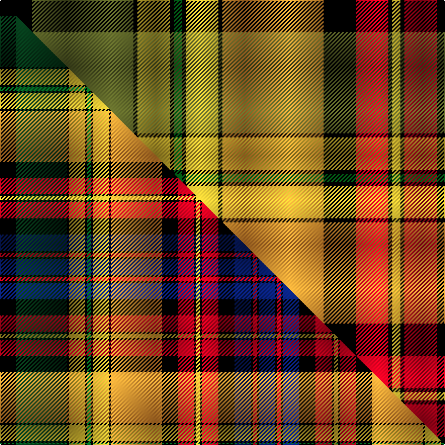

This is one **variant** — a specific cloth: this exact thread count and colourway, with its own
provenance below. It is one weaving of the [sett](/setts/k16g50k2ly16k2dg4k2ly16k2lo50k16r16k2ly4k2r16k16t1k2r4k2t16/) (the scale-free proportion — the
same cloth at any scale or shade), whose colour order is pattern [BKRKBKRKYKRKYKYKGKYKGK](/stripes/bkrkbkrkykrkykykgkykgk/).

Part of the [Rosalyn](/tartans/r/ro/rosalyn/) tartan — the named design grouping this sett with its other cloths.

Sourced from tartans-authority.  It is a [22 stripe tartan](/stripes/stripes22/).

Original link [https://www.tartanregister.gov.uk/tartanDetails.aspx?ref=10155](https://www.tartanregister.gov.uk/tartanDetails.aspx?ref=10155)

Dataset <small>— provenance for this record, inherited from the source manifest</small>

<dl class="dataset-prov">
<dt>source</dt><dd><a href="/sources/tartans-authority/">Scottish Tartans Authority</a></dd>
<dt>data captured from</dt><dd><a href="https://github.com/thetartan/tartan-database/blob/master/data/tartans-authority/data.csv">https://github.com/thetartan/tartan-database/blob/master/data/tartans-authority/data.csv</a></dd>
<dt>data date</dt><dd>17th Jan. 2010 <small>(this record)</small></dd>
<dt>licence</dt><dd><a href="https://creativecommons.org/licenses/by-nc-nd/4.0/">CC BY-NC-ND 4.0</a></dd>
</dl>

Capture chain <small>— the hands this data passed through, oldest first; each capture carries its own licence</small>

<ol class="capture-chain">
<li><a href="https://www.tartansauthority.com/">Scottish Tartans Authority</a> <small>the heritage body's archive — its tartan-ferret record browser is retired (links repaired to the SRT, above)</small></li>
<li><a href="https://github.com/thetartan/tartan-database">thetartan/tartan-database</a> <small>2016-2017</small> · <a href="https://creativecommons.org/licenses/by-nc-nd/4.0/">CC BY-NC-ND 4.0</a> <small>Levko Kravets's frozen compilation — the capture we vendored, and where its CC licence text came from</small></li>
<li>this dictionary <small>captured 2026-06-10 · commit 5bf86c7566</small> <small>each re-capture is a git commit to data/sources</small></li>
</ol>

## Register references

External register numbers recorded for this tartan.

- Scottish Register of Tartans: [10155](https://www.tartanregister.gov.uk/tartanDetails?ref=10155)
- Scottish Tartans Authority (ITI): 10155

## Thread count
K/32 G100 K4 LY32 K4 DG8 K4 LY32 K4 LO100 K32 R32 K4 LY8 K4 R32 K32 T2 K4 R8 K4 T/32

One full sett is **964 threads**.

## Palette
<table><thead><tr><th>Colour</th><th>Shade</th><th>OKLCh</th></tr></thead><tbody><tr><td>T</td><td><code style="background-color:#00879F;">#00879F</code> <small style="color:#888">#00879F</small></td><td><small style="color:#888">oklch(57.4% 0.102 216.1)</small></td></tr><tr><td>DG</td><td><code style="background-color:#006818;">#006818</code> <small style="color:#888">#006818</small></td><td><small style="color:#888">oklch(45.0% 0.142 145.0)</small></td></tr><tr><td>G</td><td><code style="background-color:#5C6428;">#5C6428</code> <small style="color:#888">#5C6428</small></td><td><small style="color:#888">oklch(48.3% 0.084 116.0)</small></td></tr><tr><td>K</td><td><code style="background-color:#000000;">#000000</code> <small style="color:#888">#000000</small></td><td><small style="color:#888">oklch(0.0% 0.000 0.0)</small></td></tr><tr><td>LY</td><td><code style="background-color:#DCBC32;">#DCBC32</code> <small style="color:#888">#DCBC32</small></td><td><small style="color:#888">oklch(80.0% 0.150 95.2)</small></td></tr><tr><td>LO</td><td><code style="background-color:#FF9C34;">#FF9C34</code> <small style="color:#888">#FF9C34</small></td><td><small style="color:#888">oklch(77.9% 0.161 61.8)</small></td></tr><tr><td>R</td><td><code style="background-color:#D60020;">#D60020</code> <small style="color:#888">#D60020</small></td><td><small style="color:#888">oklch(55.2% 0.224 25.5)</small></td></tr></tbody></table>

# Sample pattern

## Compared to the master

This cloth is one sett of its design; the master sett (the exemplar the design is anchored on) is below for comparison.

Its **ΔTartan distance** from the master is **2.22** — the same measure the nearest-tartans table ranks by (0 is identical; a re-scale of the same cloth is near 0, a recolour or a different proportion further).

<figure class="master-compare" style="margin:0">

this sett
master sett ★

<figcaption style="color:#888;font-size:smaller">One weave of this sett against the <a href="/setts/k8dg25k1ly8k1g2k1ly8k1lo25k8r8k1ly2k1r8k8db8k1r2k1db8/">master sett ★</a>, split on the diagonal: a shared proportion runs seamlessly across it with only the shades shifting; a different proportion breaks on it.</figcaption>
</figure>

## Nearest tartan variants

The nearest existing variants by ΔTartan distance, with this cloth at the top so the swatches line up against it.

ΔTartan

Threads

Variant

Sett

—

964

<a href="/variants/s22/k16g50k2ly16k2dg4k2ly16k2lo50k16r16k2ly4k2r16k16t1k2r4k2t16~x2~g1903114-dg1806142/">Rosalyn (Fashion)</a>

<a href="/ttd/edit/#slug=k8dg25k1ly8k1g2k1ly8k1lo25k8r8k1ly2k1r8k8db8k1r2k1db8~x2&amp;base=k16g50k2ly16k2dg4k2ly16k2lo50k16r16k2ly4k2r16k16t1k2r4k2t16~x2~g1903114-dg1806142" title="compare in the TTD">2.22</a>

512

<a href="/variants/s22/k8dg25k1ly8k1g2k1ly8k1lo25k8r8k1ly2k1r8k8db8k1r2k1db8~x2/">Rosalyn</a>

<a href="/ttd/edit/#slug=k4w2k2w1lb6r6g6w1g27w1db4lb4dy3w1dy3lb4db4w1r36db3lb2w1lb2db3~x2&amp;base=k16g50k2ly16k2dg4k2ly16k2lo50k16r16k2ly4k2r16k16t1k2r4k2t16~x2~g1903114-dg1806142" title="compare in the TTD">3.55</a>

494

<a href="/variants/s24/k4w2k2w1lb6r6g6w1g27w1db4lb4dy3w1dy3lb4db4w1r36db3lb2w1lb2db3~x2/">Ross Wedding Dress</a>

<a href="/ttd/edit/#slug=g7w1t7w2t6w3t5w4t4w5t3w6t2w7t1w8r31dr31k10g4~x2&amp;base=k16g50k2ly16k2dg4k2ly16k2lo50k16r16k2ly4k2r16k16t1k2r4k2t16~x2~g1903114-dg1806142" title="compare in the TTD">3.55</a>

566

<a href="/variants/s20/g7w1t7w2t6w3t5w4t4w5t3w6t2w7t1w8r31dr31k10g4~x2/">Gallacher, (Name)</a>

<a href="/ttd/edit/#slug=lb8lo8r6k6b28lo12r6k2r6lo12g28lb2k4r54dr1lb2~x2~lb3300000-r1607033-b2603265&amp;base=k16g50k2ly16k2dg4k2ly16k2lo50k16r16k2ly4k2r16k16t1k2r4k2t16~x2~g1903114-dg1806142" title="compare in the TTD">3.60</a>

720

<a href="/variants/s16/lb8lo8r6k6b28lo12r6k2r6lo12g28lb2k4r54dr1lb2~x2~lb3300000-r1607033-b2603265/">Finzean's Fancy</a>

<a href="/ttd/edit/#slug=k4w2k2w1lb6r6g6w1g27w1db4lb4o3w1o3lb4db4w1r36db3lb2w1lb2db3~x2&amp;base=k16g50k2ly16k2dg4k2ly16k2lo50k16r16k2ly4k2r16k16t1k2r4k2t16~x2~g1903114-dg1806142" title="compare in the TTD">3.61</a>

494

<a href="/variants/s24/k4w2k2w1lb6r6g6w1g27w1db4lb4o3w1o3lb4db4w1r36db3lb2w1lb2db3~x2/">Ross, Wedding dress</a>

<a href="/ttd/edit/#slug=w2r3k2r8g16k2w2k2ly1k10t6r32t6k10ly1k2w2k2g16r8k2r3w1~x4&amp;base=k16g50k2ly16k2dg4k2ly16k2lo50k16r16k2ly4k2r16k16t1k2r4k2t16~x2~g1903114-dg1806142" title="compare in the TTD">3.82</a>

1100

<a href="/variants/s23/w2r3k2r8g16k2w2k2ly1k10t6r32t6k10ly1k2w2k2g16r8k2r3w1~x4/">Stewart</a>

<a href="/ttd/edit/#slug=k13r2g9db5lb3r2k4y2k2y2k3w4k3db2r22lb1k3g4lb2~x2&amp;base=k16g50k2ly16k2dg4k2ly16k2lo50k16r16k2ly4k2r16k16t1k2r4k2t16~x2~g1903114-dg1806142" title="compare in the TTD">3.89</a>

322

<a href="/variants/s19/k13r2g9db5lb3r2k4y2k2y2k3w4k3db2r22lb1k3g4lb2~x2/">Anderson of Ardbrake</a>

<a href="/ttd/edit/#slug=w5y8ri6k6lb28y12ri6k2ri6y12g28w2k4ri54r1w2~x2~ri2008029-r1707016&amp;base=k16g50k2ly16k2dg4k2ly16k2lo50k16r16k2ly4k2r16k16t1k2r4k2t16~x2~g1903114-dg1806142" title="compare in the TTD">3.93</a>

714

<a href="/variants/s16/w5y8ri6k6lb28y12ri6k2ri6y12g28w2k4ri54r1w2~x2~ri2008029-r1707016/">Finzean, Fancy</a>

<a href="/ttd/edit/#slug=k4lb2k2lb1lg6o6dg6lb1dg27lb1db4lg4do3lb1do3lg4db4lb1o36db3lg2lb1lg2db3~x4&amp;base=k16g50k2ly16k2dg4k2ly16k2lo50k16r16k2ly4k2r16k16t1k2r4k2t16~x2~g1903114-dg1806142" title="compare in the TTD">3.95</a>

988

<a href="/variants/s24/k4lb2k2lb1lg6o6dg6lb1dg27lb1db4lg4do3lb1do3lg4db4lb1o36db3lg2lb1lg2db3~x4/">Wedding Dress:1766</a>

<a href="/ttd/edit/#slug=o36lr1lb6lr1db8r4k4r24k4o8lr1lb6lr1lo18o6k4o6lo18lr1lb6lr1lo8k4o24k4o4db8lr4~x2~lr3200000-lb3103284&amp;base=k16g50k2ly16k2dg4k2ly16k2lo50k16r16k2ly4k2r16k16t1k2r4k2t16~x2~g1903114-dg1806142" title="compare in the TTD">3.96</a>

800

<a href="/variants/s28/o36lbi1lb6lbi1db8r4k4r24k4o8lbi1lb6lbi1lo18o6k4o6lo18lbi1lb6lbi1lo8k4o24k4o4db8lbi4~x2~lbi3200000-lb3103284/">Kinross #2</a>

## Neighbour map

Every grey dot is one of 13656 variants placed by the first two principal components of the ΔTartan feature space (42% of its variance). Red is this tartan; blue dots are its nearest — click one to open its page. The map is a flat projection of a many-dimensional space — [how to read it](/posts/neighbourhood-maps/).

<svg viewBox="0 0 640 380" role="img" style="max-width:100%;height:auto;border:1px solid #e0e0e0;border-radius:4px;display:block" xmlns="http://www.w3.org/2000/svg"><image href="/nn/cloud.v1.png" width="640" height="380"/><a href="/variants/s22/k8dg25k1ly8k1g2k1ly8k1lo25k8r8k1ly2k1r8k8db8k1r2k1db8~x2/"><circle cx="25.8" cy="44.1" r="4" fill="#3465a4"><title>Rosalyn</title></circle></a><a href="/variants/s24/k4w2k2w1lb6r6g6w1g27w1db4lb4dy3w1dy3lb4db4w1r36db3lb2w1lb2db3~x2/"><circle cx="126.8" cy="14.0" r="4" fill="#3465a4"><title>Ross Wedding Dress</title></circle></a><a href="/variants/s20/g7w1t7w2t6w3t5w4t4w5t3w6t2w7t1w8r31dr31k10g4~x2/"><circle cx="73.7" cy="56.8" r="4" fill="#3465a4"><title>Gallacher, (Name)</title></circle></a><a href="/variants/s16/lb8lo8r6k6b28lo12r6k2r6lo12g28lb2k4r54dr1lb2~x2~lb3300000-r1607033-b2603265/"><circle cx="159.7" cy="32.2" r="4" fill="#3465a4"><title>Finzean's Fancy</title></circle></a><a href="/variants/s24/k4w2k2w1lb6r6g6w1g27w1db4lb4o3w1o3lb4db4w1r36db3lb2w1lb2db3~x2/"><circle cx="129.8" cy="14.7" r="4" fill="#3465a4"><title>Ross, Wedding dress</title></circle></a><a href="/variants/s23/w2r3k2r8g16k2w2k2ly1k10t6r32t6k10ly1k2w2k2g16r8k2r3w1~x4/"><circle cx="136.9" cy="38.5" r="4" fill="#3465a4"><title>Stewart</title></circle></a><a href="/variants/s19/k13r2g9db5lb3r2k4y2k2y2k3w4k3db2r22lb1k3g4lb2~x2/"><circle cx="68.3" cy="52.8" r="4" fill="#3465a4"><title>Anderson of Ardbrake</title></circle></a><a href="/variants/s16/w5y8ri6k6lb28y12ri6k2ri6y12g28w2k4ri54r1w2~x2~ri2008029-r1707016/"><circle cx="167.2" cy="30.8" r="4" fill="#3465a4"><title>Finzean, Fancy</title></circle></a><a href="/variants/s24/k4lb2k2lb1lg6o6dg6lb1dg27lb1db4lg4do3lb1do3lg4db4lb1o36db3lg2lb1lg2db3~x4/"><circle cx="135.1" cy="21.1" r="4" fill="#3465a4"><title>Wedding Dress:1766</title></circle></a><a href="/variants/s28/o36lbi1lb6lbi1db8r4k4r24k4o8lbi1lb6lbi1lo18o6k4o6lo18lbi1lb6lbi1lo8k4o24k4o4db8lbi4~x2~lbi3200000-lb3103284/"><circle cx="124.4" cy="27.8" r="4" fill="#3465a4"><title>Kinross #2</title></circle></a><circle cx="60.7" cy="14.2" r="5" fill="#c00000"/><text x="320" y="376" text-anchor="middle" font-size="11" fill="#999">ground</text><text x="11" y="190" text-anchor="middle" font-size="11" fill="#999" transform="rotate(-90 11 190)">complexity</text></svg>

ID: /variants/s22/k16g50k2ly16k2dg4k2ly16k2lo50k16r16k2ly4k2r16k16t1k2r4k2t16~x2~g1903114-dg1806142/
