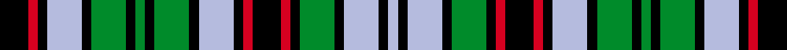

This page is one **sett** — a single exact thread-count. It belongs to the [tartan](/setts/k9r3k3lb11k3g11k3g3k3g11k3lb11k3r3k9r3k3g11k3lb11k3lb3/)
(the same proportion at any scale), whose colour order is pattern [KRKWKGKGKGKWKRKRKGKWKW](/stripes/krkwkgkgkgkwkrkrkgkwkw/).

Sourced from register-of-tartans.  It is a [22 stripe tartan](/stripes/stripes22/).

Original link https://www.tartanregister.gov.uk/tartanDetails.aspx?ref=1101

2 attestations — the source records this cloth was collapsed from (oldest owns this page)

<ul>
<li>01/11/2006 — Ellenee (register-of-tartans, <a href="https://www.tartanregister.gov.uk/tartanDetails.aspx?ref=1101">record</a>)  <em>The explanation from the designer is: 'Our interest in Scotland, its nature, inhabitants and above all its cultural history, combined with the growing interest for it in our family - we married in kilt, my mother takes country dance lessons, together we visit most Scottish events and we publish our own 'Schotland Digizine' - made us decide to design a tartan for our family in honour to Scottish tradition and to express our bond as a family. How the name of our tartan formed: Ellenee is L and E [in Dutch L en E] glued together in speech. L is the first letter of my wife's name, Louise and E is the first letter of my name, Edgar. In script the pronunciation of L en E in Dutch is Ellenee.'</em></li>
<li>November 2006 — Ellene (Personal)) (tartans-authority, <a href="http://www.tartansauthority.com/tartan-ferret/display/7050/">record</a>)  <em>The explanation from the designer is: "Our interest in Scotland, its nature, inhabitants and above all its cultural history, combined with the growing interest for it in our family - we married in kilt, my mother takes country dance lessons, together we visit most Scottish events and we publish our own 'Schotland Digizine' - made us decide to design a tartan for our family in honour to Scottish tradition and to express our bond as a family. How the name of our tartan formed: Ellen?e is L and E [in Dutch L en E] glued together in speech. L is the first letter of my wife's name, Louise and E is the first letter of my name, Edgar. In script the pronounciation of L en E in Dutch is Ellen?e."</em></li>
</ul>

## Register references

External register numbers recorded for this tartan.

- Scottish Register of Tartans: [1101](https://www.tartanregister.gov.uk/tartanDetails.aspx?ref=1101)
- Scottish Tartans Authority (ITI): 7050

## Thread count
K/18 R6 K6 LB22 K6 G22 K6 G6 K6 G22 K6 LB22 K6 R6 K18 R6 K6 G22 K6 LB22 K6 LB/6

One full sett is **480 threads**.

## Palette
<table><thead><tr><th>Colour</th><th>Shade</th><th>OKLCh</th></tr></thead><tbody><tr><td>R</td><td><code style="background-color:#D60020;">#D60020</code> <small style="color:#888">#D60020</small></td><td><small style="color:#888">oklch(55.2% 0.224 25.5)</small></td></tr><tr><td>G</td><td><code style="background-color:#008B2A;">#008B2A</code> <small style="color:#888">#008B2A</small></td><td><small style="color:#888">oklch(55.4% 0.170 145.9)</small></td></tr><tr><td>K</td><td><code style="background-color:#000000;">#000000</code> <small style="color:#888">#000000</small></td><td><small style="color:#888">oklch(0.0% 0.000 0.0)</small></td></tr><tr><td>LB</td><td><code style="background-color:#B5BBDE;">#B5BBDE</code> <small style="color:#888">#B5BBDE</small></td><td><small style="color:#888">oklch(79.9% 0.050 277.6)</small></td></tr></tbody></table>

# Sample pattern

ID: /variants/s22/k9r3k3lb11k3g11k3g3k3g11k3lb11k3r3k9r3k3g11k3lb11k3lb3~x2/
